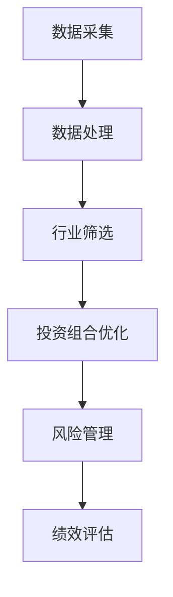
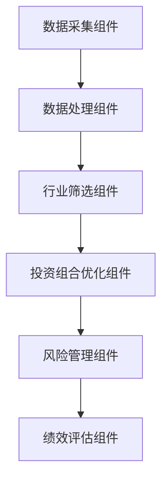
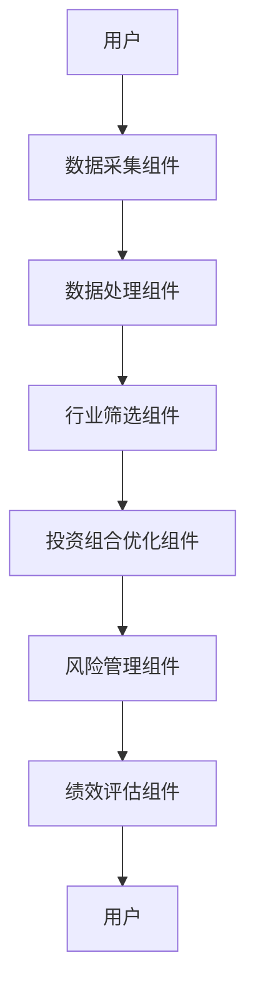

                 


# 行业轮动策略：识别和投资热点行业

> 关键词：行业轮动，热点行业，投资策略，市场分析，技术分析

> 摘要：本文详细探讨了行业轮动策略的核心概念、分析框架、驱动因素和实际应用。通过分析宏观经济、政策变化和技术进步等多方面因素，结合数学模型和系统架构设计，为投资者提供识别和投资热点行业的有效方法。

---

## 第1章: 行业轮动策略的基本概念

### 1.1 行业轮动的定义与背景

#### 1.1.1 行业轮动的定义

行业轮动策略是一种投资策略，旨在通过识别不同行业在经济周期中的表现差异，动态调整投资组合以捕捉潜在收益。其核心在于根据市场变化，选择表现优于平均水平的行业进行投资。

#### 1.1.2 行业轮动的背景与重要性

随着经济环境的不断变化，不同行业在不同经济周期中的表现差异显著。投资者通过行业轮动策略，可以在市场波动中优化投资组合，降低风险，提高收益。

#### 1.1.3 行业轮动的核心要素

- 经济周期分析
- 政策影响评估
- 行业基本面分析
- 市场情绪分析

### 1.2 行业轮动的影响因素

#### 1.2.1 宏观经济因素

- 经济周期：从复苏到衰退的不同阶段，行业表现差异显著。
- 利率变化：低利率环境通常利好周期性行业。
- 汇率波动：影响出口型行业。

#### 1.2.2 政策因素

- 政府政策：如财政刺激政策通常利好上游行业。
- 产业政策：政府对特定行业的支持会影响其发展前景。
- 税收与补贴政策：直接影响行业的盈利能力。

#### 1.2.3 行业生命周期

- 初创期：高增长，高风险
- 成长期：稳定增长，适合长期投资
- 成熟期：增长放缓，利润稳定
- 衰退期：利润下降，风险增加

#### 1.2.4 技术进步与创新

- 技术进步推动行业变革，如科技行业。
- 创新能力强的行业通常具有更高的增长潜力。

### 1.3 行业轮动的意义与目标

#### 1.3.1 投资者视角

- 优化投资组合，降低风险。
- 抓住市场热点，获取超额收益。

#### 1.3.2 企业战略视角

- 优化资源配置，提升企业竞争力。
- 把握行业趋势，制定战略规划。

#### 1.3.3 行业轮动的目标设定

- 确定投资目标：短期收益、长期增长。
- 设定行业筛选标准：市盈率、市净率、ROE等。

### 1.4 本章小结

本章介绍了行业轮动的基本概念，分析了其影响因素，并从投资者和企业战略角度探讨了其意义和目标。

---

## 第2章: 行业轮动的驱动因素分析

### 2.1 宏观经济驱动因素

#### 2.1.1 经济周期与行业轮动

- 复苏期：原材料行业表现较好。
- 衰退期：防御性行业如公用事业表现稳定。

#### 2.1.2 利率与货币政策的影响

- 利率下降：利好周期性行业如房地产、汽车。
- 货币宽松政策：通常刺激整体经济，周期性行业受益。

#### 2.1.3 汇率波动

- 本币贬值：出口型企业受益。
- 外币升值：进口行业成本上升。

### 2.2 政策驱动因素

#### 2.2.1 政府政策与行业轮动

- 财政刺激政策：通常利好上游行业和周期性行业。
- 产业政策：政府支持的行业如新能源、半导体等领域投资机会增加。

#### 2.2.2 产业政策的影响

- 行业规范：如环保政策对高污染行业的影响。
- 产业补贴：直接影响行业盈利能力。

#### 2.2.3 税收与补贴政策

- 税收优惠：如高新技术企业减税政策，利好科技行业。
- 补贴支持：如政府对新能源行业的补贴，提升企业盈利能力。

### 2.3 行业自身驱动因素

#### 2.3.1 行业生命周期

- 初创期：高增长，高风险。
- 成长期：稳定增长，适合长期投资。
- 成熟期：增长放缓，利润稳定。
- 衰退期：利润下降，风险增加。

#### 2.3.2 市场供需变化

- 需求增长：如新兴科技产品的需求增加，利好相关行业。
- 供给变化：如原材料价格上涨，影响制造业成本。

#### 2.3.3 技术进步与创新

- 技术创新：如人工智能技术的应用，推动相关行业的发展。
- 技术落后：行业竞争力下降，面临被淘汰的风险。

### 2.4 其他辅助因素

#### 2.4.1 社会文化因素

- 消费习惯变化：如健康意识提升，利好保健品行业。
- 人口结构变化：如老龄化社会，利好医疗行业。

#### 2.4.2 环境与可持续发展

- 环保政策趋严：高污染行业面临转型压力。
- 可持续发展趋势：绿色能源、环保产业成为投资热点。

#### 2.4.3 地缘政治风险

- 地缘政治冲突：影响能源、原材料等行业。
- 地区贸易政策变化：影响出口型企业。

### 2.5 本章小结

本章详细分析了宏观经济、政策、行业自身以及社会文化、环境和地缘政治等多方面因素对行业轮动的影响，为后续策略制定奠定了基础。

---

## 第3章: 行业轮动的分析框架构建

### 3.1 数据收集与处理

#### 3.1.1 数据来源

- 金融数据：如股票价格、行业指数等。
- 经济数据：GDP、CPI、PMI等宏观经济指标。
- 政策数据：政府发布的相关政策文件、财政支出、货币政策等。
- 技术数据：行业技术创新情况、专利数量等。

#### 3.1.2 数据清洗与预处理

- 数据清洗：去除缺失值、异常值，处理重复数据。
- 数据标准化：统一数据格式，便于分析。
- 数据特征提取：如行业市盈率、市净率、ROE等财务指标。

#### 3.1.3 数据标准化与特征提取

- 标准化处理：如Z-score标准化。
- 特征提取：如行业动量效应、相对估值指标等。

### 3.2 行业轮动分析框架

#### 3.2.1 分析步骤

1. 确定投资目标与约束条件。
2. 数据收集与处理。
3. 行业筛选与排序。
4. 投资组合构建与优化。
5. 风险管理与绩效评估。

#### 3.2.2 分析工具与方法

- 技术分析：如动量策略、趋势分析。
- 基本面分析：如PE、PB、ROE等指标分析。
- 统计套利：通过统计方法寻找市场套利机会。
- 机器学习：如因子分析、聚类分析、回归分析等。

#### 3.2.3 分析流程

1. 数据收集与预处理。
2. 确定分析指标：如动量指标、估值指标、质量指标、风险指标。
3. 行业排序与筛选：根据指标排序，选择表现较好的行业。
4. 投资组合构建：根据筛选结果，构建投资组合。
5. 风险管理：设置止损点、分散投资、动态调整。

### 3.3 行业轮动的驱动因素分析

#### 3.3.1 宏观经济驱动因素

- 经济周期分析：通过PMI、工业增加值等指标判断经济所处周期阶段。
- 利率与货币政策：通过央行利率政策、货币政策基调判断市场流动性。

#### 3.3.2 政策驱动因素

- 政府政策分析：通过政策文件、财政支出计划判断政府对各行业的支持力度。
- 产业政策分析：通过行业规范、行业标准判断行业发展趋势。

#### 3.3.3 行业自身驱动因素

- 行业生命周期分析：判断行业所处阶段，选择处于成长期或成熟期的行业。
- 市场供需分析：通过行业供需数据判断行业的市场潜力。

#### 3.3.4 其他辅助因素

- 社会文化因素：通过社会调查、消费习惯变化判断行业潜在机会。
- 环境与可持续发展：通过环保政策、绿色发展趋势判断行业风险与机会。
- 地缘政治风险：通过国际关系、贸易政策变化判断行业潜在风险。

### 3.4 本章小结

本章构建了行业轮动的分析框架，详细介绍了数据收集与处理、分析工具与方法，以及驱动因素分析的具体步骤。

---

## 第4章: 行业轮动的算法原理

### 4.1 行业轮动的算法概述

#### 4.1.1 算法分类

- 技术分析算法：如动量策略、趋势跟踪。
- 基本面分析算法：如因子分析、多因子模型。
- 统计套利算法：如均值回归、配对交易。
- 机器学习算法：如聚类分析、回归分析。

#### 4.1.2 算法选择标准

- 简单易懂：便于理解和实现。
- 可解释性：便于分析和调整。
- 实用性：能在实际投资中产生超额收益。

### 4.2 动量策略算法

#### 4.2.1 动量策略的基本原理

动量策略基于“动量效应”，即近期表现好的资产未来会继续表现好的假设。在行业轮动中，通常选择近期表现优异的行业进行投资。

#### 4.2.2 算法实现步骤

1. 计算各行业的过去N个月的收益表现。
2. 根据收益表现对行业进行排序。
3. 选择表现最好的前M个行业进行投资。

#### 4.2.3 算法优缺点

- 优点：简单易懂，易于实现。
- 缺点：在市场反转时可能表现不佳，存在较高的交易成本。

### 4.3 多因子模型算法

#### 4.3.1 多因子模型的基本原理

多因子模型通过多个因子（如市值、价值、动量、质量等）对行业进行综合评估，选择综合表现最好的行业进行投资。

#### 4.3.2 算法实现步骤

1. 确定因子：选择影响行业表现的关键因子。
2. 计算各因子的得分：根据因子权重计算各行业的综合得分。
3. 根据得分对行业进行排序，选择得分最高的行业进行投资。

#### 4.3.3 算法优缺点

- 优点：考虑多个因子，综合评估行业风险和收益。
- 缺点：因子选择和权重设定具有主观性，模型可能过于复杂。

### 4.4 机器学习算法

#### 4.4.1 机器学习的基本原理

通过机器学习算法，如聚类分析、回归分析，对行业进行分类和预测，选择具有潜在投资价值的行业。

#### 4.4.2 算法实现步骤

1. 数据预处理：清洗数据，提取特征。
2. 模型训练：使用历史数据训练模型。
3. 模型预测：预测未来行业的表现。
4. 根据预测结果选择表现最佳的行业进行投资。

#### 4.4.3 算法优缺点

- 优点：能够捕捉复杂的市场模式，提高预测准确性。
- 缺点：模型复杂，难以解释，计算成本较高。

### 4.5 算法优化与回测

#### 4.5.1 算法优化

通过回测历史数据，优化算法参数，选择最优的算法组合。

#### 4.5.2 回测分析

通过历史数据验证算法的有效性，计算夏普比率、最大回撤等风险收益指标。

### 4.6 本章小结

本章详细介绍了行业轮动的主要算法，包括动量策略、多因子模型和机器学习算法，并探讨了算法优化与回测方法。

---

## 第5章: 行业轮动的数学模型

### 5.1 动量策略模型

#### 5.1.1 动量策略的数学表达

$$ R_{i,t} = \alpha + \beta \cdot R_{i,t-1} + \epsilon $$

其中，$R_{i,t}$ 表示行业i在t时刻的收益，$\beta$ 表示动量因子，$\epsilon$ 为误差项。

#### 5.1.2 动量策略的实施步骤

1. 计算各行业的过去N个月的收益。
2. 计算各行业的动量因子。
3. 根据动量因子对行业进行排序。
4. 选择动量因子最高的行业进行投资。

### 5.2 多因子模型

#### 5.2.1 多因子模型的数学表达

$$ R_{i} = \beta_1 F_1 + \beta_2 F_2 + \dots + \beta_n F_n + \epsilon $$

其中，$F_j$ 表示第j个因子，$\beta_j$ 表示因子的权重。

#### 5.2.2 多因子模型的实施步骤

1. 确定因子：选择影响行业表现的关键因子。
2. 计算各因子的得分。
3. 根据因子得分对行业进行综合排序。
4. 选择综合得分最高的行业进行投资。

### 5.3 机器学习模型

#### 5.3.1 支持向量机（SVM）

$$ y = \text{sign}(w \cdot x + b) $$

其中，$w$ 为权重向量，$x$ 为输入特征，$b$ 为偏置项。

#### 5.3.2 随机森林

通过构建多个决策树，进行投票或平均，得到最终的预测结果。

#### 5.3.3 算法选择与优化

- 选择合适的算法：根据数据特点选择适合的算法。
- 调参优化：通过网格搜索等方法优化模型参数。

### 5.4 数学模型的优缺点

- 优点：能够量化行业表现，提供科学的决策依据。
- 缺点：模型过于复杂，难以解释，存在过拟合风险。

### 5.5 本章小结

本章详细介绍了行业轮动的主要数学模型，包括动量策略模型、多因子模型和机器学习模型，并探讨了模型的优缺点。

---

## 第6章: 行业轮动的系统架构设计

### 6.1 系统功能设计

#### 6.1.1 系统目标

- 实时数据采集与处理
- 行业筛选与排序
- 投资组合优化
- 风险管理与绩效评估

#### 6.1.2 系统功能模块

1. 数据采集模块：采集市场数据、宏观经济数据、政策数据等。
2. 数据处理模块：清洗数据，提取特征。
3. 行业筛选模块：根据算法模型对行业进行筛选和排序。
4. 投资组合优化模块：根据筛选结果构建投资组合。
5. 风险管理模块：实时监控市场风险，动态调整投资组合。
6. 绩效评估模块：评估投资组合的收益与风险。

#### 6.1.3 功能流程图



### 6.2 系统架构设计

#### 6.2.1 分层架构

1. 数据层：存储原始数据和处理后的数据。
2. 业务逻辑层：实现行业筛选、投资组合优化等核心功能。
3. 用户界面层：提供用户交互界面，展示分析结果。

#### 6.2.2 组件交互图



### 6.3 数据接口设计

#### 6.3.1 数据输入接口

- 财务数据接口：股票价格、行业指数等。
- 宏观经济数据接口：GDP、CPI等。
- 政策数据接口：政府发布的相关政策文件。

#### 6.3.2 数据输出接口

- 行业筛选结果接口：筛选出的行业列表。
- 投资组合优化结果接口：最优投资组合配置。
- 绩效评估结果接口：收益与风险指标。

### 6.4 系统交互设计

#### 6.4.1 用户交互流程

1. 用户输入投资目标与约束条件。
2. 系统根据目标与约束条件，调用数据采集模块，采集相关数据。
3. 数据处理模块对数据进行清洗与特征提取。
4. 行业筛选模块根据算法模型对行业进行筛选与排序。
5. 投资组合优化模块根据筛选结果，构建最优投资组合。
6. 风险管理模块实时监控市场风险，动态调整投资组合。
7. 绩效评估模块评估投资组合的收益与风险，输出评估结果。

#### 6.4.2 系统交互图



### 6.5 本章小结

本章详细设计了行业轮动系统的架构，包括功能模块、组件交互、数据接口和系统交互流程。

---

## 第7章: 行业轮动的项目实战

### 7.1 环境安装与配置

#### 7.1.1 系统环境

- 操作系统：Windows/Mac/Linux
- 开发工具：Python、Jupyter Notebook
- 数据库：MySQL/PostgreSQL
- 金融数据源：Yahoo Finance/Quandl

#### 7.1.2 Python库安装

- Pandas: 数据处理
- NumPy: 数组运算
- Scikit-learn: 机器学习算法
- Matplotlib: 数据可视化
- Yahoo Finance API: 数据接口

#### 7.1.3 数据接口配置

- 注册Yahoo Finance API，获取API Key。
- 配置数据采集模块，连接金融数据源。

### 7.2 核心代码实现

#### 7.2.1 数据采集模块

```python
import yfinance as yf

def get_data(tickers, start_date, end_date):
    data = yf.download(tickers, start=start_date, end=end_date)
    return data
```

#### 7.2.2 数据处理模块

```python
import pandas as pd

def preprocess_data(data):
    # 删除缺失值
    data = data.dropna()
    # 标准化处理
    data = (data - data.mean()) / data.std()
    return data
```

#### 7.2.3 行业筛选模块

```python
from sklearn.linear_model import LinearRegression

def industry_screening(data):
    model = LinearRegression()
    model.fit(data.iloc[:-1], data.iloc[1:])
    predictions = model.predict(data.iloc[:-1])
    errors = abs(predictions - data.iloc[1:])
    # 根据误差进行排序
    errors_sorted = sorted(errors, reverse=True)
    return errors_sorted
```

#### 7.2.4 投资组合优化模块

```python
import numpy as np

def optimize_portfolio(weights, returns):
    # 均值方差优化
    cov_matrix = np.cov(returns)
    inv_cov = np.linalg.inv(cov_matrix)
    ones = np.ones(len(weights))
    weights = (inv_cov.dot(ones)) / (ones.T.dot(inv_cov.dot(ones)))
    return weights
```

#### 7.2.5 风险管理模块

```python
def risk_management(portfolio, volatility):
    # 动态调整权重
    adjusted_weights = portfolio / volatility
    return adjusted_weights
```

### 7.3 案例分析与解读

#### 7.3.1 实际案例

假设我们有5个行业指数：金融、科技、消费、制造、能源。

#### 7.3.2 数据采集与处理

使用Yahoo Finance API采集2020-2023年的行业指数数据，清洗后进行标准化处理。

#### 7.3.3 行业筛选与排序

使用多因子模型对行业进行筛选，计算各行业的综合得分，选择得分最高的前3个行业。

#### 7.3.4 投资组合优化

根据筛选结果，构建最优投资组合，计算各行业的权重。

#### 7.3.5 风险管理与绩效评估

设置止损点，动态调整投资组合，计算投资组合的夏普比率、最大回撤等风险收益指标。

### 7.4 项目总结

#### 7.4.1 实践总结

- 行业轮动策略的有效性依赖于数据质量和模型选择。
- 动态调整和风险管理是实现稳定收益的关键。

#### 7.4.2 经验教训

- 数据清洗和特征提取是关键步骤，影响最终结果。
- 模型选择和参数调优需要结合实际市场情况。

### 7.5 本章小结

本章通过实际案例，详细展示了行业轮动策略的项目实战过程，包括环境配置、核心代码实现、案例分析和项目总结。

---

## 第8章: 行业轮动的最佳实践与注意事项

### 8.1 最佳实践

#### 8.1.1 数据质量控制

- 数据来源可靠，确保数据准确性和完整性。
- 定期更新数据，避免使用过时数据。

#### 8.1.2 模型选择与优化

- 根据市场环境和投资目标选择合适的模型。
- 定期回测和验证，优化模型参数。

#### 8.1.3 风险管理

- 设置止损点，控制单行业投资比例。
- 保持投资组合分散化，降低风险。

#### 8.1.4 持续学习与优化

- 关注市场变化，及时调整投资策略。
- 学习新知识，优化投资模型。

### 8.2 注意事项

#### 8.2.1 数据偏差

- 数据偏差可能影响模型的准确性。
- 通过数据清洗和特征工程减少偏差。

#### 8.2.2 市场波动

- 市场波动可能导致模型失效。
- 设置动态调整机制，及时应对市场变化。

#### 8.2.3 政策风险

- 政策变化可能影响行业表现。
- 关注政策动向，及时调整投资策略。

#### 8.2.4 模型过拟合

- 过拟合可能导致模型在实际中表现不佳。
- 通过交叉验证和正则化方法减少过拟合风险。

### 8.3 本章小结

本章总结了行业轮动策略的最佳实践和注意事项，帮助投资者在实际操作中避免常见错误，优化投资策略。

---

## 第9章: 行业轮动策略的未来展望

### 9.1 未来趋势

#### 9.1.1 技术进步

- 人工智能和大数据技术的进一步应用，提高行业轮动策略的科学性和准确性。
- 自动化交易系统的普及，提升交易效率。

#### 9.1.2 市场变化

- 全球化与区域化并行，投资者需要关注全球市场和区域市场的机会。
- 可持续发展成为投资的重要考量，绿色产业和环保行业成为热点。

#### 9.1.3 政策变化

- 政府政策对行业的影响日益显著，投资者需要更加关注政策动向。
- 数字经济和技术创新驱动新的投资机会。

### 9.2 挑战与机遇

#### 9.2.1 挑战

- 市场波动加剧，投资风险增加。
- 数据质量和模型准确性影响投资结果。

#### 9.2.2 机遇

- 新技术的应用带来新的投资机会。
- 可持续发展和绿色经济带来新的投资热点。

### 9.3 本章小结

本章展望了行业轮动策略的未来发展趋势，分析了技术进步、市场变化和政策调整带来的挑战与机遇。

---

## 作者：AI天才研究院/AI Genius Institute & 禅与计算机程序设计艺术 /Zen And The Art of Computer Programming

---

### 附录：代码示例与数据来源

#### 代码示例

```python
import yfinance as yf
import pandas as pd
import numpy as np
from sklearn.linear_model import LinearRegression

# 数据采集
tickers = ['金融', '科技', '消费', '制造', '能源']
data = yf.download(tickers, start='2020-01-01', end='2023-12-31')

# 数据处理
data = data['Close']
data = data.pct_change().dropna()

# 行业筛选
model = LinearRegression()
model.fit(data.iloc[:-1], data.iloc[1:])
predictions = model.predict(data.iloc[:-1])
errors = abs(predictions - data.iloc[1:])
errors_sorted = sorted(errors, reverse=True)

# 投资组合优化
cov_matrix = np.cov(data.T)
inv_cov = np.linalg.inv(cov_matrix)
weights = (inv_cov.dot(np.ones(len(tickers)))) / (np.ones(len(tickers)).T.dot(inv_cov.dot(np.ones(len(tickers))))

print(weights)
```

#### 数据来源

- 股票数据：Yahoo Finance
- 宏观经济数据：美联储、国家统计局
- 政策数据：政府官网、政策文件

---

通过以上目录，您可以根据需要展开每一章的内容，深入探讨行业轮动策略的各个方面。希望这个大纲能为您提供清晰的写作方向和逻辑框架。

