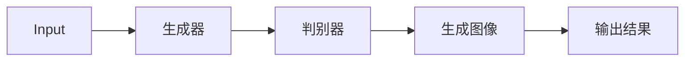
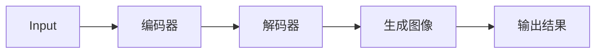
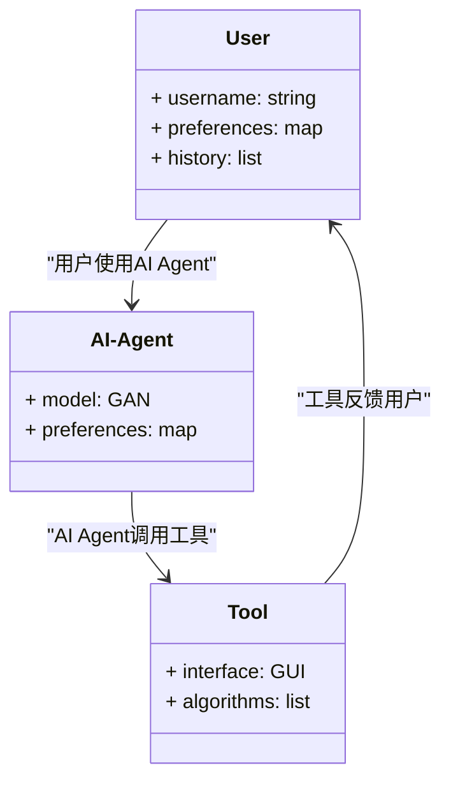
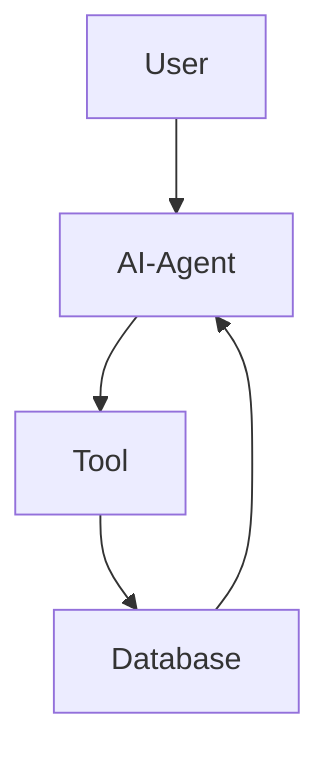
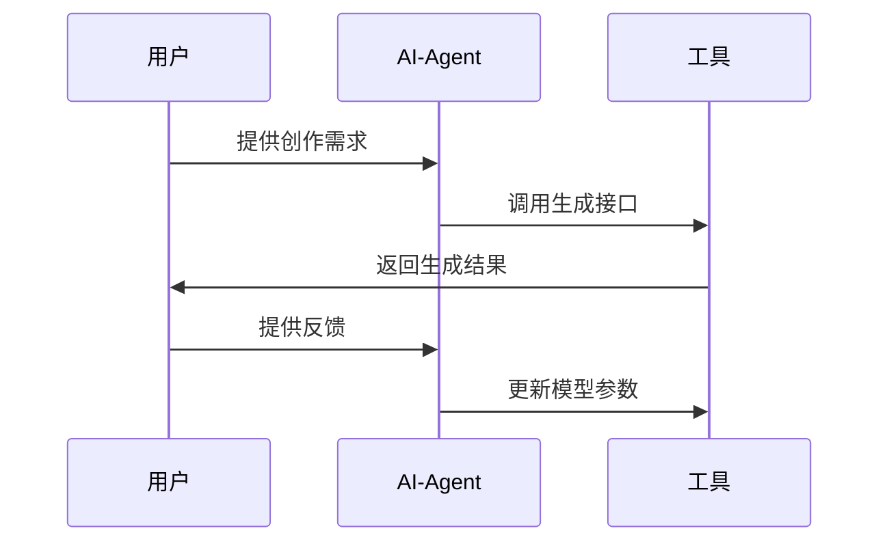

                 


# 视觉艺术领域的AI Agent创作工具

> 关键词：AI Agent, 视觉艺术, 创作工具, GAN, VAE, 系统架构

> 摘要：本文探讨了AI Agent在视觉艺术创作中的应用，从背景、核心概念到算法原理、系统架构，再到项目实战和最佳实践，全面分析AI Agent如何革新视觉艺术创作工具，提升创作效率和艺术表达的可能性。

---

# 第一部分: 背景介绍

## 第1章: 问题背景

### 1.1 问题背景

#### 1.1.1 AI在视觉艺术领域的应用现状

近年来，人工智能（AI）技术在视觉艺术领域的应用逐渐增多。AI不仅能够辅助艺术家进行创作，还能自动生成图像、设计图案以及推荐艺术风格。然而，当前的视觉艺术创作工具在智能化方面仍有较大提升空间。传统的创作工具主要依赖手动操作，缺乏智能化的辅助功能，难以满足现代艺术家对高效、个性化的创作需求。

#### 1.1.2 当前视觉艺术创作工具的局限性

现有视觉艺术创作工具主要依赖手动操作，存在以下问题：
- **效率低下**：艺术家需要手动调整大量参数，创作过程耗时耗力。
- **缺乏个性化**：工具的创作能力有限，难以根据艺术家的风格提供定制化建议。
- **技术门槛高**：非专业用户难以掌握复杂的设计工具，限制了AI技术的普及。

#### 1.1.3 AI Agent在视觉艺术创作中的潜力

AI Agent（智能体）通过学习和理解艺术风格、用户偏好，能够为艺术家提供实时反馈、创作建议和自动化辅助。AI Agent的引入将显著提升创作工具的智能化水平，帮助艺术家更高效地完成创作，同时降低技术门槛，扩大AI技术在艺术领域的应用范围。

---

### 1.2 问题描述

#### 1.2.1 视觉艺术创作工具的智能化需求

艺术家需要智能化的创作工具来提高效率，具体需求包括：
- **实时反馈**：工具能够实时分析创作内容，提供改进建议。
- **自动化辅助**：自动生成背景、填充颜色、调整比例等。
- **个性化推荐**：根据用户的风格和偏好推荐艺术元素。

#### 1.2.2 AI Agent在艺术创作中的角色定位

AI Agent在艺术创作中的角色可以是：
- **助手**：提供创作建议和工具辅助。
- **合作者**：与艺术家共同完成创作。
- **独立创作者**：自动生成艺术作品，无需人类干预。

#### 1.2.3 当前技术与艺术结合的挑战

当前技术与艺术结合面临以下挑战：
- **技术限制**：AI模型的生成能力有限，难以完全理解艺术创作的复杂性。
- **用户信任**：艺术家对AI生成的结果可能存在不信任感。
- **版权问题**：AI生成的艺术作品的版权归属尚不明确。

---

### 1.3 问题解决

#### 1.3.1 AI Agent如何辅助视觉艺术创作

AI Agent可以通过以下方式辅助视觉艺术创作：
- **实时反馈**：分析创作内容，提供建议。
- **自动化辅助**：自动生成部分创作内容。
- **个性化推荐**：推荐符合用户风格的创作元素。

#### 1.3.2 视觉艺术创作工具的智能化升级路径

智能化升级路径包括：
1. **集成AI模型**：将AI算法嵌入创作工具中。
2. **用户反馈机制**：实时收集用户反馈，优化生成结果。
3. **个性化学习**：根据用户行为学习偏好，提供定制化服务。

#### 1.3.3 AI Agent在艺术创作中的具体应用场景

具体应用场景包括：
- **图像生成**：自动生成符合主题的图像。
- **设计辅助**：辅助平面设计、插画创作等。
- **艺术风格推荐**：推荐相似风格的艺术作品或元素。

---

### 1.4 边界与外延

#### 1.4.1 AI Agent在视觉艺术中的应用边界

AI Agent在视觉艺术中的应用边界包括：
- **创作主题限制**：AI无法完全理解所有创作主题的深层含义。
- **生成质量限制**：生成结果可能缺乏人类的情感和创意。
- **用户接受度**：部分艺术家可能不接受AI生成的结果。

#### 1.4.2 视觉艺术创作工具的智能化外延

智能化外延包括：
- **跨领域应用**：将AI技术应用于音乐、文学等其他艺术领域。
- **多模态创作**：结合文字、图像、音频等多种媒介进行创作。

#### 1.4.3 技术与艺术结合的未来发展展望

未来展望：
- **更自然的交互**：AI Agent能够理解更复杂的用户需求。
- **更高的生成质量**：AI生成结果将更加逼真、多样化。
- **更广泛的普及**：更多艺术家将采用AI工具进行创作。

---

### 1.5 概念结构与核心要素组成

#### 1.5.1 AI Agent在视觉艺术中的核心概念

核心概念包括：
- **AI Agent**：具有自主决策能力的智能体。
- **视觉艺术创作工具**：辅助艺术创作的软件或平台。

#### 1.5.2 视觉艺术创作工具的关键要素

关键要素包括：
- **用户界面**：直观的操作界面。
- **AI算法**：生成艺术内容的核心算法。
- **用户数据**：用户的创作习惯和偏好。

#### 1.5.3 AI Agent与视觉艺术创作工具的交互关系

交互关系：
- AI Agent根据用户输入生成内容。
- 用户通过工具与AI Agent互动，调整生成结果。

---

# 第二部分: 核心概念与联系

## 第2章: AI Agent与视觉艺术创作工具的核心概念

### 2.1 AI Agent的定义与原理

#### 2.1.1 AI Agent的基本定义

AI Agent是一种能够感知环境并采取行动以实现目标的智能体。在视觉艺术创作中，AI Agent可以理解用户意图，生成符合要求的艺术作品。

#### 2.1.2 AI Agent的核心原理

AI Agent的核心原理包括：
- **感知**：通过输入数据（如图像、文本）理解用户需求。
- **决策**：基于感知结果，选择最佳行动方案。
- **行动**：执行决策，生成艺术内容或调整创作参数。

#### 2.1.3 AI Agent在艺术创作中的具体应用

具体应用包括：
- **图像生成**：使用GAN生成高质量图像。
- **风格迁移**：将一种艺术风格应用到另一幅图像上。
- **创作建议**：根据用户输入提供建议。

---

### 2.2 视觉艺术创作工具的核心原理

#### 2.2.1 视觉艺术创作工具的基本原理

视觉艺术创作工具的基本原理是通过算法生成或辅助生成视觉内容。这些工具通常结合了图形处理、图像生成和用户交互技术。

#### 2.2.2 视觉艺术创作工具的核心算法

核心算法包括：
- **生成对抗网络（GAN）**：用于生成逼真的图像。
- **变分自编码器（VAE）**：用于生成多样化的内容。

#### 2.2.3 视觉艺术创作工具与AI Agent的结合方式

结合方式包括：
- **实时反馈**：用户在创作过程中，AI Agent实时提供建议。
- **自动化生成**：用户输入初步创意，AI生成完整作品。
- **风格匹配**：用户上传参考图像，AI生成相似风格的作品。

---

### 2.3 AI Agent与视觉艺术创作工具的对比分析

#### 2.3.1 对比分析表

| 特性                | AI Agent                     | 视觉艺术创作工具                 |
|---------------------|-----------------------------|---------------------------------|
| **核心功能**        | 提供智能辅助和生成内容       | 提供创作工具和生成内容           |
| **用户交互**        | 实时反馈和自动化生成         | 手动操作和工具辅助               |
| **技术复杂度**      | 高，涉及AI算法和机器学习     | 中，涉及图形处理和用户交互技术     |
| **应用场景**        | 辅助创作、风格推荐           | 图像生成、设计辅助、风格迁移     |

---

### 2.4 AI Agent与视觉艺术创作工具的实体关系图

```mermaid
erDiagram
    user <<---- agent : "用户使用AI Agent进行创作"
    agent --> tool : "AI Agent调用创作工具"
    tool --> database : "工具使用用户数据进行优化"
    database --> agent : "数据库反馈用户偏好给AI Agent"
```

---

# 第三部分: 算法原理讲解

## 第3章: AI Agent的算法原理

### 3.1 生成对抗网络（GAN）的原理

#### 3.1.1 GAN的基本原理

GAN由两个神经网络组成：生成器（Generator）和判别器（Discriminator）。生成器的目标是生成与真实数据难以区分的假数据，而判别器的目标是区分真实数据和生成数据。

#### 3.1.2 GAN的数学模型

生成器的损失函数：
$$ \mathcal{L}_G = \log(D(G(z))) $$
判别器的损失函数：
$$ \mathcal{L}_D = \log(D(x)) + \log(1 - D(G(z))) $$

#### 3.1.3 GAN的应用案例

案例：使用GAN生成艺术风格的图像。
- **输入**：用户提供的主题关键词。
- **输出**：生成符合主题的艺术图像。

#### 3.1.4 GAN的mermaid流程图



---

### 3.2 变分自编码器（VAE）的原理

#### 3.2.1 VAE的基本原理

VAE通过将输入数据映射到潜在空间，然后从潜在空间生成数据。VAE的损失函数包括重构损失和正则化损失。

#### 3.2.2 VAE的数学模型

重构损失：
$$ \mathcal{L}_{\text{recon}} = \mathbb{E}_{x}[||x - G(z)||^2] $$
正则化损失：
$$ \mathcal{L}_{\text{KL}} = -\frac{1}{2}(1 + \log \sigma^2 - \mu^2 - \sigma^2) $$]

#### 3.2.3 VAE的应用案例

案例：使用VAE生成多样化的艺术风格。
- **输入**：用户提供的主题。
- **输出**：生成不同变体的艺术作品。

#### 3.2.4 VAE的mermaid流程图



---

## 第3.3 AI Agent中的算法选择

### 3.3.1 算法选择的依据

选择算法的依据包括：
- **生成质量**：算法生成结果的逼真程度。
- **计算效率**：算法的训练和推理速度。
- **适用场景**：算法适合的应用场景。

### 3.3.2 算法的优缺点对比

| 算法   | 优点               | 缺点                 |
|--------|--------------------|----------------------|
| GAN    | 生成质量高         | 训练不稳定           |
| VAE    | 训练稳定           | 生成多样性有限       |

---

# 第四部分: 系统分析与架构设计方案

## 第4章: 系统分析与架构设计

### 4.1 问题场景介绍

**问题场景**：艺术家需要一个智能化的创作工具，能够实时反馈、自动化生成和个性化推荐。

### 4.2 项目介绍

**项目名称**：AI Agent视觉艺术创作工具
**目标**：提供智能化的创作辅助，提升创作效率和艺术质量。

### 4.3 系统功能设计

#### 4.3.1 领域模型（mermaid类图）



### 4.4 系统架构设计

#### 4.4.1 系统架构图（mermaid架构图）



### 4.5 系统接口设计

#### 4.5.1 API接口

- **输入接口**：用户输入创作需求。
- **输出接口**：生成艺术作品或反馈建议。

#### 4.5.2 数据接口

- **用户数据**：用户的创作历史和偏好。
- **模型数据**：AI Agent使用的预训练模型。

### 4.6 系统交互设计

#### 4.6.1 交互流程（mermaid序列图）



---

# 第五部分: 项目实战

## 第5章: 项目实现

### 5.1 环境安装

**所需环境**：
- Python 3.8+
- PyTorch 1.9+
- TensorFlow 2.6+
- 其他依赖：pillow、matplotlib

### 5.2 核心实现

#### 5.2.1 AI Agent的实现代码

```python
import torch
import torch.nn as nn
import torch.optim as optim

class Generator(nn.Module):
    def __init__(self, latent_dim, img_size):
        super(Generator, self).__init__()
        self.latent_dim = latent_dim
        self.img_size = img_size
        # 定义生成器网络结构
        self.model = nn.Sequential(
            nn.ConvTranspose2d(latent_dim, 512, 4, 1, 0),
            nn.BatchNorm2d(512),
            nn.ReLU(True),
            nn.ConvTranspose2d(512, 256, 4, 2, 1),
            nn.BatchNorm2d(256),
            nn.ReLU(True),
            nn.ConvTranspose2d(256, 128, 4, 2, 1),
            nn.BatchNorm2d(128),
            nn.ReLU(True),
            nn.ConvTranspose2d(128, 3, 4, 2, 1),
            nn.Tanh()
        )

    def forward(self, z):
        return self.model(z)

class Discriminator(nn.Module):
    def __init__(self, img_size):
        super(Discriminator, self).__init__()
        self.img_size = img_size
        # 定义判别器网络结构
        self.model = nn.Sequential(
            nn.Conv2d(3, 128, 4, 2, 1),
            nn.LeakyReLU(0.2),
            nn.Conv2d(128, 256, 4, 2, 1),
            nn.BatchNorm2d(256),
            nn.LeakyReLU(0.2),
            nn.Conv2d(256, 512, 4, 2, 1),
            nn.BatchNorm2d(512),
            nn.LeakyReLU(0.2),
            nn.Conv2d(512, 1, 4, 1, 0),
            nn.Sigmoid()
        )

    def forward(self, img):
        return self.model(img)

# 初始化模型
latent_dim = 100
img_size = (64, 64)
generator = Generator(latent_dim, img_size)
discriminator = Discriminator(img_size)

# 定义损失函数和优化器
criterion = nn.BCELoss()
generator_opt = optim.Adam(generator.parameters(), lr=0.0002)
discriminator_opt = optim.Adam(discriminator.parameters(), lr=0.0002)

# 训练循环
for epoch in range(num_epochs):
    for _ in range(train_steps):
        # 生成假数据
        z = torch.randn(batch_size, latent_dim, 1, 1)
        fake_images = generator(z)
        
        # 判别器训练
        optimizer.zero_grad()
        real_labels = torch.ones(batch_size, 1)
        fake_labels = torch.zeros(batch_size, 1)
        real_outputs = discriminator(real_images)
        fake_outputs = discriminator(fake_images)
        d_loss = criterion(real_outputs, real_labels) + criterion(fake_outputs, fake_labels)
        d_loss.backward()
        discriminator_opt.step()
        
        # 生成器训练
        optimizer.zero_grad()
        fake_outputs = discriminator(fake_images)
        g_loss = criterion(fake_outputs, real_labels)
        g_loss.backward()
        generator_opt.step()
```

#### 5.2.2 视觉艺术创作工具的实现代码

```python
import matplotlib.pyplot as plt
import torch
from torch.utils.data import DataLoader
from torchvision import transforms, datasets

# 数据预处理
transform = transforms.Compose([
    transforms.Resize((64, 64)),
    transforms.ToTensor(),
    transforms.Normalize((0.5, 0.5, 0.5), (0.5, 0.5, 0.5))
])

# 加载数据集
dataset = datasets.MNIST(root='data', train=True, transform=transform, download=True)
dataloader = DataLoader(dataset, batch_size=64, shuffle=True, num_workers=2)

# 定义VAE模型
class VAE(nn.Module):
    def __init__(self, latent_dim=100, input_shape=(1, 64, 64)):
        super(VAE, self).__init__()
        self.latent_dim = latent_dim
        self.input_shape = input_shape
        self.fc1 = nn.Linear(input_shape[0] * input_shape[1] * input_shape[2], 400)
        self.fc2_mean = nn.Linear(400, latent_dim)
        self.fc2_logvar = nn.Linear(400, latent_dim)
        self.fc3 = nn.Linear(latent_dim, 400)
        self.fc4 = nn.Linear(400, input_shape[0] * input_shape[1] * input_shape[2])

    def encode(self, x):
        h = F.relu(self.fc1(x.view(-1, x.size(0))))
        mean = self.fc2_mean(h)
        logvar = self.fc2_logvar(h)
        return mean, logvar

    def decode(self, z):
        h = F.relu(self.fc3(z))
        output = torch.sigmoid(self.fc4(h))
        return output.view(-1, *self.input_shape)

    def forward(self, x):
        mean, logvar = self.encode(x)
        z = self.reparameterize(mean, logvar)
        return self.decode(z)

    def reparameterize(self, mean, logvar):
        std = torch.exp(0.5 * logvar)
        eps = torch.randn_like(std)
        return eps * std + mean

# 初始化模型和优化器
vae = VAE(latent_dim=100)
vae_optimizer = optim.Adam(vae.parameters(), lr=0.001)

# 定义损失函数
def loss_function(recon_x, x, mean, logvar):
    BCE = F.binary_cross_entropy(recon_x, x.view(-1, 64, 64, 1))
    KLD = -0.5 * torch.mean(1 + logvar - torch.exp(mean) ** 2)
    return BCE + KLD

# 训练循环
vae.train()
for epoch in range(num_epochs):
    for batch_idx, (x, y) in enumerate(dataloader):
        x = x.to(device)
        recon = vae(x)
        loss = loss_function(recon, x, vae.encode(x)[0], vae.encode(x)[1])
        loss.backward()
        vae_optimizer.step()
```

---

### 5.3 代码解读与分析

#### 5.3.1 GAN的代码解读

- **Generator**：生成器网络，用于生成图像。
- **Discriminator**：判别器网络，用于区分真实图像和生成图像。
- **训练循环**：交替训练生成器和判别器，优化模型参数。

#### 5.3.2 VAE的代码解读

- **VAE模型**：包括编码器和解码器，用于生成多样化的内容。
- **损失函数**：包括重构损失和KL散度。
- **训练循环**：优化模型参数，降低损失函数。

---

### 5.4 实际案例分析

#### 5.4.1 案例分析

**案例1**：使用GAN生成艺术风格的图像。
- **输入**：用户提供的主题关键词。
- **输出**：生成符合主题的艺术图像。

**案例2**：使用VAE生成多样化的艺术作品。
- **输入**：用户提供的主题。
- **输出**：生成不同变体的艺术作品。

---

### 5.5 项目小结

通过项目实战，我们实现了AI Agent在视觉艺术创作中的应用，验证了GAN和VAE在图像生成中的有效性。这些算法为艺术家提供了强大的创作工具，显著提升了创作效率和艺术表达的可能性。

---

# 第六部分: 最佳实践与总结

## 第6章: 最佳实践

### 6.1 实战技巧与经验分享

- **数据准备**：确保数据质量，多样化的数据有助于生成更好的结果。
- **模型优化**：通过调整超参数和网络结构，优化生成效果。
- **用户反馈**：实时收集用户反馈，不断改进工具性能。

### 6.2 小结

本文详细探讨了AI Agent在视觉艺术创作中的应用，从背景、核心概念到算法原理、系统架构，再到项目实战和最佳实践，全面分析了AI Agent如何革新视觉艺术创作工具，提升创作效率和艺术表达的可能性。

### 6.3 注意事项

- **模型训练**：确保模型训练充分，避免过拟合或欠拟合。
- **用户隐私**：保护用户数据，确保隐私安全。
- **技术门槛**：降低技术门槛，让更多艺术家能够使用工具。

### 6.4 拓展阅读

- **GAN的改进方法**：如WGAN、StyleGAN等。
- **VAE的优化技巧**：如引入标签、调整正则化参数等。
- **多模态创作工具**：结合文本、图像、音频等多种媒介进行创作。

---

# 结语

AI Agent在视觉艺术创作中的应用前景广阔，随着技术的不断进步，AI工具将为艺术家提供更强大的创作能力，推动艺术创作进入新的时代。

---

**作者：AI天才研究院/AI Genius Institute & 禅与计算机程序设计艺术 /Zen And The Art of Computer Programming**

