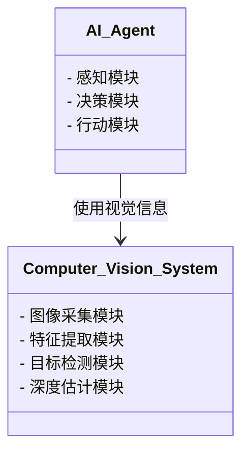
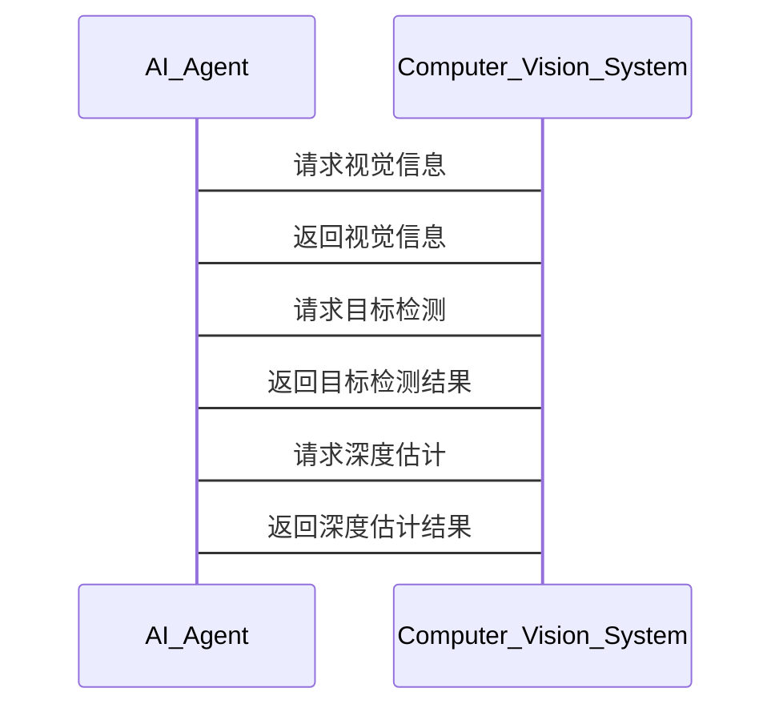

                 


# 计算机视觉集成：扩展AI Agent的感知能力

## 关键词：计算机视觉，AI Agent，感知能力，目标检测，深度估计，系统集成

## 摘要：  
本文探讨了计算机视觉技术如何扩展AI Agent的感知能力。通过详细分析计算机视觉的核心算法和AI Agent的决策机制，展示了它们的结合如何提升AI系统的环境理解能力。文章涵盖了从理论到实践的各个方面，包括关键算法、系统架构设计和项目实战，为读者提供了一个全面的视角。

---

# 第一部分: 背景介绍

# 第1章: 计算机视觉与AI Agent的集成概述

## 1.1 计算机视觉的基本概念

### 1.1.1 计算机视觉的定义与核心问题
计算机视觉是人工智能的一个分支，旨在模拟人类视觉系统，使计算机能够理解和处理图像或视频流中的信息。其核心问题包括图像分割、目标检测、目标识别、语义分割和图像生成等。

- **图像分割**：将图像分成多个部分，以便更好地理解图像内容。
- **目标检测**：识别图像中存在哪些物体，并确定它们的位置。
- **目标识别**：不仅检测目标，还识别目标的类别。
- **语义分割**：对图像中的每个像素进行分类，以更细粒度地理解图像内容。
- **图像生成**：通过算法生成新的图像。

### 1.1.2 计算机视觉的核心技术与应用领域
计算机视觉的核心技术包括：
- **特征提取**：通过提取图像的特征，如边缘、纹理、形状等，来识别图像中的物体。
- **深度学习**：近年来，深度学习技术（如卷积神经网络CNN）在计算机视觉领域取得了显著进展。
- **目标检测与识别**：基于CNN的目标检测算法（如YOLO、Faster R-CNN）广泛应用于自动驾驶、智能安防等领域。
- **图像分割**：基于分割网络（如U-Net、Mask R-CNN）的应用在医学图像分析、场景分割中表现突出。

计算机视觉的应用领域包括：
- **自动驾驶**：通过摄像头和激光雷达感知环境，识别道路、车辆、行人等。
- **智能安防**：通过人脸识别、行为分析等技术，实现智能监控。
- **机器人技术**：赋予机器人视觉感知能力，使其能够与环境交互。
- **增强现实（AR）**：通过计算机视觉技术实现虚拟物体与真实环境的叠加。

### 1.1.3 AI Agent的基本概念与功能
AI Agent（智能体）是一种能够感知环境、做出决策并采取行动的实体。AI Agent的核心功能包括：
- **感知**：通过传感器（如摄像头、麦克风）获取环境信息。
- **决策**：基于感知信息，通过算法做出决策。
- **行动**：根据决策执行动作（如移动、说话）。

AI Agent可以是软件（如虚拟助手）或硬件（如智能机器人）。

---

## 1.2 计算机视觉在AI Agent中的作用

### 1.2.1 AI Agent的感知能力扩展
AI Agent的感知能力通常依赖于多种传感器，如摄像头、麦克风、激光雷达等。计算机视觉技术通过处理来自摄像头的图像信息，显著扩展了AI Agent的感知能力。

- **环境理解**：通过计算机视觉技术，AI Agent可以理解复杂的视觉信息，如物体的位置、形状、颜色等。
- **实时反馈**：计算机视觉技术能够实时处理图像信息，为AI Agent提供即时的环境反馈。

### 1.2.2 计算机视觉如何增强AI Agent的环境理解
计算机视觉通过以下方式增强AI Agent的环境理解：
- **目标检测**：帮助AI Agent识别环境中的物体。
- **语义分割**：使AI Agent能够理解每个像素的含义，从而更精细地感知环境。
- **深度估计**：通过深度信息，AI Agent可以更好地理解三维空间中的物体位置和距离。

### 1.2.3 计算机视觉与AI Agent的结合场景
计算机视觉与AI Agent的结合场景包括：
- **自动驾驶**：通过计算机视觉技术，自动驾驶汽车能够识别道路、车辆、行人等。
- **智能安防**：通过人脸识别和行为分析，智能安防系统能够识别异常行为。
- **机器人技术**：通过计算机视觉技术，机器人能够识别和抓取物体。
- **增强现实**：通过计算机视觉技术，增强现实应用能够实现虚拟物体与真实环境的叠加。

---

## 1.3 问题背景与问题描述

### 1.3.1 当前AI Agent感知能力的局限性
尽管AI Agent在感知能力方面取得了显著进展，但仍存在一些局限性：
- **环境理解能力有限**：AI Agent通常依赖于单一传感器（如摄像头）获取信息，难以全面理解环境。
- **实时处理能力不足**：复杂的视觉任务（如实时目标检测）对计算资源要求较高，限制了AI Agent的实时性。
- **鲁棒性不足**：在复杂或动态环境中，AI Agent的感知能力可能受到限制。

### 1.3.2 计算机视觉技术如何解决这些问题
计算机视觉技术通过以下方式解决AI Agent感知能力的局限性：
- **多模态感知**：结合多种传感器（如摄像头、激光雷达）信息，提高环境理解能力。
- **高效算法**：通过优化算法（如轻量化目标检测算法），提高实时处理能力。
- **鲁棒性增强**：通过数据增强、模型优化等技术，提高AI Agent在复杂环境中的鲁棒性。

### 1.3.3 问题的边界与外延
问题的边界包括：
- **传感器限制**：AI Agent的感知能力受限于传感器的性能。
- **计算资源限制**：复杂的视觉任务需要高性能计算资源。
- **环境复杂性**：在复杂或动态环境中，AI Agent的感知能力可能受到限制。

问题的外延包括：
- **多模态感知**：结合其他传感器（如红外传感器）信息，进一步增强环境理解能力。
- **边缘计算**：通过边缘计算技术，提高AI Agent的实时处理能力。
- **自适应学习**：通过自适应学习算法，增强AI Agent在复杂环境中的鲁棒性。

---

## 1.4 本章小结

本章介绍了计算机视觉和AI Agent的基本概念，以及它们如何结合以扩展AI Agent的感知能力。通过分析当前AI Agent感知能力的局限性和计算机视觉技术的解决方案，为后续章节的深入探讨奠定了基础。

---

# 第2章: 计算机视觉与AI Agent的核心概念

## 2.1 计算机视觉的核心原理

### 2.1.1 图像处理与特征提取
图像处理是计算机视觉的基础，包括图像增强、图像分割、图像变换等技术。特征提取通过提取图像的特征（如边缘、纹理、形状）来表示图像中的物体。

- **图像增强**：通过调整图像的亮度、对比度等，改善图像质量。
- **图像分割**：将图像分成多个部分，以便更好地理解图像内容。
- **图像变换**：如傅里叶变换，用于图像频域分析。
- **特征提取**：通过卷积神经网络（CNN）提取图像的高层次特征。

### 2.1.2 目标检测与识别
目标检测通过定位和识别图像中的物体，是计算机视觉的核心任务之一。目标识别进一步识别物体的类别。

- **目标检测算法**：如YOLO、Faster R-CNN等。
- **目标识别算法**：如ResNet、MobileNet等。

### 2.1.3 视觉定位与跟踪
视觉定位通过摄像头获取物体的三维位置，视觉跟踪通过连续帧跟踪物体。

- **视觉定位**：基于特征匹配或深度估计技术。
- **视觉跟踪**：基于光流法、目标检测等技术。

---

### 2.2 AI Agent的核心原理

AI Agent的核心原理包括感知、决策和行动。

- **感知**：通过传感器获取环境信息。
- **决策**：基于感知信息，通过算法做出决策。
- **行动**：根据决策执行动作。

---

### 2.3 计算机视觉与AI Agent的关联

计算机视觉为AI Agent提供环境信息，AI Agent通过视觉信息进行决策和行动。

- **环境信息获取**：计算机视觉技术帮助AI Agent获取环境中的物体、场景等信息。
- **决策支持**：计算机视觉技术为AI Agent提供决策依据。
- **行动指导**：计算机视觉技术指导AI Agent的行动，如路径规划。

---

## 2.4 核心概念对比与ER实体关系图

### 2.4.1 计算机视觉与AI Agent的核心属性对比

| 属性         | 计算机视觉                     | AI Agent                       |
|--------------|--------------------------------|--------------------------------|
| 核心任务     | 图像处理、目标检测、语义分割    | 感知、决策、行动               |
| 技术基础     | 图像处理、深度学习             | 机器学习、强化学习            |
| 应用场景     | 自动驾驶、智能安防、机器人技术  | 自动驾驶、智能安防、机器人技术 |

### 2.4.2 实体关系图（Mermaid）

```mermaid
er
actor(AI Agent) -[通过视觉感知环境]-> entity(环境)
actor(计算机视觉系统) -[提取视觉特征]-> entity(图像)
```

---

## 2.5 本章小结

本章详细讲解了计算机视觉和AI Agent的核心概念，并通过对比和实体关系图展示了它们之间的联系。这为后续章节的深入探讨奠定了基础。

---

# 第3章: 关键算法与数学模型

## 3.1 目标检测算法

### 3.1.1 YOLO算法原理

YOLO（You Only Look Once）是一种基于深度学习的目标检测算法，具有高效、简洁的特点。

- **YOLOv1**：将图像划分为网格，每个网格负责预测目标的边界框和类别。
- **YOLOv2**：引入锚框（anchor box），并采用多尺度预测。
- **YOLOv3**：采用更深的Darknet-53网络，并引入多层感受野。

### 3.1.2 算法流程图（Mermaid）

```mermaid
graph TD
A[输入图像] -> B[提取特征] -> C[预测边界框和类别] -> D[输出结果]
```

### 3.1.3 Python代码实现

```python
import tensorflow as tf
from tensorflow import keras

# 加载预训练的YOLO模型
model = keras.models.load_model('yolov3.h5')

# 处理输入图像
def preprocess_image(image):
    # 缩放到416x416
    image = keras.preprocessing.image.load_img(image, target_size=(416, 416))
    image = keras.preprocessing.image.img_to_array(image)
    image = np.expand_dims(image, axis=0)
    return image

# 进行目标检测
def detect_objects(image_path):
    image = preprocess_image(image_path)
    predictions = model.predict(image)
    return predictions

# 解析预测结果
def parse_predictions(predictions):
    # 解析边界框和类别
    for pred in predictions:
        class_id = pred[0]
        confidence = pred[1]
        if confidence > 0.5:
            print(f"检测到物体：{class_id}，置信度：{confidence}")

# 主函数
def main():
    import argparse
    parser = argparse.ArgumentParser(description='YOLO 目标检测')
    parser.add_argument('image_path', type=str, help='图像路径')
    args = parser.parse_args()
    detect_objects(args.image_path)

if __name__ == '__main__':
    main()
```

---

## 3.2 深度估计算法

### 3.2.1 深度估计的基本原理
深度估计通过单目或多目摄像头估计场景中物体的深度信息，通常基于深度学习技术。

- **单目深度估计**：基于CNN的单目深度估计模型（如Monocular-Depth-Estimation）。
- **多目深度估计**：基于多目摄像头的立体视觉技术（如深度估计）。

### 3.2.2 深度估计的数学模型

深度估计的数学模型通常包括：
- **光心位置**：摄像头的光心位置坐标。
- **焦距**：摄像头的焦距。
- **基线距离**：多目摄像头之间的距离。

深度D的计算公式如下：

$$
D = \frac{f \cdot b}{ disparity }
$$

其中，f是焦距，b是基线距离，disparity是视差。

### 3.2.3 Python代码实现

```python
import numpy as np

# 定义深度估计函数
def compute_depth(disparity_map, f, b):
    depth = (f * b) / disparity_map
    return depth

# 示例使用
f = 500  # 焦距
b = 100  # 基线距离
disparity_map = np.random.rand(480, 640)  # 随机生成视差图
depth_map = compute_depth(disparity_map, f, b)
print("深度估计完成！")
```

---

## 3.3 本章小结

本章详细讲解了目标检测和深度估计的关键算法，并通过Python代码实现展示了它们的数学模型和实现细节。

---

# 第4章: 系统分析与架构设计

## 4.1 系统功能设计

### 4.1.1 领域模型设计（Mermaid类图）



---

## 4.2 系统架构设计

### 4.2.1 系统架构图（Mermaid架构图）


---

## 4.3 接口设计与交互流程

### 4.3.1 系统接口设计

| 接口名称   | 接口描述                     | 调用方       | 提供方       |
|------------|------------------------------|--------------|--------------|
| Get_Image  | 获取环境中的图像信息         | AI Agent     | Computer Vision System |
| Detect_Object | 检测图像中的物体           | AI Agent     | Computer Vision System |
| Estimate_Depth | 估计图像中的深度信息       | AI Agent     | Computer Vision System |

### 4.3.2 交互流程（Mermaid序列图）



---

## 4.4 本章小结

本章通过系统功能设计、架构设计和接口设计，详细展示了计算机视觉与AI Agent集成的系统架构。

---

# 第5章: 项目实战

## 5.1 环境安装与配置

### 5.1.1 安装Python环境
```bash
python --version
pip install --upgrade pip
```

### 5.1.2 安装深度学习框架
```bash
pip install tensorflow==2.6.0
pip install keras==2.6.0
pip install numpy==1.21.0
pip install opencv-python==4.5.5.56
```

---

## 5.2 系统核心实现

### 5.2.1 计算机视觉系统的实现

```python
import cv2
import numpy as np

def capture_image():
    cap = cv2.VideoCapture(0)
    ret, frame = cap.read()
    if ret:
        cv2.imwrite("captured_image.jpg", frame)
    cap.release()

def detect_objects(image_path):
    model = keras.models.load_model('yolov3.h5')
    image = preprocess_image(image_path)
    predictions = model.predict(image)
    parse_predictions(predictions)

def estimate_depth(disparity_map, f, b):
    depth = (f * b) / disparity_map
    return depth

if __name__ == '__main__':
    capture_image()
    detect_objects('captured_image.jpg')
    f = 500
    b = 100
    disparity_map = np.random.rand(480, 640)
    depth_map = estimate_depth(disparity_map, f, b)
    print("系统运行完成！")
```

---

### 5.2.2 AI Agent的核心实现

```python
class AI_Agent:
    def __init__(self):
        self.cv_system = Computer_Vision_System()

    def perceive_environment(self):
        self.cv_system.capture_image()
        self.cv_system.detect_objects('captured_image.jpg')
        depth_map = self.cv_system.estimate_depth(disparity_map, f, b)
        return depth_map

    def decide_action(self, depth_map):
        # 示例决策逻辑
        if np.max(depth_map) < 100:
            return "前进"
        else:
            return "停止"

    def act(self, action):
        print(f"执行动作：{action}")

if __name__ == '__main__':
    agent = AI_Agent()
    depth_map = agent.perceive_environment()
    action = agent.decide_action(depth_map)
    agent.act(action)
```

---

## 5.3 代码应用解读与分析

### 5.3.1 计算机视觉系统的代码解读
- **capture_image()**：通过摄像头捕获图像并保存。
- **detect_objects()**：加载预训练模型，进行目标检测。
- **estimate_depth()**：基于视差图计算深度图。

### 5.3.2 AI Agent的代码解读
- **AI_Agent类**：包含计算机视觉系统实例。
- **perceive_environment()**：调用计算机视觉系统获取环境信息。
- **decide_action()**：基于深度图做出决策。
- **act()**：执行动作。

---

## 5.4 案例分析与详细讲解

### 5.4.1 应用场景：自动驾驶

- **环境捕获**：通过摄像头捕获前方道路图像。
- **目标检测**：检测道路上的车辆和行人。
- **深度估计**：估计车辆和行人的深度信息。
- **决策与行动**：基于深度信息做出避障决策。

### 5.4.2 案例分析步骤

1. **环境捕获**：摄像头捕获前方道路图像。
2. **目标检测**：检测道路上的车辆和行人。
3. **深度估计**：估计车辆和行人的深度信息。
4. **决策与行动**：AI Agent基于深度信息做出避障决策。

---

## 5.5 项目小结

本章通过项目实战，详细展示了计算机视觉与AI Agent集成的实现过程，包括环境安装、系统实现和案例分析。通过实际代码实现，帮助读者更好地理解理论知识。

---

# 第6章: 最佳实践与注意事项

## 6.1 小结

- 计算机视觉与AI Agent的集成显著扩展了AI Agent的感知能力。
- 关键算法包括目标检测和深度估计，需要结合具体场景进行优化。
- 系统设计需要考虑实时性、鲁棒性和可扩展性。

---

## 6.2 注意事项

- **数据质量**：计算机视觉系统的性能依赖于高质量的训练数据。
- **计算资源**：复杂的视觉任务需要高性能计算资源。
- **模型优化**：通过模型优化技术（如剪枝、量化）降低计算成本。
- **鲁棒性**：在复杂或动态环境中，需要增强系统的鲁棒性。

---

## 6.3 拓展阅读

- **YOLO算法**：YOLO官网（https://yolov5.com/）
- **深度估计**：深度估计相关论文（如《Unsupervised Monocular Depth Estimation with Surface Normals》）
- **系统集成**：学习ROS（机器人操作系统）进行AI Agent开发。

---

# 第7章: 结语

计算机视觉与AI Agent的集成是人工智能领域的重要研究方向，通过本文的探讨，我们深入理解了计算机视觉技术如何扩展AI Agent的感知能力。未来，随着深度学习和计算机视觉技术的不断发展，AI Agent将在更多领域发挥重要作用。

---

# 作者：AI天才研究院/AI Genius Institute & 禅与计算机程序设计艺术/Zen And The Art of Computer Programming

---

通过以上详细内容，希望为读者提供一个全面的视角，从理论到实践，深入探讨计算机视觉与AI Agent的集成。

