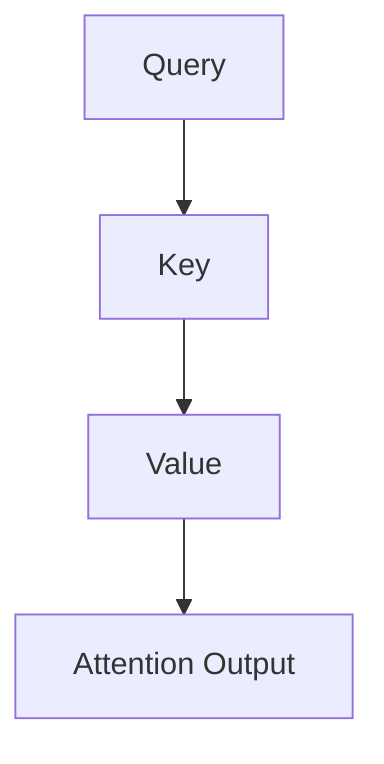
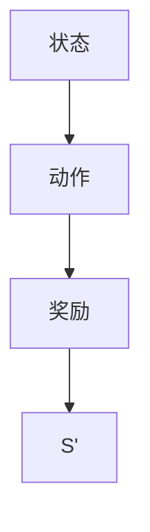
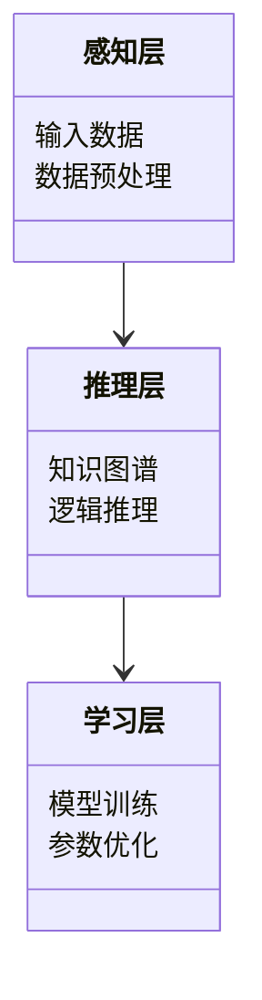
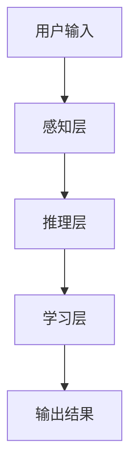
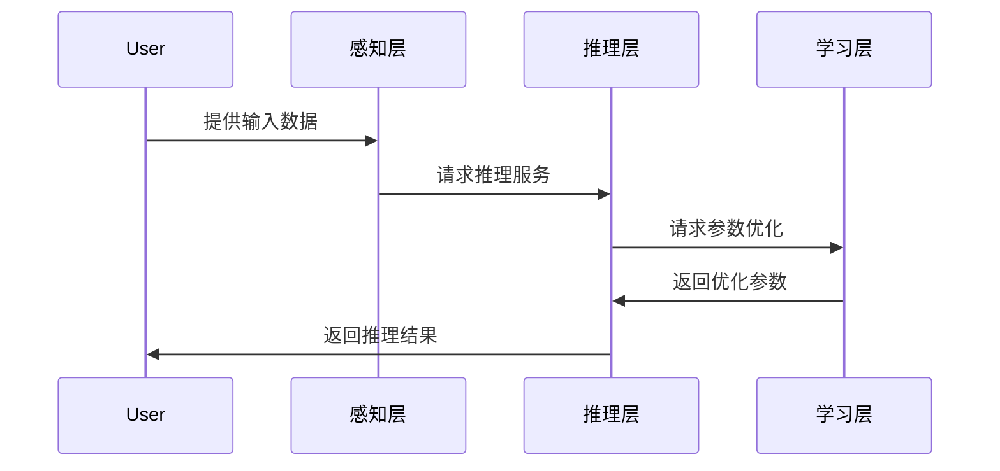

                 


# 认知架构：模拟人类思维的AI Agent设计

**关键词**：认知架构、AI Agent、人机交互、知识图谱、机器学习

**摘要**：认知架构是模拟人类思维的核心，AI Agent通过感知、推理和学习实现智能化决策。本文将详细探讨认知架构的设计原理、算法实现、系统架构及实际应用，助您深入了解如何构建智能系统。

---

## 正文

### 第1章 认知架构的背景与概念

#### 1.1 认知架构的基本概念

##### 1.1.1 什么是认知架构
认知架构是一种模拟人类认知过程的系统结构，旨在通过感知、推理和学习实现智能决策。它结合了知识表示、逻辑推理和机器学习等技术，广泛应用于AI Agent的设计中。

##### 1.1.2 认知架构的核心目标
认知架构的目标是使AI系统具备类似人类的思考和决策能力，能够处理复杂问题并适应动态环境。

##### 1.1.3 认知架构与传统AI的区别
传统的AI技术依赖于规则和数据，而认知架构强调理解和推理，能够处理语义信息并进行抽象思考。

#### 1.2 AI Agent的基本定义

##### 1.2.1 AI Agent的定义
AI Agent是一种智能实体，能够感知环境、自主决策并执行任务，广泛应用于机器人、自动驾驶等领域。

##### 1.2.2 AI Agent的特点
AI Agent具备自主性、反应性、目标导向和学习能力，能够适应复杂环境并完成复杂任务。

##### 1.2.3 AI Agent的应用场景
AI Agent在智能家居、医疗辅助、金融分析等领域有广泛应用，提升了系统的智能化水平。

#### 1.3 认知架构在AI Agent中的作用

##### 1.3.1 认知架构的结构
认知架构通常包括感知层、推理层和学习层，各层协同工作以实现智能决策。

##### 1.3.2 认知架构的功能
认知架构通过信息处理、知识推理和学习优化，提升AI Agent的智能水平。

##### 1.3.3 认知架构的实现方式
认知架构可基于知识图谱和机器学习模型实现，结合规则推理和深度学习技术。

#### 1.4 当前认知架构的研究现状

##### 1.4.1 国内外研究现状
当前认知架构研究活跃，特别是在知识图谱和深度学习的结合方面取得了显著进展。

##### 1.4.2 研究中存在的问题
现有研究面临知识表示的动态更新和推理效率的挑战，如何平衡准确性和效率是关键。

##### 1.4.3 未来研究方向
未来研究将聚焦于多模态认知、实时推理和人机协作，推动认知架构的进一步发展。

### 第2章 认知架构的核心概念与联系

#### 2.1 认知架构的核心模块

##### 2.1.1 感知模块
感知模块负责数据采集和预处理，常用技术包括自然语言处理和计算机视觉。

##### 2.1.2 推理模块
推理模块基于知识图谱进行逻辑推理，支持多种推理方式如逻辑推理和概率推理。

##### 2.1.3 学习模块
学习模块通过监督学习和强化学习优化模型参数，提升系统的认知能力。

#### 2.2 概念属性特征对比表格

| 模块     | 输入         | 输出         | 功能描述                                   |
|----------|--------------|--------------|------------------------------------------|
| 感知     | 原始数据      | 结构化数据    | 数据预处理，提取特征                       |
| 推理     | 结构化数据    | 推理结果      | 基于知识图谱进行逻辑推理                 |
| 学习     | 推理结果      | 优化参数     | 通过训练优化模型，提升认知能力           |

#### 2.3 ER实体关系图

```mermaid
erd
  节点
    实体: 感知层、推理层、学习层
    属性: 输入数据、推理结果、优化参数
  关系
    感知层 --> 输入数据
    推理层 --> 推理结果
    学习层 --> 优化参数
```

### 第3章 算法原理

#### 3.1 注意力机制

##### 3.1.1 注意力机制的数学模型

$$
\text{Attention}(Q, K, V) = \text{softmax}\left(\frac{QK^T}{\sqrt{d_k}}\right)V
$$

##### 3.1.2 注意力机制的mermaid流程图



##### 3.1.3 Python代码实现

```python
import torch

def attention(query, key, value, d_k):
    scores = (query @ key.T) / torch.sqrt(torch.tensor(d_k, dtype=torch.float))
    attention_weights = torch.softmax(scores, dim=1)
    output = attention_weights @ value
    return output
```

#### 3.2 强化学习

##### 3.2.1 强化学习的数学模型

$$
Q(s, a) = r + \gamma \max Q(s', a')
$$

##### 3.2.2 强化学习的mermaid流程图



##### 3.2.3 Python代码实现

```python
import numpy as np

def q_learning(env, num_episodes, learning_rate, gamma):
    q_table = np.zeros(env.observation_space.shape)
    for _ in range(num_episodes):
        state = env.reset()
        for _ in range(env.n_steps):
            action = np.argmax(q_table[state])
            next_state, reward, done = env.step(action)
            q_table[state][action] = q_table[state][action] * (1 - learning_rate) + \
                                      (reward + gamma * np.max(q_table[next_state])) * learning_rate
            if done:
                break
    return q_table
```

### 第4章 系统分析与架构设计

#### 4.1 系统功能设计

##### 4.1.1 领域模型



##### 4.1.2 系统架构



##### 4.1.3 接口设计



### 第5章 项目实战

#### 5.1 环境安装

安装必要的库：
```bash
pip install numpy torch matplotlib
```

#### 5.2 核心实现

##### 5.2.1 感知层实现

```python
import torch

class PerceptionLayer(torch.nn.Module):
    def __init__(self, input_dim, output_dim):
        super(PerceptionLayer, self).__init__()
        self.linear = torch.nn.Linear(input_dim, output_dim)
    
    def forward(self, x):
        return torch.relu(self.linear(x))
```

##### 5.2.2 推理层实现

```python
import torch

class ReasoningLayer(torch.nn.Module):
    def __init__(self, input_dim, hidden_dim, output_dim):
        super(ReasoningLayer, self).__init__()
        self.encoder = torch.nn.Embedding(input_dim, hidden_dim)
        self.decoder = torch.nn.Linear(hidden_dim, output_dim)
    
    def forward(self, x):
        x = self.encoder(x)
        x = torch.relu(x)
        return self.decoder(x)
```

##### 5.2.3 学习层实现

```python
import torch

class LearningLayer(torch.nn.Module):
    def __init__(self, input_dim, output_dim):
        super(LearningLayer, self).__init__()
        self.linear = torch.nn.Linear(input_dim, output_dim)
    
    def forward(self, x):
        return torch.sigmoid(self.linear(x))
```

#### 5.3 实际案例分析

以医疗诊断为例，展示认知架构如何通过感知、推理和学习模块协同工作，实现病情诊断和治疗建议。

### 第6章 最佳实践与总结

#### 6.1 小结

认知架构通过感知、推理和学习模块的协同工作，模拟人类思维，实现智能决策。

#### 6.2 注意事项

在实际应用中，需注意数据质量和模型可解释性，避免黑箱问题。

#### 6.3 拓展阅读

推荐相关书籍和论文，如《深度学习》和《知识图谱》。

---

**作者：AI天才研究院 & 禅与计算机程序设计艺术**

