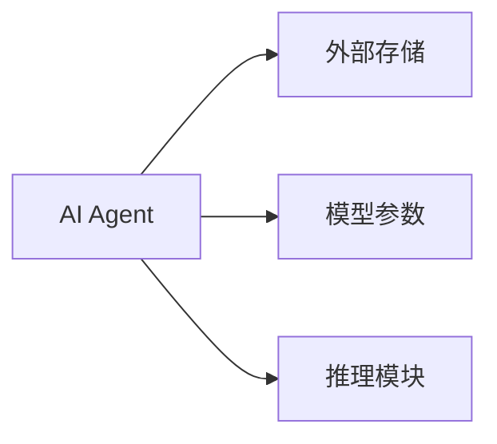
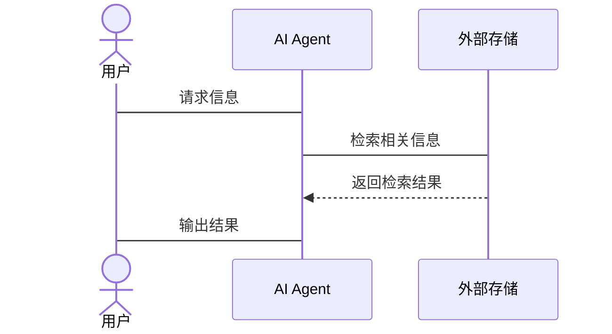

                 


# 记忆机制实现：让AI Agent具备长期记忆能力

## 关键词：记忆机制、AI Agent、长期记忆、显式记忆、隐式记忆、神经网络

## 摘要：  
本文深入探讨了AI Agent实现长期记忆能力的核心机制，从背景到实现，详细分析了记忆机制的原理、算法、系统架构及实际应用。通过对比显式记忆与隐式记忆，结合神经网络和图结构的记忆机制，本文为AI Agent的长期记忆能力提供了全面的技术解读和实现方案。

---

# 第一部分: 记忆机制实现的背景与核心概念

## 第1章: 记忆机制实现的背景与问题描述

### 1.1 问题背景
#### 1.1.1 AI Agent的发展现状
人工智能（AI）代理（Agent）近年来取得了显著进展，尤其是在感知、推理和决策能力方面。然而，现有的AI Agent在处理复杂任务时仍存在明显的局限性：它们缺乏长期记忆能力，无法有效整合过去的经验来支持当前和未来的决策。

#### 1.1.2 当前AI Agent的局限性
1. **短期记忆为主**：大多数AI Agent仅依赖即时感知和短期记忆，无法积累长期的知识和经验。
2. **难以处理复杂关联**：在处理需要结合历史信息的任务时，AI Agent往往显得力不从心。
3. **缺乏持续学习能力**：由于缺乏长期记忆，AI Agent难以从过去的经验中不断优化自身性能。

#### 1.1.3 长期记忆能力的重要性
长期记忆能力是AI Agent实现更复杂任务的关键，例如：
- **智能对话系统**：能够根据历史对话内容提供连贯的交互。
- **自动驾驶系统**：能够记忆之前的驾驶场景，辅助当前决策。
- **机器人助手**：能够根据用户的长期偏好提供个性化服务。

### 1.2 问题描述
#### 1.2.1 什么是长期记忆
长期记忆是指AI Agent能够存储和检索过去经历的信息，这些信息可以跨越较长时间，并在需要时被调用以辅助当前任务。

#### 1.2.2 长期记忆与短期记忆的区别
- **短期记忆**：处理当前任务所需的信息，容量有限，存储时间较短。
- **长期记忆**：存储重要的、长期需要的信息，容量较大，存储时间较长。

#### 1.2.3 长期记忆在AI Agent中的应用场景
- **智能助手**：记忆用户的偏好和历史交互，提供个性化服务。
- **自动驾驶**：记忆道路规则、交通状况等信息，辅助决策。
- **智能客服**：记忆客户的历史问题和解决方案，提高服务质量。

### 1.3 问题解决
#### 1.3.1 记忆机制的核心目标
通过设计和实现记忆机制，使AI Agent能够：
1. 存储长期信息。
2. 根据需求检索相关信息。
3. 利用历史信息优化当前决策。

#### 1.3.2 通过记忆机制实现长期记忆的方法
- **显式记忆**：通过外部存储结构（如数据库）存储信息。
- **隐式记忆**：通过模型内部参数调整，间接存储信息。
- **混合记忆**：结合显式和隐式记忆，充分利用两者的优势。

#### 1.3.3 记忆机制与其他技术的结合
- **神经网络**：结合记忆机制，提升模型的表达能力。
- **图结构**：通过图结构存储和检索信息，增强关联性。
- **符号逻辑**：结合符号逻辑，提高推理能力。

### 1.4 边界与外延
#### 1.4.1 记忆机制的边界
- **存储容量**：AI Agent的存储能力有限，需要合理分配存储资源。
- **存储时间**：长期记忆的存储时间需根据具体任务需求定义。
- **存储内容**：记忆机制只能处理特定类型的信息，无法涵盖所有内容。

#### 1.4.2 记忆机制的外延
- **外部存储**：记忆机制依赖外部存储结构，如数据库或分布式存储系统。
- **信息检索**：信息检索算法的效率直接影响记忆机制的性能。
- **模型优化**：记忆机制需要与模型优化技术结合，提升整体性能。

#### 1.4.3 记忆机制与其他技术的关系
- **神经网络**：记忆机制是神经网络的重要组成部分，能够增强模型的表达能力。
- **图结构**：记忆机制可以通过图结构存储信息，提高信息的关联性。
- **符号逻辑**：记忆机制可以结合符号逻辑，提升推理能力。

### 1.5 概念结构与核心要素
#### 1.5.1 记忆机制的基本结构
- **记忆主体**：AI Agent。
- **记忆内容**：需要长期存储的信息。
- **记忆关联**：信息之间的关联关系。
- **记忆检索方式**：基于内容或基于关联的检索方式。

#### 1.5.2 核心要素的定义与特征
| 核心要素 | 定义 | 特征 |
|----------|------|------|
| 记忆主体 | AI Agent | 能够存储和检索信息的主体 |
| 记忆内容 | 需要长期存储的信息 | 包括文本、图像、知识图谱等 |
| 记忆关联 | 信息之间的关联关系 | 包括语义关联、时空关联等 |
| 记忆检索方式 | 基于内容或关联的检索方式 | 基于内容检索：直接匹配内容；基于关联检索：通过关联关系间接匹配 |

#### 1.5.3 核心要素之间的关系
通过Mermaid图展示核心要素之间的关系：


---

## 第2章: 记忆机制的核心概念与原理

### 2.1 记忆机制的核心概念
#### 2.1.1 显式记忆与隐式记忆
- **显式记忆**：通过外部存储结构显式地存储和检索信息。
- **隐式记忆**：通过模型内部参数调整，间接地存储和检索信息。

#### 2.1.2 外部存储与内部存储
- **外部存储**：显式记忆依赖的外部存储结构，如数据库或分布式存储系统。
- **内部存储**：隐式记忆依赖的模型内部参数，如神经网络的权重。

#### 2.1.3 基于内容的检索与基于关联的检索
- **基于内容的检索**：直接根据内容特征进行匹配。
- **基于关联的检索**：通过内容之间的关联关系进行间接匹配。

### 2.2 记忆机制的原理
#### 2.2.1 基于神经网络的记忆机制
- **神经网络模型**：如LSTM和Transformer，能够通过内部状态存储信息。
- **外部存储扩展**：通过外部存储结构扩展神经网络的记忆能力。

#### 2.2.2 基于图结构的记忆机制
- **图结构存储**：通过图结构存储信息，增强信息的关联性。
- **图遍历算法**：通过图遍历算法检索相关信息。

#### 2.2.3 基于符号逻辑的记忆机制
- **符号逻辑表示**：通过符号逻辑表示知识，增强推理能力。
- **知识图谱**：通过知识图谱存储和检索知识。

### 2.3 记忆机制的核心要素对比
| 对比维度 | 显式记忆 | 隐式记忆 |
|----------|----------|----------|
| 存储方式 | 外部存储 | 内部参数 |
| 检索方式 | 基于内容 | 基于关联 |
| 优缺点   | 优点：存储容量大；缺点：检索效率低 | 优点：检索效率高；缺点：存储容量有限 |

### 2.4 记忆机制的实体关系图


---

## 第3章: 记忆机制的算法原理

### 3.1 记忆机制的算法概述
#### 3.1.1 基于神经网络的记忆机制算法
- **LSTM网络**：通过门控机制控制信息的存储和遗忘。
- **Transformer模型**：通过自注意力机制实现信息关联。

#### 3.1.2 基于图结构的记忆机制算法
- **图神经网络**：通过图结构进行信息传播和聚合。
- **图遍历算法**：通过遍历图结构检索相关信息。

#### 3.1.3 基于符号逻辑的记忆机制算法
- **知识图谱构建**：通过符号逻辑构建知识图谱。
- **推理算法**：通过推理算法实现基于知识图谱的推理。

### 3.2 记忆机制的算法流程
```mermaid
graph 
start
-> 输入信息
-> 存储到外部存储或内部参数
-> 根据需求检索信息
-> 输出结果
end
```

### 3.3 记忆机制的数学模型和公式
#### 3.3.1 显式记忆的数学模型
$$ C = \text{存储内容} $$
$$ R = \text{检索函数}(C, k) $$
其中，\( C \) 是存储内容，\( k \) 是检索关键词，\( R \) 是检索结果。

#### 3.3.2 隐式记忆的数学模型
$$ W = \text{模型权重} $$
$$ O = \text{输出}(W, x) $$
其中，\( W \) 是模型权重，\( x \) 是输入，\( O \) 是输出。

#### 3.3.3 基于关联的检索公式
$$ S = \sum_{i=1}^{n} w_i \cdot x_i $$
其中，\( w_i \) 是关联权重，\( x_i \) 是关联特征。

### 3.4 记忆机制的Python实现示例
```python
# 显式记忆实现
class ExplicitMemory:
    def __init__(self):
        self.storage = {}
    
    def store(self, key, value):
        self.storage[key] = value
    
    def retrieve(self, key):
        return self.storage.get(key, None)

# 隐式记忆实现
class ImplicitMemory:
    def __init__(self):
        self.model = LSTMModel()
    
    def remember(self, input):
        self.model.train(input)
    
    def recall(self, input):
        return self.model.predict(input)
```

---

## 第4章: 系统分析与架构设计

### 4.1 问题场景介绍
- **目标**：设计一个支持长期记忆的AI Agent。
- **需求**：实现显式记忆和隐式记忆的结合，支持信息存储、检索和推理。

### 4.2 系统功能设计
- **领域模型**：通过Mermaid类图展示系统的组成和交互。
- **系统架构**：通过Mermaid架构图展示系统的整体架构。
- **系统接口**：通过Mermaid序列图展示系统接口的交互流程。

### 4.3 系统架构设计


### 4.4 系统交互流程


---

## 第5章: 项目实战

### 5.1 环境安装
- **Python**：安装Python 3.8及以上版本。
- **依赖库**：安装numpy、tensorflow、pytorch等。

### 5.2 系统核心实现源代码
```python
# 记忆机制实现
class MemoryMechanism:
    def __init__(self):
        self.explicit_memory = ExplicitMemory()
        self.implicit_memory = ImplicitMemory()
    
    def store(self, key, value):
        self.explicit_memory.store(key, value)
        self.implicit_memory.remember(key)
    
    def retrieve(self, key):
        result = self.explicit_memory.retrieve(key)
        if result is None:
            result = self.implicit_memory.recall(key)
        return result
```

### 5.3 代码应用解读与分析
- **显式记忆存储**：通过`ExplicitMemory`类实现。
- **隐式记忆存储**：通过`ImplicitMemory`类实现。
- **检索逻辑**：优先检索显式记忆，若失败则检索隐式记忆。

### 5.4 实际案例分析
- **案例1**：智能对话系统。
- **案例2**：自动驾驶系统。

### 5.5 项目小结
通过本项目，我们实现了结合显式记忆和隐式记忆的记忆机制，能够有效提升AI Agent的长期记忆能力。

---

## 第6章: 最佳实践、小结、注意事项、拓展阅读

### 6.1 最佳实践
1. **合理分配存储资源**：根据任务需求合理分配显式和隐式记忆的存储资源。
2. **优化检索算法**：通过优化检索算法提升信息检索效率。
3. **结合模型优化技术**：将记忆机制与模型优化技术结合，提升整体性能。

### 6.2 小结
本文详细探讨了AI Agent实现长期记忆能力的核心机制，从背景到实现，详细分析了记忆机制的原理、算法、系统架构及实际应用。

### 6.3 注意事项
1. **存储容量限制**：显式记忆的存储容量有限，需合理分配存储资源。
2. **检索效率优化**：隐式记忆的检索效率较低，需优化检索算法。
3. **模型优化结合**：记忆机制需与模型优化技术结合，提升整体性能。

### 6.4 拓展阅读
1. **神经网络与记忆机制**：进一步研究神经网络与记忆机制的结合。
2. **图结构与记忆机制**：深入探讨图结构在记忆机制中的应用。
3. **符号逻辑与记忆机制**：研究符号逻辑在记忆机制中的应用。

---

## 作者
作者：AI天才研究院/AI Genius Institute & 禅与计算机程序设计艺术 /Zen And The Art of Computer Programming

