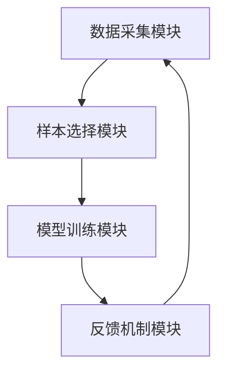

                 


# 设计AI Agent的主动学习策略

> 关键词：AI Agent, 主动学习, 策略设计, 机器学习, 智能代理

> 摘要：本文深入探讨了设计AI Agent的主动学习策略的核心概念、算法原理、系统架构及实际应用。通过分析主动学习的基本原理、策略分类、数学模型、系统架构设计以及项目实战，为读者提供了全面的理解和实践指导。文章还总结了最佳实践和未来研究方向，帮助读者更好地掌握AI Agent的主动学习策略设计。

---

# 第1章: AI Agent主动学习策略的背景与概念

## 1.1 主动学习的基本概念

### 1.1.1 主动学习的定义
主动学习是一种机器学习方法，旨在通过智能代理主动选择最有价值的数据进行学习，以最小化数据量同时最大化性能提升。其核心思想是让模型主动选择对自身改进最有帮助的样本，而不是被动接受数据。

### 1.1.2 主动学习与监督学习的区别
| 特性                | 主动学习               | 监督学习               |
|---------------------|-----------------------|-----------------------|
| 数据选择方式        | 主动选择               | 被动接受               |
| 数据量              | 较小                   | 较大                   |
| 学习效率            | 高                    | 中等                   |
| 应用场景            | 高效学习、数据稀缺场景 | 通用学习场景           |

### 1.1.3 主动学习的核心思想
主动学习的核心思想是通过不断选择最具代表性和信息量的样本，优化模型性能。这种策略特别适用于数据稀缺或标注成本高的场景。

### 1.1.4 AI Agent与主动学习的关系
AI Agent通过主动学习策略，能够更高效地完成任务，减少对外部数据的依赖，提升自主决策能力。

## 1.2 AI Agent的基本概念

### 1.2.1 AI Agent的定义
AI Agent是一种智能实体，能够感知环境、自主决策并执行任务。它具备学习、推理、规划和自适应能力。

### 1.2.2 AI Agent的分类
| 类型                | 描述                   |
|---------------------|-----------------------|
| 简单反射型Agent     | 基于规则的简单决策     |
| 基于模型的Agent     | 基于内部模型进行推理   |
| 目标驱动的Agent     | 以目标为导向执行任务   |
| 实用驱动的Agent     | 以实用结果为导向决策   |

### 1.2.3 AI Agent的任务执行模型
AI Agent的任务执行模型包括感知、决策、执行和反馈四个阶段。

## 1.3 主动学习在AI Agent中的重要性

### 1.3.1 提升学习效率
通过主动选择关键样本，AI Agent可以更快地提升模型性能。

### 1.3.2 增强决策能力
主动学习帮助AI Agent在数据稀缺场景下做出更明智的决策。

### 1.3.3 实际应用价值
在医疗、金融、自动驾驶等领域，主动学习策略能够显著提升AI Agent的性能和效率。

## 1.4 当前研究现状与未来方向

### 1.4.1 研究热点
当前研究集中在不确定性度量、样本选择策略优化和多任务主动学习。

### 1.4.2 未来方向
未来研究将探索更高效的选择策略、跨模态主动学习和强化学习的结合。

---

# 第2章: 主动学习策略的核心原理

## 2.1 主动学习策略的原理分析

### 2.1.1 不确定性度量
不确定性是主动学习的核心指标，常用的不确定性度量方法包括熵值法和最大 margin 法。

### 2.1.2 样本选择策略
样本选择策略包括不确定性采样、多样性采样和密度估计采样。

### 2.1.3 策略优化
通过不断迭代优化样本选择策略，提升模型性能。

## 2.2 不同主动学习策略的对比

| 策略                | 描述                   | 优缺点                 |
|---------------------|-----------------------|-----------------------|
| 不确定性采样         | 偏好选择不确定性高的样本 | 有效提升模型泛化能力   |
| 多样性采样           | 偏好选择分布较广的样本   | 避免模型过拟合         |
| 密度估计采样         | 偏好选择密度较低的区域   | 提高模型对稀疏区域的覆盖 |

## 2.3 策略选择的关键因素

### 2.3.1 数据分布
数据分布影响样本选择策略的有效性。

### 2.3.2 任务目标
任务目标决定选择策略的优化方向。

### 2.3.3 模型特性
模型特性影响不确定性度量方法的选择。

---

# 第3章: 主动学习策略的数学模型

## 3.1 不确定性度量的数学模型

### 3.1.1 熵值法
熵值公式：$H = -\sum p_i \log p_i$

### 3.1.2 最大 margin 法
最大 margin 公式：$argmax_{i} (y_i - y_j)$

## 3.2 多样性度量的数学模型

### 3.2.1 Kullback-Leibler散度
KL散度公式：$D_{KL}(P||Q) = \sum P_i \log \frac{P_i}{Q_i}$

## 3.3 密度度量的数学模型

### 3.3.1 高斯分布模型
概率密度公式：$f(x) = \frac{1}{\sigma \sqrt{2\pi}} e^{-\frac{(x-\mu)^2}{2\sigma^2}}$

---

# 第4章: AI Agent主动学习策略的系统架构设计

## 4.1 系统功能设计

### 4.1.1 数据采集模块
负责收集环境数据并进行预处理。

### 4.1.2 样本选择模块
根据主动学习策略选择最优样本。

### 4.1.3 模型训练模块
基于选择的样本训练模型。

### 4.1.4 反馈机制模块
根据模型表现调整样本选择策略。

## 4.2 系统架构设计

### 4.2.1 模块划分
使用Mermaid图展示系统架构。



## 4.3 接口设计

### 4.3.1 数据接口
定义数据格式和接口协议。

### 4.3.2 模型接口
定义模型输入输出接口。

## 4.4 交互流程

### 4.4.1 数据采集与预处理
从环境中采集数据并进行清洗。

### 4.4.2 样本选择与训练
根据策略选择样本并训练模型。

### 4.4.3 反馈与优化
根据模型表现调整策略。

---

# 第5章: 项目实战与案例分析

## 5.1 项目实战

### 5.1.1 环境安装
安装Python、TensorFlow和Scikit-learn等依赖库。

### 5.1.2 核心实现
实现不确定性采样策略并进行模型训练。

```python
import numpy as np
from sklearn.metrics import entropy

def select_samples(X, y, model, n_select=1):
    uncertainties = []
    for i in range(len(X)):
        prob = model.predict_proba(X[i])
        uncertainty = entropy(prob)
        uncertainties.append(uncertainty)
    selected_idx = np.argsort(uncertainties)[-n_select:]
    return selected_idx
```

### 5.1.3 代码解读
详细解读代码实现和模型训练过程。

## 5.2 案例分析

### 5.2.1 应用场景
在图像分类任务中应用主动学习策略。

### 5.2.2 实验结果
展示模型性能提升和数据量减少的效果。

## 5.3 总结与优化

### 5.3.1 总结
总结项目实现的关键点和经验教训。

### 5.3.2 优化方向
提出未来优化的方向和改进策略。

---

# 第6章: 最佳实践与注意事项

## 6.1 小结

### 6.1.1 本章总结
总结全文的核心内容和主要观点。

### 6.1.2 未来方向
展望主动学习策略的发展趋势。

## 6.2 注意事项

### 6.2.1 策略选择
根据具体任务选择合适的策略。

### 6.2.2 数据预处理
重视数据预处理对模型性能的影响。

### 6.2.3 模型选择
选择适合主动学习的模型。

## 6.3 拓展阅读

### 6.3.1 推荐书籍
推荐几本相关领域的经典书籍。

### 6.3.2 推荐论文
推荐几篇具有影响力的学术论文。

---

作者：AI天才研究院/AI Genius Institute & 禅与计算机程序设计艺术 /Zen And The Art of Computer Programming

