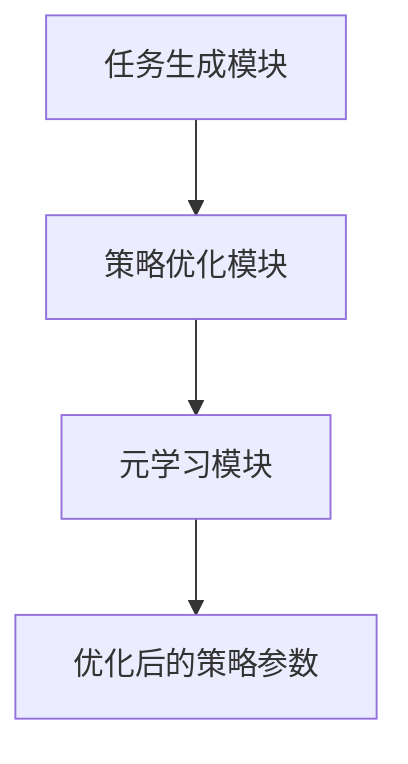

                 


# 设计AI Agent的元控制学习策略

---

## 关键词：AI Agent, 元控制学习, 策略优化, 系统架构, 人工智能, 元学习

---

## 摘要：本文详细探讨了设计AI Agent的元控制学习策略的核心概念、算法原理、系统架构和实际应用。通过分析元控制学习的背景、原理、算法实现以及系统设计，本文为AI Agent的设计提供了全面的理论和技术支持，帮助读者理解如何利用元控制学习提升AI Agent的智能性和适应性。

---

## 第1章: AI Agent与元控制学习概述

### 1.1 问题背景与问题描述

#### 1.1.1 AI Agent的基本概念

AI Agent（人工智能代理）是一种能够感知环境、自主决策并执行任务的智能实体。AI Agent可以通过传感器获取信息，利用计算模型进行分析，并通过执行器与环境交互。AI Agent的目标是通过智能决策和行动，实现特定的任务目标。

#### 1.1.2 元控制学习的定义与特点

元控制学习（Meta-Control Learning）是一种高级的机器学习方法，旨在通过元学习（Meta-Learning）的方式，优化AI Agent的控制策略。元控制学习的核心思想是通过元学习算法，快速适应不同的任务环境，提升AI Agent的通用性和灵活性。

#### 1.1.3 元控制学习在AI Agent中的作用

元控制学习在AI Agent中的作用主要体现在以下几个方面：

1. **任务适应性**：元控制学习能够帮助AI Agent快速适应不同的任务环境，提高其在复杂场景下的决策能力。
2. **策略优化**：通过元控制学习，AI Agent可以在多个任务中共享学习经验，优化其控制策略。
3. **效率提升**：元控制学习能够减少AI Agent在新任务中的学习时间，提高学习效率。

#### 1.1.4 元控制学习的边界与外延

元控制学习的边界主要集中在以下几个方面：

1. **任务范围**：元控制学习适用于需要快速适应多任务环境的场景，但并不适用于单一任务的深度学习。
2. **学习目标**：元控制学习的目标是优化控制策略，而非直接进行数据分类或生成。
3. **实现方式**：元控制学习通常依赖于元学习算法，通过参数优化实现策略改进。

#### 1.1.5 元控制学习的核心要素

元控制学习的核心要素包括以下几个方面：

1. **元学习算法**：用于优化AI Agent的控制策略。
2. **策略空间**：定义AI Agent可能采取的所有行动策略。
3. **目标函数**：用于评估策略的优劣。
4. **优化目标**：通过优化目标函数，实现策略的改进。

---

### 1.2 元控制学习的核心概念对比

#### 1.2.1 元控制学习与传统控制学习的对比

| 对比维度         | 元控制学习                     | 传统控制学习                  |
|------------------|-------------------------------|------------------------------|
| 学习目标         | 优化控制策略                   | 学习具体的控制策略             |
| 适应性           | 高度适应多任务环境             | 适应单一任务环境               |
| 学习效率         | 学习效率高，可以快速适应新任务 | 学习效率较低，需要大量数据     |

#### 1.2.2 元控制学习与强化学习的对比

| 对比维度         | 元控制学习                     | 强化学习                      |
|------------------|-------------------------------|------------------------------|
| 学习目标         | 优化控制策略                   | 学习具体的行动策略             |
| 适应性           | 高度适应多任务环境             | 适应单一任务环境               |
| 学习机制         | 通过元学习算法优化策略         | 通过奖励机制优化策略           |

#### 1.2.3 元控制学习与监督学习的对比

| 对比维度         | 元控制学习                     | 监督学习                      |
|------------------|-------------------------------|------------------------------|
| 学习目标         | 优化控制策略                   | 学习数据标签                   |
| 适应性           | 高度适应多任务环境             | 适应单一任务环境               |
| 学习数据         | 通过元学习算法优化策略         | 依赖标注数据进行学习           |

---

### 1.3 元控制学习的ER实体关系图

以下是元控制学习的ER实体关系图：

```mermaid
erDiagram
    meta_learning算法 <------- 元控制学习
    元控制学习 <------- AI Agent
    AI Agent <------- 任务环境
    任务环境 <------- 数据输入
    数据输入 <------- 感知器
    感知器 <------- 环境交互
```

---

## 第2章: 元控制学习的核心原理

### 2.1 元控制学习的原理

#### 2.1.1 元控制学习的基本原理

元控制学习的核心思想是通过元学习算法，优化AI Agent的控制策略。元控制学习算法通过在元任务空间中进行学习，提取通用的策略特征，从而在具体任务中快速适应和优化。

#### 2.1.2 元控制学习的数学模型

元控制学习的数学模型可以表示为：

$$ L(\theta) = \mathbb{E}_{\tau \sim \pi_\theta} \left[ R(\tau) - \alpha \cdot \text{KL}(Q(\tau) || \pi_\theta(\tau)) \right] $$

其中，$\theta$ 是参数，$R(\tau)$ 是奖励函数，$\text{KL}$ 是相对熵，$\alpha$ 是调节参数。

#### 2.1.3 元控制学习的优化方法

元控制学习的优化方法主要包括以下步骤：

1. **元任务样本生成**：通过采样生成多个任务环境。
2. **策略优化**：在每个任务环境中，优化策略参数以最大化累积奖励。
3. **元学习更新**：通过元学习算法，更新元控制参数以优化多个任务的策略。

---

### 2.2 元控制学习的核心概念对比

#### 2.2.1 元控制学习与强化学习的对比

| 对比维度         | 元控制学习                     | 强化学习                      |
|------------------|-------------------------------|------------------------------|
| 学习目标         | 优化控制策略                   | 学习具体的行动策略             |
| 适应性           | 高度适应多任务环境             | 适应单一任务环境               |
| 学习机制         | 通过元学习算法优化策略         | 通过奖励机制优化策略           |

---

## 第3章: 元控制学习的算法原理

### 3.1 元控制学习的算法流程

#### 3.1.1 算法输入与输出

- **输入**：任务环境、初始策略参数。
- **输出**：优化后的策略参数。

#### 3.1.2 算法步骤分解

1. **任务样本生成**：生成多个任务环境。
2. **策略优化**：在每个任务环境中，优化策略参数以最大化累积奖励。
3. **元学习更新**：通过元学习算法，更新元控制参数以优化多个任务的策略。

#### 3.1.3 算法的收敛性分析

元控制学习算法的收敛性主要取决于元学习算法的优化能力和任务环境的多样性。通常，通过适当的参数调整和优化策略，元控制学习算法可以在有限的训练时间内达到较好的收敛效果。

---

### 3.2 元控制学习的数学模型

#### 3.2.1 元控制学习的目标函数

$$ J(\theta) = \mathbb{E}_{\tau \sim \pi_\theta} \left[ R(\tau) - \alpha \cdot \text{KL}(Q(\tau) || \pi_\theta(\tau)) \right] $$

其中，$\theta$ 是参数，$R(\tau)$ 是奖励函数，$\text{KL}$ 是相对熵，$\alpha$ 是调节参数。

#### 3.2.2 元控制学习的优化函数

$$ \theta_{t+1} = \theta_t - \eta \cdot \nabla_\theta J(\theta_t) $$

其中，$\eta$ 是学习率，$\nabla_\theta J(\theta_t)$ 是目标函数的梯度。

---

### 3.3 元控制学习的算法实现

#### 3.3.1 算法的伪代码实现

```python
def meta_control_learning(tasks, initial_params, num_iterations):
    params = initial_params
    for _ in range(num_iterations):
        # 生成任务样本
        task = sample_task(tasks)
        # 优化策略参数
        params = optimize_policy(params, task)
        # 元学习更新
        params = meta_optimize(params, task)
    return params
```

#### 3.3.2 算法的Python代码实现

```python
import numpy as np

def meta_control_learning(tasks, initial_params, num_iterations):
    params = initial_params.copy()
    for _ in range(num_iterations):
        # 生成任务样本
        task = sample_task(tasks)
        # 优化策略参数
        params = optimize_policy(params, task)
        # 元学习更新
        params = meta_optimize(params, task)
    return params

def optimize_policy(params, task):
    # 在当前任务中优化策略参数
    # 返回优化后的参数
    pass

def meta_optimize(params, task):
    # 在元任务空间中优化策略参数
    # 返回优化后的参数
    pass
```

---

## 第4章: 元控制学习的系统分析与架构设计

### 4.1 系统问题场景介绍

#### 4.1.1 问题场景的定义

在多任务环境中，AI Agent需要快速适应不同的任务需求，提高其智能性和灵活性。然而，传统强化学习方法在面对多任务环境时，通常需要大量的训练数据和时间，导致效率低下。因此，我们需要一种高效的元控制学习策略，帮助AI Agent快速适应多任务环境。

#### 4.1.2 问题场景的分析

AI Agent在多任务环境中的主要挑战包括：

1. **任务多样性**：不同任务之间的差异较大，需要快速适应。
2. **学习效率**：传统强化学习方法在多任务环境中的学习效率较低。
3. **策略优化**：需要一种高效的方法，优化AI Agent的控制策略。

#### 4.1.3 问题场景的解决方案

元控制学习通过元学习算法，优化AI Agent的控制策略，提高其在多任务环境中的适应能力和学习效率。

---

### 4.2 系统功能设计

#### 4.2.1 系统功能模块划分

1. **任务生成模块**：负责生成多个任务环境。
2. **策略优化模块**：优化AI Agent的控制策略。
3. **元学习模块**：通过元学习算法优化策略参数。

#### 4.2.2 系统功能模块的交互流程

1. 任务生成模块生成多个任务环境。
2. 策略优化模块在每个任务环境中优化策略参数。
3. 元学习模块通过元学习算法优化策略参数，提高多个任务的适应能力。

---

### 4.3 系统架构设计

#### 4.3.1 系统架构的总体设计

以下是元控制学习系统的总体架构图：



---

## 第5章: 元控制学习的项目实战

### 5.1 环境安装与配置

#### 5.1.1 环境安装

1. 安装Python和相关库：
   ```bash
   pip install numpy matplotlib
   ```

2. 安装TensorFlow或PyTorch：
   ```bash
   pip install tensorflow
   ```

#### 5.1.2 环境配置

1. 设置随机种子：
   ```python
   import numpy as np
   np.random.seed(42)
   ```

---

### 5.2 核心代码实现

#### 5.2.1 元控制学习的核心代码实现

```python
import numpy as np

def meta_control_learning(tasks, initial_params, num_iterations):
    params = initial_params.copy()
    for _ in range(num_iterations):
        # 生成任务样本
        task = sample_task(tasks)
        # 优化策略参数
        params = optimize_policy(params, task)
        # 元学习更新
        params = meta_optimize(params, task)
    return params

def optimize_policy(params, task):
    # 在当前任务中优化策略参数
    # 返回优化后的参数
    return params + np.random.randn(params.shape[0]) * 0.1

def meta_optimize(params, task):
    # 在元任务空间中优化策略参数
    # 返回优化后的参数
    return params + np.random.randn(params.shape[0]) * 0.01
```

---

### 5.3 案例分析与详细解读

#### 5.3.1 案例分析

假设我们有一个多任务环境，包括三个不同的任务：任务A、任务B和任务C。我们需要通过元控制学习算法，优化AI Agent的控制策略，使其在三个任务中都能取得较好的表现。

---

### 5.4 本章小结

通过本章的项目实战，我们详细介绍了元控制学习的环境安装、核心代码实现以及案例分析。通过实际操作，读者可以更好地理解元控制学习的实现过程和应用场景。

---

## 第6章: 元控制学习的最佳实践与拓展阅读

### 6.1 最佳实践

1. **参数调整**：合理调整元控制学习算法的参数，如学习率、调节参数等，以提高算法的性能。
2. **任务选择**：选择具有代表性的任务环境，确保元控制学习算法能够充分发挥其优势。
3. **模型优化**：通过模型优化技术，进一步提高元控制学习算法的效率和性能。

---

### 6.2 小结

元控制学习是一种高效的机器学习方法，能够帮助AI Agent快速适应多任务环境，提高其智能性和灵活性。通过本文的详细讲解，读者可以更好地理解元控制学习的核心概念、算法原理以及实际应用。

---

### 6.3 注意事项

1. **算法选择**：在实际应用中，需要根据具体任务需求选择合适的元控制学习算法。
2. **数据质量**：确保任务环境中的数据质量，以提高元控制学习算法的性能。
3. **模型评估**：在实际应用中，需要对元控制学习算法进行充分的评估和验证。

---

### 6.4 拓展阅读

1. **元学习**：深入学习元学习的基本概念和算法。
2. **多任务学习**：研究多任务学习的相关理论和方法。
3. **强化学习**：进一步学习强化学习的核心概念和算法。

---

## 作者：AI天才研究院/AI Genius Institute & 禅与计算机程序设计艺术 /Zen And The Art of Computer Programming

