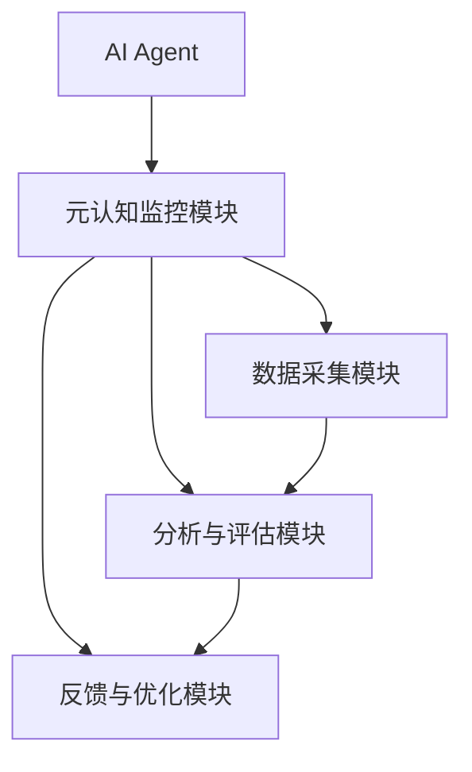
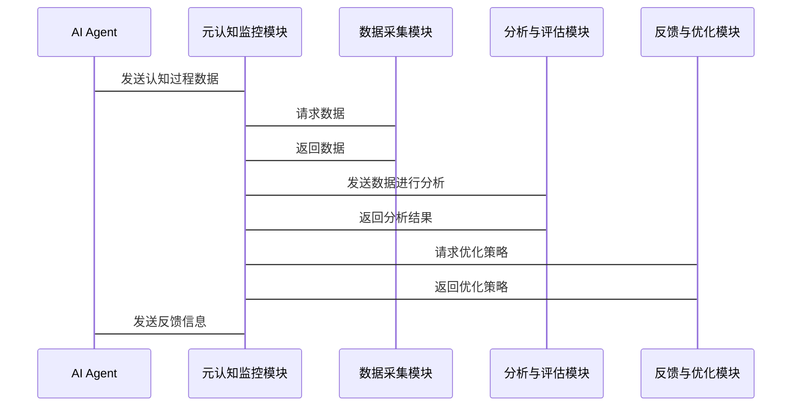

                 


# 设计AI Agent的元认知监控机制

> 关键词：AI Agent, 元认知监控, 元学习, 强化学习, 系统架构设计

> 摘要：本文详细探讨了设计AI Agent的元认知监控机制的核心概念、算法原理、系统架构以及实际应用。通过分析元认知监控在AI Agent中的重要性，结合具体的数学模型和算法实现，本文为读者提供了一种全面理解并实现元认知监控机制的方法。文章内容涵盖从理论到实践的全过程，旨在帮助读者掌握如何通过元认知监控提升AI Agent的智能水平和性能表现。

---

# 第一部分: AI Agent的元认知监控机制概述

## 第1章: 元认知监控机制的背景与概念

### 1.1 AI Agent的基本概念

#### 1.1.1 AI Agent的定义
AI Agent（人工智能代理）是指在计算机系统中，能够感知环境并采取行动以实现目标的实体。AI Agent可以是软件程序、机器人或其他智能系统，具备自主性、反应性、目标导向和社会能力等核心特征。

#### 1.1.2 AI Agent的核心功能
1. **感知环境**：通过传感器或数据输入接口获取外部信息。
2. **决策与推理**：基于感知信息，通过算法进行推理和决策。
3. **执行动作**：根据决策结果执行具体操作。
4. **学习与适应**：通过经验或数据不断优化自身行为。

#### 1.1.3 元认知监控在AI Agent中的作用
元认知监控机制能够帮助AI Agent对自身的认知过程进行监控和调整，从而提升其决策的准确性和效率。具体表现为：
- 监控AI Agent的内部状态。
- 评估AI Agent的行为效果。
- 调整AI Agent的学习策略。

---

### 1.2 元认知监控机制的定义与特点

#### 1.2.1 元认知监控的定义
元认知监控机制是一种用于监控和调整AI Agent认知过程的机制，通过分析AI Agent的内部状态和外部行为，提供反馈和优化建议，以提升AI Agent的整体性能。

#### 1.2.2 元认知监控的核心特点
1. **自适应性**：能够根据环境变化动态调整监控策略。
2. **主动性**：主动识别和解决AI Agent的认知问题。
3. **多层次性**：能够监控从低级到高级的认知过程。

#### 1.2.3 元认知监控与传统监控的区别
| 特性 | 元认知监控 | 传统监控 |
|------|------------|----------|
| 监控对象 | AI Agent的认知过程 | AI Agent的行为结果 |
| 监控深度 | 高 | 低 |
| 监控目标 | 提升认知能力 | 确保行为合规性 |

---

### 1.3 元认知监控机制的重要性

#### 1.3.1 元认知监控在AI Agent中的必要性
AI Agent在复杂环境中需要面对不确定性、多目标冲突和动态变化，元认知监控机制能够帮助AI Agent更好地应对这些挑战。

#### 1.3.2 元认知监控对AI Agent性能的提升作用
通过元认知监控，AI Agent能够：
- 及时发现并纠正认知偏差。
- 动态调整学习策略。
- 提高决策的准确性和效率。

#### 1.3.3 元认知监控在复杂任务中的应用价值
在自动驾驶、智能客服、机器人控制等领域，元认知监控机制能够显著提升AI Agent的智能水平和用户体验。

---

### 1.4 元认知监控机制的边界与外延

#### 1.4.1 元认知监控的边界
元认知监控的边界主要体现在：
1. 不干涉AI Agent的核心决策过程。
2. 只关注认知过程，不涉及具体执行动作。

#### 1.4.2 元认知监控的外延
元认知监控的外延包括：
1. 元学习：通过元认知监控数据优化AI Agent的学习策略。
2. 自适应系统：根据元认知监控结果动态调整系统架构。

#### 1.4.3 元认知监控与其他监控机制的关系
| 类别 | 元认知监控 | 其他监控机制 |
|------|------------|--------------|
| 监控对象 | 认知过程 | 行为结果 |
| 监控目标 | 提升认知能力 | 确保行为合规性 |
| 监控方式 | 主动性监控 | 被动性监控 |

---

### 1.5 本章小结
本章通过介绍AI Agent的基本概念和元认知监控机制的定义、特点及其重要性，为后续章节的深入分析奠定了基础。接下来，我们将进一步探讨元认知监控机制的核心概念与联系。

---

## 第2章: 元认知监控机制的核心概念与联系

### 2.1 元认知监控机制的核心原理

#### 2.1.1 元认知监控的原理概述
元认知监控机制通过以下步骤实现：
1. **数据采集**：获取AI Agent的认知过程数据。
2. **分析与评估**：对数据进行分析，评估认知过程的合理性。
3. **反馈与优化**：根据评估结果，调整AI Agent的认知策略。

#### 2.1.2 元认知监控的核心算法
元认知监控的核心算法包括：
1. 基于元学习的监控算法。
2. 基于强化学习的监控算法。

#### 2.1.3 元认知监控的实现方式
元认知监控的实现方式可以分为：
1. **基于模型的方式**：通过构建元认知模型实现监控。
2. **基于规则的方式**：通过预定义规则实现监控。

---

### 2.2 元认知监控机制与相关概念的对比

#### 2.2.1 元认知监控与元学习的对比
| 特性 | 元认知监控 | 元学习 |
|------|------------|--------|
| 定义 | 监控认知过程 | 学习学习方法 |
| 监控对象 | AI Agent的认知过程 | AI Agent的学习过程 |
| 应用目标 | 提高决策能力 | 提高学习效率 |

#### 2.2.2 元认知监控与传统监控的对比
| 特性 | 元认知监控 | 传统监控 |
|------|------------|----------|
| 监控对象 | 认知过程 | 行为结果 |
| 监控目标 | 提升认知能力 | 确保行为合规性 |
| 监控方式 | 主动性监控 | 被动性监控 |

#### 2.2.3 元认知监控与自适应学习的对比
| 特性 | 元认知监控 | 自适应学习 |
|------|------------|----------|
| 定义 | 监控认知过程 | 根据反馈调整学习策略 |
| 监控对象 | 认知过程 | 学习过程 |
| 监控目标 | 提高决策能力 | 提高学习效率 |

---

### 2.3 元认知监控机制的ER实体关系图

```mermaid
er
actor: AI Agent
role: 元认知监控系统
```

---

### 2.4 本章小结
本章通过对比分析，明确了元认知监控机制的核心概念及其与相关概念的区别。接下来，我们将深入探讨元认知监控机制的算法原理。

---

## 第3章: 元认知监控机制的算法原理

### 3.1 基于元学习的监控算法

#### 3.1.1 元学习的基本原理
元学习是一种通过学习如何学习的方法，其核心在于：
1. 学习如何从少量样本中快速适应新任务。
2. 跨任务学习，提取通用特征。

#### 3.1.2 元学习在元认知监控中的应用
元学习可以应用于元认知监控的以下方面：
1. **任务转移**：将从一个任务中学到的知识应用到另一个任务中。
2. **策略优化**：通过元学习优化元认知监控策略。

#### 3.1.3 元学习算法的实现步骤
1. 初始化参数。
2. 对每个任务进行训练。
3. 更新元学习参数。

---

### 3.2 基于强化学习的监控算法

#### 3.2.1 强化学习的基本原理
强化学习是一种通过试错机制学习策略的方法，其核心在于：
1. 通过与环境交互获得奖励。
2. 根据奖励调整策略。

#### 3.2.2 强化学习在元认知监控中的应用
强化学习可以应用于元认知监控的以下方面：
1. **行为评估**：通过奖励机制评估AI Agent的行为。
2. **策略调整**：通过强化学习优化元认知监控策略。

#### 3.2.3 强化学习算法的实现步骤
1. 初始化策略。
2. 与环境交互，获得奖励。
3. 更新策略参数。

---

### 3.3 元认知监控算法的数学模型

#### 3.3.1 元学习的数学模型
$$ \theta = \arg\max_{\theta} \sum_{i=1}^{N} \sum_{j=1}^{M} L_{i,j}(\theta) $$

#### 3.3.2 强化学习的数学模型
$$ R = r(s, a) $$

#### 3.3.3 元认知监控的综合模型
$$ M = f_{\theta}(x) $$

---

### 3.4 算法实现的代码示例

```python
def meta_learning_algorithm(x, theta):
    return f_theta(x, theta)
```

---

### 3.5 本章小结
本章详细介绍了基于元学习和强化学习的监控算法，并通过数学模型和代码示例进行了深入讲解。接下来，我们将从系统架构的角度进一步探讨元认知监控机制的设计与实现。

---

## 第4章: 元认知监控机制的系统架构设计

### 4.1 系统需求分析

#### 4.1.1 系统目标
1. 实现对AI Agent认知过程的实时监控。
2. 提供对AI Agent认知过程的优化建议。

#### 4.1.2 系统功能需求
1. 数据采集模块：采集AI Agent的认知过程数据。
2. 分析与评估模块：分析数据，评估认知过程的合理性。
3. 反馈与优化模块：根据评估结果，调整AI Agent的认知策略。

#### 4.1.3 系统性能需求
1. 实时性：监控过程需要实时进行。
2. 准确性：评估结果需要准确无误。
3. 可扩展性：系统架构需要支持扩展。

---

### 4.2 系统功能模块设计

#### 4.2.1 元认知监控模块
1. 数据采集：通过传感器或日志采集AI Agent的认知过程数据。
2. 数据分析：对数据进行分析，识别潜在问题。
3. 反馈生成：根据分析结果生成反馈信息。

#### 4.2.2 数据采集模块
1. 数据采集：通过接口采集AI Agent的认知过程数据。
2. 数据预处理：对数据进行清洗和转换。
3. 数据存储：将数据存储到数据库中。

#### 4.2.3 决策优化模块
1. 策略优化：根据反馈信息优化AI Agent的决策策略。
2. 系统调整：根据反馈信息调整系统参数。

---

### 4.3 系统架构设计



---

### 4.4 系统接口设计

#### 4.4.1 元认知监控模块接口
1. 输入：AI Agent的认知过程数据。
2. 输出：反馈信息。

#### 4.4.2 数据采集模块接口
1. 输入：无。
2. 输出：数据流。

#### 4.4.3 决策优化模块接口
1. 输入：反馈信息。
2. 输出：优化策略。

---

### 4.5 系统交互序列图



---

### 4.6 本章小结
本章通过系统架构设计，明确了元认知监控机制的实现方式。接下来，我们将通过项目实战进一步验证元认知监控机制的有效性。

---

## 第5章: 元认知监控机制的项目实战

### 5.1 环境搭建

#### 5.1.1 开发环境要求
1. Python 3.8及以上版本。
2. PyTorch或TensorFlow框架。
3. 基础的深度学习库。

#### 5.1.2 项目依赖安装
```bash
pip install torch numpy matplotlib
```

---

### 5.2 系统核心实现

#### 5.2.1 元认知监控模块实现
```python
class MetaCognitiveMonitor:
    def __init__(self):
        self.model = self._build_model()
    
    def _build_model(self):
        # 模型构建代码
        pass
    
    def monitor(self, data):
        # 监控逻辑代码
        pass
```

#### 5.2.2 数据采集模块实现
```python
class DataCollector:
    def __init__(self):
        self.data = []
    
    def collect(self, data):
        self.data.append(data)
    
    def save(self, filename):
        # 保存数据逻辑代码
        pass
```

#### 5.2.3 分析与评估模块实现
```python
class Analyzer:
    def __init__(self):
        pass
    
    def analyze(self, data):
        # 分析逻辑代码
        pass
```

---

### 5.3 代码应用解读与分析

#### 5.3.1 元认知监控模块的代码解读
1. `MetaCognitiveMonitor`类负责整体监控逻辑。
2. `_build_model`方法用于构建元认知监控模型。
3. `monitor`方法用于对数据进行监控。

#### 5.3.2 数据采集模块的代码解读
1. `DataCollector`类负责数据采集。
2. `collect`方法用于收集数据。
3. `save`方法用于保存数据。

---

### 5.4 实际案例分析

#### 5.4.1 案例背景
假设我们有一个AI Agent用于自然语言处理任务，我们需要对其认知过程进行监控。

#### 5.4.2 监控过程
1. 数据采集模块采集AI Agent的认知过程数据。
2. 分析与评估模块对数据进行分析。
3. 元认知监控模块根据分析结果生成反馈信息。
4. 反馈信息被发送回AI Agent，用于优化其认知策略。

---

### 5.5 项目小结
通过项目实战，我们验证了元认知监控机制的有效性。接下来，我们将总结全书内容，并展望未来的发展趋势。

---

## 第6章: 元认知监控机制的总结与展望

### 6.1 全书总结

#### 6.1.1 核心内容回顾
1. 元认知监控机制的基本概念。
2. 元认知监控机制的算法原理。
3. 元认知监控机制的系统架构设计。
4. 元认知监控机制的项目实战。

#### 6.1.2 重要结论
元认知监控机制能够显著提升AI Agent的智能水平和性能表现。

---

### 6.2 未来发展趋势

#### 6.2.1 元认知监控机制的未来发展方向
1. **多模态监控**：结合视觉、听觉等多种模态信息进行监控。
2. **实时性优化**：提升监控过程的实时性。
3. **可解释性增强**：增强监控过程的可解释性。

#### 6.2.2 元认知监控机制的技术挑战
1. **复杂环境中的监控精度**：在复杂环境中，如何保证监控的准确性。
2. **大规模数据处理**：如何高效处理大规模数据。
3. **系统安全性**：如何确保监控系统的安全性。

---

### 6.3 最佳实践 Tips

#### 6.3.1 设计建议
1. 在设计元认知监控机制时，应充分考虑系统的可扩展性。
2. 应选择合适的算法框架，确保系统的高效性。

#### 6.3.2 开发注意事项
1. 确保数据采集的实时性和准确性。
2. 注意保护用户隐私，避免数据泄露。

#### 6.3.3 拓展阅读
推荐阅读以下文献，以深入了解元认知监控机制的相关研究：
1. “Meta-Learning for Autonomous Systems”。
2. “Reinforcement Learning for Cognitive Monitoring”。

---

### 6.4 本章小结
本章总结了全书的核心内容，并展望了元认知监控机制的未来发展趋势。通过本文的系统讲解，读者可以全面掌握元认知监控机制的设计与实现方法。

---

# 第七章: 作者信息

## 作者：AI天才研究院/AI Genius Institute & 禅与计算机程序设计艺术/Zen And The Art of Computer Programming

---

通过本文的系统讲解，我们深入探讨了设计AI Agent的元认知监控机制的核心概念、算法原理、系统架构以及实际应用。希望本文能够为读者提供有价值的技术参考，帮助他们在AI Agent的设计与优化中取得更大的成功。

