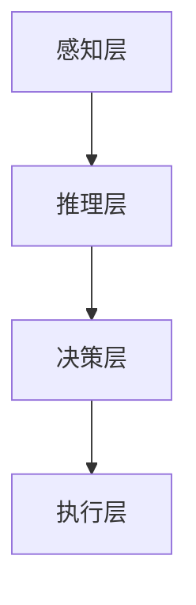

                 


# 设计AI Agent的决策与推理机制

> 关键词：AI Agent，决策机制，推理机制，算法原理，系统架构，项目实战

> 摘要：本文详细探讨了AI Agent的决策与推理机制的设计原理，从核心概念到算法实现，从系统架构到项目实战，系统地分析了AI Agent在决策与推理过程中的关键问题和解决方案。文章结合实际案例，深入浅出地分析了如何设计高效的决策与推理机制，为AI Agent的开发提供了理论和实践指导。

---

## 第1章: AI Agent的基本概念与应用场景

### 1.1 AI Agent的定义与核心概念

AI Agent（人工智能代理）是指在计算机系统中，能够感知环境、做出决策并采取行动以实现特定目标的智能实体。AI Agent可以是软件程序、机器人或其他智能系统，其核心目标是通过自主决策和推理来完成任务。

#### 1.1.1 什么是AI Agent
AI Agent具备以下几个核心特征：
- **自主性**：能够在没有外部干预的情况下独立运行。
- **反应性**：能够感知环境并实时做出反应。
- **目标导向性**：所有行为都以实现特定目标为导向。
- **学习能力**：能够通过经验改进自身的决策和推理能力。

#### 1.1.2 AI Agent的核心特征
- **自主性**：AI Agent无需外部指令即可执行任务。
- **目标导向性**：所有行为都围绕目标展开。
- **适应性**：能够根据环境变化调整策略。
- **推理能力**：能够通过逻辑推理解决问题。

#### 1.1.3 AI Agent的应用场景
AI Agent广泛应用于多个领域：
- **智能家居**：如智能音箱、智能灯泡等设备的控制。
- **自动驾驶**：汽车通过AI Agent实时感知环境并做出驾驶决策。
- **智能客服系统**：通过自然语言处理技术为用户提供服务。

---

### 1.2 决策与推理机制的背景与问题描述

#### 1.2.1 决策的定义与作用
决策是指在多个可能的选择中，根据当前状态和目标，选择一个最优或满意的行为。

#### 1.2.2 推理的定义与作用
推理是指从已有信息中推导出新的结论，是AI Agent理解环境和解决问题的重要能力。

#### 1.2.3 决策与推理的关系
决策和推理相辅相成，推理为决策提供依据，决策驱动推理的方向。

---

### 1.3 AI Agent决策与推理的核心问题

#### 1.3.1 决策的不确定性
- **不确定性**：环境中的信息不完全，导致决策存在风险。
- **多目标优化**：多个目标之间的冲突需要协调。

#### 1.3.2 推理的复杂性
- **知识表示**：如何有效地表示和存储知识。
- **推理规则**：推理规则的正确性和完备性。

#### 1.3.3 系统架构
- **模块化设计**：将系统分解为多个模块，如感知、推理、决策和执行。
- **交互设计**：模块之间的协作与通信机制。

---

## 第2章: 决策机制的原理与算法

### 2.1 决策机制的原理

#### 2.1.1 基于规则的决策
- **规则定义**：通过预定义的规则进行决策。
- **优点**：简单易懂，适合规则明确的场景。
- **缺点**：难以处理复杂和动态变化的环境。

#### 2.1.2 基于逻辑的决策
- **逻辑推理**：通过逻辑推理得出结论。
- **优点**：决策过程清晰，结果可解释。
- **缺点**：逻辑推理可能过于理想化，难以处理实际中的不确定性。

#### 2.1.3 基于概率的决策
- **概率模型**：通过概率计算来评估不同选择的优劣。
- **优点**：能够处理不确定性，适合复杂环境。
- **缺点**：需要大量数据支持，计算复杂。

---

### 2.2 常见的决策算法

#### 2.2.1 Q-learning算法
Q-learning是一种基于强化学习的决策算法，适用于动态环境中的决策问题。

**算法步骤**：
1. 初始化Q表。
2. 选择动作并执行。
3. 计算奖励并更新Q值。
4. 重复上述步骤。

**数学公式**：
$$ Q(s, a) = Q(s, a) + \alpha (r + \gamma \max Q(s', a') - Q(s, a)) $$

---

## 第3章: 推理机制的原理与算法

### 3.1 推理机制的原理

#### 3.1.1 基于逻辑的推理
- **逻辑推理**：通过逻辑规则推导出结论。
- **优点**：结论具有逻辑性，可解释性强。
- **缺点**：难以处理模糊和不确定的信息。

#### 3.1.2 基于概率的推理
- **概率推理**：通过概率模型计算事件发生的可能性。
- **优点**：能够处理不确定性，适合复杂场景。
- **缺点**：计算复杂，需要大量数据支持。

#### 3.1.3 基于知识图谱的推理
- **知识图谱**：通过构建知识图谱，推理出新的知识。
- **优点**：能够处理大规模知识，推理能力强。
- **缺点**：构建和维护知识图谱成本高。

---

### 3.2 常见的推理算法

#### 3.2.1 贝叶斯网络
贝叶斯网络是一种概率推理模型，通过构建概率图模型进行推理。

**数学公式**：
$$ P(A|B) = \frac{P(B|A)P(A)}{P(B)} $$

---

## 第4章: 系统架构设计

### 4.1 系统架构图



---

## 第5章: 项目实战

### 5.1 智能客服系统

#### 5.1.1 环境安装
```bash
pip install numpy scikit-learn
```

#### 5.1.2 核心代码实现
```python
import numpy as np
from sklearn.naive_bayes import GaussianNB

# 训练数据
X = np.array([[0, 0], [0, 1], [1, 0], [1, 1]])
y = np.array([0, 1, 1, 0])

# 创建模型
model = GaussianNB()
model.fit(X, y)

# 预测
print(model.predict([[1, 1]]))
```

---

## 第6章: 最佳实践

### 6.1 关键点总结
- **数据质量**：高质量的数据是决策和推理的基础。
- **计算效率**：优化算法以提高计算效率。
- **模型泛化能力**：确保模型在不同场景下的泛化能力。

### 6.2 小结
通过本文的分析，我们可以看到AI Agent的决策与推理机制设计需要综合考虑算法选择、系统架构和实际应用等多个方面。

### 6.3 注意事项
- **数据隐私**：注意数据隐私和安全问题。
- **模型解释性**：确保模型的可解释性。

### 6.4 拓展阅读
- 《强化学习（Deep Learning Book）》
- 《概率论与数理统计》

---

## 第7章: 总结

通过本文的详细讲解，我们系统地探讨了AI Agent的决策与推理机制的设计原理、算法实现和系统架构。希望本文能够为AI Agent的开发提供有价值的参考。

---

作者：AI天才研究院/AI Genius Institute & 禅与计算机程序设计艺术 /Zen And The Art of Computer Programming

