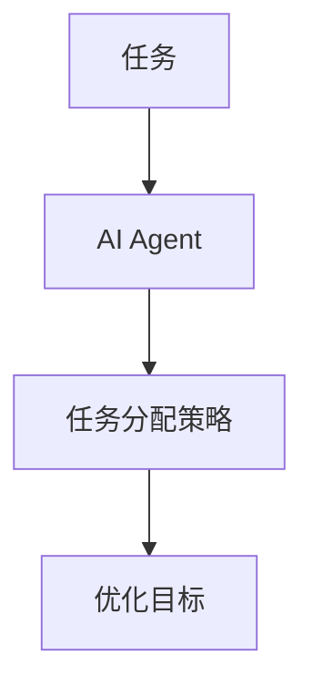
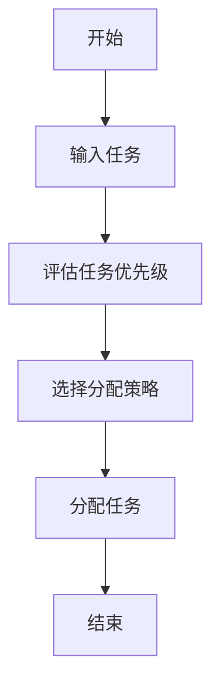
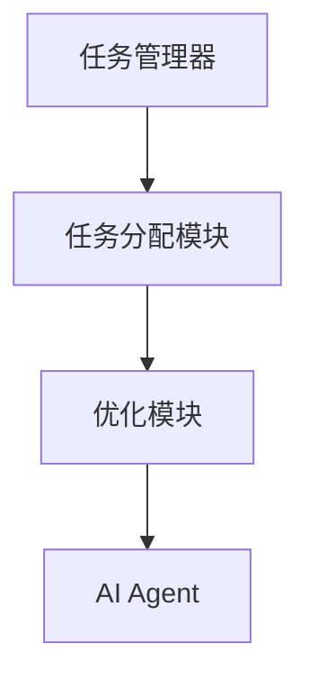

                 


# 设计AI Agent的动态任务分配策略

> 关键词：AI Agent，动态任务分配，任务建模，多目标优化，系统架构

> 摘要：本文详细探讨了设计AI Agent动态任务分配策略的核心概念、算法原理、系统架构以及实际应用。通过理论分析和实战案例，本文旨在为读者提供一个全面的理解框架，帮助他们在复杂动态环境中实现高效的AI Agent任务分配。

---

# 第1章: 动态任务分配策略的背景与问题背景

## 1.1 问题背景

### 1.1.1 AI Agent的定义与特点

AI Agent（人工智能代理）是一种能够感知环境、自主决策并执行任务的智能实体。其核心特点包括：

1. **自主性**：AI Agent能够在没有外部干预的情况下独立运行。
2. **反应性**：能够实时感知环境变化并做出响应。
3. **目标导向性**：基于预设目标或动态目标执行任务。
4. **学习能力**：通过数据和经验不断优化自身行为。

### 1.1.2 动态任务分配的必要性

在现代AI系统中，任务分配是一个核心问题。动态任务分配的必要性体现在以下几个方面：

1. **环境不确定性**：动态环境中任务需求和资源状态不断变化，静态分配策略难以适应。
2. **资源有限性**：AI Agent通常面临计算资源、通信带宽等限制，需要动态调整任务分配以提高资源利用率。
3. **任务优先级变化**：不同任务的优先级可能随时间变化，动态分配能够快速响应这些变化。

### 1.1.3 问题解决的目标与意义

动态任务分配的目标是在动态环境中高效分配任务，确保系统整体性能最优。其意义在于：

1. **提高系统效率**：通过优化任务分配策略，最大化资源利用率。
2. **增强系统鲁棒性**：在动态变化的环境中，确保任务能够被及时、合理分配。
3. **支持复杂场景**：适用于多Agent协作、分布式系统等复杂场景。

---

## 1.2 问题描述

### 1.2.1 任务分配的基本概念

任务分配是指将任务分配给不同的AI Agent，以确保任务能够高效完成。基本概念包括：

1. **任务**：需要完成的具体工作，具有明确的目标和约束条件。
2. **AI Agent**：执行任务的智能实体，具有感知和决策能力。
3. **任务分配策略**：决定如何将任务分配给AI Agent的规则和方法。

### 1.2.2 动态环境下的任务分配挑战

动态环境下的任务分配面临以下挑战：

1. **不确定性**：环境变化难以预测，任务需求和资源状态可能随时变化。
2. **实时性要求**：任务分配需要快速响应环境变化。
3. **复杂性**：多个AI Agent协作，任务分配需要考虑全局最优。

### 1.2.3 任务分配的核心问题与边界

任务分配的核心问题包括：

1. **任务优先级排序**：确定任务的执行顺序。
2. **资源分配**：合理分配计算资源、通信资源等。
3. **Agent选择**：选择最适合执行任务的AI Agent。

任务分配的边界包括：

1. **时间约束**：任务必须在规定时间内完成。
2. **资源约束**：任务分配不能超过可用资源。
3. **目标约束**：任务分配必须符合系统目标。

---

## 1.3 问题解决的思路与方法

### 1.3.1 动态任务分配的基本思路

动态任务分配的基本思路包括：

1. **实时感知环境**：通过传感器或其他信息源获取环境状态。
2. **评估任务优先级**：根据环境变化和任务目标，动态评估任务优先级。
3. **选择分配策略**：根据优先级和资源状态，选择合适的任务分配策略。

### 1.3.2 任务分配的优化目标

任务分配的优化目标包括：

1. **最大化系统性能**：通过优化任务分配，提高系统整体性能。
2. **最小化资源消耗**：在满足任务需求的前提下，尽量减少资源消耗。
3. **提高系统鲁棒性**：确保系统在动态环境中能够稳定运行。

### 1.3.3 解决方案的可行性分析

解决方案的可行性分析包括：

1. **技术可行性**：现有技术是否能够支持动态任务分配。
2. **资源可行性**：系统是否具备足够的资源支持任务分配。
3. **时间可行性**：任务分配是否能够在规定时间内完成。

---

## 1.4 核心概念与联系

### 1.4.1 核心概念原理

任务分配的核心概念包括：

1. **任务建模**：将任务分解为具体的子任务，并定义每个子任务的属性和约束。
2. **任务分配机制**：根据任务建模结果，选择合适的AI Agent执行任务。
3. **任务优化方法**：通过优化算法，提高任务分配效率和系统性能。

### 1.4.2 核心概念对比表

以下是任务分配相关概念的对比表：

| 对比维度 | 静态任务分配 | 动态任务分配 |
|----------|--------------|--------------|
| **任务优先级** | 静态排序 | 动态调整 |
| **资源分配** | 静态分配 | 动态调整 |
| **环境适应性** | 低 | 高 |

### 1.4.3 实体关系图

以下是任务分配的核心实体关系图：



---

## 1.5 算法原理讲解

### 1.5.1 算法原理概述

动态任务分配的算法通常基于多目标优化，其核心思想是通过优化算法，在动态环境中找到最优的任务分配方案。

### 1.5.2 算法流程图

以下是动态任务分配的算法流程图：



### 1.5.3 算法实现代码

以下是动态任务分配的Python实现代码：

```python
def dynamic_task_allocation(tasks, agents):
    # 任务优先级评估
    for task in tasks:
        task.优先级 = evaluate_priority(task)
    # 分配策略选择
    selected_agents = select_agents_with_high_priority(agents, tasks)
    # 分配任务
    allocate_task(selected_agents, tasks)
    return selected_agents
```

### 1.5.4 数学模型与公式

动态任务分配的数学模型可以表示为：

$$ \text{目标函数} = \sum_{i=1}^{n} w_i x_i $$

其中，\( w_i \) 是任务 \( i \) 的权重，\( x_i \) 是任务 \( i \) 的分配变量。

---

## 1.6 系统分析与架构设计

### 1.6.1 系统功能设计

系统功能设计包括：

1. **任务建模**：将任务分解为具体的子任务，并定义每个子任务的属性和约束。
2. **任务分配**：根据任务建模结果，选择合适的AI Agent执行任务。
3. **任务优化**：通过优化算法，提高任务分配效率和系统性能。

### 1.6.2 系统架构设计

以下是系统架构设计的mermaid图：



---

## 1.7 项目实战

### 1.7.1 环境安装

以下是项目实战的环境安装步骤：

1. **安装Python**：确保系统上安装了Python 3.x。
2. **安装依赖库**：安装必要的依赖库，如numpy、pandas等。

### 1.7.2 核心代码实现

以下是项目实战的核心代码实现：

```python
def evaluate_priority(task):
    # 任务优先级评估函数
    return task.deadline - datetime.now()
```

### 1.7.3 案例分析与解读

以下是项目实战的案例分析：

1. **任务优先级评估**：根据任务的截止时间，评估任务的优先级。
2. **选择分配策略**：选择优先级最高的任务进行分配。
3. **任务分配**：将任务分配给最适合的AI Agent。

### 1.7.4 项目小结

项目实战部分通过具体案例，展示了动态任务分配策略的实际应用。通过案例分析，我们可以看到动态任务分配策略在实际应用中的有效性和实用性。

---

## 1.8 最佳实践与注意事项

### 1.8.1 最佳实践

1. **实时监控环境变化**：动态任务分配需要实时监控环境变化，以确保任务分配的准确性。
2. **优化算法选择**：根据具体场景选择合适的优化算法，以提高任务分配效率。
3. **系统架构设计**：合理设计系统架构，确保系统的可扩展性和可维护性。

### 1.8.2 注意事项

1. **资源限制**：任务分配需要考虑资源限制，避免资源过度分配。
2. **任务优先级变化**：任务优先级可能随时间变化，需要动态调整。
3. **系统鲁棒性**：确保系统在动态环境中能够稳定运行。

---

## 1.9 小结

本文详细探讨了设计AI Agent动态任务分配策略的核心概念、算法原理、系统架构以及实际应用。通过理论分析和实战案例，本文旨在为读者提供一个全面的理解框架，帮助他们在复杂动态环境中实现高效的AI Agent任务分配。

---

作者：AI天才研究院/AI Genius Institute & 禅与计算机程序设计艺术 /Zen And The Art of Computer Programming

