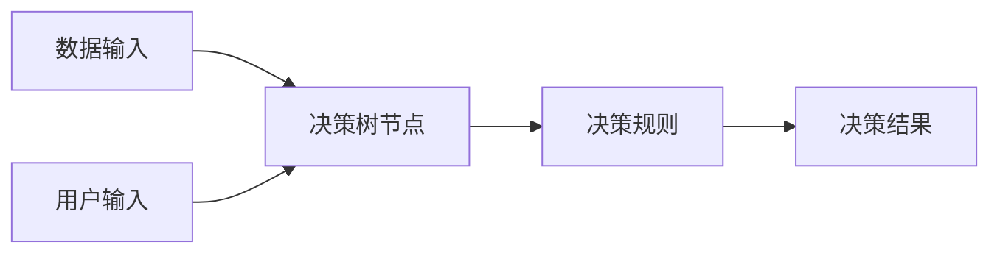
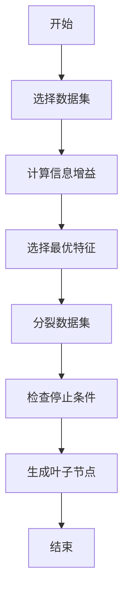

                 


# 设计AI Agent的可解释决策树

## 关键词：AI Agent, 可解释性, 决策树, 算法原理, 系统架构, 项目实战

## 摘要：  
AI Agent的决策过程需要具备高度的可解释性，以便人类能够理解和信任其决策。决策树作为一种经典的机器学习模型，具有天然的可解释性优势。本文从AI Agent与可解释决策树的基本概念出发，深入分析可解释决策树的核心原理，探讨其在AI Agent中的具体应用，结合实际案例，详细讲解可解释决策树的设计与实现过程。通过本文，读者将能够掌握如何设计和实现具备高可解释性的AI Agent决策树，从而在实际应用中更好地理解和优化AI Agent的决策过程。

---

# 第一部分: AI Agent与可解释决策树的背景与基础

## 第1章: AI Agent与可解释决策树概述

### 1.1 AI Agent的基本概念  
#### 1.1.1 AI Agent的定义  
AI Agent（人工智能代理）是指能够感知环境、自主决策并采取行动以实现特定目标的智能实体。AI Agent可以是软件程序、机器人或其他智能系统，其核心目标是通过感知和行动与环境交互，以完成预设任务。  

#### 1.1.2 AI Agent的核心特征  
- **自主性**：AI Agent能够在没有外部干预的情况下自主决策。  
- **反应性**：能够实时感知环境变化并做出响应。  
- **目标导向性**：所有行为都围绕实现特定目标展开。  
- **可解释性**：决策过程需要具备一定的透明度，以便人类能够理解和信任。  

#### 1.1.3 AI Agent的应用场景  
- **自动驾驶**：通过感知环境并做出驾驶决策。  
- **智能助手**：如Siri、Alexa等，通过理解用户需求并执行任务。  
- **医疗诊断**：基于患者数据和诊断规则，辅助医生做出诊断决策。  

---

### 1.2 可解释性在AI Agent中的重要性  
#### 1.2.1 可解释性定义  
可解释性是指AI系统的行为、决策或输出能够被人类理解和解释的程度。对于AI Agent来说，可解释性是其被广泛接受和信任的重要前提。  

#### 1.2.2 可解释性的重要性  
- **信任与责任**：用户或系统管理员需要信任AI Agent的决策，尤其是在高风险场景中。  
- **故障排查**：当AI Agent出现错误时，可解释性有助于快速定位问题。  
- **合规性**：许多行业和法规要求AI系统具备可解释性，以确保其决策符合法律和伦理标准。  

#### 1.2.3 可解释性与AI Agent决策的关系  
AI Agent的决策过程需要通过可解释的方式呈现给用户，这不仅有助于用户理解决策的依据，还能帮助开发者优化算法和改进系统。  

---

### 1.3 决策树的基本原理  
#### 1.3.1 决策树的定义  
决策树是一种树状结构，用于表示可能的决策路径。每个内部节点代表一个决策点，叶子节点代表最终的决策结果。  

#### 1.3.2 决策树的结构  
- **根节点**：决策树的起点，代表初始决策点。  
- **内部节点**：代表中间的决策点。  
- **叶子节点**：代表最终的决策结果。  
- **属性测试**：在每个决策点，系统根据某个特征进行测试，以决定下一步的决策路径。  

#### 1.3.3 决策树的优势与局限性  
**优势**：  
- 结构直观，易于理解和解释。  
- 适合处理离散和连续数据。  
- 决策过程基于明确的规则，逻辑清晰。  

**局限性**：  
- 对噪声数据敏感，容易过拟合。  
- 在处理复杂问题时，决策树可能不够高效。  

---

### 1.4 本章小结  
本章从AI Agent的基本概念出发，探讨了可解释性在AI Agent中的重要性，并介绍了决策树的基本原理及其优势与局限性。通过本章的学习，读者可以理解AI Agent与决策树的基本概念，并为后续内容打下基础。

---

## 第2章: 可解释决策树的核心概念与联系  

### 2.1 可解释决策树的原理  
#### 2.1.1 决策树的构建过程  
决策树的构建过程包括特征选择、数据划分、树的生成和剪枝等步骤。  

#### 2.1.2 决策树的可解释性特征  
- **规则清晰**：决策树的每个节点都对应明确的决策规则。  
- **路径可追溯**：用户可以追溯决策的每一步，理解最终结果的来源。  
- **可视化直观**：决策树可以通过图形化展示，便于人类理解。  

#### 2.1.3 决策树的可解释性评估方法  
- **规则复杂度**：规则越简单，可解释性越强。  
- **路径长度**：决策路径越短，可解释性越强。  
- **规则覆盖率**：决策规则能够覆盖的数据范围越大，可解释性越强。  

---

### 2.2 可解释决策树与传统决策树的对比  
#### 2.2.1 核心概念对比  
| 对比维度       | 可解释决策树                     | 传统决策树                     |
|----------------|----------------------------------|----------------------------------|
| 目标           | 提高决策过程的可解释性             | 优化分类或回归性能               |
| 简化规则       | 是                               | 否                               |
| 适用场景       | 需要高透明度和用户信任的场景       | 侧重于模型性能的场景             |

#### 2.2.2 属性特征对比  
- **决策规则**：可解释决策树注重规则的简洁性和可理解性，而传统决策树更注重规则的分类能力。  
- **数据处理**：可解释决策树在处理复杂数据时可能需要额外的简化步骤，而传统决策树可以直接处理原始数据。  

#### 2.2.3 实际应用中的差异  
可解释决策树更适用于需要解释性要求较高的场景，如医疗诊断、金融风控等，而传统决策树更适用于纯粹追求模型性能的场景，如广告推荐、数据分类等。  

---

### 2.3 可解释决策树的ER实体关系图  


---

### 2.4 本章小结  
本章详细探讨了可解释决策树的核心概念及其与传统决策树的差异，并通过ER实体关系图展示了可解释决策树的结构特征。通过本章的学习，读者可以理解可解释决策树的独特优势及其在实际应用中的定位。

---

## 第3章: 可解释决策树的算法原理  

### 3.1 决策树算法概述  
#### 3.1.1 ID3算法  
ID3算法是一种基于熵的决策树构建算法，适用于分类问题。  

#### 3.1.2 C4.5算法  
C4.5算法是ID3算法的改进版本，引入了信息增益率的概念，能够更好地处理不同特征的权重问题。  

#### 3.1.3 CART算法  
CART算法（决策树与随机森林）主要用于回归和分类问题，支持二叉树结构。  

---

### 3.2 可解释决策树的构建算法  
#### 3.2.1 熵与信息增益  
熵是数据的混乱程度，信息增益是特征对数据分类能力的度量。  

公式：  
$$ H(S) = -\sum_{i=1}^{n} p_i \log_2 p_i $$  
$$ \text{信息增益} = H(S) - H(S|A) $$  

#### 3.2.2 决策树的分裂标准  
- **ID3算法**：基于熵和信息增益。  
- **C4.5算法**：基于信息增益率。  
- **CART算法**：基于基尼指数。  

#### 3.2.3 决策树的剪枝方法  
- **预剪枝**：在构建过程中提前停止树的生长，以避免过拟合。  
- **后剪枝**：在构建完成后剪枝，以优化决策树的性能。  

---

### 3.3 可解释决策树的算法流程图  


---

### 3.4 决策树算法的Python实现  
```python
def information_gain(examples, feature, label):
    # 计算信息增益
    pass

def decision_tree_train(examples, features, label):
    # 决策树训练函数
    pass
```

---

### 3.5 本章小结  
本章详细介绍了可解释决策树的算法原理，包括ID3、C4.5和CART算法的核心思想及其数学模型。通过本章的学习，读者可以理解可解释决策树的构建过程，并能够根据实际需求选择合适的算法。

---

# 第二部分: 可解释决策树的系统分析与架构设计  

## 第4章: 可解释决策树的系统分析  

### 4.1 问题场景介绍  
可解释决策树的系统设计需要考虑数据预处理、模型训练、结果解释等多个环节。  

### 4.2 系统功能设计  
- **数据输入**：接收原始数据并进行预处理。  
- **模型训练**：基于可解释决策树算法构建决策树模型。  
- **结果解释**：将决策树的规则以人类可理解的方式呈现。  

---

### 4.3 系统架构设计  


---

## 第5章: 可解释决策树的项目实战  

### 5.1 项目背景与目标  
以医疗诊断为例，设计一个基于可解释决策树的诊断系统。  

### 5.2 核心代码实现  
```python
class DecisionTree:
    def __init__(self):
        self.tree = None

    def fit(self, X, y):
        # 训练决策树模型
        pass

    def predict(self, X):
        # 预测结果
        pass

    def explain(self):
        # 解释决策树规则
        pass
```

---

### 5.3 案例分析与结果解读  
- **数据预处理**：清洗和标准化数据。  
- **模型训练**：基于医疗数据训练决策树模型。  
- **结果解释**：将决策规则以自然语言形式呈现，如“如果症状A和B同时出现，则诊断为疾病C”。  

---

## 第6章: 可解释决策树的最佳实践  

### 6.1 可解释性设计的注意事项  
- **规则简化**：避免过于复杂的决策规则。  
- **用户反馈**：根据用户反馈优化决策树的可解释性。  
- **定期验证**：确保决策树的可解释性不会随数据变化而降低。  

### 6.2 本章小结  
本章结合实际案例，总结了设计和实现可解释决策树系统的关键点，并提出了若干最佳实践建议。

---

## 第7章: 总结与展望  

### 7.1 全文总结  
本文从AI Agent的可解释性需求出发，详细探讨了可解释决策树的设计与实现过程，结合实际案例，总结了可解释决策树的核心原理和应用方法。  

### 7.2 未来展望  
随着AI技术的不断发展，可解释性将成为AI Agent设计中的重要方向。未来的研究可以集中在如何进一步提升决策树的可解释性，以及探索其他可解释性模型的应用。  

---

## 作者：AI天才研究院/AI Genius Institute & 禅与计算机程序设计艺术 /Zen And The Art of Computer Programming  

---

通过本文的系统讲解，读者可以全面掌握设计AI Agent的可解释决策树的核心方法，并能够在实际应用中灵活运用这些知识。

