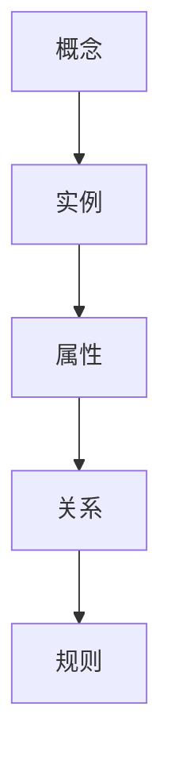
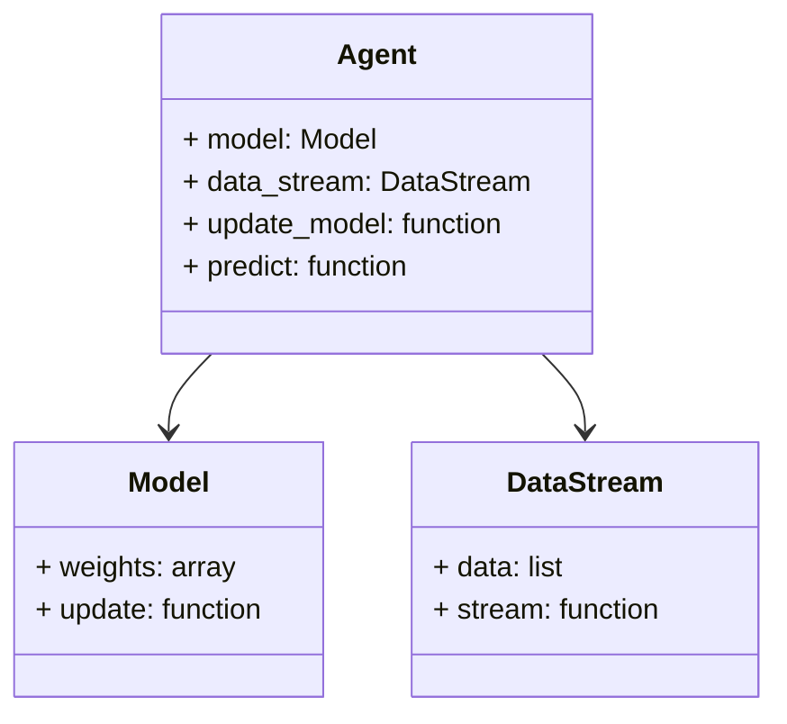
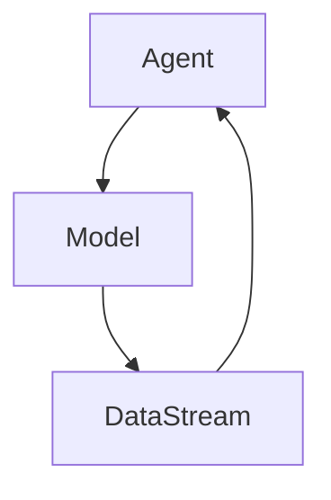

                 


# 设计AI Agent的增量式概念学习策略

## 关键词：AI Agent，增量式学习，概念学习，机器学习，深度学习

## 摘要：本文详细探讨了设计AI Agent的增量式概念学习策略，从背景介绍到系统架构设计，再到项目实战，全面解析了增量式概念学习的核心概念、算法原理、系统架构及实现方案，为AI Agent的设计提供了深入的技术指导。

---

# 第1章 AI Agent与增量式概念学习概述

## 1.1 AI Agent的基本概念

### 1.1.1 AI Agent的定义与特点
AI Agent（智能体）是指能够感知环境、自主决策并执行任务的智能系统。AI Agent的特点包括自主性、反应性、目标导向性和社交能力。

### 1.1.2 增量式学习的定义与特点
增量式学习是一种机器学习方法，模型在新数据到达时逐步更新，而不是一次性训练整个数据集。其特点包括在线性、渐进性和适应性。

### 1.1.3 AI Agent与增量式学习的结合
AI Agent通过增量式学习可以在动态环境中实时更新知识，适应新任务和新环境。

## 1.2 增量式概念学习的背景与意义

### 1.2.1 传统概念学习的局限性
传统概念学习方法通常需要一次性训练大量数据，无法适应动态变化的环境。

### 1.2.2 增量式概念学习的优势
增量式概念学习可以在数据不足时开始学习，并逐步优化模型，适用于实时性和资源受限的场景。

### 1.2.3 增量式概念学习的应用场景
应用场景包括动态数据流处理、在线推荐系统、实时监控和自适应控制系统等。

## 1.3 问题背景与目标

### 1.3.1 问题背景分析
在动态和不确定的环境中，AI Agent需要实时更新知识以应对变化。

### 1.3.2 问题描述与目标
设计一种增量式概念学习策略，使AI Agent能够在线更新知识，提高适应性和实时性。

### 1.3.3 问题解决的思路与方法
通过增量式学习算法，逐步优化AI Agent的概念模型，确保其在动态环境中保持高效性能。

## 1.4 核心概念与边界

### 1.4.1 核心概念的结构与组成
概念由实例、属性和规则组成，AI Agent通过学习这些概念构建知识体系。

### 1.4.2 核心概念的边界与外延
概念学习的边界包括数据流、模型更新频率和资源限制，外延涉及增量学习的数学模型和算法设计。

### 1.4.3 核心概念与相关概念的对比
对比增量式学习与其他学习方法（如批量学习、在线学习）的优缺点，突出其独特性。

## 1.5 本章小结
本章介绍了AI Agent和增量式概念学习的基本概念，分析了其背景和意义，为后续章节奠定了基础。

---

# 第2章 增量式概念学习的核心概念与联系

## 2.1 核心概念的原理

### 2.1.1 增量式学习的基本原理
增量式学习通过逐步处理数据流，更新模型参数，保持对新数据的适应性。

### 2.1.2 概念学习的数学模型
概念学习可以用数学模型表示，例如线性回归和分类模型，通过逐步优化参数实现。

### 2.1.3 AI Agent中的增量式概念学习机制
AI Agent通过增量式学习机制，实时更新其知识库，提高决策能力。

## 2.2 核心概念的属性特征对比

### 2.2.1 不同概念学习方法的对比
| 方法       | 批量学习 | 在线学习 | 增量学习 |
|------------|----------|----------|----------|
| 数据处理    | 一次性   | 实时     | 实时     |
| 记忆需求    | 高       | 中       | 低       |
| 适应性      | 低       | 中       | 高       |

### 2.2.2 增量式学习与其他学习方法的对比
增量式学习在实时性和资源利用方面具有优势，但在数据利用方面可能不如批量学习。

### 2.2.3 AI Agent中的增量式概念学习与其他概念学习的对比
AI Agent的增量式学习更具实时性和适应性，适合动态环境。

## 2.3 ER实体关系图架构



## 2.4 本章小结
本章详细分析了增量式概念学习的核心概念及其属性特征，通过对比和ER图展示了概念结构。

---

# 第3章 增量式概念学习的算法原理

## 3.1 算法原理概述

### 3.1.1 增量式学习的基本算法
增量式学习算法包括实例增量学习和特征增量学习，适用于不同场景。

### 3.1.2 概念学习的数学模型
概念学习的数学模型可以用线性回归和分类器表示，通过逐步优化参数实现。

### 3.1.3 AI Agent中的增量式概念学习算法
AI Agent通过增量式学习算法实时更新模型，保持对动态环境的适应性。

## 3.2 算法

### 3.2.1 实例增量学习算法
```mermaid
graph TD
    Start --> ReadData
    ReadData --> UpdateModel
    UpdateModel --> CheckConvergence
    CheckConvergence --> if converged then OutputResult else ReadData
```

### 3.2.2 特征增量学习算法
```mermaid
graph TD
    Start --> ReadFeature
    ReadFeature --> UpdateModel
    UpdateModel --> CheckConvergence
    CheckConvergence --> if converged then OutputResult else ReadFeature
```

### 3.2.3 实现代码
```python
class IncrementalLearner:
    def __init__(self):
        self.model = initialize_model()

    def update_model(self, new_data):
        self.model.update(new_data)

    def predict(self, input):
        return self.model.predict(input)
```

### 3.2.4 数学模型
增量式学习的数学模型可以表示为：
$$\theta_{t+1} = \theta_t + \alpha (y_t - h_\theta(x_t))x_t$$
其中，$\theta$ 是模型参数，$\alpha$ 是学习率，$y_t$ 是真实值，$h_\theta(x_t)$ 是模型预测值。

## 3.3 本章小结
本章详细讲解了增量式概念学习的算法原理，通过算法流程图和代码示例展示了实现方法。

---

# 第4章 增量式概念学习的系统架构设计

## 4.1 问题场景介绍
动态数据流处理、在线推荐系统和实时监控是常见的增量式概念学习应用场景。

## 4.2 项目介绍
设计一个AI Agent，用于实时监控系统中的异常检测。

## 4.3 系统功能设计

### 4.3.1 领域模型


### 4.3.2 系统架构


### 4.3.3 接口设计
AI Agent需要实现`update_model`和`predict`接口，与数据流和模型更新模块交互。

## 4.4 本章小结
本章设计了AI Agent的系统架构，展示了各个模块之间的协作关系。

---

# 第5章 增量式概念学习的项目实战

## 5.1 环境安装
安装必要的库，如`numpy`、`scikit-learn`和`tensorflow`。

## 5.2 核心代码实现

### 5.2.1 数据流处理
```python
def process_data_stream(stream):
    for batch in stream:
        update_model(batch)
```

### 5.2.2 模型更新
```python
def update_model(batch):
    model.fit(batch)
```

### 5.2.3 实时预测
```python
def predict(input):
    return model.predict(input)
```

## 5.3 实际案例分析
通过实时监控系统中的异常检测案例，展示了增量式概念学习的实际应用。

## 5.4 项目小结
本章通过项目实战，展示了增量式概念学习的实现过程和应用效果。

---

# 第6章 增量式概念学习的最佳实践

## 6.1 小结
总结了增量式概念学习的核心概念和算法原理。

## 6.2 注意事项
在实际应用中，需注意数据质量、模型收敛性和计算效率等问题。

## 6.3 拓展阅读
推荐阅读相关书籍和论文，深入理解增量式概念学习的理论和应用。

---

# 作者
作者：AI天才研究院 & 禅与计算机程序设计艺术

