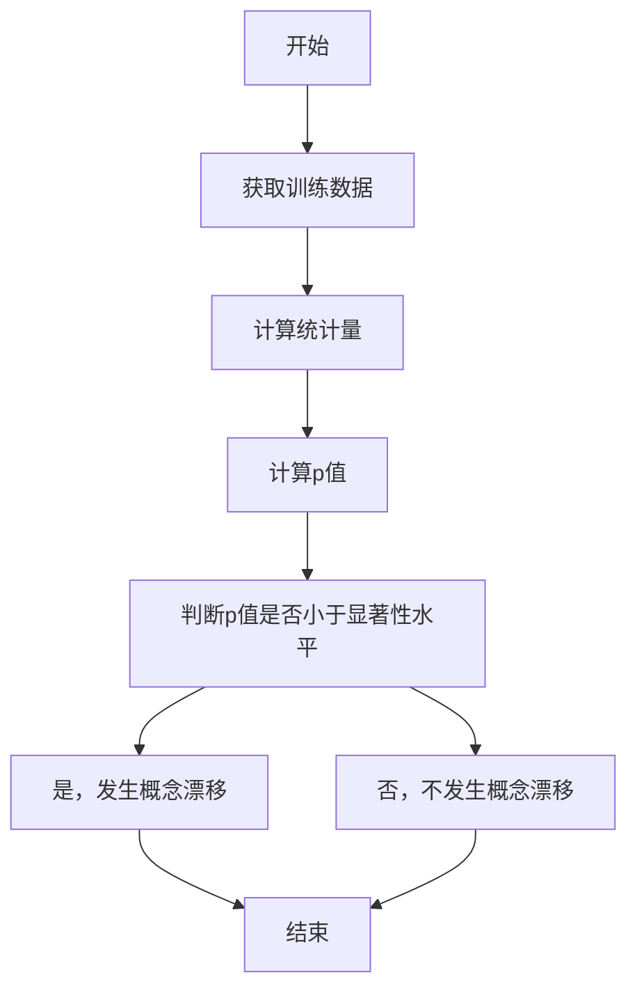
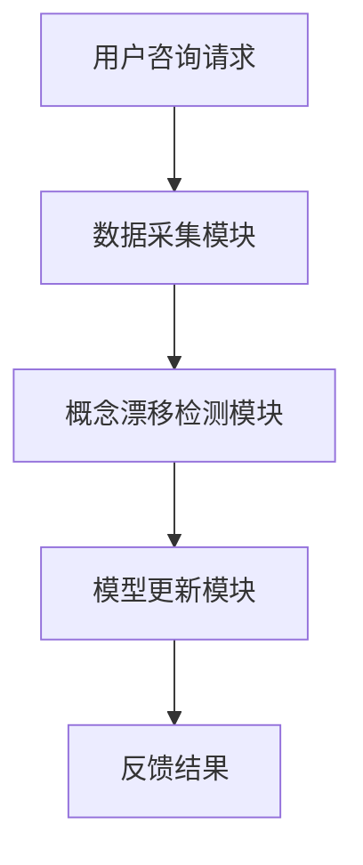
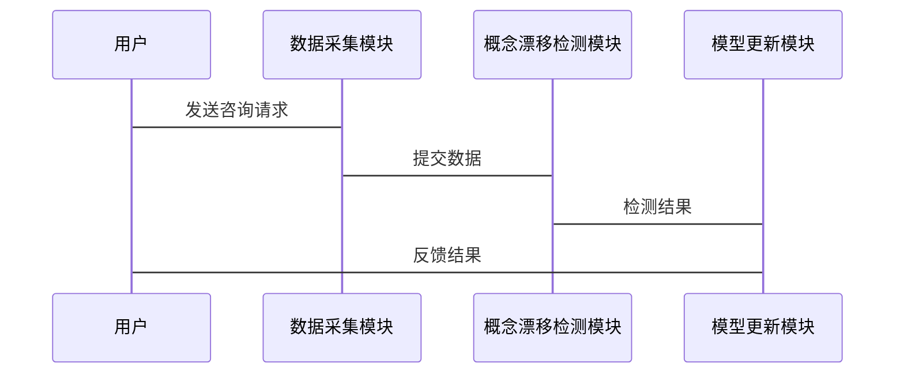

                 


# 设计AI Agent的概念漂移检测机制

> 关键词：AI Agent，概念漂移，数据分布变化，模型检测，机器学习

> 摘要：本文将详细探讨AI Agent中的概念漂移检测机制，从核心概念、算法原理到系统设计与项目实战，逐步分析如何有效检测和应对数据分布变化，确保AI Agent的持续有效性和适应性。

---

# 第一部分: AI Agent与概念漂移检测背景介绍

## 第1章: 概念漂移检测概述

### 1.1 概念漂移的定义与背景

#### 1.1.1 什么是概念漂移
概念漂移是指在机器学习模型的运行过程中，训练数据与实时数据之间的分布发生变化，导致模型性能下降的现象。这种变化可能由数据分布的改变（分布漂移）或标签变化（概念变化）引起。

#### 1.1.2 概念漂移的背景与重要性
在AI Agent的应用场景中，实时数据的分布可能会随时间变化，例如用户行为、市场趋势或环境条件的变化。概念漂移检测能够帮助AI Agent及时发现并适应这些变化，避免模型失效。

#### 1.1.3 概念漂移的分类与特征
概念漂移可以分为以下几类：
1. **突然漂移（突然变化）**：数据分布的突然变化，例如突发事件导致的用户行为改变。
2. **渐进漂移（逐渐变化）**：数据分布逐渐变化，例如季节性变化。
3. **噪声漂移（随机噪声）**：数据中噪声增加，影响模型性能。
4. **混杂漂移（混合分布变化）**：数据中出现新的分布模式。

### 1.2 AI Agent中的概念漂移问题

#### 1.2.1 AI Agent的基本概念
AI Agent是一种能够感知环境、做出决策并执行动作的智能实体。它需要根据实时数据做出反应，因此对数据分布的敏感性很高。

#### 1.2.2 概念漂移对AI Agent的影响
概念漂移会导致模型预测准确性下降，影响AI Agent的决策能力。例如，在推荐系统中，概念漂移可能导致推荐结果与用户需求不符。

#### 1.2.3 概念漂移检测的必要性
为了保证AI Agent的长期稳定性和高效性，必须实时检测概念漂移，并采取相应的措施，如模型更新或参数调整。

### 1.3 本章小结
本章介绍了概念漂移的定义、分类及其在AI Agent中的重要性，为后续内容奠定了基础。

---

## 第2章: 概念漂移检测的核心概念

### 2.1 概念漂移的核心要素

#### 2.1.1 数据分布变化
数据分布变化是概念漂移的核心原因。例如，用户行为数据中某些特征的分布发生变化。

#### 2.1.2 模型性能变化
模型性能变化是概念漂移的表现形式。例如，分类模型的准确率下降。

#### 2.1.3 概念漂移的数学表示
概念漂移可以用概率分布的变化来表示。设P(X)为数据分布，P(Y|X)为模型预测概率，则概念漂移检测的目标是发现P(X)的变化。

### 2.2 概念漂移与相关概念的关系

#### 2.2.1 概念漂移与数据漂移
数据漂移是指数据分布的变化，而概念漂移是数据漂移的一种特殊情况，涉及标签或目标的变化。

#### 2.2.2 概念漂移与模型退化
模型退化是模型性能下降的现象，通常由概念漂移引起。

#### 2.2.3 概念漂移与概念偏移
概念偏移是指概念本身的变化，例如从“狗”变为“猫”，而概念漂移是数据分布的变化。

### 2.3 概念漂移检测的核心原理

#### 2.3.1 数据分布变化的检测方法
检测数据分布变化的方法包括统计检验（如Kolmogorov-Smirnov检验）和分布距离（如KL散度）。

#### 2.3.2 模型性能变化的检测方法
检测模型性能变化的方法包括监控准确率、F1分数等指标的变化。

#### 2.3.3 综合检测策略
综合检测策略结合数据分布变化和模型性能变化，能够更准确地检测概念漂移。

### 2.4 本章小结
本章详细讲解了概念漂移的核心要素及其与相关概念的关系，为后续算法设计奠定了理论基础。

---

## 第3章: 概念漂移检测的算法原理

### 3.1 基于统计的方法

#### 3.1.1 置信区间法
置信区间法通过计算数据分布的置信区间，判断新数据是否在置信区间内。

#### 3.1.2 假设检验法
假设检验法通过假设检验判断数据分布是否发生显著变化。

#### 3.1.3 算法流程图


#### 3.1.4 代码实现
```python
import numpy as np
from scipy.stats import ks_2samp

def is_drift detected(x_train, x_new, alpha=0.05):
    statistic, p_value = ks_2samp(x_train, x_new)
    return p_value < alpha
```

### 3.2 基于分布距离的方法

#### 3.2.1 KL散度
KL散度（Kullback-Leibler divergence）用于衡量两个概率分布之间的差异。

$$ D_{KL}(P || Q) = \sum P(x) \log \frac{P(x)}{Q(x)} $$

#### 3.2.2 JS散度
JS散度（Jensen-Shannon divergence）是对称的分布距离衡量标准。

$$ D_{JS}(P || Q) = \frac{1}{2} D_{KL}(P || M) + \frac{1}{2} D_{KL}(Q || M) $$

其中，M是P和Q的平均分布。

#### 3.2.3 Wasserstein距离
Wasserstein距离是基于最优传输问题的分布距离。

$$ W_p(P, Q) = \left( \int_{0}^{1} W^{-1}(t) dt \right)^{1/p} $$

#### 3.2.4 算法实现代码
```python
import numpy as np
from scipy.stats import entropy

def js_divergence(p, q):
    m = 0.5 * (p + q)
    return 0.5 * (entropy(p, m) + entropy(q, m))
```

### 3.3 基于模型的方法

#### 3.3.1 分类器性能监控
通过监控分类器的准确率、F1分数等指标的变化来检测概念漂移。

#### 3.3.2 对抗网络检测
使用对抗网络（GAN）检测数据分布的变化。

#### 3.3.3 算法实现代码
```python
import torch
import torch.nn as nn

class Discriminator(nn.Module):
    def __init__(self, input_dim):
        super(Discriminator, self).__init__()
        self.fc1 = nn.Linear(input_dim, 128)
        self.fc2 = nn.Linear(128, 1)
    
    def forward(self, x):
        x = x.view(-1, input_dim)
        x = F.relu(self.fc1(x))
        x = torch.sigmoid(self.fc2(x))
        return x
```

### 3.4 算法对比与选择策略

#### 3.4.1 算法性能对比表格
| 方法        | 优点                          | 缺点                          |
|-------------|-------------------------------|-------------------------------|
| 置信区间法    | 实现简单，适用于小数据集        | 对大数据集性能较差              |
| KL散度       | 能捕捉分布差异                | 需要估计概率分布                |
| JS散度       | 对称性好，鲁棒性较强            | 计算复杂性较高                  |
| Wasserstein | 能捕捉分布间的距离             | 对参数选择敏感                |

#### 3.4.2 算法选择的注意事项
选择算法时需考虑数据规模、分布类型、计算资源等因素。

### 3.5 本章小结
本章详细讲解了三种主流的概念漂移检测算法，包括基于统计的方法、分布距离方法和基于模型的方法，并给出了代码实现和对比分析。

---

## 第4章: 系统分析与架构设计

### 4.1 系统分析

#### 4.1.1 问题场景描述
假设我们开发一个智能客服AI Agent，需要实时处理用户的咨询请求。由于用户行为可能随时间变化，需要检测概念漂移。

#### 4.1.2 系统目标与范围
系统目标：实时监控用户咨询请求的分布变化，检测概念漂移并触发模型更新。

系统范围：包括数据采集、概念漂移检测、模型更新和结果反馈。

#### 4.1.3 系统功能需求
- 数据采集模块：实时采集用户咨询请求。
- 概念漂移检测模块：基于算法检测概念漂移。
- 模型更新模块：当检测到概念漂移时，重新训练模型。
- 结果反馈模块：将检测结果和模型更新结果反馈给用户。

### 4.2 系统架构设计

#### 4.2.1 系统架构图


#### 4.2.2 数据流分析
数据从用户咨询请求开始，经过数据采集模块，进入概念漂移检测模块。检测结果决定是否需要模型更新，并将结果反馈给用户。

#### 4.2.3 模块划分与职责
- 数据采集模块：负责实时采集用户咨询请求。
- 概念漂移检测模块：负责检测数据分布变化。
- 模型更新模块：负责重新训练模型。
- 反馈结果模块：负责将检测结果和模型更新结果反馈给用户。

### 4.3 接口与交互设计

#### 4.3.1 系统接口定义
- 数据采集接口：`GET /data采集`
- 概念漂移检测接口：`POST /检测概念漂移`
- 模型更新接口：`POST /更新模型`

#### 4.3.2 系统交互流程


### 4.4 本章小结
本章通过系统分析与架构设计，明确了AI Agent的概念漂移检测系统的各个模块及其交互关系。

---

## 第5章: 项目实战——电商用户行为分析

### 5.1 项目背景与目标

#### 5.1.1 项目背景
我们开发一个电商AI Agent，需要实时分析用户的购买行为，检测概念漂移。

#### 5.1.2 项目目标
实时监控用户购买行为数据，检测概念漂移，并触发推荐策略的更新。

### 5.2 环境搭建与数据预处理

#### 5.2.1 环境搭建
- 安装Python、TensorFlow、Keras等库。

#### 5.2.2 数据预处理
- 数据清洗：处理缺失值、异常值。
- 数据归一化：将数据转换为统一格式。

### 5.3 核心算法实现

#### 5.3.1 基于KL散度的概念漂移检测
```python
import numpy as np
from scipy.stats import entropy

def compute_kl_divergence(p, q):
    return entropy(p, q)
```

#### 5.3.2 模型更新策略
当检测到概念漂移时，重新训练模型。

### 5.4 项目实现代码

#### 5.4.1 数据采集与预处理
```python
import pandas as pd

data = pd.read_csv('user_behavior.csv')
data = data.dropna()
data = data.normalize()
```

#### 5.4.2 概念漂移检测
```python
from sklearn.metrics import accuracy_score

def detect_concept_drift(X_train, y_train, X_new, y_new):
    acc_train = accuracy_score(y_train, model.predict(X_train))
    acc_new = accuracy_score(y_new, model.predict(X_new))
    return acc_new < 0.8 * acc_train
```

#### 5.4.3 模型更新
```python
from sklearn.ensemble import RandomForestClassifier

model = RandomForestClassifier()
model.fit(X_train, y_train)
```

### 5.5 实际案例分析

#### 5.5.1 案例背景
假设用户购买行为数据中，某些特征的分布发生变化，导致推荐模型性能下降。

#### 5.5.2 检测与分析
检测到概念漂移后，重新训练模型，提升推荐准确率。

### 5.6 项目小结
本章通过电商用户行为分析的案例，展示了如何在实际项目中实现概念漂移检测和模型更新。

---

## 第6章: 总结与展望

### 6.1 本章总结
本文详细探讨了AI Agent中的概念漂移检测机制，从核心概念、算法原理到系统设计与项目实战，全面分析了如何有效检测和应对数据分布变化。

### 6.2 未来研究方向
1. 更高效的算法研究。
2. 多模态数据的概念漂移检测。
3. 模型自适应策略优化。

### 6.3 最佳实践Tips
- 定期监控模型性能。
- 根据数据特性选择合适的检测算法。
- 及时更新模型以应对概念漂移。

### 6.4 本章小结
本章总结了全文内容，并展望了未来的研究方向和最佳实践。

---

# 作者：AI天才研究院 & 禅与计算机程序设计艺术

