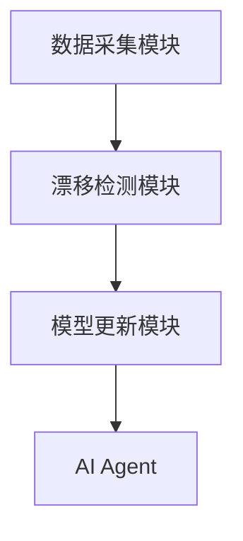
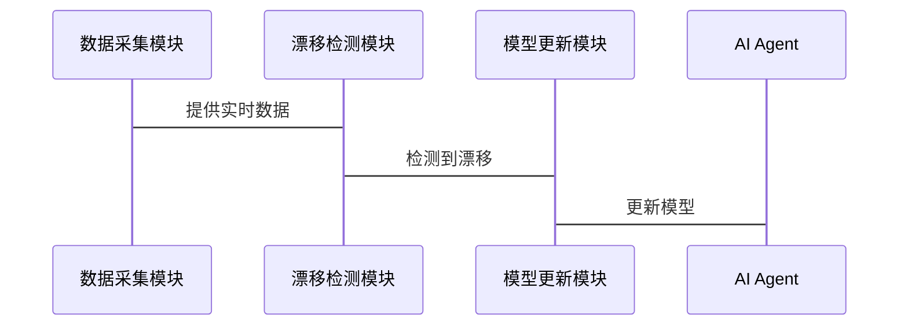

                 


# 设计AI Agent的概念漂移适应策略

## 关键词：
AI Agent, 概念漂移, 适应策略, 机器学习, 模型更新

## 摘要：
AI Agent在动态环境中面临概念漂移的问题，这会严重影响其性能和决策能力。本文详细探讨了概念漂移的定义、类型及其对AI Agent的影响，分析了多种概念漂移适应策略的核心原理和实现方法。通过具体案例，本文展示了如何设计和实现具有概念漂移适应能力的AI Agent系统，包括算法选择、系统架构设计和项目实战等内容，为读者提供了全面的理论和实践指导。

---

## 第一部分: AI Agent的概念漂移适应策略概述

### 第1章: 概念漂移与AI Agent的背景介绍

#### 1.1 概念漂移的定义与类型

##### 1.1.1 概念漂移的定义
概念漂移（Concept Drift）是指数据分布的变化导致模型性能下降的现象。具体来说，当训练数据和测试数据的分布不一致时，模型的预测能力会受到影响。概念漂移可以分为**突然漂移（Sudden Drift）**、**逐步漂移（Incremental Drift）**和**周期性漂移（Cyclic Drift）**三种类型。

**突然漂移**：数据分布突然发生显著变化，例如市场突然出现新的竞争产品。
**逐步漂移**：数据分布缓慢变化，例如用户偏好逐渐从A转向B。
**周期性漂移**：数据分布随时间周期性变化，例如季节性销售模式。

##### 1.1.2 概念漂移的类型
概念漂移可以进一步分为**标签漂移（Label Drift）**和**特征漂移（Feature Drift）**：
- **标签漂移**：标签的分布发生变化，例如原本属于类别A的数据逐渐变为类别B。
- **特征漂移**：特征的分布发生变化，例如某个特征的值域从正态分布变为偏态分布。

##### 1.1.3 概念漂移对AI Agent的影响
概念漂移会导致AI Agent的预测准确性下降，甚至可能引发错误决策。例如，在金融领域，概念漂移可能导致欺诈检测模型漏检或误检。

#### 1.2 AI Agent的基本概念

##### 1.2.1 AI Agent的定义
AI Agent是一种能够感知环境、自主决策并执行任务的智能体。AI Agent可以是软件程序、机器人或其他智能系统。

##### 1.2.2 AI Agent的核心特点
- **自主性**：能够在没有外部干预的情况下自主运行。
- **反应性**：能够实时感知环境并做出反应。
- **目标导向性**：为了实现特定目标而行动。

##### 1.2.3 AI Agent与传统算法的区别
AI Agent具有自主性和目标导向性，能够根据环境变化调整行为。传统算法则是在固定输入下输出固定结果，无法根据环境变化自适应。

#### 1.3 概念漂移适应策略的重要性

##### 1.3.1 概念漂移适应的必要性
在动态环境中，数据分布不可避免地会发生变化，因此AI Agent需要具备适应概念漂移的能力。

##### 1.3.2 概念漂移适应对AI Agent性能的提升
通过概念漂移适应策略，AI Agent能够及时发现数据分布的变化，并采取相应的措施（如更新模型），从而保持高性能。

##### 1.3.3 概念漂移适应在实际应用中的案例
例如，在电商领域，用户购买行为可能随季节变化而发生漂移。通过概念漂移适应策略，推荐系统能够实时调整推荐策略，提高转化率。

#### 1.4 本章小结
本章介绍了概念漂移的定义、类型及其对AI Agent的影响，强调了概念漂移适应策略的重要性。

---

### 第2章: 概念漂移适应策略的核心概念

#### 2.1 概念漂移适应策略的原理

##### 2.1.1 概念漂移适应的基本原理
概念漂移适应策略的核心在于监测数据分布的变化，并在检测到漂移时采取相应的措施（如更新模型）。

##### 2.1.2 概念漂移适应与机器学习模型的关系
概念漂移适应策略依赖于机器学习模型的性能监控和更新机制。模型性能下降时，需要重新训练或更新模型。

#### 2.2 概念漂移适应策略的分类

##### 2.2.1 基于统计的方法
基于统计的方法通过监控数据分布的变化来检测概念漂移。例如，使用Kolmogorov-Smirnov检验检测分布差异。

##### 2.2.2 基于模型的方法
基于模型的方法通过构建模型来预测数据分布的变化。例如，使用时间序列模型预测未来的数据分布。

##### 2.2.3 基于规则的方法
基于规则的方法通过预定义的规则来检测和适应概念漂移。例如，当某特征的均值变化超过阈值时，触发模型更新。

#### 2.3 概念漂移适应策略的优缺点对比

##### 2.3.1 各种策略的优缺点
- **基于统计的方法**：优点是简单易实现，缺点是检测精度可能不足。
- **基于模型的方法**：优点是检测精度高，缺点是计算复杂度较高。
- **基于规则的方法**：优点是灵活性高，缺点是需要大量人工干预。

##### 2.3.2 策略选择的依据
选择策略时需要考虑数据特点、计算资源和实时性要求。

#### 2.4 概念漂移适应策略的数学模型

##### 2.4.1 概念漂移适应的数学表达式
假设数据分布为P(x)，概念漂移检测可以通过比较当前分布P_current(x)和参考分布P_ref(x)来实现：
$$ D(P_{\text{current}}(x), P_{\text{ref}}(x)) = \text{distance measure} $$

##### 2.4.2 模型的参数解释
- **距离度量**：可以是KL散度、JS散度或其他统计距离。
- **阈值**：用于判断是否发生概念漂移。

##### 2.4.3 模型的适用场景
基于统计的方法适用于小数据场景，基于模型的方法适用于大数据场景，基于规则的方法适用于需要快速响应的场景。

#### 2.5 本章小结
本章分析了概念漂移适应策略的分类及其优缺点，介绍了数学模型和适用场景。

---

### 第3章: 概念漂移适应策略的算法原理

#### 3.1 概念漂移适应算法的分类

##### 3.1.1 基于统计的方法
- **假设检验**：使用统计检验方法（如卡方检验）检测分布差异。
- **分布估计**：通过估计数据分布的变化来检测漂移。

##### 3.1.2 基于模型的方法
- **时间序列模型**：使用ARIMA、LSTM等模型预测未来的数据分布。
- **流数据处理模型**：处理实时数据流，动态调整模型。

##### 3.1.3 基于规则的方法
- **阈值触发**：当某个指标（如分类准确性）低于阈值时，触发模型更新。
- **模式匹配**：当数据模式发生变化时，触发模型更新。

#### 3.2 常见概念漂移适应算法的实现

##### 3.2.1 基于统计的方法实现
```python
from scipy.stats import ks_2samp

# 检测两个样本是否来自相同的分布
def detect_drift(sample1, sample2):
    statistic, p_value = ks_2samp(sample1, sample2)
    return p_value < 0.05
```

##### 3.2.2 基于模型的方法实现
```python
from sklearn.linear_model import LinearRegression
from sklearn.metrics import mean_squared_error

# 使用线性回归模型预测未来的数据分布
def predict_distribution(X_train, y_train, X_test):
    model = LinearRegression()
    model.fit(X_train, y_train)
    y_pred = model.predict(X_test)
    return y_pred
```

##### 3.2.3 基于规则的方法实现
```python
# 监控分类准确性
def monitor_accuracy(model, X, y):
    accuracy = accuracy_score(y, model.predict(X))
    if accuracy < 0.8:
        update_model(model, X, y)
```

#### 3.3 算法的数学模型与公式

##### 3.3.1 统计方法的数学公式
Kolmogorov-Smirnov检验统计量：
$$ D = \max_{x} |F_1(x) - F_2(x)| $$
其中，$F_1(x)$和$F_2(x)$分别是两个样本的累积分布函数。

##### 3.3.2 模型方法的数学公式
线性回归模型：
$$ y = \beta_0 + \beta_1 x + \epsilon $$
其中，$\epsilon$是误差项。

##### 3.3.3 规则方法的数学公式
分类准确性的计算：
$$ \text{Accuracy} = \frac{\text{正确预测数}}{\text{总样本数}} $$

#### 3.4 算法的优缺点对比

##### 3.4.1 统计方法的优缺点
- **优点**：简单易实现，无需训练模型。
- **缺点**：检测精度可能不足。

##### 3.4.2 模型方法的优缺点
- **优点**：检测精度高，适用于大数据场景。
- **缺点**：计算复杂度较高。

##### 3.4.3 规则方法的优缺点
- **优点**：灵活性高，适用于快速响应场景。
- **缺点**：需要大量人工干预。

#### 3.5 本章小结
本章详细介绍了概念漂移适应算法的分类及其实现方法，分析了各种算法的优缺点和适用场景。

---

## 第二部分: 概念漂移适应策略的系统设计与实现

### 第4章: 系统架构设计与实现

#### 4.1 系统功能设计

##### 4.1.1 系统功能模块
- **数据采集模块**：实时采集数据。
- **漂移检测模块**：检测数据分布的变化。
- **模型更新模块**：根据漂移检测结果更新模型。

##### 4.1.2 系统功能流程
1. 数据采集模块采集实时数据。
2. 漂移检测模块检测数据分布的变化。
3. 如果检测到漂移，模型更新模块重新训练或更新模型。

#### 4.2 系统架构设计

##### 4.2.1 系统架构图


##### 4.2.2 系统接口设计
- **数据接口**：提供实时数据的接口。
- **模型接口**：提供模型更新的接口。

##### 4.2.3 系统交互流程


#### 4.3 系统实现细节

##### 4.3.1 数据采集模块的实现
```python
import pandas as pd

def collect_data():
    # 采集实时数据
    data = pd.read_csv('data.csv')
    return data
```

##### 4.3.2 漂移检测模块的实现
```python
from scipy.stats import ks_2samp

def detect_drift(data_current, data_ref):
    statistic, p_value = ks_2samp(data_current, data_ref)
    return p_value < 0.05
```

##### 4.3.3 模型更新模块的实现
```python
from sklearn.linear_model import LogisticRegression

def update_model(X, y):
    model = LogisticRegression()
    model.fit(X, y)
    return model
```

#### 4.4 本章小结
本章设计了概念漂移适应系统的架构，并详细介绍了各模块的实现细节。

---

## 第三部分: 项目实战与最佳实践

### 第5章: 项目实战

#### 5.1 项目背景与目标

##### 5.1.1 项目背景
在电商领域，用户购买行为可能随时间发生变化，导致推荐系统的性能下降。

##### 5.1.2 项目目标
设计一个能够适应用户购买行为变化的推荐系统。

#### 5.2 项目实现

##### 5.2.1 数据预处理
```python
import pandas as pd
from sklearn.preprocessing import StandardScaler

data = pd.read_csv('user_behavior.csv')
scaler = StandardScaler()
scaled_data = scaler.fit_transform(data)
```

##### 5.2.2 模型训练与部署
```python
from sklearn.ensemble import RandomForestClassifier

model = RandomForestClassifier()
model.fit(X_train, y_train)
```

##### 5.2.3 漂移检测与模型更新
```python
from utils import detect_drift

while True:
    new_data = collect_data()
    if detect_drift(current_data, new_data):
        model = update_model(new_data)
        current_data = new_data
```

#### 5.3 项目监控与优化

##### 5.3.1 监控指标
- **分类准确性**：模型预测的准确率。
- **召回率**：模型召回的正例比例。

##### 5.3.2 模型优化
- **参数调整**：调整模型的超参数以提高性能。
- **特征工程**：优化特征选择以提高模型的泛化能力。

#### 5.4 项目小结
本章通过一个电商推荐系统的案例，展示了概念漂移适应策略在实际项目中的应用。

---

### 第6章: 最佳实践与注意事项

#### 6.1 最佳实践

##### 6.1.1 监控策略的选择
根据业务需求选择合适的漂移检测方法。

##### 6.1.2 模型更新的频率
根据数据变化的速度和业务需求确定模型更新的频率。

##### 6.1.3 模型评估与优化
定期评估模型性能，并根据需要进行优化。

#### 6.2 注意事项

##### 6.2.1 数据质量
确保数据采集的实时性和准确性。

##### 6.2.2 计算资源
确保系统有足够的计算资源来支持模型更新和漂移检测。

##### 6.2.3 业务需求
根据业务需求选择合适的漂移检测和模型更新策略。

#### 6.3 拓展阅读
- **《Machine Learning: A Probabilistic Perspective》**
- **《Data Streams: Models and Algorithms》**

#### 6.4 本章小结
本章总结了概念漂移适应策略的最佳实践和注意事项，并提供了拓展阅读的方向。

---

## 第四部分: 总结与展望

### 第7章: 总结与展望

#### 7.1 全文总结
本文详细探讨了概念漂移适应策略的设计与实现，涵盖了从理论分析到实际应用的各个方面。

#### 7.2 未来展望
未来的研究方向包括：
- 更高效的漂移检测方法。
- 更智能的模型更新策略。
- 更强大的多模态数据处理能力。

#### 7.3 本章小结
本章总结了全文内容，并展望了未来的研究方向。

---

## 作者：AI天才研究院/AI Genius Institute & 禅与计算机程序设计艺术/Zen And The Art of Computer Programming

