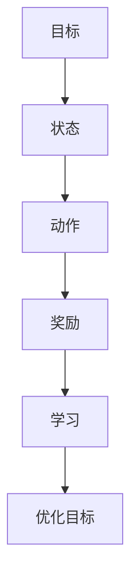
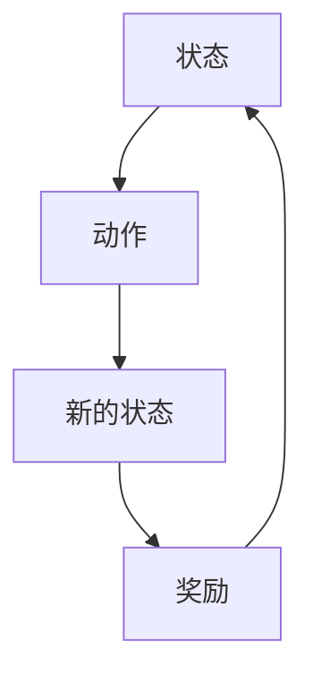
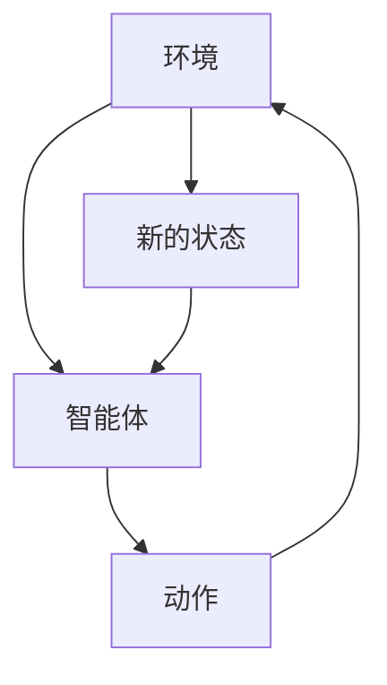
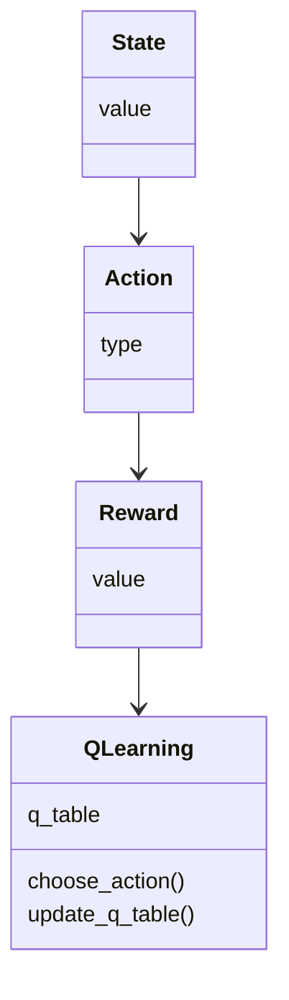
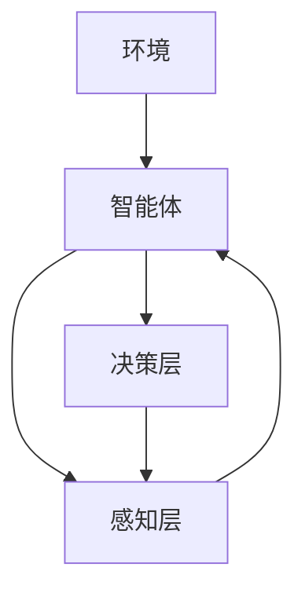
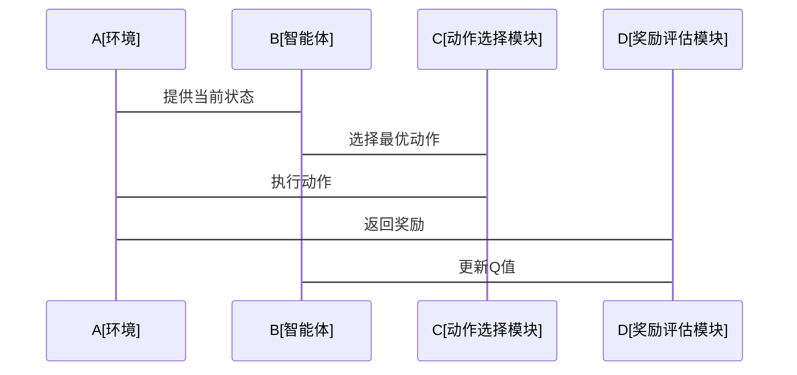

                 


# 设计AI Agent的目标导向行为系统

> 关键词：AI Agent，目标导向行为，强化学习，系统架构，项目实战

> 摘要：本文旨在深入探讨设计AI Agent的目标导向行为系统的原理和实现方法。通过结合强化学习算法和系统架构设计，本文详细讲解了如何构建一个高效的目标导向行为系统，从理论到实践，为读者提供全面的指导。

---

## 第1章: AI Agent的目标导向行为系统概述

### 1.1 问题背景与目标设定

#### 1.1.1 问题背景
AI Agent（人工智能代理）是一种能够感知环境、自主决策并执行任务的智能实体。在现代AI系统中，目标导向行为是实现智能代理的核心机制之一。目标导向行为系统通过设定目标，使AI Agent能够根据当前状态和环境反馈，选择最优的行为策略，从而实现目标。

#### 1.1.2 目标导向行为的定义
目标导向行为系统是一种基于目标的智能系统，通过感知环境、评估当前状态、规划行动方案并执行动作，以实现预定目标。其核心在于将目标转化为具体的行为序列，确保系统在动态环境中灵活应对挑战。

#### 1.1.3 系统的边界与外延
目标导向行为系统的边界在于其目标的设定和环境的感知范围。系统的外延包括从简单的行为决策到复杂的多目标优化，涉及强化学习、规划算法和感知技术等多个领域。

---

### 1.2 核心概念与系统组成

#### 1.2.1 核心概念原理
目标导向行为系统的核心概念包括目标设定、状态感知、决策规划和行为执行。这些概念共同构成了系统的逻辑框架。

#### 1.2.2 核心概念属性特征对比表
| 概念       | 属性特征                 |
|------------|--------------------------|
| 目标设定    | 明确性、可变性           |
| 状态感知    | 实时性、准确性           |
| 决策规划    | 优化性、可行性           |
| 行为执行    | 及时性、可执行性         |

#### 1.2.3 系统实体关系图（Mermaid流程图）


---

## 第2章: 强化学习与目标导向行为系统

### 2.1 强化学习算法原理

#### 2.1.1 强化学习的基本概念
强化学习是一种通过试错机制来学习策略的算法。智能体通过与环境交互，获得奖励或惩罚，逐步优化行为策略。

#### 2.1.2 Q-learning算法原理（Mermaid流程图）


#### 2.1.3 DQN算法原理（Mermaid流程图）


### 2.2 强化学习与目标导向行为系统的数学模型

#### 2.2.1 Q-learning数学模型
Q-learning的目标是学习状态-动作对的价值函数，公式如下：
$$ Q(s, a) = Q(s, a) + \alpha (r + \gamma \max Q(s', a') - Q(s, a)) $$

#### 2.2.2 DQN数学模型
DQN使用深度神经网络近似Q值函数，公式如下：
$$ Q(s, a) = \alpha r + (1-\alpha) Q(s, a) $$

### 2.3 强化学习算法的Python实现

#### 2.3.1 环境安装与配置
```bash
pip install gym matplotlib numpy
```

#### 2.3.2 Q-learning算法实现代码
```python
import numpy as np

class QLearning:
    def __init__(self, state_space, action_space, alpha=0.1, gamma=0.9):
        self.q_table = np.zeros((state_space, action_space))
        self.alpha = alpha
        self.gamma = gamma

    def choose_action(self, state):
        return np.argmax(self.q_table[state])

    def update_q_table(self, state, action, reward, next_state):
        self.q_table[state][action] += self.alpha * (reward + self.gamma * np.max(self.q_table[next_state]) - self.q_table[state][action])
```

---

## 第3章: 系统分析与架构设计

### 3.1 系统功能设计

#### 3.1.1 领域模型设计（Mermaid类图）


#### 3.1.2 系统功能模块划分
- 状态感知模块
- 动作选择模块
- 奖励评估模块
- Q值更新模块

### 3.2 系统架构设计

#### 3.2.1 分层架构设计（Mermaid架构图）


#### 3.2.2 接口设计
- 输入接口：接收环境状态
- 输出接口：发送动作指令
- 奖励接口：评估行为结果

#### 3.2.3 交互流程设计（Mermaid序列图）


---

## 第4章: 项目实战

### 4.1 项目环境安装

#### 4.1.1 Python环境配置
```bash
python --version
pip --version
```

#### 4.1.2 依赖库安装
```bash
pip install gym matplotlib numpy
```

### 4.2 核心代码实现

#### 4.2.1 环境配置
```python
import gym
env = gym.make('CartPole-v0')
```

#### 4.2.2 动作选择与执行
```python
state = env.reset()
action = agent.choose_action(state)
next_state, reward, done, info = env.step(action)
```

#### 4.2.3 奖励评估与Q值更新
```python
agent.update_q_table(state, action, reward, next_state)
```

---

## 第5章: 最佳实践

### 5.1 小结
目标导向行为系统结合了强化学习和系统架构设计，是构建智能Agent的核心机制。

### 5.2 注意事项
- 状态空间和动作空间的设计要合理
- 奖励函数要明确且具有引导性
- 算法参数的调优要谨慎

### 5.3 拓展阅读
- 《强化学习：理论与算法》
- 《机器学习实战》

---

作者：AI天才研究院/AI Genius Institute & 禅与计算机程序设计艺术 /Zen And The Art of Computer Programming

