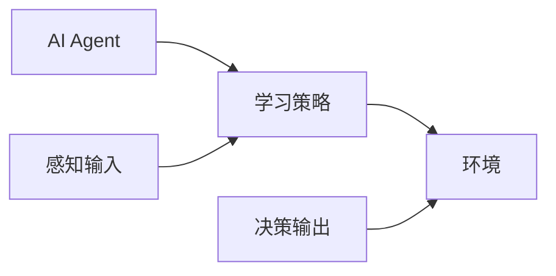
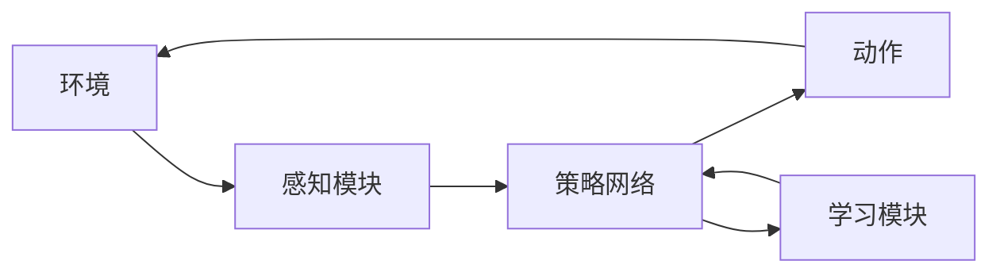

                 


# 设计AI Agent的自我修正学习策略

> 关键词：AI Agent, 自我修正学习策略, 强化学习, 元学习, 算法原理, 系统架构, 项目实战

> 摘要：本文深入探讨了AI Agent的自我修正学习策略的设计原理与实现方法。从核心概念到算法原理，从系统架构到项目实战，详细讲解了如何设计一个能够自我修正和优化的AI Agent学习策略。文章结合理论分析和实践案例，为读者提供了全面的技术指导。

---

# 第1章: AI Agent的基本概念与背景

## 1.1 AI Agent的定义与核心要素
- AI Agent的定义：AI Agent是一种智能体，能够感知环境、自主决策并执行动作以实现特定目标。
- 核心特征：
  - 感知能力：通过传感器或数据输入感知环境。
  - 决策能力：基于感知信息做出决策。
  - 学习能力：通过经验或数据优化自身行为。
  - 自适应能力：在动态环境中调整策略。
- 应用场景：
  - 智能助手（如Siri、Alexa）
  - 自动驾驶系统
  - 机器人控制
  - 游戏AI

## 1.2 自我修正学习策略的必要性
- 动态环境中的挑战：
  - 环境变化可能导致原有策略失效。
  - 新任务的引入需要快速适应。
- 知识更新的需求：
  - 数据分布的变化需要实时调整模型。
  - 知识库的更新需要动态优化。
- 策略优化的必要性：
  - 提高决策的准确性和效率。
  - 降低试错成本。

---

# 第2章: 自我修正学习策略的核心概念与联系

## 2.1 自我修正学习策略的原理
- 强化学习（Reinforcement Learning）：
  - 通过与环境交互，学习策略以最大化累积奖励。
  - 核心算法：Q-learning、策略梯度法（Policy Gradient）。
- 元学习（Meta-Learning）：
  - 学习如何学习，能够在少量数据上快速适应新任务。
  - 核心算法：MAML（Meta-Automated Machine Learning）、Reptile方法。

## 2.2 核心概念对比分析
- 不同学习策略的特征对比：

| 策略类型 | 强化学习 | 元学习 | 监督学习 |
|----------|----------|--------|----------|
| 数据来源 | 环境交互 | 少量数据 | 标签数据 |
| 学习目标 | 最大化奖励 | 快速适应新任务 | 分类/回归 |
| 适用场景 | 控制、游戏 | 少样本任务 | 通用分类任务 |

- 策略网络的优缺点：
  - 优点：实时调整策略，适应动态环境。
  - 缺点：计算开销大，需要频繁反馈。

## 2.3 实体关系图（ER图）


---

# 第3章: 自我修正学习策略的算法原理

## 3.1 基于强化学习的策略优化算法

### 3.1.1 强化学习的基本原理
- 状态（State）：环境的当前情况。
- 动作（Action）：AI Agent的选择。
- 奖励（Reward）：对动作的反馈。
- 策略（Policy）：从状态到动作的映射函数。

### 3.1.2 Q-learning算法的介绍
- 算法流程：
  1. 初始化Q表。
  2. 选择动作（探索与利用）。
  3. 执行动作，获得奖励。
  4. 更新Q值：$Q(s, a) = Q(s, a) + \alpha (r + \gamma \max Q(s', a'))$。
- 参数解释：
  - $\alpha$：学习率。
  - $\gamma$：折扣因子。

### 3.1.3 策略网络的构建与优化
- 使用神经网络近似策略。
- 策略梯度法：优化目标为最大化期望奖励。
  $$ \nabla J = \mathbb{E}[\nabla \log \pi(a|s)] \cdot Q(s, a) $$

## 3.2 基于元学习的策略调整方法

### 3.2.1 元学习的核心思想
- 学习如何快速学习：通过在多个任务上训练，使得模型能够快速适应新任务。
- 核心算法：MAML（Meta-Automated Machine Learning）。
  - 算法流程：
    1. 初始化参数$\theta$。
    2. 对每个任务，进行内循环更新：$\theta_{\text{meta}} = \theta + \alpha (\theta' - \theta)$。
    3. 外循环优化：$\theta = \theta + \beta (\theta' - \theta)$。

### 3.2.2 元学习的数学模型
- 内循环更新：$$ \theta' = \theta + \alpha \nabla_{\theta} L_{\text{task}}(\theta) $$
- 外循环优化：$$ \theta = \theta + \beta \nabla_{\theta} L_{\text{meta}}(\theta) $$

---

# 第4章: 自我修正学习策略的系统架构与实现

## 4.1 系统功能设计
- 感知模块：接收环境输入。
- 决策模块：基于策略网络输出动作。
- 学习模块：更新策略参数。

## 4.2 系统架构设计


## 4.3 系统接口设计
- 输入接口：接收环境状态。
- 输出接口：输出决策动作。
- 学习接口：接收奖励信号，更新策略。

---

# 第5章: 项目实战——设计一个自我修正的AI Agent

## 5.1 项目背景
- 设计一个能够在动态环境中调整策略的AI Agent。
- 应用场景：游戏AI、智能推荐系统。

## 5.2 核心代码实现
### 5.2.1 强化学习部分
```python
import numpy as np
import gym

class AI-Agent:
    def __init__(self, env):
        self.env = env
        self.Q = np.zeros([env.observation_space.shape[0], env.action_space.n])
    
    def choose_action(self, state):
        # 探索与利用策略
        epsilon = 0.1
        if np.random.random() < epsilon:
            return self.env.action_space.sample()
        else:
            return np.argmax(self.Q[state])
    
    def update_Q(self, state, action, reward, next_state):
        alpha = 0.1
        gamma = 0.9
        self.Q[state][action] += alpha * (reward + gamma * np.max(self.Q[next_state]) - self.Q[state][action])
```

### 5.2.2 元学习部分
```python
import tensorflow as tf

class Meta-Learner:
    def __init__(self):
        self.theta = tf.Variable(tf.random.normal([10, 1]))
    
    def inner_loop(self, task, theta):
        with tf.GradientTape(persistent=True) as tape:
            # 假设task loss函数
            loss = task_loss(theta)
            d_loss = tape.gradient(loss, theta)
        new_theta = theta + 1e-3 * d_loss
        return new_theta
    
    def meta_loop(self, tasks):
        for task in tasks:
            theta_prime = self.inner_loop(task, self.theta)
            with tf.GradientTape() as tape:
                loss = self.inner_loop(task_loss(theta_prime))
                meta_loss = tape.gradient(loss, self.theta)
            self.theta = self.theta - 1e-3 * meta_loss
```

## 5.3 项目小结
- 实现了一个简单的自我修正AI Agent。
- 结合强化学习和元学习，展示了策略优化的潜力。
- 未来可以进一步优化算法，引入更复杂的环境模型。

---

# 第6章: 总结与展望

## 6.1 总结
- AI Agent的自我修正学习策略是实现智能体自主优化的核心技术。
- 通过强化学习和元学习的结合，可以显著提升策略优化的效率和效果。

## 6.2 未来展望
- 更复杂环境下的策略优化。
- 多智能体协作与竞争中的策略调整。
- 真实应用场景中的进一步优化。

---

作者：AI天才研究院 & 禅与计算机程序设计艺术

