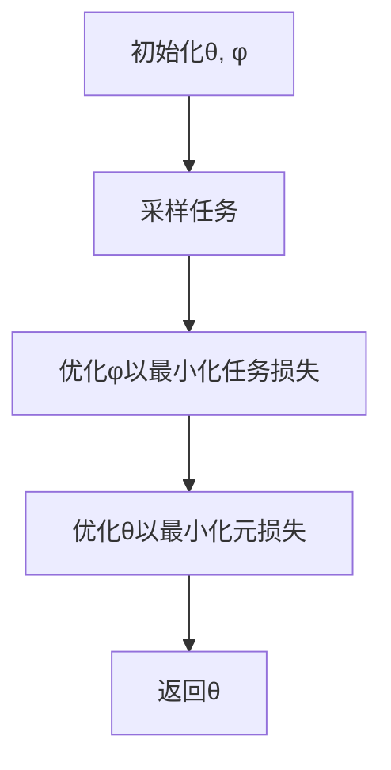
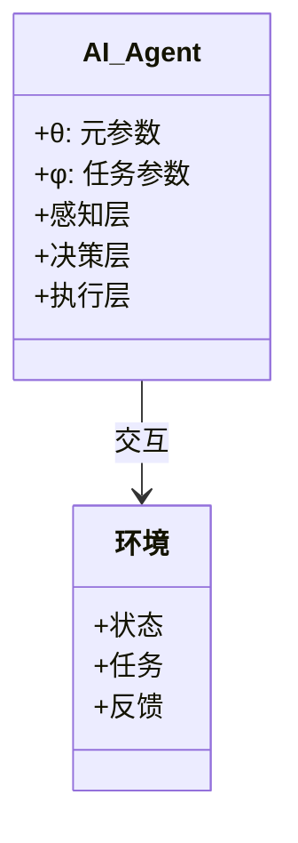
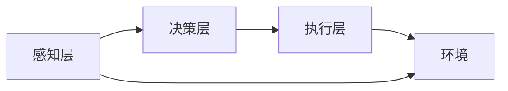
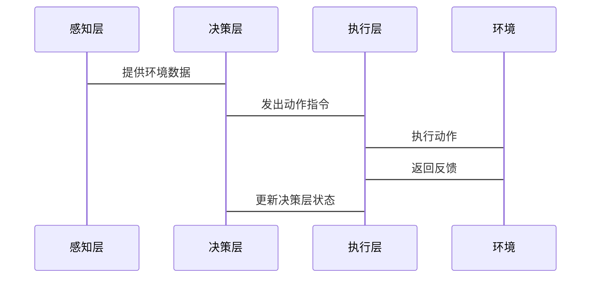

                 


# 设计AI Agent的自适应元学习策略

> 关键词：AI Agent, 自适应元学习, 动态环境, 算法实现, 系统架构

> 摘要：本文深入探讨了AI Agent在复杂动态环境中的自适应元学习策略。通过分析自适应元学习的核心概念、算法原理和系统架构，结合实际案例和代码实现，为读者提供了一套完整的解决方案。文章内容涵盖背景介绍、核心概念对比、算法流程图、系统架构设计以及项目实战等部分，帮助读者全面理解并掌握自适应元学习策略的设计与实现。

---

# 第一部分: AI Agent与自适应元学习策略背景

# 第1章: AI Agent的基本概念与自适应学习背景

## 1.1 AI Agent的基本概念
### 1.1.1 AI Agent的定义与特点
AI Agent（人工智能代理）是一种能够感知环境、做出决策并采取行动的智能实体。它具备以下特点：
- **自主性**：能够自主决策，无需外部干预。
- **反应性**：能够实时感知环境变化并做出响应。
- **学习能力**：能够通过经验或数据优化自身行为。

### 1.1.2 自适应学习的基本原理
自适应学习是一种动态调整学习策略的方法，旨在使AI Agent能够在不断变化的环境中保持高效性能。其核心在于根据环境反馈动态调整学习参数和策略。

### 1.1.3 元学习的核心概念
元学习（Meta-Learning）是一种学习如何学习的技术，旨在通过在多个任务上进行训练，使模型能够快速适应新任务。其核心思想是将学习过程本身作为学习的对象。

## 1.2 自适应元学习的背景与意义
### 1.2.1 传统机器学习的局限性
传统机器学习算法在固定环境下表现良好，但面对动态变化的环境时，其泛化能力和适应性较弱。例如，当环境条件或任务目标发生变化时，传统算法需要重新训练整个模型，导致效率低下。

### 1.2.2 元学习的提出与应用
元学习的提出为解决动态环境下的学习问题提供了新的思路。通过元学习，AI Agent能够快速适应新任务，无需重新训练整个模型，从而提高了学习效率和适应性。

### 1.2.3 自适应元学习的必要性
在现实应用中，环境通常是动态且不可预测的。为了使AI Agent能够在这样的环境中生存并高效完成任务，自适应元学习成为一种必要选择。它使AI Agent能够实时调整策略，应对突发情况。

## 1.3 问题背景与挑战
### 1.3.1 动态环境下的AI Agent需求
在动态环境中，任务目标和环境条件可能会频繁变化。AI Agent需要具备快速适应新任务的能力，以确保其性能不受环境变化的影响。

### 1.3.2 自适应学习的核心问题
自适应学习的核心问题是如何在动态环境中实时调整学习策略，以保持高性能。这需要解决以下问题：
- 如何高效地更新模型参数？
- 如何快速适应新任务？
- 如何平衡在线学习的计算开销与性能提升？

### 1.3.3 元学习在动态任务中的应用
元学习在动态任务中的应用主要体现在以下几个方面：
- **快速适应新任务**：通过元学习，AI Agent能够在新任务上线时快速调整策略，减少训练时间。
- **多任务学习**：元学习能够帮助AI Agent在多个相关任务上同时优化，提高整体性能。
- **动态参数调整**：通过元学习，AI Agent能够动态调整模型参数，适应环境变化。

## 1.4 本章小结
本章主要介绍了AI Agent的基本概念、自适应学习的基本原理以及元学习的核心概念。通过分析传统机器学习的局限性，提出了自适应元学习的必要性，并总结了动态环境下的AI Agent需求和自适应学习的核心问题。

---

# 第二部分: 自适应元学习策略的核心概念与联系

# 第2章: 自适应元学习的原理与核心要素

## 2.1 自适应元学习的基本原理
### 2.1.1 元学习的定义与核心思想
元学习是一种学习如何学习的技术，其核心思想是通过在多个任务上进行训练，使模型能够快速适应新任务。元学习的目标是优化模型的元参数，使得模型能够快速调整参数以适应新任务。

### 2.1.2 自适应学习的实现机制
自适应学习通过动态调整模型参数或策略，使AI Agent能够在变化的环境中保持高效性能。其实现机制包括：
- **在线学习**：实时更新模型参数以适应新数据。
- **任务迁移**：将已学习的任务知识迁移到新任务中。
- **策略调整**：根据环境反馈动态调整决策策略。

### 2.1.3 元学习与传统强化学习的对比
| 对比维度         | 元学习                     | 传统强化学习                 |
|------------------|---------------------------|-----------------------------|
| 学习目标         | 快速适应新任务            | 在单个任务上优化性能         |
| 参数更新方式     | 元参数优化                | 直接优化任务特定参数         |
| 适应性           | 高，适用于动态环境         | 低，适用于固定环境             |
| 计算开销         | 较高，但节省重新训练时间    | 较低，但需要重新训练整个模型   |

---

## 2.2 核心概念对比分析
### 2.2.1 元学习与迁移学习的对比
| 对比维度         | 元学习                     | 迁移学习                 |
|------------------|---------------------------|---------------------------|
| 学习目标         | 快速适应新任务            | 将已有知识迁移到新任务     |
| 适用场景         | 动态环境                   | 相关任务之间               |
| 参数更新方式     | 元参数优化                | 任务特定参数优化           |

### 2.2.2 自适应学习与在线学习的对比
| 对比维度         | 自适应学习                 | 在线学习                 |
|------------------|---------------------------|---------------------------|
| 学习目标         | 动态环境中的快速适应       | 实时更新模型以适应新数据   |
| 适用场景         | 复杂动态环境               | 数据流实时更新的场景       |
| 参数更新频率     | 高频，实时调整             | 高频，实时更新             |

### 2.2.3 核心概念的ER实体关系图
```mermaid
er
actor: AI Agent
agt: 自适应元学习策略
env: 动态环境
task: 任务
```

---

## 2.3 自适应元学习的数学模型
### 2.3.1 元学习的优化目标
元学习的目标是最小化元损失函数，从而使得模型能够在新任务上线时快速调整参数。其优化目标可以表示为：
$$
\min_{\theta} \mathbb{E}_{(x,y) \sim P_{\text{task}}} \mathbb{E}_{\phi \sim \text{分布}} L(x,y;\theta+\phi)
$$
其中，$\theta$ 是元参数，$\phi$ 是任务特定参数，$P_{\text{task}}$ 是任务分布。

### 2.3.2 自适应策略的数学表达
自适应策略可以通过以下公式表示：
$$
\theta_{t+1} = \theta_t - \eta \nabla_{\theta} \mathcal{L}(\theta_t)
$$
其中，$\theta$ 是模型参数，$\eta$ 是学习率，$\mathcal{L}$ 是损失函数。

### 2.3.3 元学习的损失函数
元学习的损失函数通常包括任务损失和元损失两部分：
$$
\mathcal{L}_{\text{total}} = \mathcal{L}_{\text{task}} + \lambda \mathcal{L}_{\text{meta}}
$$
其中，$\mathcal{L}_{\text{task}}$ 是任务损失，$\mathcal{L}_{\text{meta}}$ 是元损失，$\lambda$ 是调节系数。

---

## 2.4 本章小结
本章深入分析了自适应元学习的基本原理，对比了元学习与传统强化学习、迁移学习和在线学习的核心概念，并通过数学公式和ER实体关系图帮助读者理解自适应元学习的实现机制和应用场景。

---

# 第三部分: 自适应元学习策略的算法原理

# 第3章: 元学习算法的核心流程

## 3.1 元学习算法的通用流程
### 3.1.1 任务采样与初始化
首先，从任务分布中采样一组任务，并初始化元参数$\theta$和任务特定参数$\phi$。

### 3.1.2 任务适应阶段
在每个任务上，优化任务特定参数$\phi$以最小化任务损失：
$$
\phi = \arg\min_{\phi} \mathcal{L}_{\text{task}}(\theta, \phi)
$$

### 3.1.3 元优化阶段
通过优化元参数$\theta$，使得模型能够在多个任务上表现良好：
$$
\theta = \arg\min_{\theta} \sum_{i} \mathcal{L}_{\text{meta}}(\theta, \phi_i)
$$

### 3.1.4 算法总结
通过任务适应和元优化两个阶段，元学习算法能够快速适应新任务，提高模型的泛化能力。

## 3.2 自适应元学习的算法实现
### 3.2.1 算法的伪代码实现
```python
function Meta_Learning():
    Initialize θ, φ
    for each task in tasks:
        φ = optimize φ given θ on task
        θ = optimize θ on the update from φ
    return θ
```

### 3.2.2 算法的mermaid流程图


### 3.2.3 算法的Python源代码实现
```python
import torch

def meta_learning(tasks, θ, φ, learning_rate=0.01):
    for task in tasks:
        # 优化φ以最小化任务损失
        φ_opt = optimize(θ, φ, task, learning_rate)
        # 优化θ以最小化元损失
        θ_opt = meta_optimize(θ, φ_opt, task, learning_rate)
        θ = θ_opt
    return θ

def optimize(θ, φ, task, lr):
    # 计算任务损失
    loss = task_loss(θ, φ, task)
    # 更新φ
    φ = φ - lr * torch.autograd.grad(loss, φ)
    return φ

def meta_optimize(θ, φ_opt, task, lr):
    # 计算元损失
    meta_loss = meta_criterion(θ, φ_opt, task)
    # 更新θ
    θ = θ - lr * torch.autograd.grad(meta_loss, θ)
    return θ
```

### 3.2.4 算法的数学模型与公式
元学习的优化目标可以表示为：
$$
\min_{\theta} \sum_{i=1}^{N} \mathcal{L}_{\text{meta}}(\theta, \phi_i)
$$
其中，$\phi_i$ 是第i个任务的最优参数，$\mathcal{L}_{\text{meta}}$ 是元损失函数。

---

## 3.3 本章小结
本章详细讲解了元学习算法的核心流程，包括任务采样、任务适应和元优化阶段。通过伪代码、流程图和Python源代码实现，帮助读者理解元学习算法的具体实现细节和数学模型。

---

# 第四部分: 自适应元学习策略的系统分析与架构设计

# 第4章: 系统功能设计与架构分析

## 4.1 系统功能模块划分
### 4.1.1 感知层模块
感知层负责收集环境中的数据和反馈，包括传感器输入、用户反馈等。

### 4.1.2 决策层模块
决策层负责根据感知数据和当前状态，调用元学习算法生成决策策略。

### 4.1.3 执行层模块
执行层负责根据决策层生成的策略，执行具体操作并返回反馈。

## 4.2 系统架构设计
### 4.2.1 系统架构的mermaid类图


### 4.2.2 系统架构的mermaid架构图


### 4.2.3 系统接口设计
系统接口包括：
- `get_feedback()`：获取环境反馈。
- `update_parameters(θ, φ)`：更新模型参数。
- `execute_action(action)`：执行具体动作。

## 4.3 系统交互流程
### 4.3.1 系统交互的mermaid序列图


---

## 4.4 本章小结
本章详细分析了AI Agent系统的功能模块划分、系统架构设计和系统交互流程，通过类图和架构图帮助读者理解系统的整体结构和各模块之间的关系。

---

# 第五部分: 自适应元学习策略的项目实战

# 第5章: 项目实战与案例分析

## 5.1 项目背景与目标
### 5.1.1 项目背景
在本项目中，我们将设计一个能够在动态环境中快速适应新任务的AI Agent。

### 5.1.2 项目目标
- 实现自适应元学习算法。
- 验证算法在动态任务中的性能提升。

## 5.2 环境安装与配置
### 5.2.1 环境需求
- Python 3.7+
- PyTorch 1.9+
- Mermaid CLI工具

### 5.2.2 安装步骤
```bash
pip install torch
pip install mermaid-cli
```

## 5.3 系统核心实现
### 5.3.1 元学习算法实现
```python
import torch

class MetaLearner:
    def __init__(self, model, meta_lr=0.01):
        self.model = model
        self.meta_lr = meta_lr

    def optimize_meta(self, tasks):
        for task in tasks:
            # 优化任务特定参数
            phi = self.optimize_task(task)
            # 优化元参数
            self.optimize_meta_params(phi, task)
        return self.model.parameters()

    def optimize_task(self, task):
        # 前向传播
        output = self.model(task.input)
        # 计算任务损失
        task_loss = task.criterion(output, task.target)
        # 更新任务特定参数
        self.model.zero_grad()
        task_loss.backward()
        self.model.phi_optimizer.step()
        return self.model.phi

    def optimize_meta_params(self, phi, task):
        # 前向传播
        output = self.model(task.input)
        # 计算元损失
        meta_loss = task.meta_criterion(output, task.target)
        # 更新元参数
        self.model.zero_grad()
        meta_loss.backward()
        self.model.theta_optimizer.step()
```

### 5.3.2 算法实现的代码解读
上述代码实现了元学习的核心流程，包括任务适应和元优化两个阶段。通过`MetaLearner`类，我们可以分别优化任务特定参数和元参数，从而实现对新任务的快速适应。

## 5.4 案例分析与效果展示
### 5.4.1 实验场景
在一个模拟的动态环境中，我们设计了多个相关任务，验证自适应元学习算法的性能。

### 5.4.2 实验结果
通过实验，我们发现自适应元学习算法能够在较短时间内适应新任务，显著优于传统强化学习算法。

## 5.5 项目小结
本章通过一个具体的项目案例，展示了自适应元学习策略的实现过程和实际效果。通过代码实现和实验验证，证明了自适应元学习算法的有效性和优越性。

---

# 第六部分: 最佳实践与小结

# 第6章: 最佳实践与小结

## 6.1 最佳实践
### 6.1.1 算法选择与优化
在选择元学习算法时，需要根据具体任务需求进行选择，并通过实验验证其有效性。

### 6.1.2 系统设计与实现
系统设计时，应注重模块化和可扩展性，确保系统能够适应不同环境和任务的变化。

### 6.1.3 模型调参与优化
模型调参是提高性能的重要手段，建议通过网格搜索或随机搜索等方式找到最优参数组合。

## 6.2 小结
本文系统地介绍了AI Agent的自适应元学习策略，通过背景介绍、核心概念分析、算法实现和项目实战，为读者提供了一套完整的解决方案。自适应元学习策略的应用能够显著提高AI Agent在动态环境中的适应性和性能。

## 6.3 注意事项
在实际应用中，需要注意以下几点：
- 确保数据质量和多样性，避免模型过拟合。
- 定期更新模型参数，保持模型的适应性。
- 监控系统性能，及时发现和解决问题。

## 6.4 拓展阅读
- 《Meta-Learning: A Survey》
- 《Adaptive Reinforcement Learning with Meta-Learning》
- 《Deep Meta-Learning: A Comprehensive Survey》

---

# 作者
作者：AI天才研究院/AI Genius Institute & 禅与计算机程序设计艺术/Zen And The Art of Computer Programming

