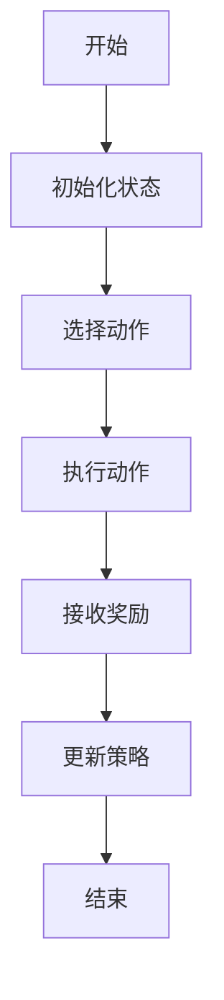

                 


# 设计AI Agent的自适应探索策略

> **关键词**: AI Agent, 自适应探索策略, 强化学习, 动态环境, 智能系统, 自适应算法

> **摘要**: 本文系统地探讨了AI Agent的自适应探索策略的设计方法。首先，从AI Agent的基本概念出发，分析了自适应探索策略的核心要素和应用场景。接着，详细阐述了自适应探索策略的数学模型和算法原理，重点介绍了强化学习和多智能体协作的实现方式。随后，通过系统架构设计和项目实战，展示了如何在实际场景中应用这些策略。最后，探讨了高级主题和最佳实践，为读者提供了全面的指导。

---

## 第一部分: AI Agent的自适应探索策略概述

### 第1章: AI Agent的基本概念与问题背景

#### 1.1 AI Agent的定义与核心概念

- **1.1.1 AI Agent的定义**  
  AI Agent（智能体）是指在环境中能够感知并自主行动以实现目标的实体。Agent可以是软件程序、机器人或其他智能系统，其核心在于能够根据环境反馈调整自身行为。

- **1.1.2 自适应探索策略的背景与意义**  
  在动态和不确定的环境中，AI Agent需要不断调整其策略以适应环境变化。自适应探索策略使得Agent能够在复杂场景中做出最优决策，提升任务成功率。

- **1.1.3 问题背景与目标设定**  
  在许多实际应用中，如游戏AI、自然语言处理和机器人控制等，AI Agent需要在未知或部分已知的环境中进行探索和学习。自适应探索策略的目标是平衡探索与利用，最大化长期收益。

---

#### 1.2 自适应探索策略的核心要素

- **1.2.1 策略空间与状态空间**  
  策略空间定义了所有可能的动作或行为，而状态空间则描述了环境中所有可能的状态。自适应探索策略的核心在于在策略空间中找到最优策略，以应对不同状态的变化。

- **1.2.2 探索与利用的平衡**  
  在强化学习中，探索（exploration）是指尝试新的动作以发现潜在的高回报状态，而利用（exploitation）则是指在已知的最佳策略下获取最大收益。平衡这两者是自适应探索策略的关键。

- **1.2.3 动态环境中的适应性**  
  环境通常是动态变化的，Agent需要能够快速调整其策略以应对这些变化。自适应探索策略通过实时更新模型和参数，确保在动态环境中保持高效性。

---

### 第2章: 自适应探索策略的应用场景

#### 2.1 AI Agent在游戏AI中的应用

- **2.1.1 游戏AI的基本原理**  
  游戏AI通过感知游戏环境（如棋盘或地图）并做出决策来控制角色或单位。自适应探索策略在游戏AI中用于优化路径规划、资源分配和战斗策略。

- **2.1.2 自适应探索策略在游戏AI中的作用**  
  例如，在策略游戏中，AI Agent需要根据对手的行动动态调整自己的策略，确保在复杂对抗环境中保持优势。

- **2.1.3 典型案例分析**  
  以Dota 2中的AI Agent为例，分析其如何通过自适应探索策略在动态比赛中做出最优决策。

---

#### 2.2 自然语言处理中的应用

- **2.2.1 语言模型的自适应探索**  
  在自然语言处理中，AI Agent需要通过不断探索语言空间，优化其生成文本的质量。例如，在对话系统中，Agent需要根据用户的反馈调整其回答策略。

- **2.2.2 对话系统中的策略优化**  
  自适应探索策略用于优化对话流程，提升用户体验。通过实时分析对话历史和用户反馈，AI Agent能够动态调整其回答策略。

- **2.2.3 实际应用案例**  
  例如，在智能客服系统中，AI Agent通过自适应探索策略，能够更准确地理解用户需求并提供个性化的服务。

---

#### 2.3 其他领域中的应用

- **2.3.1 机器人控制**  
  自适应探索策略用于机器人在复杂环境中的导航和操作任务。例如，在仓储物流中，机器人需要动态调整路径以应对环境中的障碍物。

- **2.3.2 自动驾驶**  
  自动驾驶系统通过自适应探索策略优化路径规划和决策-making，确保在复杂交通环境中安全行驶。

- **2.3.3 智能推荐系统**  
  在推荐系统中，AI Agent通过自适应探索策略，动态调整推荐策略以满足用户的个性化需求。

---

## 第二部分: 自适应探索策略的核心概念与联系

### 第3章: 自适应探索策略的数学模型

#### 3.1 自适应探索策略的数学模型

- **3.1.1 状态空间表示**  
  状态空间可以表示为一个集合S，其中每个元素s ∈ S表示环境中的一个状态。例如，在迷宫导航问题中，状态可以表示为位置坐标(x, y)。

- **3.1.2 动作空间表示**  
  动作空间可以表示为一个集合A，其中每个元素a ∈ A表示Agent可以执行的一个动作。例如，在迷宫导航中，动作可以是“左转”、“右转”、“前进”。

- **3.1.3 奖励函数设计**  
  奖励函数r(s, a)定义了在状态s下执行动作a后获得的奖励。例如，在迷宫导航中，找到出口可以得到正奖励，而碰撞到墙壁则得到负奖励。

---

#### 3.2 核心概念的ER实体关系图

```mermaid
er
actor(Agent, Environment)
relation(Agent, Environment, "与环境交互")
```

---

#### 3.3 算法流程图



---

## 第三部分: 自适应探索策略的算法原理

### 第4章: 强化学习基础

#### 4.1 Q-learning算法

- **Q-learning算法的基本原理**  
  Q-learning是一种基于值函数的强化学习算法，通过不断更新Q值表来学习最优策略。Q值表示在状态s下执行动作a后的期望奖励。

- **数学模型**  
  Q-learning的更新公式为：  
  $$ Q(s, a) = Q(s, a) + \alpha \left( r + \gamma \max_{a'} Q(s', a') - Q(s, a) \right) $$  
  其中，α是学习率，γ是折扣因子。

- **算法流程图**  
  ```mermaid
  graph TD
      A[环境] --> B[选择动作]
      B --> C[执行动作]
      C --> D[接收奖励]
      D --> E[更新Q值]
      E --> F[结束]
  ```

---

#### 4.2 Deep Q-Networks (DQN)

- **DQN的基本原理**  
  DQN通过深度神经网络近似Q值函数，避免了Q值表的离散化问题，能够处理高维状态空间。

- **数学模型**  
  DQN的目标是最小化预测Q值与实际Q值之间的误差：  
  $$ \min \mathbb{E}[(r + \gamma Q(s', a') - Q(s, a))^2] $$

---

### 第5章: 多智能体协作

#### 5.1 多智能体系统的基本原理

- **多智能体系统的定义**  
  多智能体系统是指多个智能体协同工作的系统，每个智能体负责不同的任务或子问题。

- **自适应探索策略在多智能体中的应用**  
  在多智能体系统中，每个智能体需要通过自适应探索策略动态调整其行为，以实现全局最优。

- **典型算法分析**  
  例如，基于DQN的多智能体协作算法，通过分布式Q值函数更新实现全局优化。

---

## 第四部分: 系统分析与架构设计方

### 第6章: 系统分析与架构设计方

#### 6.1 系统功能设计

- **领域模型类图**  
  ```mermaid
  classDiagram
      class Agent {
          - state: S
          - action: A
          - reward: R
          - policy: P
      }
      class Environment {
          - state: S
          - action: A
          - reward: R
      }
      Agent --> Environment: interact
  ```

- **系统架构图**  
  ```mermaid
  boxDiagram
      Agent
      Environment
      Policy Network
  ```

---

## 第五部分: 项目实战

### 第7章: 项目实战

#### 7.1 环境安装

- **安装依赖**  
  需要安装Python、TensorFlow、Keras等库。

- **代码示例**  
  ```python
  import numpy as np
  from collections import deque
  import random

  class Agent:
      def __init__(self, state_space, action_space):
          self.state_space = state_space
          self.action_space = action_space
          self.memory = deque(maxlen=1000)
          self.gamma = 0.95
          self.epsilon = 1.0
          self.epsilon_min = 0.01
          self.epsilon_decay = 0.995
          self.model = self.build_model()

      def build_model(self):
          # 定义神经网络模型
          pass

      def remember(self, state, action, reward, next_state):
          self.memory.append((state, action, reward, next_state))

      def act(self, state):
          if random.random() < self.epsilon:
              return random.randint(0, self.action_space-1)
          # 使用模型预测
          pass

      def replay(self, batch_size):
          # 回放记忆并更新模型
          pass

  # 示例环境
  class Environment:
      def __init__(self):
          self.state = 0

      def reset(self):
          self.state = 0
          return self.state

      def step(self, action):
          # 根据动作更新状态并返回奖励
          pass

  # 主函数
  def main():
      env = Environment()
      agent = Agent(env.state_space, env.action_space)
      for episode in range(1000):
          state = env.reset()
          while True:
              action = agent.act(state)
              next_state, reward, done = env.step(action)
              agent.remember(state, action, reward, next_state)
              agent.replay(32)
              if done:
                  break
              state = next_state

  if __name__ == "__main__":
      main()
  ```

---

## 第六部分: 高级主题与最佳实践

### 第8章: 高级主题

#### 8.1 自适应探索策略的优化方法

- **策略梯度方法**  
  策略梯度方法通过优化策略直接更新参数，避免了值函数的近似。

- **多目标优化**  
  在复杂任务中，可能需要同时优化多个目标，例如在游戏AI中，既需要优化得分，也需要优化操作速度。

---

### 第9章: 最佳实践

#### 9.1 小结

- 自适应探索策略是AI Agent实现智能决策的核心技术。
- 在实际应用中，需要根据具体场景选择合适的算法和优化方法。

#### 9.2 注意事项

- 确保算法的实时性和效率，特别是在动态环境中。
- 注意平衡探索与利用，避免陷入局部最优。

#### 9.3 拓展阅读

- 推荐阅读相关论文，如“DeepMind的DQN论文”和“多智能体协作的最新研究”。

---

## 作者

**作者：AI天才研究院/AI Genius Institute & 禅与计算机程序设计艺术 /Zen And The Art of Computer Programming**

---

以上是《设计AI Agent的自适应探索策略》的完整目录大纲和部分章节内容。根据用户的要求，我可以进一步扩展每个章节的具体内容，提供更详细的算法解释、代码实现和实际案例分析。

