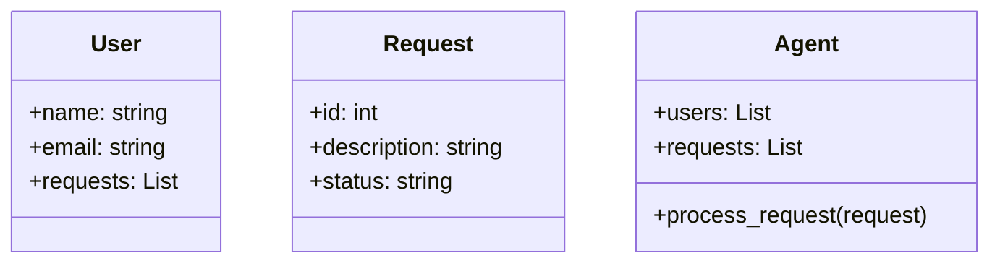
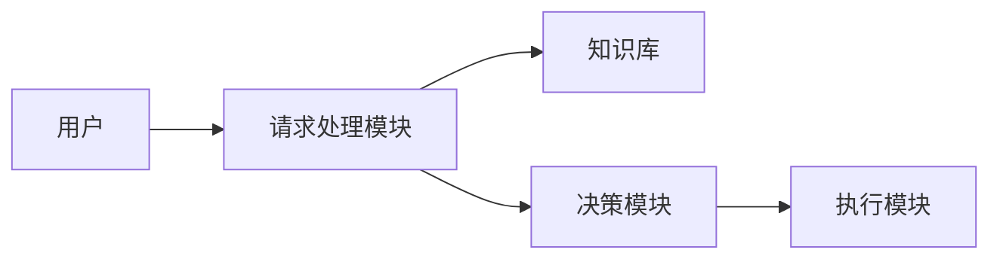
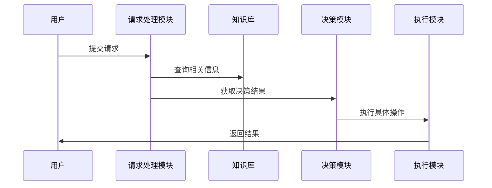

                 


# 设计可扩展的AI Agent架构

---

## 关键词  
可扩展AI Agent、AI架构设计、系统扩展性、模块化设计、算法原理

---

## 摘要  
随着人工智能技术的快速发展，AI Agent（智能代理）在各个领域的应用越来越广泛。然而，AI Agent的设计需要考虑系统的可扩展性，以应对日益复杂和多样化的应用场景。本文从AI Agent的基本概念出发，详细探讨了可扩展AI Agent的核心概念、算法原理、系统架构设计以及项目实战。通过对比分析和实际案例，本文为读者提供了一套系统化的设计方法，帮助他们在实际应用中构建高效、灵活且可扩展的AI Agent架构。

---

## 第1章 AI Agent与可扩展性概述

### 1.1 AI Agent的基本概念  
AI Agent是一种能够感知环境、自主决策并执行任务的智能实体。它能够通过传感器获取信息，利用算法进行推理和决策，并通过执行器与环境交互。AI Agent的核心特征包括自主性、反应性、目标导向性和社会性。

### 1.2 AI Agent的应用场景  
AI Agent广泛应用于多个领域：  
- **智能助手**：如Siri、Alexa等，为用户提供信息查询、任务管理等服务。  
- **企业级应用**：如自动化运维、智能客服等，帮助企业在复杂环境中高效运作。  
- **智能交通**：如自动驾驶汽车中的路径规划和决策系统。  

可扩展性是AI Agent设计中的关键因素，特别是在企业级应用中，系统需要能够灵活扩展以应对业务增长和技术进步。

### 1.3 可扩展性设计的必要性  
可扩展性设计的核心目标是确保AI Agent在功能扩展、数据量增长和环境变化时，系统性能和稳定性不受显著影响。这需要在架构设计阶段充分考虑模块化、松耦合和高扩展性的原则。

---

## 第2章 可扩展AI Agent的核心概念与联系

### 2.1 核心概念原理  
AI Agent的架构通常分为三层：  
- **感知层**：负责数据的采集和初步处理，如传感器数据解析。  
- **决策层**：基于感知层的数据进行推理和决策，如路径规划。  
- **执行层**：根据决策层的指令执行具体操作，如驱动机器人运动。  

### 2.2 核心概念对比分析  
以下对比了不同AI Agent架构的特点：  

| 架构类型       | 优点                               | 缺点                               |
|----------------|------------------------------------|------------------------------------|
| 单体架构       | 简单易懂                           | 扩展性差                           |
| 分层架构       | 明确的职责划分                     | 层间耦合较高                       |
| 微服务架构     | 高度可扩展                        | 需要复杂的编排和通信机制           |

### 2.3 实体关系图（ER图）  
以下是AI Agent架构的实体关系图：  


---

## 第3章 可扩展AI Agent的算法原理

### 3.1 算法原理概述  
- **Dijkstra算法**：用于单源最短路径问题，适用于静态环境下的路径规划。  
- **A*算法**：结合启发式搜索，适用于动态环境下的路径优化。  

### 3.2 算法实现与代码示例  
以下是Dijkstra算法的Python实现：  
```python
import heapq

def dijkstra(graph, start, end):
    distances = {node: float('infinity') for node in graph}
    distances[start] = 0
    heap = [(0, start)]
    
    while heap:
        current_dist, current_node = heapq.heappop(heap)
        if current_dist > distances[current_node]:
            continue
        if current_node == end:
            break
        for neighbor, weight in graph[current_node].items():
            if distances[neighbor] > current_dist + weight:
                distances[neighbor] = current_dist + weight
                heapq.heappush(heap, (distances[neighbor], neighbor))
    return distances[end]
```

---

## 第4章 系统分析与架构设计方案

### 4.1 问题场景介绍  
假设我们需要设计一个智能客服系统，该系统需要处理大量的用户请求，并能够根据用户需求动态扩展资源。

### 4.2 系统功能设计  
- **领域模型类图**：展示了系统的模块划分。  


- **系统架构图**：展示了系统的整体架构。  


### 4.3 系统交互设计  
以下是系统的交互流程图：  


---

## 第5章 项目实战

### 5.1 环境安装  
- 需要安装Python 3.8及以上版本。  
- 安装依赖：`pip install mermaid-py`。

### 5.2 核心代码实现  
以下是AI Agent的核心代码实现：  
```python
class Agent:
    def __init__(self):
        self.components = {}

    def add_component(self, name, component):
        self.components[name] = component

    def execute(self):
        for component in self.components.values():
            component.run()
```

### 5.3 案例分析与解读  
通过上述代码，我们可以看到AI Agent的模块化设计，每个组件独立运行，且通过主代理进行协调。

### 5.4 项目小结  
本项目展示了如何通过模块化设计实现一个可扩展的AI Agent架构，能够根据需求动态添加或移除组件。

---

## 第6章 总结与展望

### 6.1 全文总结  
本文从AI Agent的基本概念出发，详细探讨了可扩展AI Agent的核心概念、算法原理、系统架构设计以及项目实战。通过实际案例，展示了如何在实际应用中构建高效、灵活且可扩展的AI Agent架构。

### 6.2 未来展望  
随着AI技术的不断发展，AI Agent的可扩展性设计将更加重要。未来的研究方向包括更高效的算法优化、更灵活的架构设计以及更智能的自适应机制。

### 6.3 最佳实践 Tips  
- 在设计AI Agent时，优先考虑模块化和松耦合设计。  
- 定期进行性能测试，确保系统的可扩展性。  

---

## 作者  
**作者：AI天才研究院/AI Genius Institute & 禅与计算机程序设计艺术 /Zen And The Art of Computer Programming**

