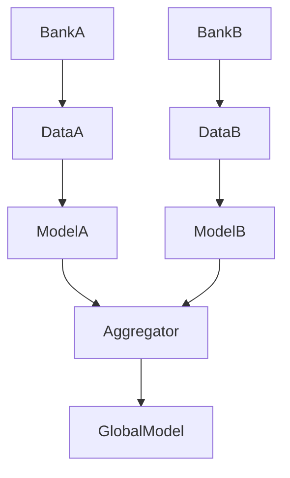
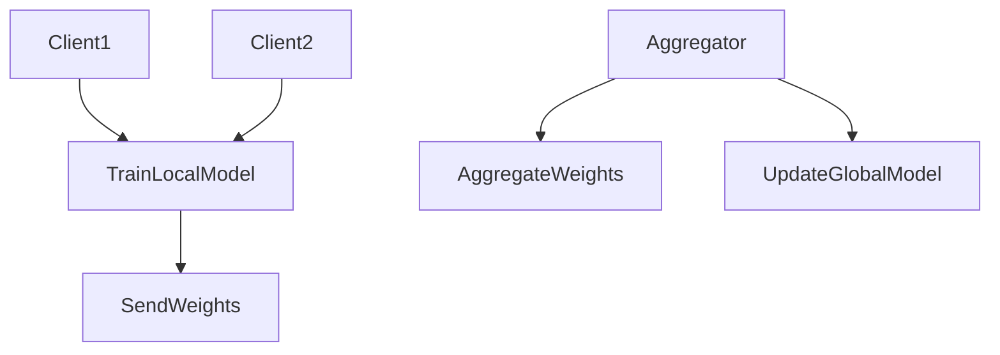
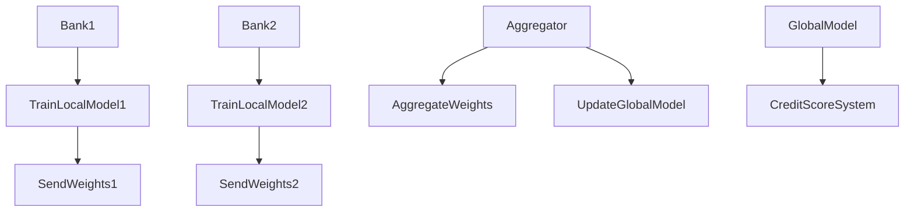
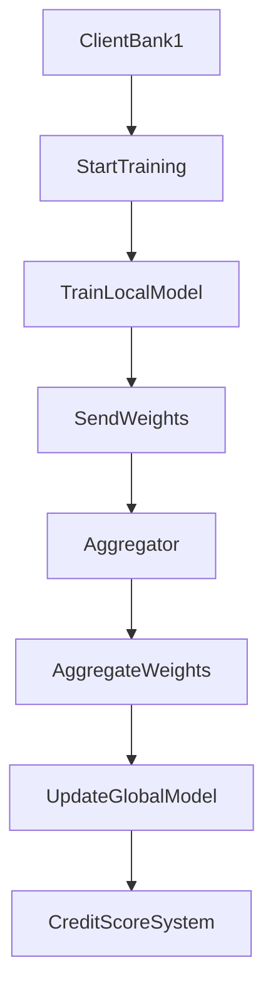

                 


# 设计基于联邦学习的跨银行信用评分系统

> 关键词：联邦学习，跨银行，信用评分，数据隐私，机器学习

> 摘要：本文将探讨如何设计基于联邦学习的跨银行信用评分系统。通过分析跨银行信用评分系统的核心问题和挑战，介绍联邦学习的基本原理及其在信用评分中的应用，结合实际案例，详细讲解系统架构设计、算法实现和项目实战，最终提供最佳实践和未来展望。

---

# 第一部分: 背景介绍

# 第1章: 跨銀行信用評分系統的背景與挑戰

## 1.1 信用評分系統的基本概念

### 1.1.1 信用評分的定義
信用評分是銀行或其他金融機構用於評估個人或企業信用狀況的重要工具。它是基於借款人的歷史信貸記錄、收入水平、債務負擔等多個因素，通過數學模型計算得出的一個數值，用以表徵借款人的信用風險。

### 1.1.2 信用評分的重要性
信用評分在金融行業中具有至關重要的地位，它直接影響貸款授信额度、貸款利率等信貸條件。一個高分的信用評分通常意味著借款人的信用風險較低，銀行願意提供更優惠的信貸條件；反之，信用評分低的借款人在申請貸款時可能面臨更嚴苛的條件或直接被拒貸。

### 1.1.3 跨銀行信用評分的必要性
 traditional credit scoring systems operate within a single bank, which limits the amount of data available for building robust models. 跨銀行信用評分系統能夠整合多家銀行的數據，提供更全面的信用評價，幫助銀行更好地評估客戶的信用風險。

## 1.2 联邦学习的基本概念

### 1.2.1 联邦学习的定义
聯邦學習（Federated Learning, FL）是一種分布式機器學習技術，允許在多個分散的數據源上聯合訓練模型，而不必將數據集中到一個地方。數據保持在原始位置，模型更新信息在設備之間傳播，這樣可以有效保護數據隱私。

### 1.2.2 联邦学习的核心优势
- **數據隱私保護**：數據不需要集中到一處，每個參與方只分享模型更新信息，而不是原始數據。
- **數據多樣性**：聯邦學習能夠利用多方數據源的數據多樣性，提高模型的泛化能力。
- **成本降低**：不需要將大量數據遷移或存儲在一個中心位置，降低了數據傳輸和存儲成本。

### 1.2.3 联邦学习的適用場景
- **數據分散**：數據分布在不同的設備或服務器上，無法集中。
- **數據隱私保護**：需要在數據不出戶的情況下完成模型訓練。
- **邊緣計算**：在邊緣設備上進行模型訓練，然後聚合模型更新。

## 1.3 跨銀行信用評分系統的問題背景

### 1.3.1 資料孤島問題
銀行之間的數據孤島現象嚴重，數據無法有效共享，限制了信用評分模型的准準性和魯棒性。

### 1.3.2 資訊隱私保護
銀行數據屬於敏感信息，直接共享會帶來隱私泄露風險，必須在數據不出戶的情況下完成模型訓練。

### 1.3.3 跨銀行數據整合的挑戰
跨銀行數據整合需要解決數據格式、模型兼容性等多方面問題，並且需要符合相關的金融監管規範。

## 1.4 联邦學習在信用評分中的應用前景

### 1.4.1 聯邦學習解決跨銀行數據共享的可行性
聯邦學習可以在不共享原始數據的情況下，聯合訓練信用評分模型，保護數據隱私。

### 1.4.2 联邦學習在信用評分中的潛在價值
- **提高模型性能**：利用多家銀行的數據，模型可以學習更多樣化的特征，提升信用評分的准確性。
- **降低成本**：銀行不需要將數據遷移到一個中心位置，降低了數據傳輸和存儲成本。
- **促進金融創新**：聯邦學習技術可以推動金融行業的數據共享和模型共建，促進金融創新。

### 1.4.3 联邦學習應用的未來發展
隨著數據隱私保護需求的增加，聯邦學習在金融行業，特別是信用評分領域的應用將進一步普及。未來，聯邦學習技術將與區塊鏈、隱私計算等技術結合，進一步提升數據共享的安全性。

---

# 第二部分: 核心概念與聯繫

# 第2章: 联邦学习的核心原理

## 2.1 联邦学习的基本原理

### 2.1.1 联邦学习的數據分佈特性
在聯邦學習中，數據分布在多個不同的設備或服務器上，每個設備只保存自己的數據副本。模型訓練時，設備在本地訓練模型，然後將模型更新信息傳輸到中央聚合器，聚合器將所有設備的模型更新聚合起來，形成全局模型。

### 2.1.2 联邦学习的模型更新機制
聯邦學習的模型更新通常使用**模型平均**（Model Aggregation）的方法。每個設備在本地訓練模型後，將模型權重上傳到中央聚合器，聚合器將所有設備的模型權重進行平均，得到新的全局模型。

### 2.1.3 联邦学习的隱私保護特性
聯邦學習通過避免傳輸原始數據，只傳輸模型更新信息，保護了數據隱私。此外，還可以結合加密技術（如同態加密）進一步提升數據的安全性。

## 2.2 联邦学习的數據特征

### 2.2.1 資料分佈的多樣性
數據分布在不同的設備或銀行，數據的分佈可能具有多樣性，例如信貸記錄、收入水平等特征在不同銀行中可能存在差異。

### 2.2.2 資料隱私的保護要求
數據必須在本地進行處理，確保數據不出戶，避免隱私泄露風險。

### 2.2.3 資料同步與異步更新
聯邦學習可以支持同步和異步更新模式。同步更新中，所有設備同時訓練模型並更新；異步更新中，設備可以在不同時間點訓練模型並更新，提高訓練效率。

## 2.3 联邦学习的算法特征

### 2.3.1 联邦平均（FedAvg）算法
FedAvg是最常用的聯邦學習算法之一。其核心思想是每個設備在本地訓練模型後，將模型權重上傳到中央聚合器，聚合器將所有設備的模型權重進行平均，得到新的全局模型。

### 2.3.2 联邦直推（FedProx）算法
FedProx是一種改進的聯邦學習算法，引入了正則化項，用於防止模型更新時的更新衝突，提升模型的穩定性。

### 2.3.3 联邦學習的模型聚合策略
模型聚合策略包括模型平均、加權平均等。根據設備數據量的大小，可以對設備的模型更新進行加權，確保數據量大的設備對模型更新的影響更大。

## 2.4 联邦学习的ER實體關係圖



## 2.5 联邦学习的算法流程



---

# 第三部分: 算法原理與數學模型

# 第3章: 联邦學習的算法原理

## 3.1 联邦平均（FedAvg）算法

### 3.1.1 算法的基本思想
FedAvg算法的基本思想是將模型分佈在多個設備上，每個設備在本地數據上訓練模型，然後將模型權重上傳到中央聚合器。聚合器將所有設備的模型權重進行平均，得到新的全局模型。

### 3.1.2 算法的數學模型
FedAvg算法的數學模型可以表示為：

$$
w_{t+1} = \frac{1}{n}\sum_{i=1}^{n}(w_{t}^{(i)} + \eta \Delta w_{t}^{(i)})
$$

其中，$w_{t}$ 是全局模型權重，$w_{t}^{(i)}$ 是設備 $i$ 的本地模型權重，$\Delta w_{t}^{(i)}$ 是設備 $i$ 的模型更新，$\eta$ 是學習率，$n$ 是設備數量。

## 3.2 联邦直推（FedProx）算法

### 3.2.1 算法的基本思想
FedProx算法在FedAvg的基礎上引入了正則化項，用於防止模型更新時的更新衝突。其數學模型如下：

$$
L_i(w) = \frac{1}{n_i}\sum_{i=1}^{n_i} \left( L_i(w) + \lambda \|w - w_{t}^{(i)}\|^2 \right)
$$

其中，$\lambda$ 是正則化係數，$w_{t}^{(i)}$ 是設備 $i$ 的本地模型權重。

---

# 第四部分: 系統分析與架構設計

# 第4章: 跨銀行信用評分系統的架構設計

## 4.1 系統背景與目標
跨銀行信用評分系統旨在整合多家銀行的信貸數據，利用聯邦學習技術，在數據不出戶的情況下訓練.credit score model，提升信用評分的准確性和魯棒性。

## 4.2 系統功能設計

### 4.2.1 資料預處理
- **數據清洗**：去除噪聲數據，補充缺失值。
- **數據轉換**：將原始數據轉換為模型訓練所需的格式。

### 4.2.2 模型訓練
- **本地訓練**：在每個銀行本地訓練.credit score model。
- **模型聚合**：將所有銀行的模型更新信息聚合，形成全局模型。

### 4.2.3 模型評估
- **模型性能評價**：評估全局模型的准確性、召回率等指標。
- **模型更新**：根據評估結果，對模型進行優化和更新。

## 4.3 系統架構設計

### 4.3.1 系統架構圖



### 4.3.2 系統接口設計
- **模型訓練接口**：接收銀行的模型更新信息。
- **模型聚合接口**：將所有銀行的模型更新信息聚合，形成全局模型。
- **模型評估接口**：評估全局模型的性能，並反饋給銀行。

## 4.4 系統交互流程



---

# 第五部分: 項目實戰

# 第5章: 跨銀行信用評分系統的實戰

## 5.1 環境安裝

```python
# 安裝必要的庫
pip install numpy
pip install pandas
pip install scikit-learn
pip install tensorflow
```

## 5.2 系統核心實現

### 5.2.1 資料預處理

```python
import pandas as pd

# 加載數據
data = pd.read_csv('credit_data.csv')

# 資料清洗
data.dropna(inplace=True)
data['income'] = data['income'].fillna(data['income'].mean())

# 資料轉換
data['income'] = data['income'].apply(lambda x: 1 if x > 50000 else 0)
```

### 5.2.2 模型訓練

```python
import tensorflow as tf
from tensorflow.keras import layers

# 定義模型
model = tf.keras.Sequential([
    layers.Dense(64, activation='relu'),
    layers.Dense(1, activation='sigmoid')
])

# 編譯模型
model.compile(optimizer='adam', loss='binary_crossentropy', metrics=['accuracy'])

# 訓練模型
model.fit(x_train, y_train, epochs=10, batch_size=32)
```

### 5.2.3 模型聚合

```python
# 獲取設備模型權重
weights = [model1.get_weights(), model2.get_weights()]

# 計算模型權重平均值
avg_weights = []
for i in range(len(weights[0])):
    avg_weights.append(sum([w[i] for w in weights]) / len(weights))

# 更新全局模型
global_model.set_weights(avg_weights)
```

## 5.3 項目小結
本章介紹了跨銀行信用評分系統的實戰實現，包括環境安裝、數據預處理、模型訓練和模型聚合等步驟。通過實際案例，展示了如何在數據不出戶的情況下，利用聯邦學習技術訓練信用評分模型。

---

# 第六部分: 最佳實踐

# 第6章: 聯邦學習的最佳實踐

## 6.1 小結
聯邦學習在跨銀行信用評分系統中的應用具有重要的現實意義。通過聯邦學習技術，可以在不共享原始數據的情況下，聯合訓練信用評分模型，提升模型的准確性和魯棒性。

## 6.2 注意事项
- **數據隱私保護**：必須確保數據不出戶，避免隱私泄露風險。
- **模型更新同步**：需要合理設計模型更新策略，確保模型聚合的效率和准確性。
- **模型性能評估**：需要定期評估模型性能，根據實際需求進行模型優化。

## 6.3 未來展望
隨著數據隱私保護需求的增加，聯邦學習在金融行業的應用將進一步普及。未來，聯邦學習將與區塊鏈、隱私計算等技術結合，進一步提升數據共享的安全性和效率。

---

# 作者

作者：AI天才研究院/AI Genius Institute & 禅與计算机程序设计艺术 /Zen And The Art of Computer Programming

