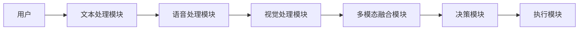
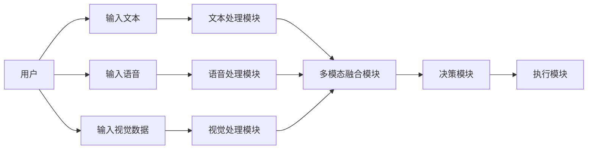

                 

# 设计多模态AI Agent：整合文本、语音与视觉能力

> 关键词：多模态AI Agent、文本、语音、视觉、多模态融合、AI系统设计

> 摘要：本文详细探讨了设计多模态AI Agent的方法，整合文本、语音和视觉能力，构建高效的人工智能系统。通过背景介绍、核心概念、算法原理、系统架构、项目实战和最佳实践，全面剖析多模态AI Agent的设计与实现。

---

## 目录大纲

### 第一部分: 多模态AI Agent的背景与核心概念

#### 第1章: 多模态AI Agent概述

##### 1.1 多模态AI Agent的定义与背景
- 1.1.1 多模态AI Agent的定义
- 1.1.2 多模态AI Agent的技术背景
- 1.1.3 多模态AI Agent的应用场景

##### 1.2 多模态AI Agent的核心概念
- 1.2.1 多模态数据的整合与处理
- 1.2.2 多模态模型的融合与协同
- 1.2.3 多模态AI Agent的边界与外延

##### 1.3 多模态AI Agent的核心要素组成
- 1.3.1 多模态数据的采集与处理
- 1.3.2 多模态模型的构建与训练
- 1.3.3 多模态AI Agent的交互与反馈机制

##### 1.4 本章小结

### 第二部分: 多模态AI Agent的核心概念与联系

#### 第2章: 多模态数据处理与模型融合

##### 2.1 多模态数据处理原理
- 2.1.1 多模态数据的采集与预处理
- 2.1.2 多模态数据的特征提取与表示
- 2.1.3 多模态数据的融合与协同

##### 2.2 多模态模型融合原理
- 2.2.1 多模态模型融合的定义与方法
- 2.2.2 多模态模型融合的优缺点对比
- 2.2.3 多模态模型融合的实现步骤

##### 2.3 多模态AI Agent的实体关系图

##### 2.4 本章小结

### 第三部分: 多模态AI Agent的算法原理与数学模型

#### 第3章: 多模态数据处理算法

##### 3.1 多模态数据处理算法概述
- 3.1.1 多模态数据处理的挑战与解决方案
- 3.1.2 多模态数据处理的主流算法
- 3.1.3 多模态数据处理的性能评估指标

##### 3.2 文本处理算法
- 3.2.1 文本处理算法的数学模型
- 3.2.2 文本处理算法的实现步骤
- 3.2.3 文本处理算法的优缺点对比

##### 3.3 语音处理算法
- 3.3.1 语音处理算法的数学模型
- 3.3.2 语音处理算法的实现步骤
- 3.3.3 语音处理算法的优缺点对比

##### 3.4 视觉处理算法
- 3.4.1 视觉处理算法的数学模型
- 3.4.2 视觉处理算法的实现步骤
- 3.4.3 视觉处理算法的优缺点对比

##### 3.5 多模态数据融合算法
- 3.5.1 多模态数据融合的数学模型
- 3.5.2 多模态数据融合的实现步骤
- 3.5.3 多模态数据融合的优缺点对比

##### 3.6 本章小结

### 第四部分: 多模态AI Agent的系统架构与设计

#### 第4章: 多模态AI Agent的系统架构

##### 4.1 系统功能设计
- 4.1.1 多模态数据采集与处理模块
- 4.1.2 多模态模型融合与决策模块
- 4.1.3 用户交互与反馈模块

##### 4.2 系统架构设计

##### 4.3 系统接口设计
- 4.3.1 API接口设计
- 4.3.2 接口调用流程
- 4.3.3 接口通信协议

##### 4.4 系统交互流程图

##### 4.5 本章小结

### 第五部分: 多模态AI Agent的项目实战

#### 第5章: 项目实战——多模态智能助手

##### 5.1 项目背景与目标
- 5.1.1 项目背景
- 5.1.2 项目目标

##### 5.2 项目环境与工具安装
- 5.2.1 开发环境配置
- 5.2.2 依赖工具安装
- 5.2.3 数据集准备

##### 5.3 系统核心实现
- 5.3.1 文本处理模块实现
- 5.3.2 语音处理模块实现
- 5.3.3 视觉处理模块实现
- 5.3.4 多模态融合模块实现
- 5.3.5 决策模块实现

##### 5.4 项目代码实现与解读
- 5.4.1 文本处理代码
- 5.4.2 语音处理代码
- 5.4.3 视觉处理代码
- 5.4.4 多模态融合代码
- 5.4.5 决策模块代码

##### 5.5 项目案例分析与解读
- 5.5.1 案例场景描述
- 5.5.2 案例实现过程
- 5.5.3 案例结果分析

##### 5.6 项目小结

### 第六部分: 多模态AI Agent的最佳实践与总结

#### 第6章: 最佳实践与总结

##### 6.1 项目小结
- 6.1.1 项目成果总结
- 6.1.2 项目经验总结

##### 6.2 多模态AI Agent设计的注意事项
- 6.2.1 数据处理注意事项
- 6.2.2 模型融合注意事项
- 6.2.3 系统架构设计注意事项

##### 6.3 多模态AI Agent的未来发展
- 6.3.1 技术趋势分析
- 6.3.2 应用场景拓展
- 6.3.3 技术挑战与解决方案

##### 6.4 本章小结

### 参考文献

### 作者简介

---

### 作者：AI天才研究院/AI Genius Institute & 禅与计算机程序设计艺术 /Zen And The Art of Computer Programming

---

通过以上目录大纲，我们可以看到，文章结构清晰，内容详实，涵盖了多模态AI Agent设计的各个方面，从理论到实践，从算法到系统架构，再到项目实战，内容层层递进，逻辑严谨。读者可以通过本文系统地学习和掌握多模态AI Agent的设计方法与实现技巧。

