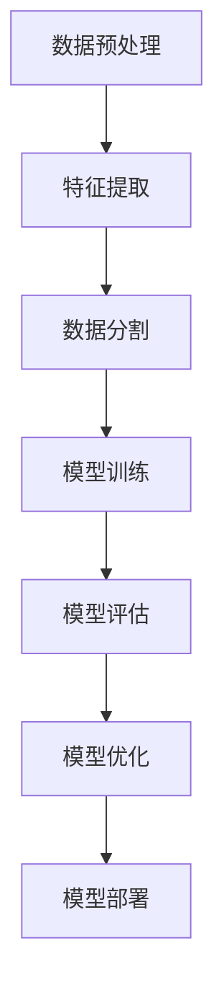
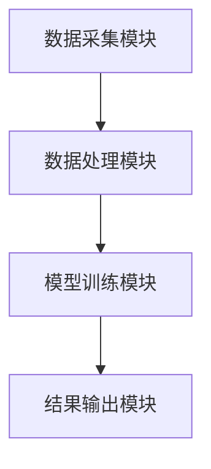
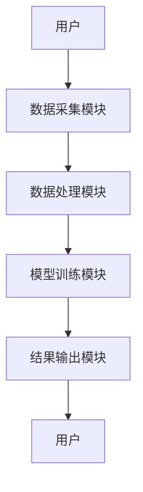

                 


# 设计智能化的个人信用评估系统

> 关键词：个人信用评估系统、人工智能、大数据、机器学习、系统架构设计、Python实现

> 摘要：本文详细介绍了如何利用人工智能和大数据技术设计一个智能化的个人信用评估系统。文章从系统背景、核心概念、算法原理、系统架构设计、项目实战到最佳实践，全面解析了智能化信用评估系统的构建过程，为读者提供了一个从理论到实践的完整指南。

---

# 第一部分：智能化个人信用评估系统背景与核心概念

# 第1章：智能化个人信用评估系统背景介绍

## 1.1 个人信用评估的定义与意义

### 1.1.1 个人信用评估的基本概念
个人信用评估是指通过分析个人的财务状况、行为记录和社会关系等多方面信息，对其信用状况进行量化评估的过程。信用评估的结果通常用于金融贷款、信用卡审批、信用评分等领域，帮助机构判断个人的信用风险。

### 1.1.2 信用评估的重要性与应用场景
信用评估在金融行业中具有重要的意义。它不仅帮助金融机构降低风险，还能提高审批效率，降低运营成本。常见的应用场景包括个人贷款审批、信用卡额度确定、赊购信用额度评估等。

### 1.1.3 智能化信用评估的优势与必要性
传统的信用评估方法依赖于人工审核和简单的统计分析，存在效率低、成本高、主观性强等问题。随着人工智能和大数据技术的发展，智能化信用评估系统能够通过自动化数据处理、机器学习模型和实时数据分析，显著提高评估的准确性和效率，降低人为错误和成本。

---

## 1.2 传统信用评估的局限性

### 1.2.1 传统信用评估的主要方法
传统信用评估主要依赖以下几种方法：
1. **信用评分卡模型**：通过标准化的评分卡对申请者进行评分，评分结果决定信用额度和审批结果。
2. **人工审核**：通过人工审查申请者的财务报表、信用报告等信息，评估其信用风险。
3. **经验判断**：基于信贷经理的经验进行主观判断。

### 1.2.2 传统方法的不足与挑战
- **效率低**：人工审核耗时长，难以应对大量申请。
- **主观性强**：人为判断容易受到主观因素影响，存在较高的道德风险。
- **数据维度有限**：传统方法通常只考虑有限的财务数据，忽略了非结构化数据（如社交媒体行为、消费记录等）的价值。
- **难以实时评估**：传统方法难以快速响应实时信用变化。

### 1.2.3 智能化技术如何解决这些问题
人工智能和大数据技术可以通过以下方式解决传统信用评估的局限性：
- **自动化数据处理**：利用爬虫、API接口等方式自动收集和处理多源数据。
- **机器学习模型**：通过训练机器学习模型（如逻辑回归、随机森林、神经网络等）对信用风险进行预测和评估。
- **实时数据分析**：通过流数据处理技术实时监控信用变化，提供动态信用评估结果。

---

## 1.3 人工智能与大数据在信用评估中的应用前景

### 1.3.1 人工智能技术在信用评估中的潜力
人工智能技术（如机器学习、自然语言处理、计算机视觉等）能够从海量数据中提取有价值的信息，发现传统方法难以察觉的信用风险。例如：
- **自然语言处理**：分析社交媒体文本，评估申请者的信用风险。
- **计算机视觉**：通过分析申请者提供的图像数据（如营业执照、身份证明等）验证其真实性。

### 1.3.2 大数据分析在信用评估中的作用
大数据分析能够处理海量的结构化和非结构化数据，提供更全面的信用评估依据。例如：
- **结构化数据**：分析银行流水、税务记录等数据。
- **非结构化数据**：分析社交媒体、新闻报道等文本数据。

### 1.3.3 结合AI与大数据的智能化信用评估系统
智能化信用评估系统通过结合人工智能和大数据技术，能够实现以下功能：
1. **自动化数据采集**：从多源数据中自动采集和处理信用相关信息。
2. **智能风险评估**：利用机器学习模型对信用风险进行预测和评估。
3. **实时监控与反馈**：实时跟踪申请者的信用变化，提供动态评估结果。

---

## 1.4 本章小结

### 1.4.1 智能化信用评估系统的背景总结
智能化信用评估系统是传统信用评估方法的升级版，它利用人工智能和大数据技术克服了传统方法的局限性。

### 1.4.2 传统方法与智能化方法的对比
通过对比传统方法与智能化方法，可以看出智能化信用评估系统在效率、准确性和实时性方面具有显著优势。

### 1.4.3 未来信用评估的发展方向
未来，信用评估将更加依赖人工智能和大数据技术，信用评估系统将更加智能化、自动化和实时化。

---

# 第2章：智能化个人信用评估系统的核心概念

## 2.1 智能化信用评估系统的定义与特点

### 2.1.1 系统的定义
智能化信用评估系统是一种基于人工智能和大数据技术，通过自动化数据处理和机器学习模型对个人信用进行评估的系统。它能够实时采集、分析和预测信用风险，提供高精度的信用评估结果。

### 2.1.2 系统的核心特点
1. **自动化数据处理**：系统能够自动采集和处理多源数据，减少人工干预。
2. **智能风险评估**：通过机器学习模型对信用风险进行预测和评估，提高评估的准确性和效率。
3. **实时性**：系统能够实时监控信用变化，提供动态评估结果。
4. **可扩展性**：系统能够处理海量数据，适用于大规模信用评估需求。

---

### 2.1.3 系统与传统信用评估系统的区别
| 特性               | 传统信用评估系统       | 智能化信用评估系统       |
|--------------------|-----------------------|-------------------------|
| 数据来源           | 有限的结构化数据       | 多源数据（结构化+非结构化） |
| 数据处理方式       | 人工处理               | 自动化处理               |
| 评估方法           | 统计分析和人工判断       | 机器学习模型预测         |
| 评估效率           | 较低                   | 较高                     |
| 评估准确性         | 受主观因素影响较大     | 更高                     |

---

## 2.2 系统的核心要素与组成

### 2.2.1 数据来源与处理
系统可以从以下来源采集数据：
1. **银行流水**：分析申请者的收入、支出情况。
2. **信用报告**：获取申请者的信用历史。
3. **社交媒体**：分析申请者在社交媒体上的行为和言论。
4. **税务记录**：获取申请者的税务信息。

### 2.2.2 模型构建与训练
系统需要构建机器学习模型对信用风险进行预测。常用的模型包括：
1. **逻辑回归**：用于分类问题，预测信用风险。
2. **随机森林**：用于特征重要性分析和分类。
3. **神经网络**：用于复杂非线性关系的建模。

### 2.2.3 结果输出与反馈机制
系统输出信用评估结果，并根据实时信用变化进行动态调整。同时，系统会根据评估结果提供反馈建议，帮助金融机构做出决策。

---

## 2.3 系统的边界与外延

### 2.3.1 系统的边界定义
智能化信用评估系统的边界包括：
1. **输入边界**：数据来源和接口。
2. **输出边界**：信用评估结果和反馈建议。
3. **交互边界**：与金融机构的交互接口。

### 2.3.2 系统的外延与扩展可能性
智能化信用评估系统可以扩展到以下领域：
1. **信用评分动态调整**：根据实时数据动态调整信用评分。
2. **信用风险预警**：实时监控信用变化，预警潜在风险。
3. **信用行为分析**：分析信用行为，提供个性化信用管理建议。

### 2.3.3 系统与其他系统的接口关系
系统需要与以下系统进行交互：
1. **金融机构系统**：获取申请者的信用信息。
2. **数据源系统**：采集多源数据。
3. **用户终端**：向用户输出信用评估结果。

---

## 2.4 本章小结

### 2.4.1 核心概念的总结
智能化信用评估系统是一种基于人工智能和大数据技术的自动化信用评估系统，能够提高评估效率和准确性。

### 2.4.2 系统组成要素的分析
系统的核心要素包括数据来源、模型构建和结果输出，每个部分都具有重要作用。

### 2.4.3 系统边界与外延的明确
系统的边界和外延需要清晰定义，以确保系统的可扩展性和可维护性。

---

# 第3章：智能化个人信用评估系统的算法原理

## 3.1 算法原理概述

### 3.1.1 算法的基本原理
智能化信用评估系统的核心算法是机器学习模型，用于对信用风险进行分类和预测。常用的算法包括逻辑回归、随机森林和神经网络。

---

### 3.1.2 算法的核心思想
算法的核心思想是通过训练数据，构建一个能够预测信用风险的模型。模型通过学习数据中的特征和标签之间的关系，对新数据进行预测。

---

### 3.1.3 算法的适用场景
算法适用于以下场景：
1. **信用风险预测**：预测申请者的信用违约概率。
2. **信用评分**：根据模型预测结果生成信用评分。
3. **信用行为分析**：分析申请者的信用行为特征。

---

## 3.2 算法流程图

以下是一个典型的机器学习算法流程图：



---

## 3.3 算法的数学模型与公式

### 3.3.1 线性回归模型
线性回归模型用于预测连续型变量，其数学公式为：

$$ y = \beta_0 + \beta_1x_1 + \beta_2x_2 + \ldots + \beta_nx_n + \epsilon $$

其中，$y$ 是预测目标，$x_i$ 是特征变量，$\beta_i$ 是回归系数，$\epsilon$ 是误差项。

---

### 3.3.2 随机森林模型
随机森林模型是一种基于决策树的集成学习算法，其数学模型较为复杂，通常用于分类和回归问题。

---

### 3.3.3 神经网络模型
神经网络模型是一种深度学习算法，其数学模型包括输入层、隐藏层和输出层，通常使用反向传播算法进行训练。

---

## 3.4 算法实现的Python代码示例

### 3.4.1 数据加载与预处理
以下是一个使用Python加载和预处理数据的示例代码：

```python
import pandas as pd
from sklearn.model_selection import train_test_split
from sklearn.preprocessing import StandardScaler

# 加载数据
data = pd.read_csv('credit_data.csv')

# 数据分割
X = data.drop('target', axis=1)
y = data['target']

# 数据标准化
scaler = StandardScaler()
X_scaled = scaler.fit_transform(X)

# 分割训练集和测试集
X_train, X_test, y_train, y_test = train_test_split(X_scaled, y, test_size=0.2, random_state=42)
```

---

### 3.4.2 模型训练
以下是一个使用逻辑回归模型进行训练的示例代码：

```python
from sklearn.linear_model import LogisticRegression

# 初始化模型
model = LogisticRegression()

# 训练模型
model.fit(X_train, y_train)

# 预测结果
y_pred = model.predict(X_test)
```

---

## 3.5 本章小结

### 3.5.1 算法原理的总结
智能化信用评估系统的核心算法是机器学习模型，通过训练数据学习特征与标签之间的关系，实现信用风险的预测和分类。

### 3.5.2 数学模型与公式的应用
不同的算法具有不同的数学模型，选择合适的算法需要根据数据特点和业务需求进行。

### 3.5.3 算法实现的步骤与注意事项
算法实现的步骤包括数据预处理、特征提取、模型训练和模型评估等，每一步都需要仔细设计和实现。

---

# 第4章：智能化个人信用评估系统的系统架构设计

## 4.1 系统架构概述

### 4.1.1 系统架构的目标
系统架构的目标是实现一个高效、可靠、可扩展的智能化信用评估系统，能够支持大规模数据处理和实时信用评估。

---

### 4.1.2 系统架构的组成部分
1. **数据采集模块**：负责从多源数据中采集信用相关信息。
2. **数据处理模块**：对采集的数据进行清洗、转换和标准化处理。
3. **模型训练模块**：基于处理后的数据训练机器学习模型。
4. **结果输出模块**：根据模型预测结果输出信用评估报告。

---

## 4.2 系统功能设计

### 4.2.1 数据采集模块
数据采集模块可以通过以下方式获取数据：
1. **API接口**：通过API接口从金融机构获取信用报告。
2. **爬虫技术**：从社交媒体、新闻网站等渠道采集非结构化数据。

---

### 4.2.2 数据处理模块
数据处理模块负责对采集的数据进行清洗、转换和标准化处理，确保数据质量和一致性。

---

### 4.2.3 模型训练模块
模型训练模块基于处理后的数据训练机器学习模型，并对模型进行评估和优化。

---

### 4.2.4 结果输出模块
结果输出模块根据模型预测结果生成信用评估报告，并将结果输出给金融机构或其他用户。

---

## 4.3 系统架构图

以下是一个典型的智能化信用评估系统的架构图：



---

## 4.4 系统接口设计

### 4.4.1 系统接口的定义
系统接口定义了系统与其他系统的交互方式，包括数据输入和输出接口。

---

### 4.4.2 接口的实现方式
系统接口可以通过API接口或文件接口实现数据交互。

---

## 4.5 系统交互序列图

以下是一个典型的系统交互序列图：



---

## 4.6 本章小结

### 4.6.1 系统架构设计的目标
系统架构设计的目标是实现一个高效、可靠、可扩展的智能化信用评估系统。

### 4.6.2 系统功能设计的模块划分
系统功能设计包括数据采集模块、数据处理模块、模型训练模块和结果输出模块，每个模块都具有特定的功能。

### 4.6.3 系统架构图的解读
系统架构图展示了系统各模块之间的关系和数据流，有助于理解系统的整体结构和工作流程。

---

# 第5章：智能化个人信用评估系统的项目实战

## 5.1 项目环境安装

### 5.1.1 安装Python环境
建议使用Anaconda或Miniconda安装Python环境。

```bash
conda create -n credit_assessment python=3.8
conda activate credit_assessment
```

---

### 5.1.2 安装依赖库
安装所需的Python库，如Pandas、Scikit-learn、XGBoost等。

```bash
pip install pandas scikit-learn xgboost
```

---

## 5.2 系统核心实现源代码

### 5.2.1 数据预处理代码
```python
import pandas as pd
import numpy as np
from sklearn.model_selection import train_test_split
from sklearn.preprocessing import StandardScaler

# 加载数据
data = pd.read_csv('credit_data.csv')

# 数据清洗
data = data.dropna()
data = data.replace([np.inf, -np.inf], np.nan).dropna()

# 特征选择
X = data.drop('target', axis=1)
y = data['target']

# 数据标准化
scaler = StandardScaler()
X_scaled = scaler.fit_transform(X)

# 分割训练集和测试集
X_train, X_test, y_train, y_test = train_test_split(X_scaled, y, test_size=0.2, random_state=42)
```

---

### 5.2.2 模型训练代码
```python
from sklearn.linear_model import LogisticRegression
from sklearn.metrics import accuracy_score, precision_score, recall_score, f1_score

# 初始化模型
model = LogisticRegression()

# 训练模型
model.fit(X_train, y_train)

# 预测结果
y_pred = model.predict(X_test)

# 评估指标
print(f'Accuracy: {accuracy_score(y_test, y_pred)}')
print(f'Precision: {precision_score(y_test, y_pred)}')
print(f'Recall: {recall_score(y_test, y_pred)}')
print(f'F1 Score: {f1_score(y_test, y_pred)}')
```

---

## 5.3 实际案例分析

### 5.3.1 数据来源与特征分析
假设我们有一个信用数据集，其中包含以下特征：
- **age**：年龄
- **income**：收入
- **credit_history**：信用历史
- **loan_amount**：贷款金额
- **repayment_history**：还款历史

---

### 5.3.2 模型训练与评估
使用上述代码训练逻辑回归模型，并评估模型的准确率、精确率、召回率和F1分数。

---

## 5.4 本章小结

### 5.4.1 项目实战的目标
项目实战的目标是通过实际案例展示智能化信用评估系统的实现过程。

### 5.4.2 核心代码的解读
核心代码包括数据预处理、模型训练和模型评估，展示了如何使用Python实现信用评估系统的核心功能。

### 5.4.3 实际案例分析的意义
通过实际案例分析，可以验证系统的有效性和准确性，为实际应用提供参考。

---

# 第6章：智能化个人信用评估系统的最佳实践

## 6.1 最佳实践

### 6.1.1 数据处理
- 确保数据的完整性和准确性。
- 使用适当的特征工程方法提取有意义的特征。

### 6.1.2 模型选择
- 根据数据特点和业务需求选择合适的机器学习模型。
- 对模型进行调参和优化，提高模型性能。

### 6.1.3 系统部署
- 使用容器化技术（如Docker）部署系统，确保系统的稳定性和可扩展性。
- 建立监控机制，实时监控系统的运行状态和性能。

---

## 6.2 小结

### 6.2.1 系统设计与实现的总结
智能化信用评估系统的实现需要综合考虑数据处理、模型选择和系统架构设计等多个方面。

### 6.2.2 系统优化与维护的建议
系统优化与维护是系统长期稳定运行的重要保障，需要定期监控和更新系统。

---

## 6.3 注意事项

### 6.3.1 数据隐私与安全
在处理个人数据时，需要注意数据隐私和安全，遵守相关法律法规。

### 6.3.2 模型解释性
在实际应用中，模型的解释性非常重要，尤其是在金融领域，需要能够解释模型的预测结果。

### 6.3.3 系统容错与恢复
系统需要具备容错和恢复能力，确保在出现故障时能够快速恢复，减少损失。

---

## 6.4 拓展阅读

### 6.4.1 机器学习在信用评估中的应用
推荐阅读《机器学习实战》和《Python机器学习》等书籍，深入了解机器学习在信用评估中的应用。

### 6.4.2 大数据分析与实时计算
推荐阅读《大数据分析与挖掘》和《实时数据分析技术》等书籍，学习大数据分析与实时计算的相关知识。

### 6.4.3 系统架构设计
推荐阅读《系统架构设计》和《软件架构设计》等书籍，掌握系统架构设计的方法和技巧。

---

# 结语

智能化个人信用评估系统的实现离不开人工智能和大数据技术的支持。通过本文的详细介绍，读者可以了解到如何利用这些技术构建一个高效、准确的信用评估系统。未来，随着技术的不断发展，智能化信用评估系统将更加智能化、自动化和实时化，为金融行业的发展带来更大的价值。

---

# 作者：AI天才研究院/AI Genius Institute & 禅与计算机程序设计艺术/Zen And The Art of Computer Programming

