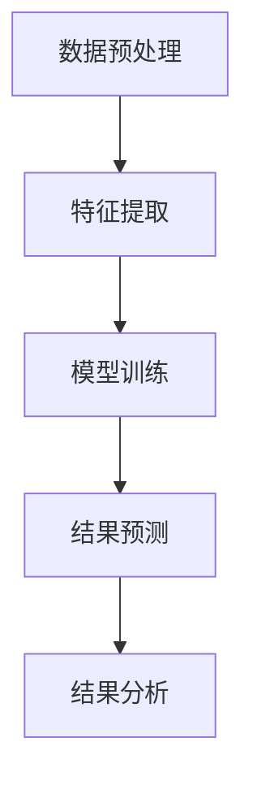
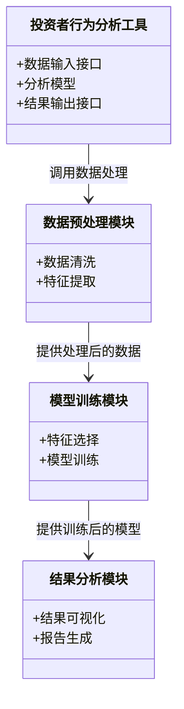
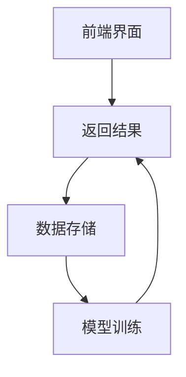

                 


# 设计智能化的个人投资者行为分析工具

> 关键词：智能化、个人投资者、行为分析、机器学习、系统架构、项目实战

> 摘要：本文系统地探讨了设计智能化的个人投资者行为分析工具的方法与实现路径。通过分析个人投资者行为分析的背景、核心概念、算法原理、系统架构，以及项目实战，展示了如何利用机器学习和数据驱动的方法，构建一个高效、智能的行为分析工具。文章结合理论与实践，详细阐述了从数据预处理、模型训练到结果分析的全过程，并通过具体案例分析，验证了工具的有效性。最后，本文还总结了设计过程中的经验和最佳实践，为后续研究提供了参考。

---

## 第1章: 背景介绍

### 1.1 问题背景

#### 1.1.1 传统投资分析的局限性
传统的投资分析方法主要依赖于人工判断和经验分析，存在以下问题：
- 数据量大，难以快速处理。
- 分析结果主观性强，缺乏客观依据。
- 需要大量时间进行数据整理和分析。

#### 1.1.2 个人投资者行为分析的重要性
个人投资者的行为直接影响投资决策，分析其行为模式可以帮助投资者：
- 识别投资偏好。
- 发现潜在风险。
- 提供个性化投资建议。

#### 1.1.3 智能化工具在投资分析中的作用
智能化工具可以通过自动化数据处理和机器学习模型，帮助投资者：
- 快速分析大量数据。
- 提供客观的分析结果。
- 发现隐藏在数据中的规律。

### 1.2 问题描述

#### 1.2.1 个人投资者行为的复杂性
投资者的行为受到多种因素影响，包括市场波动、个人情绪等，导致行为数据具有复杂性和多样性。

#### 1.2.2 数据驱动分析的必要性
通过收集和分析投资者的行为数据，可以提取有价值的信息，帮助投资者做出更明智的决策。

#### 1.2.3 智能化工具的实现路径
- 数据收集与处理。
- 行为模式识别。
- 投资建议生成。

### 1.3 核心概念与联系

#### 1.3.1 核心概念原理
个人投资者行为分析工具通过收集和分析投资者的行为数据，利用机器学习模型识别行为模式，并生成相应的投资建议。

#### 1.3.2 ER实体关系图
```mermaid
erDiagram
    actor 投资者 {
        <属性> 帐户信息
        <属性> 投资记录
        <属性> 行为数据
    }
    actor 工具 {
        <属性> 数据输入
        <属性> 分析模型
        <属性> 输出结果
    }
    investor --> 工具 : 提供数据
    工具 --> investor : 返回分析结果
```

---

## 第2章: 算法原理讲解

### 2.1 机器学习算法的选择与实现

#### 2.1.1 机器学习在行为分析中的应用
- 分类：预测投资者的投资类型。
- 回归：预测投资收益。
- 聚类：识别投资者行为模式。

#### 2.1.2 算法选择的依据
- 数据量和数据类型。
- 分析目标和任务。
- 模型的可解释性和计算效率。

#### 2.1.3 算法实现的步骤
1. 数据预处理。
2. 特征提取。
3. 模型训练。
4. 模型评估。
5. 模型优化。

### 2.2 机器学习算法实现

#### 2.2.1 线性回归模型
$$ y = \beta_0 + \beta_1x + \epsilon $$

#### 2.2.2 决策树模型
$$ entropy = -\sum p_i \log p_i $$

### 2.3 算法实现流程图


---

## 第3章: 系统分析与架构设计

### 3.1 系统功能设计

#### 3.1.1 用户需求分析
- 数据输入：支持多种数据格式。
- 分析功能：提供多种分析模型。
- 结果输出：支持可视化和报告生成。

#### 3.1.2 功能模块划分
- 数据预处理模块。
- 模型训练模块。
- 结果分析模块。

#### 3.1.3 领域模型设计


### 3.2 系统架构设计

#### 3.2.1 系统架构图


---

## 第4章: 项目实战

### 4.1 环境安装与配置

#### 4.1.1 环境要求
- Python 3.8+
- Jupyter Notebook
- 机器学习库（scikit-learn, xgboost）
- 数据库（MySQL, MongoDB）

#### 4.1.2 安装步骤
1. 安装Python和必要的库。
2. 安装数据库。
3. 配置开发环境。

### 4.2 核心代码实现

#### 4.2.1 数据预处理
```python
import pandas as pd
from sklearn.preprocessing import StandardScaler

# 加载数据
data = pd.read_csv('investor_behavior.csv')

# 删除缺失值
data = data.dropna()

# 标准化处理
scaler = StandardScaler()
scaled_data = scaler.fit_transform(data[['age', 'experience', 'income']])
```

#### 4.2.2 模型训练
```python
from sklearn.tree import DecisionTreeClassifier
from sklearn.metrics import accuracy_score

# 训练决策树模型
model = DecisionTreeClassifier()
model.fit(scaled_data, data['investment_type'])

# 模型评估
y_pred = model.predict(scaled_data)
print('Accuracy:', accuracy_score(data['investment_type'], y_pred))
```

#### 4.2.3 结果分析
```python
from sklearn.metrics import classification_report

print(classification_report(data['investment_type'], y_pred))
```

### 4.3 案例分析与解读

#### 4.3.1 数据收集与清洗
- 收集投资者的行为数据，包括交易记录、市场数据等。
- 清洗数据，处理缺失值和异常值。

#### 4.3.2 模型训练与评估
- 使用决策树模型训练投资者行为分类模型。
- 评估模型性能，调整参数优化模型。

### 4.4 项目总结

#### 4.4.1 项目成果
- 成功构建投资者行为分析工具。
- 提供了有效的投资建议。

#### 4.4.2 经验总结
- 数据质量对模型性能影响重大。
- 模型选择需要根据具体任务调整。

---

## 第5章: 最佳实践与注意事项

### 5.1 最佳实践

#### 5.1.1 数据质量管理
- 数据清洗：处理缺失值和异常值。
- 数据增强：增加数据多样性。

#### 5.1.2 模型优化
- 参数调优：使用网格搜索。
- 模型融合：集成学习提高性能。

### 5.2 小结

### 5.3 注意事项

#### 5.3.1 数据隐私
- 遵守数据隐私法规。
- 加强数据加密和访问控制。

#### 5.3.2 模型解释性
- 选择可解释性强的模型。
- 提供清晰的解释说明。

### 5.4 拓展阅读

#### 5.4.1 推荐书籍
- 《机器学习实战》
- 《深入浅出机器学习》

#### 5.4.2 技术博客
- [Towards Data Science](https://towardsdatascience.com/)
- [Medium - AI & ML](https://medium.com/ai-and-ml)

---

## 作者：AI天才研究院 & 禅与计算机程序设计艺术

通过本文的详细讲解，我们系统地介绍了设计智能化的个人投资者行为分析工具的方法与实现路径。从背景分析、算法原理到系统架构和项目实战，我们展示了如何利用机器学习和数据驱动的方法，构建一个高效、智能的行为分析工具。希望本文能够为读者提供有价值的参考和启发，帮助他们在投资领域取得更好的成果。

