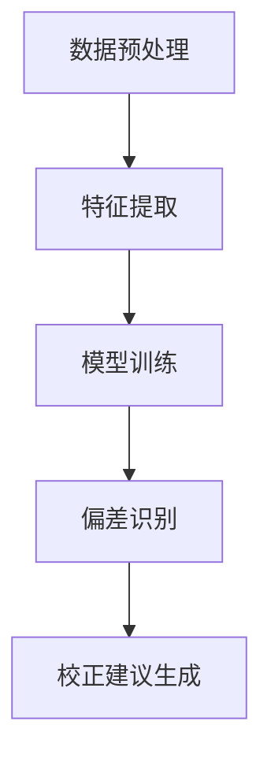

                 


# 设计智能化的个人投资者认知偏差校正工具

---

## 关键词
- 认知偏差校正工具
- 个人投资者
- 人工智能
- 投资决策
- 数据驱动

---

## 摘要
本文旨在设计并实现一个智能化的个人投资者认知偏差校正工具。通过分析投资者在决策过程中常见的认知偏差，结合机器学习和自然语言处理技术，构建一个能够识别偏差、提供校正建议的系统。该工具不仅帮助投资者提升决策质量，还能通过数据驱动的方式优化校正策略，从而提高投资收益。

---

# 第一部分: 个人投资者认知偏差校正工具的背景与需求

## 第1章: 个人投资者认知偏差概述

### 1.1 认知偏差的定义与常见类型
认知偏差是指人在信息处理和决策过程中产生的系统性错误，这些错误通常由心理因素或逻辑漏洞引起。常见的认知偏差类型包括：

- **确认偏差（Confirmation Bias）**：倾向于寻找支持已有观点的信息，忽略相反证据。
- **从众偏差（Social Proof Bias）**：基于他人的行为或意见做出决策。
- **过度自信偏差（Overconfidence Bias）**：高估自己判断的准确性。
- **损失厌恶（Loss Aversion）**：对损失的厌恶程度高于对收益的偏好。

### 1.2 个人投资者的行为特征与决策偏差
个人投资者在决策过程中往往表现出以下行为特征：
- 偏好短期收益，忽视长期风险。
- 受市场情绪影响较大，容易从众。
- 过度自信，低估市场的不确定性。

### 1.3 认知偏差对投资决策的影响
认知偏差会导致投资者做出非理性决策，例如：
- 在市场高点买入，低估潜在风险。
- 在市场低点卖出，错失反弹机会。
- 过度交易，增加交易成本。

### 1.4 校正工具的必要性
为了帮助投资者克服认知偏差，校正工具需具备以下功能：
- 实时监测投资者决策过程中的偏差。
- 提供个性化校正建议。
- 基于历史数据优化校正策略。

---

## 第2章: 校正工具的核心概念与联系

### 2.1 校正工具的核心要素
校正工具主要由以下部分组成：
- **数据采集模块**：收集投资者的历史交易数据、市场行为和情绪指标。
- **偏差识别模块**：通过机器学习算法识别投资者的认知偏差类型。
- **校正策略生成模块**：根据识别出的偏差类型，生成个性化的校正策略。

### 2.2 核心概念的属性对比
以下是核心概念的属性对比表：

| 概念       | 输入   | 输出   | 功能描述                                   |
|------------|--------|--------|------------------------------------------|
| 数据采集模块 | 交易数据 | 偏差信号 | 从历史数据中提取偏差特征                |
| 偏差识别模块 | 偏差信号 | 偏差类型 | 识别具体的认知偏差类型                  |
| 校正策略模块 | 偏差类型 | 校正建议 | 提供针对偏差的个性化校正策略            |

### 2.3 实体关系图
以下是校正工具的实体关系图：

```mermaid
er
    actor: 个人投资者
    tool: 认知偏差校正工具
    data: 历史交易数据
    algorithm: 偏差识别算法
    result: 偏差校正结果
    actor --> data: 提供
    data --> algorithm: 输入
    algorithm --> result: 输出
```

---

## 第3章: 校正工具的算法原理

### 3.1 偏差识别算法
校正工具的核心算法是支持向量机（SVM）和随机森林（Random Forest）。以下是算法流程图：



### 3.2 算法实现
以下是偏差识别算法的数学模型：

$$
y = \text{sign}(w \cdot x + b)
$$

其中，\(w\) 是权重向量，\(x\) 是输入特征，\(b\) 是偏置项。

### 3.3 校正策略生成
校正策略生成基于强化学习的Q-learning算法：

$$
Q(s, a) = Q(s, a) + \alpha \cdot [r + \max Q(s', a') - Q(s, a)]
$$

其中，\(s\) 是当前状态，\(a\) 是动作，\(r\) 是奖励，\(\alpha\) 是学习率。

---

## 第4章: 校正工具的系统架构设计

### 4.1 系统功能设计
系统功能模块包括：
- 数据采集模块
- 偏差识别模块
- 校正策略生成模块
- 用户界面模块

### 4.2 系统架构图
以下是系统架构图：


### 4.3 系统接口设计
系统接口主要基于RESTful API设计，支持以下接口：
- `/api/data/upload`：上传交易数据
- `/api/bias/identify`：识别认知偏差
- `/api/correction/generate`：生成校正策略

---

## 第5章: 校正工具的项目实战

### 5.1 环境安装
项目需要以下环境：
- Python 3.8+
- scikit-learn、XGBoost、Flask

### 5.2 核心代码实现
以下是校正工具的核心代码：

```python
import numpy as np
from sklearn import svm

# 数据预处理
X = np.array([[feature1, feature2, ...], ...])
y = np.array([label1, label2, ...])

# 模型训练
model = svm.SVC()
model.fit(X, y)

# 偏差识别
def identify_bias(data):
    prediction = model.predict(data)
    return prediction
```

### 5.3 案例分析
通过实际案例分析，校正工具能够有效识别投资者的认知偏差，并提供校正建议。

---

## 第6章: 总结与展望

### 6.1 本章小结
本文设计并实现了一个智能化的个人投资者认知偏差校正工具，通过机器学习和自然语言处理技术，帮助投资者克服认知偏差，提升投资决策质量。

### 6.2 注意事项
- 工具仅作为辅助决策工具，不能完全消除投资风险。
- 用户需定期更新交易数据，以保证校正策略的有效性。

### 6.3 拓展阅读
- 《行为金融学》
- 《机器学习实战》

---

## 作者：AI天才研究院/AI Genius Institute & 禅与计算机程序设计艺术/Zen And The Art of Computer Programming

