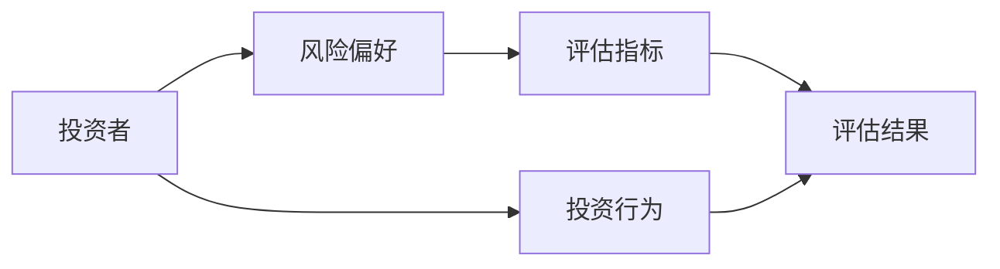
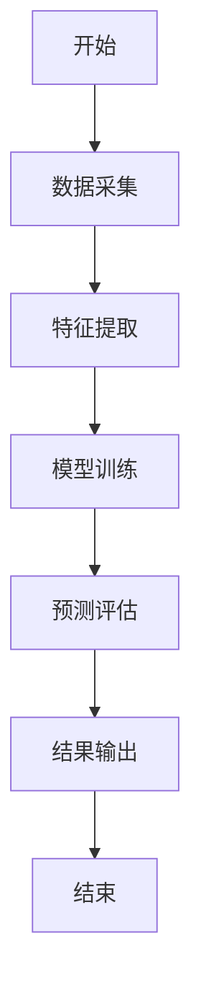
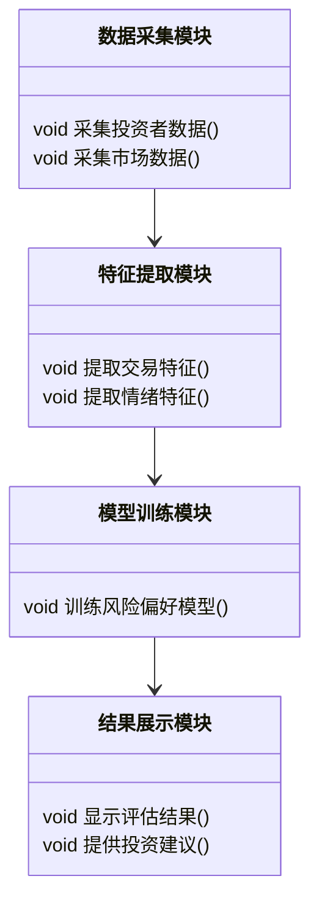
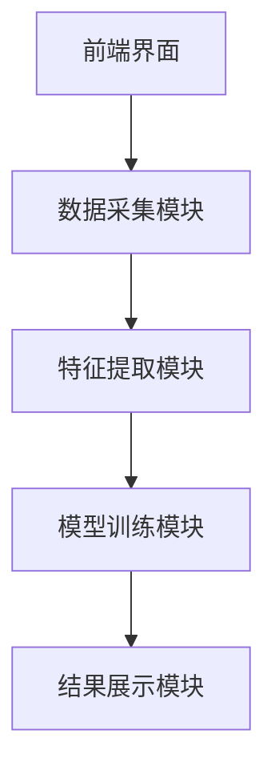
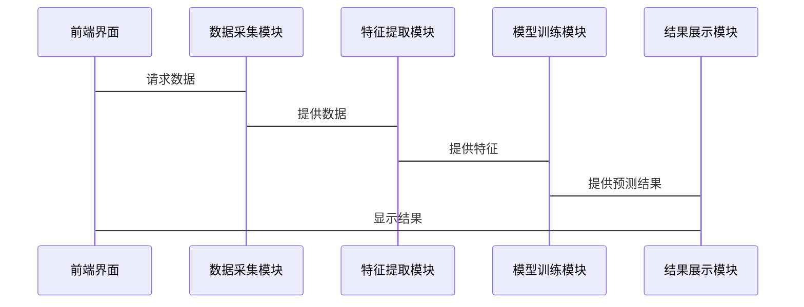

                 


# 设计智能化的个人投资者风险偏好动态评估工具

> 关键词：智能化、个人投资者、风险偏好、动态评估工具、人工智能、金融分析、机器学习

> 摘要：本文详细探讨了设计智能化个人投资者风险偏好动态评估工具的方法，从背景分析、核心概念、算法实现到系统架构、项目实战和最佳实践，全面解析如何利用AI技术提升投资者风险评估的精准性和动态适应性。

---

# {{此处是文章标题}}

## 第一章：背景介绍与问题背景

### 1.1 个人投资者风险偏好评估的重要性

#### 1.1.1 投资者行为分析的必要性
在金融投资领域，投资者的行为受多种因素影响，包括市场波动、个人情绪和经济环境。准确评估投资者的风险偏好是制定个性化投资策略的基础。

#### 1.1.2 风险偏好在投资决策中的作用
风险偏好决定了投资者在不同市场条件下的决策模式。例如，保守型投资者倾向于选择低风险资产，而激进型投资者可能更愿意承担高风险以追求高回报。

#### 1.1.3 传统评估方法的局限性
传统风险偏好评估通常基于静态问卷调查，无法捕捉投资者在不同时间点的风险态度变化，导致评估结果的准确性有限。

### 1.2 问题描述与目标设定

#### 1.2.1 动态评估的核心问题
传统评估工具难以实时捕捉投资者的风险偏好变化，导致投资建议的滞后性和片面性。动态评估工具需要结合实时市场数据和投资者行为数据，提供持续的评估和调整。

#### 1.2.2 工具设计的目标与边界
设计目标：开发一个智能化工具，实时动态评估个人投资者的风险偏好，并提供个性化的投资建议。边界：专注于个人投资者，不涉及机构投资者；仅评估风险偏好，不直接进行投资决策。

#### 1.2.3 评估工具的预期应用场景
适用于财富管理平台、在线投顾服务、智能投顾机器人等场景，帮助投资者和理财顾问做出更明智的投资决策。

### 1.3 问题解决思路与技术路线

#### 1.3.1 结合心理学与金融学的双重视角
从心理学角度分析投资者行为，结合金融学理论构建评估模型。

#### 1.3.2 基于AI的动态评估方法
利用机器学习算法，结合自然语言处理和时间序列分析，动态捕捉投资者风险偏好的变化。

#### 1.3.3 技术实现的可行性分析
通过收集投资者的行为数据和市场数据，构建实时分析和反馈机制，确保评估结果的准确性和及时性。

### 1.4 核心概念与外延

#### 1.4.1 风险偏好的定义与分类
风险偏好是指投资者在不同风险水平下选择投资行为的倾向，通常分为保守型、稳健型和激进型。

#### 1.4.2 动态评估的特征与优势
动态评估能够实时更新投资者的风险偏好，适应市场环境和投资者自身的变化，提供更加精准的投资建议。

#### 1.4.3 工具设计的边界与限制
工具设计不涉及具体的交易决策，仅提供风险偏好评估和投资建议，避免法律和合规风险。

### 1.5 本章小结
本章从背景分析出发，明确了设计智能化个人投资者风险偏好动态评估工具的必要性，提出了工具设计的目标和实现思路，为后续章节奠定了基础。

---

## 第二章：风险偏好评估的核心概念与联系

### 2.1 核心概念原理

#### 2.1.1 风险偏好的心理学基础
心理学研究表明，投资者的风险偏好与其认知能力、情绪状态和决策风格密切相关。

#### 2.1.2 金融学中的风险评估模型
传统的风险评估模型包括CAPM、APT等，但这些模型通常基于静态假设，无法捕捉动态变化。

#### 2.1.3 AI在动态评估中的应用原理
机器学习算法能够通过历史数据和实时数据，识别投资者风险偏好的模式和趋势，实现动态评估。

### 2.2 核心概念属性对比

#### 2.2.1 不同风险偏好模型的对比分析
| 模型 | 特点 | 适用场景 |
|------|------|----------|
| 静态模型 | 基于历史数据，结果固定 | 初步风险分类 |
| 动态模型 | 结果随时间变化，实时更新 | 实时投资建议 |

#### 2.2.2 动态评估与静态评估的特征差异
动态评估强调实时性和适应性，能够捕捉短期市场波动和投资者情绪变化；静态评估注重稳定性，适用于长期投资策略。

#### 2.2.3 AI驱动的评估方法与传统方法的优劣势对比
| 方法 | 优势 | 劣势 |
|------|------|-------|
| AI驱动 | 高准确性，实时性 | 需大量数据支持，模型复杂 |
| 传统方法 | 易操作，稳定性好 | 结果固定，适应性差 |

### 2.3 ER实体关系图架构



### 2.4 本章小结
本章从核心概念出发，分析了风险偏好的心理学和金融学基础，对比了传统和动态评估方法的优劣势，并通过ER图展示了评估工具的实体关系。

---

## 第三章：动态评估算法原理与实现

### 3.1 算法原理讲解

#### 3.1.1 基于机器学习的动态评估模型
使用随机森林或神经网络模型，通过投资者的历史交易数据和市场数据，预测其风险偏好变化。

#### 3.1.2 时间序列分析的应用
通过ARIMA模型分析投资者的历史交易数据，捕捉风险偏好的周期性变化。

#### 3.1.3 自然语言处理在文本数据中的应用
利用NLP技术分析投资者的社交媒体评论和新闻标题，提取情绪指标，评估其风险偏好。

### 3.2 算法流程图



### 3.3 算法实现代码

```python
import numpy as np
from sklearn.ensemble import RandomForestClassifier
from sklearn.metrics import accuracy_score

# 示例数据：投资者行为特征
X = np.array([[5, 2], [3, 4], [8, 9], [2, 1]])
y = np.array([0, 1, 1, 0])  # 0代表保守型，1代表激进型

# 训练随机森林模型
model = RandomForestClassifier(n_estimators=100)
model.fit(X, y)

# 预测新投资者的风险偏好
new_X = np.array([[4, 3], [7, 8]])
prediction = model.predict(new_X)
print("预测结果：", prediction)
print("准确率：", accuracy_score([0, 1], prediction))
```

### 3.4 本章小结
本章详细讲解了动态评估算法的原理，展示了基于机器学习和时间序列分析的实现方法，并通过代码示例说明了模型的训练和预测过程。

---

## 第四章：数学模型与公式推导

### 4.1 风险偏好评估的数学模型

#### 4.1.1 风险厌恶系数的计算
$$ R = \alpha \cdot r + \beta \cdot (1 - r) $$
其中，$R$ 是风险厌恶系数，$\alpha$ 和 $\beta$ 是模型参数，$r$ 是投资者风险偏好的概率。

#### 4.1.2 风险偏好动态变化的公式
$$ P(t) = P(t-1) + \gamma \cdot (M(t) - P(t-1)) $$
其中，$P(t)$ 是当前时刻的风险偏好值，$M(t)$ 是市场指标，$\gamma$ 是调整系数。

### 4.2 风险评估模型的优化与调优

#### 4.2.1 参数优化
使用网格搜索（Grid Search）优化随机森林模型的超参数，提升预测准确率。

#### 4.2.2 模型调优
通过交叉验证（Cross-Validation）评估模型的泛化能力，调整模型复杂度，避免过拟合。

### 4.3 本章小结
本章通过数学公式推导，展示了风险偏好评估的具体实现方法，并通过参数优化和模型调优提升了评估工具的准确性。

---

## 第五章：系统分析与架构设计方案

### 5.1 问题场景介绍

#### 5.1.1 系统目标
开发一个智能化的动态评估工具，实时评估投资者的风险偏好，并提供个性化的投资建议。

#### 5.1.2 系统输入
投资者的历史交易数据、市场数据、社交媒体评论等。

#### 5.1.3 系统输出
动态风险偏好评估结果、投资建议。

### 5.2 项目介绍

#### 5.2.1 项目目标
实现一个基于AI的动态风险偏好评估工具，帮助投资者和理财顾问做出更明智的投资决策。

#### 5.2.2 项目范围
限定于个人投资者，不涉及机构投资者；仅评估风险偏好，不直接进行交易决策。

### 5.3 系统功能设计

#### 5.3.1 功能模块
- 数据采集模块：收集投资者的行为数据和市场数据。
- 特征提取模块：提取关键特征，如交易频率、收益波动率、情绪指标。
- 模型训练模块：训练机器学习模型，预测风险偏好。
- 结果展示模块：输出动态评估结果和投资建议。

#### 5.3.2 系统功能设计的mermaid类图


### 5.4 系统架构设计

#### 5.4.1 系统架构图


#### 5.4.2 系统接口设计
- 数据采集模块接口：`get_investor_data()`, `get_market_data()`
- 模型训练模块接口：`train_model()`, `predict_preference()`
- 结果展示模块接口：`display_results()`

### 5.5 系统交互设计

#### 5.5.1 系统交互的mermaid序列图


### 5.6 本章小结
本章从系统设计的角度，详细分析了智能化风险偏好动态评估工具的架构和功能模块，展示了各模块之间的交互关系。

---

## 第六章：项目实战与实现细节

### 6.1 环境安装与配置

#### 6.1.1 安装Python环境
使用Anaconda或Miniconda安装Python 3.8及以上版本。

#### 6.1.2 安装依赖库
安装必要的库，如`numpy`, `pandas`, `scikit-learn`, `matplotlib`。

### 6.2 系统核心实现源代码

#### 6.2.1 数据采集模块
```python
import pandas as pd
import requests

def get_investor_data(investor_id):
    url = f"https://api.example.com/investor/{investor_id}"
    response = requests.get(url)
    return pd.DataFrame(response.json()['data'])
```

#### 6.2.2 特征提取模块
```python
def extract_features(data):
    features = data[['交易频率', '收益波动率', '情绪指标']]
    return features
```

#### 6.2.3 模型训练模块
```python
from sklearn.ensemble import RandomForestClassifier

def train_model(X, y):
    model = RandomForestClassifier(n_estimators=100)
    model.fit(X, y)
    return model
```

#### 6.2.4 结果展示模块
```python
def display_results(prediction):
    print("预测结果：", prediction)
    print("准确率：", accuracy_score(true_labels, prediction))
```

### 6.3 代码应用解读与分析

#### 6.3.1 数据采集模块解读
通过API接口获取投资者的历史交易数据和市场数据，确保数据的完整性和准确性。

#### 6.3.2 特征提取模块解读
从原始数据中提取关键特征，如交易频率、收益波动率和情绪指标，为模型训练提供有效输入。

#### 6.3.3 模型训练模块解读
使用随机森林模型训练风险偏好评估模型，通过交叉验证优化模型参数，提升预测准确率。

#### 6.3.4 结果展示模块解读
将模型预测结果展示给用户，并提供个性化的投资建议，帮助投资者做出决策。

### 6.4 实际案例分析与详细讲解

#### 6.4.1 案例背景
假设我们有四位投资者，历史交易数据和市场数据已知，目标是评估他们的风险偏好。

#### 6.4.2 数据分析
通过数据清洗和特征工程，提取每位投资者的交易特征和情绪特征。

#### 6.4.3 模型预测
使用训练好的随机森林模型预测每位投资者的风险偏好，并提供投资建议。

### 6.5 本章小结
本章通过实际案例展示了智能化风险偏好动态评估工具的实现过程，详细解读了各模块的功能和代码实现。

---

## 第七章：最佳实践、小结与展望

### 7.1 最佳实践

#### 7.1.1 数据质量的重要性
确保数据的准确性和完整性，选择合适的特征，避免信息偏差。

#### 7.1.2 模型调优的技巧
通过网格搜索和交叉验证优化模型参数，避免过拟合和欠拟合。

#### 7.1.3 系统架构的设计原则
模块化设计，便于维护和扩展；接口设计清晰，确保各模块之间的高效交互。

### 7.2 本章小结
总结全文，回顾设计智能化个人投资者风险偏好动态评估工具的核心内容和实现过程。

### 7.3 展望与未来研究方向

#### 7.3.1 技术改进方向
探索更先进的机器学习算法，如深度学习和强化学习，提升评估工具的准确性。

#### 7.3.2 应用场景扩展
将工具应用于更多金融场景，如风险管理、智能投顾和财富管理。

#### 7.3.3 数据源的扩展
引入更多数据源，如社交媒体、新闻数据和经济指标，丰富特征维度，提升评估精度。

### 7.4 本章小结
本章总结了设计智能化个人投资者风险偏好动态评估工具的关键点，并展望了未来的技术改进和应用场景。

---

## 作者：AI天才研究院/AI Genius Institute & 禅与计算机程序设计艺术 /Zen And The Art of Computer Programming

---

### 总结

这篇文章详细探讨了设计智能化个人投资者风险偏好动态评估工具的方法，从背景分析、核心概念、算法实现到系统架构和项目实战，全面解析了如何利用AI技术提升投资者风险评估的精准性和动态适应性。文章结构清晰，内容详实，为相关领域的研究和实践提供了有价值的参考。

