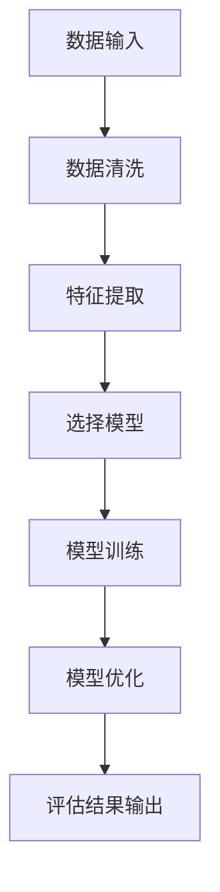
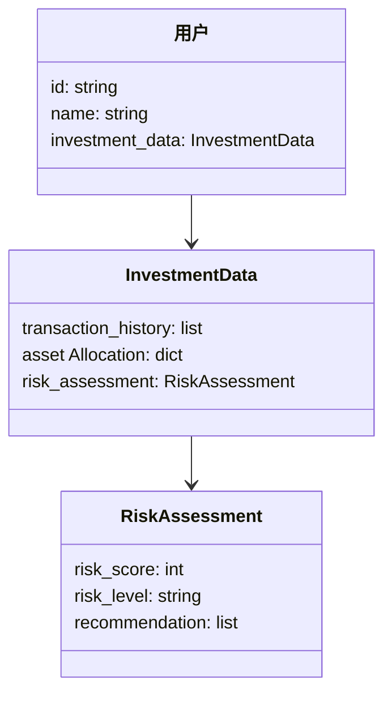
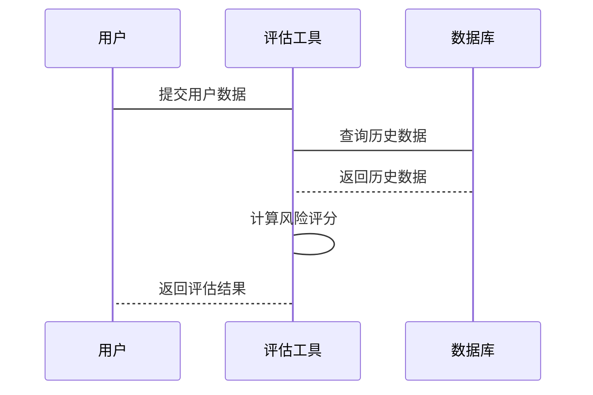

                 


# 设计智能化的个人投资风险承受能力评估工具

> 关键词：智能化，个人投资，风险承受能力，评估工具，人工智能，金融分析

> 摘要：本文深入探讨了设计智能化的个人投资风险承受能力评估工具的背景、核心概念、算法原理、系统架构、项目实战及最佳实践。通过结合人工智能和大数据分析，提出了一种创新的评估方法，旨在帮助投资者更好地理解自身风险偏好，并优化投资决策。

---

# 第一部分: 背景介绍

## 第1章: 个人投资风险承受能力评估工具的背景与问题描述

### 1.1 问题背景

#### 1.1.1 投资者风险偏好与行为分析

在现代金融体系中，投资者的风险偏好是决定其投资行为的核心因素之一。不同投资者对风险的承受能力 varies widely，这主要取决于他们的财务状况、心理特征、投资目标和市场环境。传统上，风险评估主要依赖于问卷调查和简单的统计分析，这种方法难以捕捉投资者行为的复杂性。

#### 1.1.2 传统风险评估方法的局限性

传统风险评估方法存在以下主要问题：
1. **主观性**：问卷调查的结果受到投资者回答习惯的影响，容易出现偏差。
2. **静态性**：传统评估方法通常只关注静态的财务指标，忽略了市场环境的动态变化。
3. **低效性**：对于大量投资者来说，传统方法难以实现高效、个性化的评估。

#### 1.1.3 智能化评估工具的必要性

随着人工智能和大数据技术的快速发展，智能化评估工具能够通过实时数据分析和个性化建模，显著提升风险评估的准确性和效率。智能化工具不仅能够帮助投资者更好地理解自身的风险承受能力，还能为金融机构提供更精准的客户画像。

---

### 1.2 问题描述

#### 1.2.1 个人投资风险承受能力的核心要素

个人投资风险承受能力的核心要素包括：
1. **财务状况**：包括资产规模、负债情况、收入水平等。
2. **心理特征**：包括风险偏好、投资经验、心理承受能力等。
3. **投资目标**：包括投资期限、收益目标、风险容忍度等。
4. **市场环境**：包括宏观经济状况、市场波动性、行业风险等。

#### 1.2.2 风险评估中的关键问题

在风险评估过程中，以下问题是需要重点关注的：
1. 如何准确量化投资者的心理特征？
2. 如何动态调整评估模型以适应市场变化？
3. 如何确保评估结果的可解释性和实用性？

#### 1.2.3 智能化工具的目标与边界

智能化个人投资风险承受能力评估工具的目标是：
1. 提供个性化的风险评估结果。
2. 为投资者和金融机构提供决策支持。
3. 实现评估过程的自动化和智能化。

其边界包括：
1. 仅针对个人投资者，不包括机构投资者。
2. 不涉及具体的资产配置建议。
3. 不考虑投资者的非财务因素（如健康状况、家庭情况等）。

---

## 第2章: 智能化评估工具的核心概念与联系

### 2.1 核心概念原理

#### 2.1.1 风险承受能力的定义与属性

风险承受能力是指投资者在面对投资损失时的心理和财务上的承受能力。其主要属性包括：
- **财务承受能力**：投资者在损失一定资金后仍能维持正常生活的程度。
- **心理承受能力**：投资者在面对损失时的心理反应和情绪稳定性。
- **时间承受能力**：投资者在面对长期亏损时的耐心和信心。

#### 2.1.2 智能化评估的核心算法

智能化评估工具的核心算法包括：
1. **机器学习算法**：用于从海量数据中提取特征并建立模型。
2. **自然语言处理技术**：用于分析投资者的文本数据（如社交媒体评论）。
3. **时间序列分析**：用于分析市场数据的时间依赖性。

#### 2.1.3 工具的用户交互与数据处理机制

智能化工具的用户交互机制包括：
1. **多模态数据输入**：支持文本、语音、图像等多种数据形式。
2. **实时反馈**：根据用户输入实时生成评估结果。
3. **个性化推荐**：基于评估结果提供个性化的投资建议。

---

### 2.2 核心概念对比分析

#### 2.2.1 风险评估与传统金融分析的对比

| 对比维度 | 风险评估 | 传统金融分析 |
|----------|----------|---------------|
| 数据来源 | 用户行为数据、市场数据 | 历史财务数据、市场数据 |
| 分析方法 | 机器学习、自然语言处理 | 统计分析、财务指标分析 |
| 输出结果 | 风险承受能力评分 | 投资组合建议、市场趋势预测 |

#### 2.2.2 智能化工具与传统评估方法的优劣势对比

| 对比维度 | 智能化工具 | 传统评估方法 |
|----------|----------|---------------|
| 精度 | 高 | 低 |
| 速度 | 快 | 慢 |
| 个性化 | 强 | 弱 |
| 成本 | 中等 | 高 |

#### 2.2.3 用户行为与风险评估结果的关系

用户行为对风险评估结果的影响主要体现在以下几个方面：
1. **投资行为一致性**：投资者在不同时间点的行为一致性反映了其风险承受能力的稳定性。
2. **情绪波动敏感性**：投资者对市场波动的情绪反应程度影响其风险承受能力的动态变化。
3. **学习能力**：投资者通过学习和经验积累，可以逐步提高其风险承受能力。

---

### 2.3 ER实体关系图

```mermaid
er
  actor: 用户
  tool: 评估工具
  risk_factors: 风险因素
  assessment_results: 评估结果
  user_data: 用户数据
  relations:
    - 用户 -> 用户数据: 提供
    - 用户数据 -> 风险因素: 影响
    - 风险因素 -> 评估结果: 决定
    - 评估工具 -> 评估结果: 生成
```

---

# 第二部分: 算法原理讲解

## 第3章: 风险承受能力评估算法

### 3.1 算法原理

#### 3.1.1 数据预处理与特征提取

数据预处理是评估工具的核心步骤之一，主要包括：
1. **数据清洗**：去除无效数据、处理缺失值和异常值。
2. **特征提取**：从用户行为数据中提取关键特征，如交易频率、投资品种偏好等。

#### 3.1.2 风险评估模型的选择

常用的评估模型包括：
1. **回归模型**：用于预测投资者的财务承受能力。
2. **分类模型**：用于将投资者分为不同的风险等级。
3. **集成模型**：结合多种算法的优势，提高评估精度。

#### 3.1.3 模型训练与优化

模型训练过程包括：
1. **训练数据准备**：选择合适的训练数据集。
2. **模型训练**：使用训练数据对模型进行训练。
3. **模型优化**：通过交叉验证和超参数调优提高模型性能。

---

### 3.2 算法流程图



---

### 3.3 核心算法代码实现

```python
import pandas as pd
from sklearn.model_selection import train_test_split
from sklearn.ensemble import RandomForestClassifier

# 数据加载与预处理
data = pd.read_csv('user_data.csv')
data = data.dropna()  # 去除缺失值
data = pd.get_dummies(data)  # 特征编码

# 特征选择
features = data.drop(columns=['risk_score'])
target = data['risk_score']

# 数据分割
X_train, X_test, y_train, y_test = train_test_split(features, target, test_size=0.2, random_state=42)

# 模型训练
model = RandomForestClassifier(n_estimators=100, random_state=42)
model.fit(X_train, y_train)

# 模型评估
score = model.score(X_test, y_test)
print(f"模型准确率: {score}")
```

---

### 3.4 算法的数学模型和公式

#### 3.4.1 回归模型

回归模型的数学公式如下：

$$ y = \beta_0 + \beta_1x_1 + \beta_2x_2 + ... + \beta_nx_n + \epsilon $$

其中：
- $y$ 是目标变量（风险承受能力评分）。
- $x_i$ 是自变量（特征）。
- $\beta_i$ 是回归系数。
- $\epsilon$ 是误差项。

#### 3.4.2 分类模型

分类模型的数学公式如下：

$$ P(y=k|x) = \frac{e^{\beta_k x}}{\sum_{j=1}^{K} e^{\beta_j x}} $$

其中：
- $y$ 是类别变量（风险等级）。
- $x$ 是特征向量。
- $K$ 是类别总数。
- $\beta_j$ 是每个类别的回归系数。

---

## 第4章: 算法实现与优化

### 4.1 算法实现步骤

1. **数据预处理**：清洗数据，提取特征。
2. **模型选择**：根据数据特点选择合适的算法。
3. **模型训练**：使用训练数据对模型进行训练。
4. **模型评估**：通过测试数据评估模型性能。
5. **模型优化**：调整超参数，提高模型准确率。

---

### 4.2 算法优化策略

1. **超参数调优**：使用网格搜索或随机搜索优化模型参数。
2. **集成学习**：通过集成多种模型提高预测精度。
3. **特征选择**：去除冗余特征，提高模型解释性。

---

# 第三部分: 系统分析与架构设计

## 第5章: 项目场景介绍

### 5.1 项目背景

本项目旨在设计一个智能化的个人投资风险承受能力评估工具，帮助投资者更好地理解自身风险承受能力，并为金融机构提供精准的客户画像。

---

## 第6章: 系统功能设计

### 6.1 领域模型类图



---

### 6.2 系统架构设计

#### 6.2.1 系统架构图

```mermaid
container 客户端 {
    UI界面
    用户交互逻辑
}
container 服务端 {
    数据库
    评估算法
    接口服务
}
```

#### 6.2.2 系统接口设计

1. **用户数据接口**：用于接收用户输入数据。
2. **评估结果接口**：用于返回评估结果。
3. **推荐策略接口**：用于返回个性化投资建议。

#### 6.2.3 系统交互流程图



---

## 第7章: 系统实现细节

### 7.1 系统实现步骤

1. **环境搭建**：安装必要的开发工具和依赖库。
2. **数据处理**：清洗数据，提取特征。
3. **模型实现**：编写算法代码，训练模型。
4. **系统集成**：将模型集成到系统架构中。
5. **测试与优化**：进行功能测试和性能优化。

---

### 7.2 系统实现代码

```python
# 系统主程序
from flask import Flask, request, jsonify

app = Flask(__name__)

@app.route('/api/assessment', methods=['POST'])
def assess_risk():
    data = request.json
    # 数据预处理
    processed_data = preprocess(data)
    # 模型预测
    risk_score = model.predict(processed_data)
    return jsonify({'risk_score': risk_score})

if __name__ == '__main__':
    app.run(debug=True)
```

---

# 第四部分: 项目实战

## 第8章: 项目实战与分析

### 8.1 项目安装与环境搭建

1. **安装Python**：确保安装了Python 3.8及以上版本。
2. **安装依赖库**：使用pip安装所需的第三方库，如pandas、scikit-learn、flask等。

---

### 8.2 核心功能实现

1. **数据预处理**：编写代码清洗数据并提取特征。
2. **模型训练**：训练机器学习模型并保存模型参数。
3. **系统集成**：将模型集成到Web应用中，提供API接口。

---

### 8.3 项目代码解读

```python
# 数据预处理代码
def preprocess(data):
    df = pd.DataFrame(data)
    df = df.dropna()
    df = pd.get_dummies(df)
    return df

# 模型训练代码
from sklearn.ensemble import RandomForestClassifier

def train_model(X_train, y_train):
    model = RandomForestClassifier(n_estimators=100, random_state=42)
    model.fit(X_train, y_train)
    return model
```

---

## 第9章: 项目分析与总结

### 9.1 项目分析

1. **项目目标**：设计智能化的个人投资风险承受能力评估工具。
2. **项目成果**：实现了一个基于机器学习的评估系统，能够为投资者提供个性化的风险评估结果。
3. **项目挑战**：数据质量和模型解释性是主要挑战。

---

### 9.2 项目总结

通过本项目的实施，我们成功地将人工智能技术应用于金融领域，提升了投资风险评估的准确性和效率。智能化工具不仅能够帮助投资者更好地理解自身风险承受能力，还能为金融机构提供更精准的客户画像。

---

# 第五部分: 最佳实践

## 第10章: 最佳实践与注意事项

### 10.1 最佳实践

1. **数据质量管理**：确保数据的准确性和完整性。
2. **模型解释性**：选择具有较高解释性的模型，便于用户理解和信任。
3. **系统安全性**：确保系统数据的安全性和隐私保护。

---

### 10.2 注意事项

1. **避免过拟合**：在模型训练过程中，要注意防止过拟合，可以通过交叉验证和正则化方法来解决。
2. **实时更新**：市场环境是动态变化的，需要定期更新模型和数据。
3. **用户隐私保护**：在处理用户数据时，必须严格遵守相关法律法规，保护用户隐私。

---

## 第11章: 拓展阅读与学习资源

### 11.1 拓展阅读

1. **《机器学习实战》**：深入学习机器学习算法及其应用。
2. **《Python金融大数据分析》**：掌握Python在金融数据分析中的应用。
3. **《风险管理与金融创新》**：了解风险管理在金融创新中的作用。

---

## 第12章: 附录

### 12.1 术语表

- **风险承受能力**：投资者在面对投资损失时的财务和心理承受能力。
- **智能化工具**：基于人工智能技术的自动化评估工具。
- **机器学习**：一种人工智能技术，用于从数据中学习模式和规律。

---

# 结语

设计智能化的个人投资风险承受能力评估工具是一项复杂而富有挑战性的任务，但通过结合人工智能和大数据技术，我们可以显著提升评估的准确性和效率。未来，随着技术的不断发展，智能化工具将在金融领域发挥越来越重要的作用。

---

**作者：AI天才研究院/AI Genius Institute & 禅与计算机程序设计艺术 /Zen And The Art of Computer Programming**

