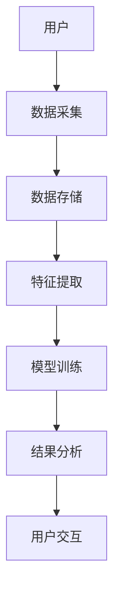
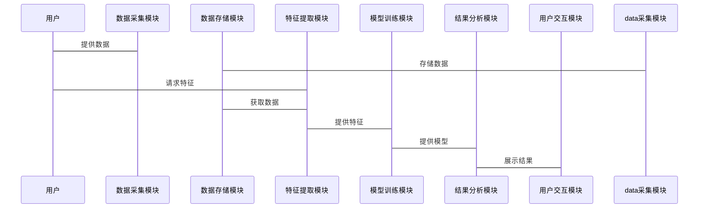

                 


# 设计智能化的个人消费行为分析系统

## 关键词：数据挖掘、机器学习、人工智能、消费行为分析、系统设计

## 摘要：本文将结合数据挖掘和机器学习技术，深入分析个人消费行为的模式与特征，设计并实现一个智能化的个人消费行为分析系统。通过系统化的数据处理、特征提取和模型训练，帮助用户理解个人消费行为的内在规律，提供个性化消费建议，优化消费决策。

---

## 第一部分：智能化个人消费行为分析系统背景与概念

### 第1章：智能化个人消费行为分析的背景与意义

#### 1.1 系统背景
- **传统消费行为分析的局限性**：传统的消费行为分析主要依赖于统计方法和简单的数据汇总，难以捕捉个体消费行为的动态变化和复杂模式。
- **智能化分析的必要性**：随着人工智能和大数据技术的快速发展，通过智能化手段分析个人消费行为，能够更精准地识别用户的消费习惯和偏好，为个性化服务提供数据支持。
- **消费行为分析的场景与应用**：在电商、金融、零售等领域，智能化的消费行为分析可以帮助企业优化营销策略、提升用户体验，并预防欺诈行为。

#### 1.2 问题描述
- **消费行为数据的特点**：个人消费行为数据具有多样性、时序性和关联性，需要结合多源数据进行综合分析。
- **智能化分析的目标**：通过构建智能化的分析系统，实现对个人消费行为的实时监测、预测和个性化推荐。
- **系统边界与外延**：系统需要处理多源异构数据，支持在线分析和离线分析，并具备可扩展性和灵活性。

#### 1.3 问题解决
- **数据驱动的分析方法**：利用数据挖掘、机器学习等技术，从海量数据中提取有价值的信息。
- **智能化分析的核心技术**：包括数据预处理、特征提取、模型训练和结果解释等关键步骤。
- **系统设计的思路与框架**：以用户为中心，构建一个高效、智能、可扩展的消费行为分析系统。

#### 1.4 本章小结
本章通过分析智能化个人消费行为分析的背景和意义，明确了系统建设的目标和必要性，为后续的系统设计和实现奠定了基础。

---

## 第二部分：智能化个人消费行为分析系统的核心概念

### 第2章：系统核心概念与联系

#### 2.1 核心概念原理
- **数据采集与预处理**：从多源数据中提取消费行为数据，进行清洗、转换和标准化处理。
- **特征提取与建模**：基于时间序列和用户行为特征，构建适合机器学习的特征向量。
- **模型训练与优化**：利用监督学习或无监督学习算法，训练消费行为预测模型，并通过交叉验证进行优化。

#### 2.2 核心概念属性对比表
| 概念 | 属性 | 描述 |
|------|------|------|
| 数据来源 | 多样性 | 包括交易数据、用户行为数据、产品信息等 |
| 数据特征 | 细粒度 | 个体消费习惯的差异性，如时间偏好、产品偏好等 |
| 模型类型 | 可解释性 | 需要兼顾解释性和预测性，以便用户理解和信任 |

#### 2.3 ER实体关系图
```mermaid
erDiagram
    user [用户]
    transaction [交易记录]
    product [产品]
    behavior [用户行为]
    model [模型]
    result [分析结果]
    user --> transaction : 产生
    transaction --> product : 关联
    user --> behavior : 表现
    transaction + behavior --> model : 输入
    model --> result : 输出
```

---

## 第三部分：智能化个人消费行为分析系统的算法原理

### 第3章：算法原理与实现

#### 3.1 数据预处理
- **数据清洗**：去除重复数据、填充缺失值、处理异常值。
- **数据标准化**：将不同量纲的特征进行归一化处理，确保模型训练的稳定性。
- **数据增强**：通过数据变换（如时间序列平移、特征组合）增加数据多样性。

#### 3.2 特征提取
- **时间序列特征**：提取消费频率、周期性、趋势等特征。
- **用户行为特征**：分析用户行为的路径、时序、频次等特征。
- **产品偏好特征**：挖掘用户对不同产品的偏好程度。

#### 3.3 模型训练
- **逻辑回归模型**：
  ```mermaid
  graph TD
      A[数据输入] --> B[特征提取]
      B --> C[模型训练]
      C --> D[结果输出]
  ```
  逻辑回归模型用于分类任务，适用于二分类问题，如预测用户是否会在特定时间进行消费。

  **数学公式**：
  $$ P(y=1|x) = \frac{1}{1 + e^{- (w \cdot x + b)}} $$

- **决策树模型**：
  决策树是一种基于树结构的分类模型，适用于消费行为的多分类问题。

  **数学公式**：
  $$ entropy(S) = -\sum_{i=1}^{n} p_i \log p_i $$

---

## 第四部分：智能化个人消费行为分析系统的系统分析与架构设计

### 第4章：系统分析与架构设计

#### 4.1 系统功能设计
- **数据采集模块**：负责收集用户的消费数据、行为数据等。
- **特征提取模块**：对数据进行预处理和特征提取。
- **模型训练模块**：训练消费行为分析模型。
- **结果分析模块**：输出分析结果并提供可视化展示。
- **用户交互模块**：提供用户友好的操作界面。

#### 4.2 系统架构设计


#### 4.3 系统接口设计
- **数据接口**：提供API用于数据的输入和输出。
- **模型接口**：提供API用于模型的训练和预测。
- **用户接口**：提供图形化界面用于用户交互和结果展示。

#### 4.4 系统交互流程


---

## 第五部分：智能化个人消费行为分析系统的项目实战

### 第5章：项目实战与分析

#### 5.1 环境配置
- **工具安装**：安装Python、Jupyter Notebook、TensorFlow、Pandas等工具。
- **数据准备**：收集用户消费数据、行为数据等。

#### 5.2 系统核心实现
- **数据预处理代码**：
  ```python
  import pandas as pd
  # 读取数据
  df = pd.read_csv('consumption_data.csv')
  # 清洗数据
  df.dropna(inplace=True)
  df.drop_duplicates(inplace=True)
  # 标准化处理
  from sklearn.preprocessing import StandardScaler
  scaler = StandardScaler()
  df_scaled = scaler.fit_transform(df)
  ```

- **特征提取代码**：
  ```python
  # 时间序列特征提取
  import numpy as np
  def extract_time_features(df):
      # 提取消费频率
      frequency = df['消费金额'].value_counts().sort_values(ascending=False)
      return frequency
  ```

- **模型训练代码**：
  ```python
  # 逻辑回归模型训练
  from sklearn.linear_model import LogisticRegression
  model = LogisticRegression()
  model.fit(X_train, y_train)
  ```

#### 5.3 实际案例分析
- **案例1**：分析用户的消费时间分布，预测未来消费高峰。
- **案例2**：分析用户的消费偏好，推荐个性化产品。

#### 5.4 项目小结
通过项目实战，验证了系统设计的可行性和有效性，为后续优化提供了数据支持。

---

## 第六部分：总结与展望

### 第6章：总结与展望

#### 6.1 最佳实践 tips
- 数据预处理是关键，确保数据质量和一致性。
- 特征提取要结合业务背景，选择合适的特征组合。
- 模型选择要根据任务需求，尝试多种算法进行对比。

#### 6.2 小结
本文通过系统化的分析和设计，构建了一个智能化的个人消费行为分析系统，涵盖了数据处理、特征提取、模型训练和结果分析的全过程。

#### 6.3 注意事项
- 数据隐私和安全问题需要重点关注。
- 模型的可解释性和实时性需要在设计阶段进行权衡。

#### 6.4 拓展阅读
- 推荐阅读《机器学习实战》和《数据挖掘导论》。

---

## 作者信息

作者：AI天才研究院/AI Genius Institute  
联系地址：禅与计算机程序设计艺术/Zen And The Art of Computer Programming  
邮箱：[email protected]  
个人网站：[链接]  

---

通过以上目录大纲和内容设计，您可以根据实际需求进一步扩展每个章节的内容，确保文章逻辑清晰、内容丰富且专业。

