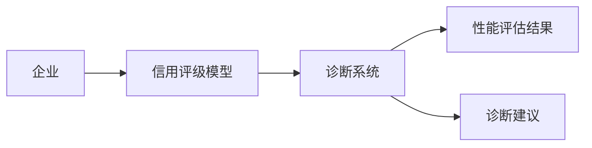

                 


# 设计智能化的企业信用评级模型性能诊断系统

> 关键词：企业信用评级、智能化诊断、性能评估、机器学习、系统架构

> 摘要：本文详细探讨了设计智能化的企业信用评级模型性能诊断系统的核心概念、算法原理、系统架构以及实际应用。通过分析传统信用评级模型的局限性，提出了一种基于机器学习的智能化诊断方法，旨在提高信用评级的准确性和效率。本文还提供了系统的实现方案和实际案例分析，为读者提供了从理论到实践的全面指导。

---

# 第一部分: 企业信用评级模型性能诊断系统背景与概述

## 第1章: 企业信用评级模型的背景与挑战

### 1.1 企业信用评级的重要性

#### 1.1.1 信用评级的定义与作用
信用评级是通过对企业的财务状况、经营能力、偿债能力等多方面因素进行评估，给出一个反映企业信用风险的等级。信用评级不仅帮助企业优化融资策略，还能帮助金融机构降低信贷风险，是现代金融体系中不可或缺的重要工具。

#### 1.1.2 信用评级对企业与金融机构的影响
- 对企业：信用评级影响企业的融资成本和能力，良好的信用评级可以降低融资门槛，获得更优惠的贷款条件。
- 对金融机构：信用评级是金融机构进行信贷决策的重要依据，有助于降低不良贷款率，提高资产质量。

#### 1.1.3 当前信用评级的主要挑战
- 数据繁杂：企业信用信息涉及财务数据、市场表现、行业风险等多个维度，数据量大且复杂。
- 模型局限：传统信用评级模型（如Z分数模型、Altman模型）基于线性假设，难以捕捉复杂的非线性关系。
- 数据更新：企业经营状况动态变化，信用评级需要实时更新和调整。

### 1.2 传统信用评级模型的局限性

#### 1.2.1 传统信用评级模型的分类
- 基于财务数据的模型：如Altman的Z-score模型，主要基于财务指标进行评估。
- 基于专家判断的模型：依赖人工经验判断，主观性强，效率低。
- 基于市场数据的模型：如Merton的期权定价模型，考虑市场波动对企业信用的影响。

#### 1.2.2 传统模型的局限性与不足
- 线性假设：传统模型假设信用风险与财务指标之间是线性关系，忽视了非线性关系。
- 数据维度：传统模型通常只考虑少量财务指标，忽略了其他重要信息（如市场数据、行业趋势）。
- 单一维度：传统模型难以同时考虑定量和定性因素，诊断能力有限。

#### 1.2.3 智能化诊断的必要性
随着企业经营环境的复杂化，传统信用评级模型的局限性日益显现。智能化诊断系统能够通过机器学习算法，从海量数据中提取特征，发现潜在风险，提高诊断准确性和效率。

### 1.3 问题背景与目标

#### 1.3.1 问题背景的详细描述
企业信用评级的准确性直接影响金融机构的信贷决策和风险控制。传统信用评级模型由于其局限性，难以应对复杂多变的市场环境。因此，如何设计一个智能化的诊断系统，提高信用评级的准确性和实时性，是当前亟待解决的问题。

#### 1.3.2 问题解决的必要性
智能化诊断系统能够通过机器学习算法，实时分析企业信用数据，发现潜在风险，为金融机构提供更精准的信用评级结果。

#### 1.3.3 系统的目标与边界
- 目标：设计一个智能化的企业信用评级模型性能诊断系统，能够实时分析企业信用数据，诊断模型性能，提出改进建议。
- 边界：系统仅针对企业信用评级模型的性能进行诊断，不涉及具体的信贷决策。

---

## 第2章: 智能化企业信用评级模型性能诊断系统的核心概念

### 2.1 核心概念与定义

#### 2.1.1 信用评级模型的定义
信用评级模型是基于企业提供的财务数据、市场数据和行业数据，通过一定的算法或规则，对企业信用风险进行评估和等级划分的工具。

#### 2.1.2 性能诊断系统的定义
性能诊断系统是对信用评级模型的输出结果进行分析，评估模型的准确性、稳定性、鲁棒性等性能指标，并提出改进建议的系统。

#### 2.1.3 系统的核心要素与组成
- 数据采集模块：负责采集企业信用数据，包括财务数据、市场数据、行业数据等。
- 模型评估模块：对信用评级模型的输出结果进行评估，计算模型的准确率、召回率、F1值等性能指标。
- 可视化分析模块：将模型性能评估结果以图表形式展示，帮助用户直观理解模型表现。
- 诊断建议模块：根据模型评估结果，提出改进建议，优化信用评级模型的性能。

### 2.2 核心概念的联系与对比

#### 2.2.1 信用评级模型与诊断系统的关联
- 信用评级模型是诊断系统的输入，诊断系统通过对模型输出的分析，评估模型的性能。
- 诊断系统为信用评级模型提供反馈，帮助模型不断优化和改进。

#### 2.2.2 不同模型的性能特征对比
| 模型类型         | 优点                       | 缺点                       |
|------------------|----------------------------|----------------------------|
| 线性模型（如Z-score） | 简单易懂，计算效率高         | 非线性关系捕捉能力有限       |
| 树模型（如决策树） | 能够捕捉非线性关系           | �易过拟合，解释性较差         |
| 神经网络模型      | 高精度，能够捕捉复杂模式       | 训练时间长，解释性差          |

#### 2.2.3 系统架构的实体关系图



---

## 第3章: 智能化诊断系统的核心算法原理

### 3.1 算法原理概述

#### 3.1.1 算法的基本思路
智能化诊断系统通过机器学习算法对信用评级模型的输出结果进行分析，评估模型的性能，并提出改进建议。具体步骤如下：
1. 数据采集：采集企业信用数据，包括财务数据、市场数据、行业数据等。
2. 数据预处理：对数据进行清洗、特征提取和标准化处理。
3. 模型评估：使用机器学习算法（如随机森林、支持向量机等）对信用评级模型的输出结果进行评估，计算模型的性能指标。
4. 性能诊断：根据模型性能指标，诊断模型的优缺点，并提出改进建议。

#### 3.1.2 算法的核心步骤
- 数据预处理：包括数据清洗、特征提取和标准化。
- 模型评估：使用交叉验证、ROC曲线等方法评估模型的性能。
- 性能诊断：根据评估结果，诊断模型的优缺点，并提出优化建议。

#### 3.1.3 算法的输入与输出
- 输入：企业信用数据、信用评级模型的输出结果。
- 输出：模型性能评估结果、诊断建议。

### 3.2 算法流程图


### 3.3 算法实现代码

```python
def performance_diagnosis(model_output, true_labels):
    # 示例代码
    from sklearn.metrics import accuracy_score, recall_score, f1_score
    accuracy = accuracy_score(true_labels, model_output)
    recall = recall_score(true_labels, model_output)
    f1 = f1_score(true_labels, model_output)
    print(f"Accuracy: {accuracy}")
    print(f"Recall: {recall}")
    print(f"F1 Score: {f1}")
```

### 3.4 算法的数学模型与公式

#### 3.4.1 精准率（Precision）
$$ \text{Precision} = \frac{\text{TP}}{\text{TP} + \text{FP}} $$

#### 3.4.2 召回率（Recall）
$$ \text{Recall} = \frac{\text{TP}}{\text{TP} + \text{FN}} $$

#### 3.4.3 F1分数
$$ \text{F1} = \frac{2 \times \text{Precision} \times \text{Recall}}{\text{Precision} + \text{Recall}} $$

---

## 第4章: 智能化诊断系统的优势与实际应用

### 4.1 系统的优势

#### 4.1.1 提高诊断效率
智能化诊断系统能够快速分析海量数据，提高信用评级模型的诊断效率。

#### 4.1.2 提高诊断精度
通过机器学习算法，智能化诊断系统能够捕捉数据中的非线性关系，提高诊断的准确性。

#### 4.1.3 实时监控
智能化诊断系统能够实时监控信用评级模型的性能，及时发现潜在问题，提高金融机构的风险控制能力。

### 4.2 系统的实际应用

#### 4.2.1 金融领域的应用
在银行、保险公司等金融机构中，智能化诊断系统能够帮助机构提高信用评级的准确性，降低信贷风险。

#### 4.2.2 企业风险管理
企业可以通过智能化诊断系统，实时监控自身的信用状况，优化财务管理，提高融资能力。

#### 4.2.3 行业监管
监管机构可以利用智能化诊断系统，监控整个行业的信用风险，制定更加科学的监管政策。

---

## 总结与展望

智能化企业信用评级模型性能诊断系统通过对信用评级模型的性能进行评估和诊断，能够提高信用评级的准确性和效率，为金融机构和企业提供更加可靠的信用评估服务。未来，随着机器学习和大数据技术的不断发展，智能化诊断系统将在金融、企业管理和行业监管等领域发挥越来越重要的作用。

---

**作者：AI天才研究院/AI Genius Institute & 禅与计算机程序设计艺术 /Zen And The Art of Computer Programming**

