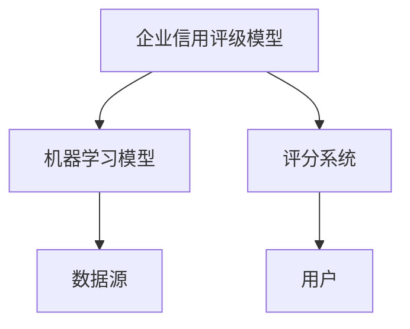
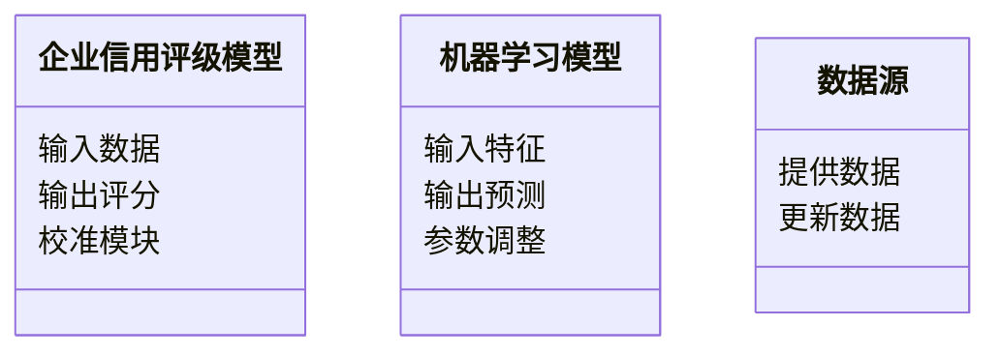
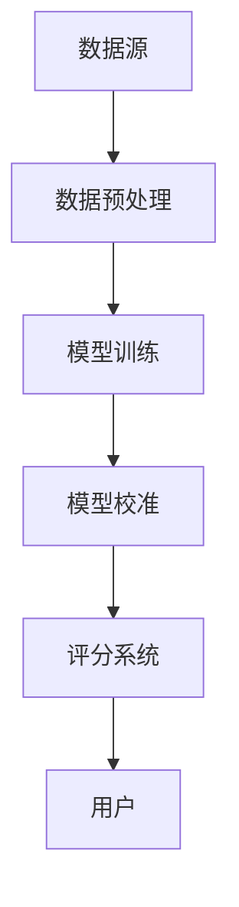
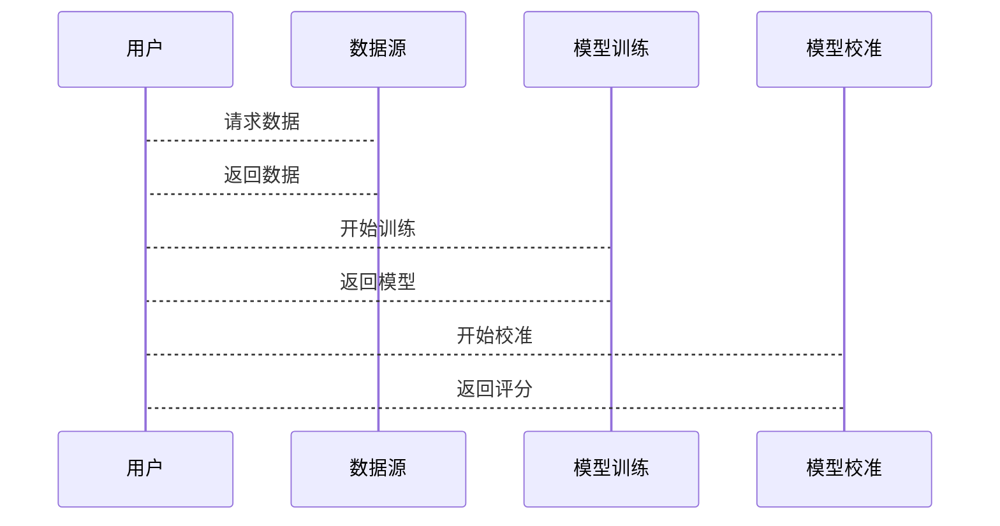

                 


# 设计智能化的企业信用评级模型校准系统

**关键词**：智能化、信用评级、机器学习、校准系统、风险管理、企业征信

**摘要**：随着企业征信需求的不断增加，传统的信用评级模型逐渐暴露出诸多局限性。本文将详细探讨如何设计一个智能化的企业信用评级模型校准系统，从算法原理到系统架构，从项目实战到最佳实践，为您提供全面的技术指导。

---

# 第一部分: 企业信用评级模型校准系统背景与概念

## 第1章: 问题背景与核心概念

### 1.1 问题背景

#### 1.1.1 传统信用评级模型的局限性
传统的信用评级模型主要依赖于静态的、基于规则的评分方法，往往忽略了数据的动态变化和非线性关系。例如，线性回归模型虽然简单，但难以捕捉复杂的市场波动和企业行为。

#### 1.1.2 智能化校准的需求与重要性
随着企业征信需求的增加，传统的模型难以满足实时性和个性化的要求。智能化校准系统能够通过机器学习算法，动态调整模型参数，提高评级的准确性和实时性。

#### 1.1.3 企业信用评级模型的边界与外延
企业信用评级模型的边界包括数据来源、模型输入和输出；外延则涉及风险管理、金融决策等多个领域。

### 1.2 核心概念与联系

#### 1.2.1 核心概念原理
智能化校准系统通过机器学习算法，对信用评级模型进行动态优化，确保模型能够适应市场变化。

#### 1.2.2 核心概念属性特征对比表格
| 概念               | 数据驱动 | 自适应性 | 实时性 |
|--------------------|----------|----------|--------|
| 智能化校准系统      | 高       | 高       | 高      |
| 机器学习模型       | 高       | 高       | 中      |
| 传统信用评级模型   | 低       | 低       | 低      |

#### 1.2.3 ER实体关系图架构


### 1.3 本章小结
本章通过分析传统信用评级模型的局限性，提出了智能化校准系统的概念，并详细介绍了其核心概念和属性特征。

---

# 第二部分: 算法原理与数学模型

## 第2章: 模型校准的数学基础

### 2.1 概率论基础

#### 2.1.1 概率分布
概率分布是机器学习的基础，常见的概率分布包括正态分布、二项分布等。

#### 2.1.2 贝叶斯定理
贝叶斯定理在信用评级中用于计算企业违约的概率：
$$P(A|B) = \frac{P(B|A)P(A)}{P(B)}$$

### 2.2 统计学基础

#### 2.2.1 参数估计
参数估计是通过数据估计模型参数的过程，常用方法包括最大似然估计和贝叶斯估计。

#### 2.2.2 假设检验
假设检验用于验证模型的显著性和合理性。

### 2.3 机器学习模型的数学模型

#### 2.3.1 线性回归模型
线性回归模型用于预测企业的信用评分：
$$y = \beta_0 + \beta_1x + \epsilon$$

#### 2.3.2 非线性模型
非线性模型能够更好地捕捉数据的复杂关系：
$$y = f(x; \theta)$$

### 2.4 本章小结
本章通过概率论和统计学的基础知识，详细介绍了机器学习模型的数学模型和校准方法。

---

# 第三部分: 系统分析与架构设计

## 第3章: 系统分析与架构设计

### 3.1 问题场景介绍
企业信用评级模型校准系统需要解决数据实时更新、模型动态调整等问题。

### 3.2 系统功能设计

#### 3.2.1 领域模型图


### 3.3 系统架构设计

#### 3.3.1 系统架构图


### 3.4 系统接口设计

#### 3.4.1 接口设计
系统提供API接口，支持数据输入、模型训练和评分输出。

#### 3.4.2 交互流程图


### 3.5 本章小结
本章通过系统分析和架构设计，提出了企业信用评级模型校准系统的整体框架和实现方案。

---

# 第四部分: 项目实战与最佳实践

## 第4章: 项目实战

### 4.1 环境安装

#### 4.1.1 安装Python
安装Python 3.8及以上版本。

#### 4.1.2 安装依赖库
安装numpy、pandas、scikit-learn等依赖库。

### 4.2 核心代码实现

#### 4.2.1 数据预处理代码
```python
import pandas as pd
data = pd.read_csv('企业数据.csv')
```

#### 4.2.2 模型训练代码
```python
from sklearn.linear_model import LinearRegression
model = LinearRegression()
model.fit(X_train, y_train)
```

#### 4.2.3 模型校准代码
```python
from sklearn.metrics import mean_squared_error
y_pred = model.predict(X_test)
print(mean_squared_error(y_true, y_pred))
```

### 4.3 代码解读与分析
详细解读代码功能，分析每个模块的作用。

### 4.4 实际案例分析
通过实际案例，展示系统在企业信用评级中的应用。

### 4.5 本章小结
本章通过项目实战，详细介绍了企业信用评级模型校准系统的实现过程。

---

## 第5章: 最佳实践与总结

### 5.1 最佳实践
在实际应用中，建议定期更新模型、选择合适的算法，并注意数据质量和特征选择。

### 5.2 总结与展望
本文详细介绍了企业信用评级模型校准系统的设计与实现，未来可以进一步研究更复杂的算法和实时校准方法。

---

# 作者：AI天才研究院/AI Genius Institute & 禅与计算机程序设计艺术 /Zen And The Art of Computer Programming

