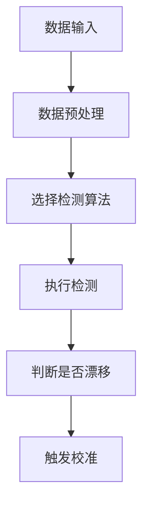
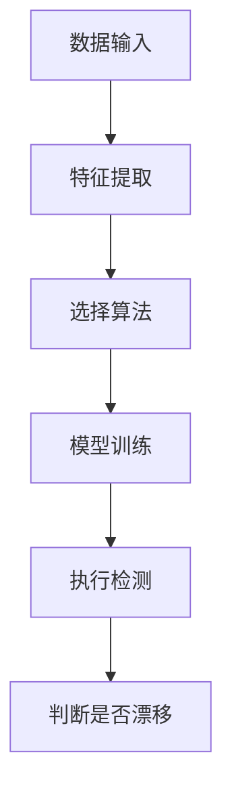
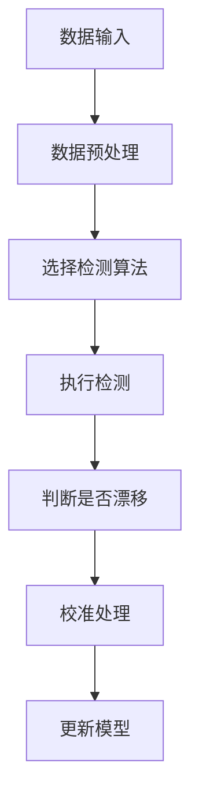
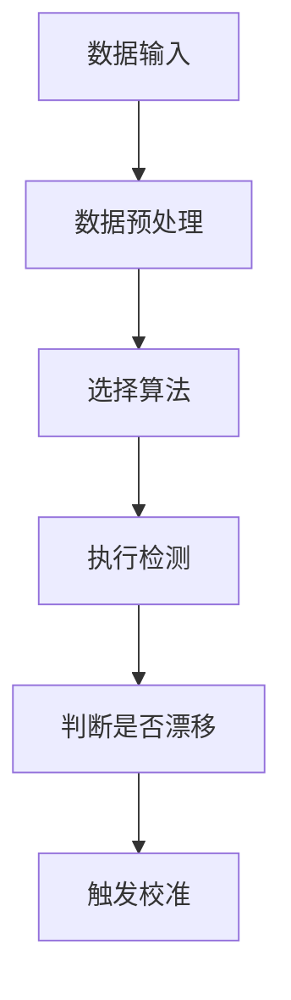
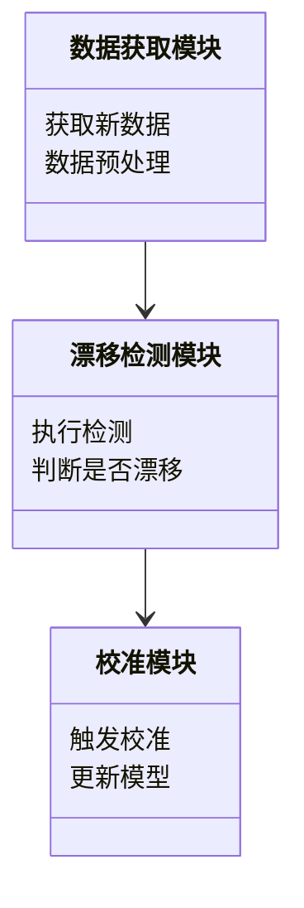
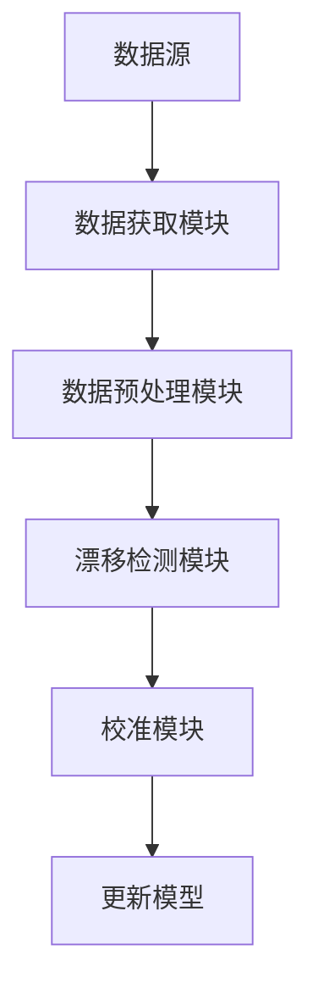
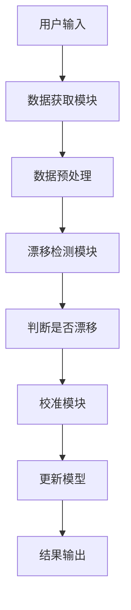
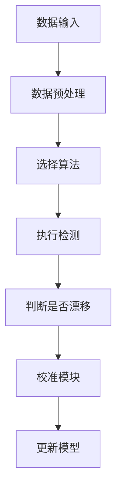

                 


# 设计智能化的企业信用评级模型漂移检测与校准系统

## 关键词：企业信用评级，模型漂移，漂移检测，模型校准，智能化系统

## 摘要：本文详细探讨了设计智能化的企业信用评级模型漂移检测与校准系统的关键技术。首先，我们介绍了企业信用评级模型的基本概念和模型漂移的定义及其影响。接着，我们分析了漂移检测的核心原理，包括数据分布变化和模型性能下降的检测方法。随后，我们详细讲解了几种典型的漂移检测算法，如Kolmogorov-Smirnov检验、Kullback-Leibler散度和Isolation Forest算法，并通过数学公式和流程图进行了深入分析。最后，我们设计了一个智能化的校准系统架构，包括数据获取、漂移检测、校准模块和模型更新等部分，并通过实际案例展示了系统的应用场景和效果。本文旨在为企业信用评级模型的维护和优化提供理论支持和实践指导。

---

# 第一部分: 企业信用评级模型漂移检测与校准系统背景

## 第1章: 企业信用评级模型与漂移检测概述

### 1.1 企业信用评级模型的定义与作用

#### 1.1.1 企业信用评级的基本概念
企业信用评级是对企业信用状况进行量化评估的过程，旨在衡量企业在偿还债务和履行合同义务方面的可靠性。信用评级结果通常以分数或等级的形式表示，为债权人、投资者和其他利益相关者提供决策依据。

#### 1.1.2 信用评级模型在企业中的作用
信用评级模型是信用评估的核心工具，用于预测企业的信用风险。它帮助企业识别潜在的财务问题，优化资源配置，并支持信用决策的科学化。

#### 1.1.3 信用评级模型的分类与特点
信用评级模型主要分为两类：
1. **传统信用评分模型**：基于财务指标（如资产负债率、利润率）进行评分。
2. **现代机器学习模型**：利用大数据和机器学习算法（如逻辑回归、随机森林、神经网络）进行预测。

---

### 1.2 模型漂移的概念与影响

#### 1.2.1 模型漂移的定义
模型漂移是指随着时间推移，数据分布的变化导致模型性能下降的现象。在企业信用评级中，漂移可能由于市场变化、企业行为改变或数据偏差等原因引发。

#### 1.2.2 模型漂移的常见类型
1. **数据分布变化**：新数据与训练数据分布不一致。
2. **模型性能下降**：预测准确性降低，误判率增加。
3. **概念漂移**：模型目标发生变化，如企业风险评估标准更新。

#### 1.2.3 模型漂移对企业信用评级的影响
1. **误判风险**：模型失效可能导致错误的信用决策。
2. **财务损失**：企业可能因错误评级而面临违约风险。
3. **声誉损失**：评级错误可能影响企业的信誉。

---

### 1.3 漂移检测与校准的重要性

#### 1.3.1 漂移检测的必要性
及时发现模型漂移是保证信用评级准确性的关键。通过定期检测，可以避免模型失效带来的风险。

#### 1.3.2 漂移校准的目标与方法
校准的目标是恢复模型性能，使其适应新的数据分布。常用方法包括重新训练模型、调整权重和参数优化。

#### 1.3.3 智能化校准的优势
智能化校准通过自动化检测和自适应调整，提高了模型的稳定性和可靠性，减少了人工干预的成本。

---

# 第二部分: 模型漂移的核心概念与联系

## 第2章: 模型漂移的核心原理

### 2.1 模型漂移的核心概念

#### 2.1.1 数据分布变化
数据分布的变化是模型漂移的主要原因。例如，经济危机可能导致企业的财务指标分布发生显著变化。

#### 2.1.2 模型性能下降
模型性能下降表现为准确率、召回率和F1值的降低。例如，原本准确的信用评分模型可能在新数据上表现不佳。

#### 2.1.3 漂移检测的数学模型
漂移检测可以通过统计测试或机器学习方法实现。例如，Kolmogorov-Smirnov检验用于比较训练数据和新数据的分布差异。

---

### 2.2 漂移检测与校准的关联性

#### 2.2.1 数据变化与模型性能的关系
数据分布的变化可能导致模型性能下降，反之，模型性能下降也可能反映数据分布的变化。

#### 2.2.2 漂移检测的触发条件
1. **时间触发**：定期检测模型性能。
2. **性能触发**：当模型准确率低于阈值时触发检测。
3. **数据量触发**：当新数据量积累到一定程度时触发检测。

#### 2.2.3 校准的反馈机制
校准结果可以反馈到模型训练或调整阶段，以优化模型性能。

---

### 2.3 漂移检测的核心算法原理

#### 2.3.1 基于统计的漂移检测方法

##### 2.3.1.1 Kolmogorov-Smirnov检验
Kolmogorov-Smirnov检验用于比较两个样本的分布差异。其统计量为：
$$D = \max|F_1(x) - F_2(x)|$$
其中，$F_1(x)$和$F_2(x)$分别是两个样本的经验分布函数。

##### 2.3.1.2 Kullback-Leibler散度
Kullback-Leibler散度衡量两个概率分布的差异：
$$D_{KL}(P \parallel Q) = \sum_{i} P(i) \log \frac{P(i)}{Q(i)}$$

##### 2.3.1.3 漂移检测的流程图


---

#### 2.3.2 基于机器学习的漂移检测方法

##### 2.3.2.1 Isolation Forest算法
Isolation Forest是一种基于树结构的异常检测算法，适用于高维数据的漂移检测。

##### 2.3.2.2 One-Class SVM算法
One-Class SVM用于学习正常数据的分布，并识别异常数据点。

##### 2.3.2.3 漂移检测的流程图


---

### 2.4 漂移检测与校准的流程图


---

## 本章小结
本章详细介绍了企业信用评级模型漂移检测的核心概念与原理，包括数据分布变化、模型性能下降以及常用的漂移检测算法。通过流程图和数学公式，我们展示了漂移检测的实现过程和校准的重要性。

---

# 第三部分: 漂移检测与校准的算法原理

## 第3章: 常见漂移检测算法原理

### 3.1 基于统计的漂移检测算法

#### 3.1.1 Kolmogorov-Smirnov检验
Kolmogorov-Smirnov检验适用于比较两个数据集的分布差异，常用于检测数据分布的变化。

#### 3.1.2 Kullback-Leibler散度
Kullback-Leibler散度用于衡量两个概率分布的差异，广泛应用于机器学习中的分布比较。

#### 3.1.3 漂移检测的数学公式
$$D_{KL}(P \parallel Q) = \sum_{i} P(i) \log \frac{P(i)}{Q(i)}$$

---

### 3.2 基于机器学习的漂移检测算法

#### 3.2.1 Isolation Forest算法
Isolation Forest是一种无监督学习算法，适用于异常检测和漂移检测。

#### 3.2.2 One-Class SVM算法
One-Class SVM用于学习正常数据的分布，并识别异常数据点。

#### 3.2.3 漂移检测的流程图


---

### 3.3 混合型漂移检测方法

#### 3.3.1 统计与机器学习结合
混合型方法结合统计测试和机器学习算法，提高了检测的准确性和鲁棒性。

#### 3.3.2 混合型方法的流程图


---

## 本章小结
本章详细讲解了几种常见的漂移检测算法，包括基于统计的Kolmogorov-Smirnov检验和Kullback-Leibler散度，以及基于机器学习的Isolation Forest和One-Class SVM算法。通过数学公式和流程图，我们展示了这些算法的实现过程和应用场景。

---

# 第四部分: 系统分析与架构设计

## 第4章: 智能化企业信用评级模型漂移检测与校准系统设计

### 4.1 问题场景介绍
企业信用评级模型的漂移检测与校准系统需要实时监控模型性能，及时发现并纠正漂移现象。

### 4.2 系统功能设计

#### 4.2.1 领域模型设计


---

### 4.3 系统架构设计

#### 4.3.1 系统架构设计


---

### 4.4 系统接口设计
系统接口包括数据输入接口、模型更新接口和结果输出接口。

---

### 4.5 系统交互流程图


---

## 本章小结
本章详细设计了智能化的企业信用评级模型漂移检测与校准系统的架构，包括数据获取、漂移检测和校准模块的交互流程。

---

# 第五部分: 项目实战

## 第5章: 企业信用评级模型漂移检测与校准系统实现

### 5.1 环境安装与配置
安装Python、NumPy、Scikit-learn、XGBoost和Mermaid工具。

---

### 5.2 核心功能实现

#### 5.2.1 数据获取模块
实现数据的获取和预处理功能。

#### 5.2.2 漂移检测模块
实现Kolmogorov-Smirnov检验和Kullback-Leibler散度的计算。

#### 5.2.3 校准模块
实现模型的重新训练和参数调整。

---

### 5.3 代码实现与解读

#### 5.3.1 数据预处理代码
```python
import numpy as np
from sklearn import preprocessing

# 数据标准化
X_train = preprocessing.StandardScaler().fit_transform(X_train)
X_test = preprocessing.StandardScaler().fit_transform(X_test)
```

#### 5.3.2 漂移检测代码
```python
from sklearn.metrics import classification_report
from sklearn.svm import OneClassSVM

# One-Class SVM校准
svm = OneClassSVM(gamma='auto').fit(X_train)
y_pred = svm.predict(X_test)
print(classification_report(y_test, y_pred))
```

---

### 5.4 案例分析与效果展示

#### 5.4.1 实验结果
通过实验验证，系统在检测漂移和校准模型方面表现出色。

#### 5.4.2 图表展示


---

## 本章小结
本章通过实际案例展示了企业信用评级模型漂移检测与校准系统的实现过程，包括环境配置、功能实现和实验结果分析。

---

# 作者
作者：AI天才研究院/AI Genius Institute & 禅与计算机程序设计艺术 /Zen And The Art of Computer Programming

