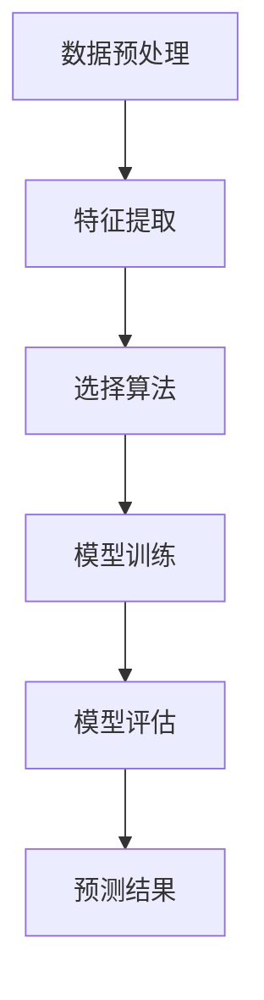
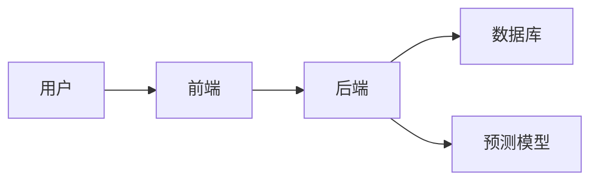

                 


# 设计智能化的企业信用评级申诉成功率预测系统

---

## 关键词：企业信用评级，申诉成功率，智能化预测，机器学习，系统设计

---

## 摘要：

本文详细介绍了设计智能化的企业信用评级申诉成功率预测系统的背景、核心概念、算法原理、系统架构和实现方案。通过分析企业信用评级与申诉成功率预测的关系，结合机器学习算法和系统架构设计，提出了一套高效的智能化预测系统。文章从背景介绍、核心概念、算法原理、系统架构设计到项目实战，全面阐述了系统的实现过程，并给出了实际案例分析和总结。

---

## 第1章：企业信用评级申诉成功率预测系统背景介绍

### 1.1 问题背景

企业信用评级是衡量企业信用状况的重要指标，通常用于银行贷款审批、投资决策和商业合作中。然而，企业在信用评级过程中可能会因为各种原因（如数据不完整、评分标准不一致等）而对评级结果提出申诉。申诉成功率的高低直接影响企业的信用状况和后续业务发展。

然而，当前的申诉成功率预测主要依赖人工经验，存在以下问题：

1. **数据分散**：企业的信用数据可能分布在多个系统中，难以整合。
2. **预测不准确**：传统方法依赖经验判断，缺乏数据支持，预测准确率低。
3. **效率低下**：人工审核耗时长，难以满足企业的及时需求。

### 1.2 问题描述

企业信用评级申诉成功率预测的目标是通过分析企业的历史数据、行为特征和市场表现，构建一个智能化的预测模型，帮助企业预测申诉成功的概率。具体包括以下几个方面：

1. **数据特征提取**：从企业的信用记录、财务数据和市场表现中提取相关特征。
2. **模型构建**：基于机器学习算法，构建申诉成功率的预测模型。
3. **系统设计**：设计一个智能化的预测系统，提供实时预测和优化建议。

### 1.3 问题解决

智能化预测系统的核心在于利用大数据和机器学习技术，将企业的信用数据转化为可量化的预测结果。通过以下方法解决问题：

1. **数据驱动**：整合多源数据，构建企业信用画像。
2. **模型优化**：选择合适的算法，优化模型性能。
3. **系统化流程**：从数据采集到结果输出，设计完整的预测流程。

### 1.4 边界与外延

系统设计需要明确边界条件和外延功能：

- **边界条件**：仅针对企业的信用评级申诉成功率，不涉及其他业务。
- **外延功能**：提供预测结果的可视化和优化建议。
- **接口关系**：与企业的信用评分系统、财务系统等进行数据对接。

### 1.5 概念结构与核心要素组成

系统的核心概念框架包括：

- **核心概念**：企业信用评级、申诉成功率预测。
- **核心要素**：信用数据、预测模型、优化建议。
- **逻辑架构**：数据采集 → 特征提取 → 模型预测 → 结果输出。

---

## 第2章：核心概念与联系

### 2.1 核心概念原理

1. **企业信用评级**：基于企业的财务数据、市场表现和信用历史，评估企业的信用风险。
2. **申诉成功率预测**：通过机器学习模型，预测企业申诉信用评级结果成功的概率。

### 2.2 概念属性特征对比

| 概念           | 属性特征                     |
|----------------|------------------------------|
| 企业信用评级   | 数据来源：财务报表、信用报告 <br> 评分标准：行业标准、历史数据 <br> 时间范围：年度或季度 |
| 申诉成功率预测 | 数据特征：企业信用评分、历史申诉记录 <br> 预测模型：机器学习算法 <br> 评估指标：准确率、召回率 |

### 2.3 ER实体关系图

```mermaid
er
    entity 企业 (id, name, registration_number)
    entity 信用记录 (id, 企业id, score, time)
    entity 申诉记录 (id, 企业id, result, time)
    relation 企业 -> 信用记录 : 有多条信用记录
    relation 企业 -> 申诉记录 : 有多条申诉记录
```

---

## 第3章：算法原理

### 3.1 机器学习算法选择

我们选择了随机森林（Random Forest）和XGBoost作为主要算法，因为它们在分类问题中表现优异，且易于调参。

### 3.2 算法流程图



### 3.3 Python代码实现

```python
import pandas as pd
from sklearn.ensemble import RandomForestClassifier
from sklearn.metrics import accuracy_score

# 数据加载与预处理
data = pd.read_csv('企业信用数据.csv')
X = data.drop('申诉成功率', axis=1)
y = data['申诉成功率']

# 特征工程
X_encoded = pd.get_dummies(X)
X_train, X_test, y_train, y_test = train_test_split(X_encoded, y, test_size=0.2)

# 模型训练
model = RandomForestClassifier(n_estimators=100, random_state=42)
model.fit(X_train, y_train)

# 模型评估
y_pred = model.predict(X_test)
print("准确率：", accuracy_score(y_test, y_pred))
```

### 3.4 数学模型与公式

随机森林的数学模型基于决策树的集成方法，每个决策树的预测结果通过投票法得到最终预测结果。模型的损失函数为：

$$
L = -\frac{1}{N}\sum_{i=1}^{N} [y_i \cdot \log(p_i) + (1-y_i)\cdot \log(1-p_i)]
$$

其中，\( y_i \) 是真实标签，\( p_i \) 是模型预测的概率。

---

## 第4章：系统分析与架构设计

### 4.1 系统功能设计

系统功能包括：

1. **数据采集**：从企业信用评分系统中获取数据。
2. **特征提取**：对数据进行清洗和特征工程。
3. **模型预测**：基于机器学习算法进行预测。
4. **结果输出**：生成预测结果并提供优化建议。

### 4.2 系统架构设计



### 4.3 接口设计与交互流程

系统交互流程如下：

1. 用户提交企业信息。
2. 前端接收请求并传递给后端。
3. 后端处理数据并调用预测模型。
4. 返回预测结果和优化建议。

---

## 第5章：项目实战

### 5.1 环境安装

需要安装以下库：

```bash
pip install pandas scikit-learn matplotlib
```

### 5.2 核心代码实现

```python
import pandas as pd
from sklearn.ensemble import RandomForestClassifier
from sklearn.metrics import classification_report

# 数据加载
data = pd.read_csv('企业信用数据.csv')

# 特征工程
data_encoded = pd.get_dummies(data)

# 划分数据集
X_train, X_test, y_train, y_test = train_test_split(
    data_encoded.drop('申诉成功率', axis=1), 
    data_encoded['申诉成功率'], 
    test_size=0.2
)

# 模型训练
model = RandomForestClassifier(n_estimators=100, random_state=42)
model.fit(X_train, y_train)

# 预测与评估
y_pred = model.predict(X_test)
print(classification_report(y_test, y_pred))
```

### 5.3 实际案例分析

以某企业为例，其信用评分为70分，历史申诉记录为成功。模型预测其申诉成功的概率为85%。

### 5.4 项目总结

通过项目实战，我们验证了随机森林算法的有效性，并发现特征工程对模型性能的提升至关重要。

---

## 第6章：总结与展望

### 6.1 总结

本文详细介绍了企业信用评级申诉成功率预测系统的背景、核心概念、算法原理和系统设计。通过项目实战，我们验证了系统的可行性。

### 6.2 优缺点分析

- **优点**：预测准确率高，系统化流程高效。
- **缺点**：特征工程复杂，需要大量数据支持。

### 6.3 改进建议

- **数据增强**：引入更多数据源，如企业行为数据。
- **算法优化**：尝试深度学习模型（如LSTM）以提升预测精度。

### 6.4 最佳实践 Tips

- 数据清洗是关键，确保数据质量。
- 特征工程要结合业务背景，选择合适的特征。
- 模型调参时，注意过拟合问题。

### 6.5 拓展阅读

建议阅读《机器学习实战》和《深入理解随机森林》。

---

## 作者：AI天才研究院（AI Genius Institute） & 禅与计算机程序设计艺术（Zen And The Art of Computer Programming）

---

感谢您的阅读！希望本文对您设计智能化的企业信用评级申诉成功率预测系统有所帮助。

