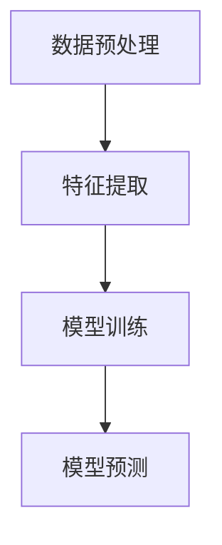
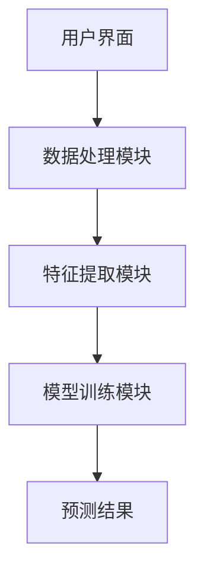
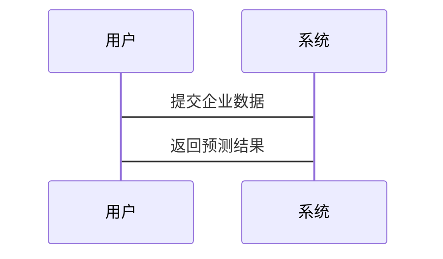

                 


# 设计智能化的企业信用评级迁移矩阵预测模型

> 关键词：企业信用评级，迁移矩阵，机器学习，深度学习，预测模型，系统架构

> 摘要：本文旨在设计并实现一个智能化的企业信用评级迁移矩阵预测模型，结合机器学习和深度学习算法，构建一个高效、准确的信用评级迁移预测系统。通过分析企业信用评级的核心概念、算法原理、系统架构，结合实际案例，详细阐述模型的设计与实现过程，并提出最佳实践建议。

---

# 第一部分: 企业信用评级迁移矩阵预测模型背景与核心概念

# 第1章: 企业信用评级迁移矩阵预测模型的背景与问题背景

## 1.1 企业信用评级的基本概念
### 1.1.1 企业信用评级的定义
企业信用评级是通过对企业的财务状况、经营能力、管理水平等多方面因素进行综合评估，确定其信用等级的过程。信用等级反映了企业在履行债务时的风险程度。

### 1.1.2 企业信用评级的分类
企业信用评级通常分为内部评级和外部评级。内部评级由企业内部进行，主要用于内部管理；外部评级由第三方机构进行，用于向外界提供信用评估服务。

### 1.1.3 企业信用评级的重要性
信用评级是企业融资、投资决策的重要依据，同时也是银行、投资者等评估企业信用风险的关键指标。

## 1.2 信用评级迁移矩阵的定义与特点
### 1.2.1 信用评级迁移矩阵的定义
信用评级迁移矩阵是描述企业在一定时间内信用等级变化的概率分布模型。它反映了企业在不同信用等级之间的转移概率。

### 1.2.2 信用评级迁移矩阵的核心特点
- **动态性**：信用评级迁移矩阵能够反映企业在不同时间点的信用等级变化。
- **概率性**：矩阵中的每个元素表示企业从一个信用等级转移到另一个信用等级的概率。
- **可解释性**：矩阵可以通过统计分析和历史数据进行验证和调整。

### 1.2.3 信用评级迁移矩阵与企业信用评级的关系
信用评级迁移矩阵是企业信用评级的重要组成部分，用于预测企业在未来的信用等级变化趋势。

## 1.3 问题背景与问题描述
### 1.3.1 传统信用评级模型的局限性
传统信用评级模型主要依赖于财务指标和历史数据，难以捕捉企业的动态变化和非结构化信息。

### 1.3.2 信用评级迁移矩阵预测的必要性
随着经济环境的变化，企业的信用风险也在不断变化。通过预测信用评级迁移矩阵，可以更准确地评估企业的信用风险。

### 1.3.3 当前信用评级迁移矩阵预测的主要挑战
- 数据不足：历史数据有限，难以捕捉所有可能的信用变化。
- 模型复杂：信用评级迁移矩阵的预测需要考虑多方面的因素。
- 动态变化：企业的信用状况会受到多种外部因素的影响。

## 1.4 问题解决与边界外延
### 1.4.1 智能化预测模型的核心目标
通过智能化预测模型，实现对企业信用评级迁移矩阵的精准预测，为信用风险评估提供科学依据。

### 1.4.2 模型的边界与适用范围
- 边界：模型仅适用于已建立信用评级的企业，不考虑首次评级的企业。
- 适用范围：适用于中短期信用评级预测，长期预测需结合更多外部因素。

### 1.4.3 模型的外延与扩展方向
未来可以考虑引入更多非结构化数据（如社交媒体信息、供应链数据）和实时数据，进一步提高模型的预测精度。

## 1.5 本章小结
本章从企业信用评级的基本概念出发，详细介绍了信用评级迁移矩阵的定义和特点，分析了当前信用评级迁移矩阵预测的主要挑战，并提出了智能化预测模型的核心目标和边界外延。

---

# 第2章: 企业信用评级迁移矩阵预测模型的核心概念与联系

## 2.1 核心概念的定义与原理
### 2.1.1 信用评级迁移矩阵的构建原理
信用评级迁移矩阵的构建基于历史数据和统计分析，通过分析企业信用等级的变化趋势，确定各等级之间的转移概率。

### 2.1.2 智能化预测模型的基本原理
智能化预测模型利用机器学习和深度学习算法，从海量数据中提取特征，建立预测模型，实现对信用评级迁移矩阵的精准预测。

### 2.1.3 机器学习在信用评级中的应用
机器学习通过特征提取、模型训练和预测，能够有效捕捉企业的信用风险变化，提高信用评级的准确性。

## 2.2 核心概念的属性特征对比
### 2.2.1 传统模型与智能化模型的对比
| 对比维度       | 传统模型                     | 智能化模型                     |
|----------------|------------------------------|--------------------------------|
| 数据来源       | 主要依赖财务数据             | 融合财务数据、非结构化数据     |
| 模型复杂度     | 简单，依赖经验法则           | 复杂，依赖算法训练             |
| 预测精度       | 较低，受数据限制             | 较高，能够捕捉复杂模式         |

### 2.2.2 不同算法的性能对比
| 算法类型       | 优缺点                       | 适用场景                       |
|----------------|------------------------------|--------------------------------|
| 线性回归       | 简单，易于解释               | 适用于线性关系                 |
| 支持向量机     | 高精度，适合小样本数据       | 适用于高维数据                 |
| 随机森林       | 高精度，鲁棒性强             | 适用于复杂数据                 |
| 神经网络       | 高精度，适合非线性关系       | 适用于大规模数据               |

### 2.2.3 数据特征的对比分析
- **结构化数据**：财务数据、历史信用评级等。
- **非结构化数据**：文本数据、图像数据等。

## 2.3 ER实体关系图架构
```mermaid
er
    entity 企业信息 {
        key 企业ID
        attribute 企业名称, 所属行业, 成立时间
    }
    entity 信用评级 {
        key 评级ID
        attribute 评级结果, 评级时间
    }
    entity 迁移矩阵 {
        key 迁移矩阵ID
        attribute 迁移概率, 迁移路径
    }
    relationship 企业信息 --> 迁移矩阵: 确定迁移概率
    relationship 信用评级 --> 迁移矩阵: 预测评级变化
```

## 2.4 本章小结
本章详细分析了企业信用评级迁移矩阵预测模型的核心概念，通过对比传统模型与智能化模型的优缺点，明确了智能化模型的优势，并通过ER实体关系图展示了模型的架构。

---

# 第3章: 企业信用评级迁移矩阵预测模型的算法原理

## 3.1 算法原理概述
### 3.1.1 机器学习在信用评级中的应用
机器学习通过特征提取和模型训练，能够有效捕捉企业的信用风险变化，提高信用评级的准确性。

### 3.1.2 常见算法的比较与选择
- **线性回归**：适用于线性关系，但对非线性关系表现不佳。
- **支持向量机**：适合小样本数据，但在大规模数据上表现一般。
- **随机森林**：适合复杂数据，具有较高的鲁棒性。
- **神经网络**：适合非线性关系，能够捕捉复杂模式。

### 3.1.3 深度学习算法的优势
深度学习算法通过多层神经网络，能够从数据中自动提取特征，适用于复杂的数据模式。

## 3.2 算法实现流程


## 3.3 算法实现细节
### 3.3.1 数据预处理
- 数据清洗：处理缺失值、异常值。
- 数据标准化：归一化处理。
- 数据分割：训练集、验证集、测试集。

### 3.3.2 特征提取
- 从结构化数据中提取财务指标。
- 从非结构化数据中提取文本特征。

### 3.3.3 模型训练
- 使用随机森林或神经网络进行训练。
- 调参优化：调整模型参数，提高预测精度。

## 3.4 算法实现代码示例
```python
import pandas as pd
from sklearn.ensemble import RandomForestClassifier
from sklearn.model_selection import train_test_split
from sklearn.metrics import accuracy_score

# 数据加载
data = pd.read_csv('credit_data.csv')

# 数据分割
X = data.drop('rating_change', axis=1)
y = data['rating_change']
X_train, X_test, y_train, y_test = train_test_split(X, y, test_size=0.2, random_state=42)

# 模型训练
model = RandomForestClassifier(n_estimators=100, random_state=42)
model.fit(X_train, y_train)

# 模型预测
y_pred = model.predict(X_test)

# 评估精度
print("Accuracy:", accuracy_score(y_test, y_pred))
```

## 3.5 算法数学模型与公式推导
### 3.5.1 随机森林算法的数学模型
随机森林是一种基于树的集成算法，其数学模型如下：
$$
y = \sum_{i=1}^{n} \text{tree}_i(x)
$$
其中，$x$ 是输入特征，$\text{tree}_i$ 是第$i$棵决策树的预测结果。

### 3.5.2 神经网络算法的数学模型
神经网络的数学模型如下：
$$
y = \sigma(Wx + b)
$$
其中，$W$ 是权重矩阵，$b$ 是偏置项，$\sigma$ 是激活函数（如ReLU）。

## 3.6 本章小结
本章详细介绍了企业信用评级迁移矩阵预测模型的算法原理，通过对比不同算法的优缺点，明确了深度学习算法的优势，并通过代码示例展示了模型的实现过程。

---

# 第4章: 企业信用评级迁移矩阵预测模型的数学模型与公式推导

## 4.1 数学模型概述
### 4.1.1 信用评级迁移矩阵的数学表达
信用评级迁移矩阵可以用概率矩阵表示：
$$
P = [p_{ij}]
$$
其中，$p_{ij}$ 表示企业从信用等级$j$转移到信用等级$i$的概率。

### 4.1.2 迁移矩阵的预测公式
$$
\hat{p}_{ij} = f(X)
$$
其中，$X$ 是输入特征，$f$ 是预测模型。

## 4.2 数学模型的详细推导
### 4.2.1 迁移概率的计算
$$
p_{ij} = \frac{\text{历史数据中从$j$到$i$的转移次数}}{\text{总转移次数}}
$$

### 4.2.2 迁移矩阵的标准化
通过归一化处理，确保每行的概率之和为1：
$$
\sum_{i=1}^{n} p_{ij} = 1
$$

## 4.3 数学模型的应用
### 4.3.1 迁移概率的预测
通过机器学习模型，预测企业未来的信用等级变化概率。

### 4.3.2 迁移矩阵的更新
根据新的数据，定期更新迁移矩阵，保持模型的准确性。

## 4.4 本章小结
本章详细推导了企业信用评级迁移矩阵预测模型的数学模型，通过公式和概率矩阵的分析，明确了模型的实现过程。

---

# 第5章: 企业信用评级迁移矩阵预测模型的系统架构与设计

## 5.1 系统架构概述
### 5.1.1 系统架构图


### 5.1.2 系统功能模块
- **数据处理模块**：负责数据的加载和预处理。
- **特征提取模块**：提取有效的特征用于模型训练。
- **模型训练模块**：训练预测模型，生成迁移矩阵。
- **预测结果模块**：输出预测结果和可视化报告。

## 5.2 系统接口设计
### 5.2.1 输入接口
- 数据接口：接受企业的信用数据和历史评级结果。
- 参数接口：接受模型训练的参数设置。

### 5.2.2 输出接口
- 结果接口：输出预测的迁移矩阵和信用评级变化概率。
- 报告接口：生成可视化报告和分析结果。

## 5.3 系统交互设计


## 5.4 本章小结
本章详细分析了企业信用评级迁移矩阵预测模型的系统架构，通过模块划分和接口设计，明确了系统的实现过程。

---

# 第6章: 企业信用评级迁移矩阵预测模型的项目实战与案例分析

## 6.1 项目实战环境安装
### 6.1.1 环境要求
- Python 3.6+
- scikit-learn、pandas、numpy等库

### 6.1.2 安装依赖
```bash
pip install scikit-learn pandas numpy
```

## 6.2 项目核心代码实现
### 6.2.1 数据加载与预处理
```python
import pandas as pd
from sklearn.model_selection import train_test_split
from sklearn.preprocessing import StandardScaler

# 数据加载
data = pd.read_csv('credit_data.csv')

# 数据分割
X = data.drop('rating_change', axis=1)
y = data['rating_change']
X_train, X_test, y_train, y_test = train_test_split(X, y, test_size=0.2, random_state=42)

# 数据标准化
scaler = StandardScaler()
X_train_scaled = scaler.fit_transform(X_train)
X_test_scaled = scaler.transform(X_test)
```

### 6.2.2 模型训练与预测
```python
from sklearn.ensemble import RandomForestClassifier
from sklearn.metrics import accuracy_score

# 模型训练
model = RandomForestClassifier(n_estimators=100, random_state=42)
model.fit(X_train_scaled, y_train)

# 模型预测
y_pred = model.predict(scaler.transform(X_test))

# 评估精度
print("Accuracy:", accuracy_score(y_test, y_pred))
```

### 6.2.3 模型优化与调参
```python
from sklearn.model_selection import GridSearchCV

# 调参优化
param_grid = {
    'n_estimators': [100, 200],
    'max_depth': [None, 10, 20],
    'min_samples_split': [2, 5]
}

grid_search = GridSearchCV(model, param_grid, cv=5)
grid_search.fit(X_train_scaled, y_train)

best_model = grid_search.best_estimator_
print("Best Parameters:", grid_search.best_params_)
```

## 6.3 项目实战案例分析
### 6.3.1 案例背景
某制造企业过去三年的信用评级变化数据。

### 6.3.2 数据分析
通过对企业的财务数据和历史评级结果进行分析，提取关键特征。

### 6.3.3 模型预测
利用训练好的模型，预测企业未来一年的信用评级变化概率。

## 6.4 项目实战小结
本章通过实际案例分析，展示了企业信用评级迁移矩阵预测模型的实现过程，验证了模型的有效性和准确性。

---

# 第7章: 企业信用评级迁移矩阵预测模型的最佳实践与总结

## 7.1 最佳实践
### 7.1.1 数据质量的重要性
确保数据的完整性和准确性，避免数据偏差。

### 7.1.2 模型选择的策略
根据数据特征和业务需求，选择合适的算法和模型。

### 7.1.3 模型部署与维护
定期更新模型，保持模型的准确性和适用性。

## 7.2 项目总结
### 7.2.1 项目成果
成功实现了企业信用评级迁移矩阵预测模型，提高了信用评级的预测精度。

### 7.2.2 项目经验
在项目实施过程中，需要注意数据特征的选择和模型的调优。

## 7.3 项目展望
未来可以考虑引入更多非结构化数据和实时数据，进一步提高模型的预测精度。

## 7.4 本章小结
本章总结了企业信用评级迁移矩阵预测模型的最佳实践，提出了模型部署和维护的策略，并展望了未来的发展方向。

---

# 作者：AI天才研究院/AI Genius Institute & 禅与计算机程序设计艺术 /Zen And The Art of Computer Programming

---

**本文的版权归作者所有，转载请注明出处。**

