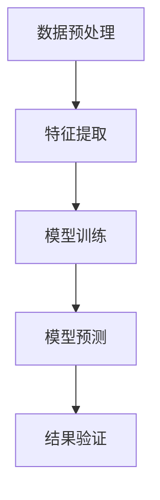
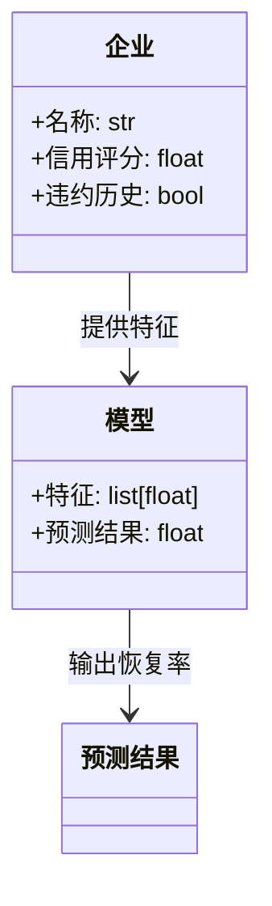

                 


# 设计智能化的企业信用违约恢复率预测模型

> 关键词：企业信用违约，恢复率预测，人工智能，机器学习，金融风险管理

> 摘要：本文详细探讨了设计智能化的企业信用违约恢复率预测模型的关键步骤，包括背景分析、核心概念、算法原理、系统架构、项目实战以及总结与展望。通过结合理论与实践，本文旨在为企业信用风险管理提供一种高效、准确的智能化预测方法。

---

# 第1章: 企业信用违约恢复率预测模型的背景介绍

## 1.1 问题背景

### 1.1.1 信用违约的定义与影响
信用违约是指债务人未能按照合同约定履行还款义务，导致债权人遭受损失的行为。在企业信用风险管理中，信用违约不仅影响企业的财务健康，还可能导致连锁的金融风险。因此，预测信用违约的发生并评估其恢复率是金融风险管理中的核心问题。

### 1.1.2 恢复率预测的重要性
恢复率是指在信用违约发生后，债权人能够收回的债务比例。准确预测恢复率可以帮助企业更好地评估信用风险，制定合理的风险管理策略，并优化资本配置。

### 1.1.3 智能化预测的必要性
传统的信用风险评估方法依赖于人工分析，效率低且容易受到主观因素的影响。随着人工智能和大数据技术的发展，智能化的信用违约恢复率预测模型能够更快、更准确地捕捉复杂的数据特征，提高预测的准确性和效率。

## 1.2 问题描述

### 1.2.1 信用违约的多维度特征
信用违约的特征包括企业财务状况、市场环境、行业风险等多个维度。这些特征可以通过数据化的方法进行建模和分析。

### 1.2.2 恢复率预测的复杂性
恢复率预测涉及多个变量的综合分析，例如违约企业的资产质量、抵押品价值、法律追偿能力等。这些变量之间的复杂关系使得恢复率预测具有较高的难度。

### 1.2.3 数据驱动的预测优势
通过收集和分析大量历史数据，数据驱动的预测方法可以发现传统方法难以捕捉的模式和趋势，从而提高预测的准确性。

## 1.3 问题解决

### 1.3.1 数据收集与处理
数据收集是构建模型的基础，需要获取企业的财务数据、市场数据、行业数据等多维度信息，并进行清洗和预处理。

### 1.3.2 模型构建与优化
基于收集的数据，选择合适的算法构建预测模型，并通过交叉验证等方法优化模型性能。

### 1.3.3 结果验证与应用
通过历史数据验证模型的准确性，并将其应用于实际的信用风险管理中。

## 1.4 边界与外延

### 1.4.1 模型适用的范围
模型适用于企业信用违约的预测，但需注意其适用的行业和数据范围。

### 1.4.2 模型的局限性
模型的预测结果受数据质量和算法选择的影响，可能存在一定的误差。

### 1.4.3 模型的可扩展性
模型可以根据实际需求进行扩展，例如增加新的特征或调整算法参数。

## 1.5 概念结构与核心要素组成

### 1.5.1 核心概念的层次结构
信用违约 → 恢复率 → 预测模型

### 1.5.2 核心要素的属性特征
- 数据特征：多维性、时序性
- 模型特征：可解释性、准确性

### 1.5.3 概念之间的关系
信用违约是恢复率预测的基础，恢复率是信用风险管理的重要指标，预测模型是实现恢复率预测的核心工具。

---

# 第2章: 核心概念与联系

## 2.1 核心概念原理

### 2.1.1 信用违约的多维度分析
信用违约受企业财务状况、市场环境、行业风险等因素的影响，需要通过多维度数据分析来全面评估。

### 2.1.2 恢复率预测的数学模型
恢复率预测模型通常采用回归分析、机器学习等方法，结合多维特征进行建模。

### 2.1.3 数据特征与模型选择
根据数据特征选择合适的模型，例如线性回归适用于线性关系，随机森林适用于非线性复杂关系。

## 2.2 概念属性特征对比表格

| 概念 | 属性 | 特征描述 |
|------|------|----------|
| 信用违约 | 数据类型 | 数值型 |
| 恢复率 | 数据范围 | 0-100% |
| 模型输入 | 特征数量 | 多维特征 |

## 2.3 ER实体关系图

```mermaid
er
  actor: 企业
  model: 模型
  feature: 特征
  prediction: 预测结果
  actor --> model: 输入特征
  model --> prediction: 输出预测
  feature --> prediction: 影响预测
```

---

# 第3章: 算法原理讲解

## 3.1 算法流程



## 3.2 Python源代码实现

```python
import pandas as pd
from sklearn.model import Model

# 数据预处理
data = pd.read_csv('credit_data.csv')
data = data.dropna()

# 特征提取
features = data[['feature1', 'feature2', ...]]
target = data['target']

# 模型训练
model = Model()
model.fit(features, target)

# 模型预测
predictions = model.predict(features)
```

## 3.3 数学模型和公式

### 3.3.1 线性回归模型
$$ y = \beta_0 + \beta_1x_1 + \beta_2x_2 + ... + \beta_nx_n $$

### 3.3.2 逻辑回归模型
$$ P(y=1|x) = \frac{1}{1 + e^{-(\beta_0 + \beta_1x_1 + ... + \beta_nx_n)}} $$

---

# 第4章: 系统分析与架构设计方案

## 4.1 系统功能设计

### 4.1.1 领域模型类图


### 4.1.2 系统架构设计


### 4.1.3 系统接口设计
```mermaid
sequence
    Client -> API Gateway: 发送请求
    API Gateway -> Service Layer: 处理请求
    Service Layer -> Database: 查询数据
    Database --> Service Layer: 返回数据
    Service Layer --> API Gateway: 处理结果
    API Gateway --> Client: 返回响应
```

---

# 第5章: 项目实战

## 5.1 环境安装

```bash
pip install pandas scikit-learn
```

## 5.2 系统核心实现源代码

```python
from sklearn.ensemble import RandomForestRegressor
from sklearn.metrics import mean_squared_error

# 数据加载
data = pd.read_csv('credit_data.csv')

# 特征与目标分离
X = data[['feature1', 'feature2', 'feature3']]
y = data['target']

# 模型训练
model = RandomForestRegressor()
model.fit(X, y)

# 预测与评估
predictions = model.predict(X)
print(mean_squared_error(y, predictions))
```

## 5.3 实际案例分析

### 5.3.1 案例背景
某制造企业因市场波动导致资金链断裂，面临信用违约风险。通过模型预测，其恢复率约为70%。

### 5.3.2 分析结果
模型预测结果表明，该企业的恢复率较高，但需密切关注市场环境的变化。

---

# 第6章: 总结与展望

## 6.1 内容总结
本文详细探讨了企业信用违约恢复率预测模型的设计与实现，从背景分析到系统架构，再到项目实战，全面覆盖了模型构建的各个环节。

## 6.2 注意事项
- 数据质量对模型性能影响重大，需确保数据的准确性和完整性。
- 模型的可解释性在实际应用中同样重要，需结合业务背景进行解释。

## 6.3 拓展阅读
建议读者进一步学习机器学习在金融风险管理中的应用，以及深度学习模型在信用评估中的创新应用。

---

# 作者

作者：AI天才研究院/AI Genius Institute & 禅与计算机程序设计艺术 /Zen And The Art of Computer Programming

