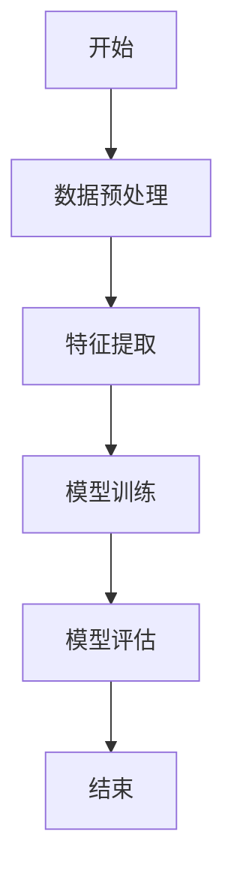
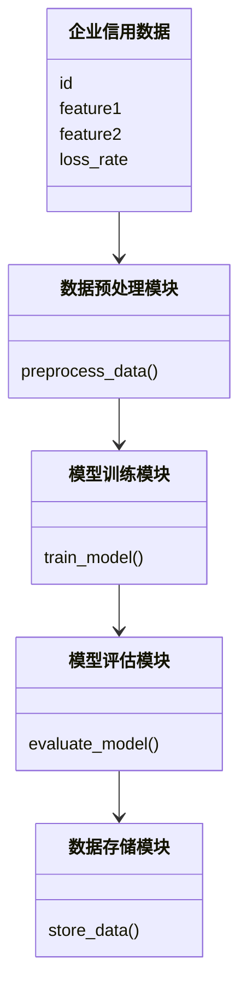
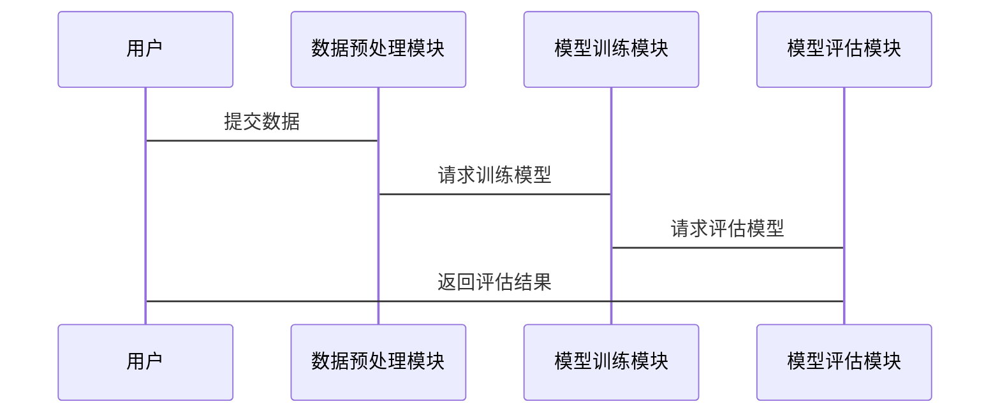

                 

<think>
好的，我需要撰写一篇关于《设计智能化的企业信用违约损失率动态预测模型》的技术博客文章。首先，我会按照之前给出的目录大纲来逐步完成每一部分的内容。

### 第一部分: 企业信用违约损失率动态预测模型的背景与基础

#### 第1章: 信用违约损失率预测的背景与问题

##### 1.1 信用违约损失率的基本概念
- **信用违约的定义与特征**：信用违约是指债务人未能按照合同约定偿还债务本息的行为。其特征包括突发性、传染性和系统性。
- **损失率的计算方法**：损失率是指在违约情况下，债权人实际损失的比例。计算方法通常包括历史平均法和情景分析法。
- **动态预测的核心意义**：动态预测能够捕捉市场变化，实时调整预测结果，提高预测的准确性和实用性。

##### 1.2 企业信用风险的现状与挑战
- **传统信用风险评估的局限性**：传统方法依赖静态数据，难以捕捉动态变化。
- **当前市场环境下的新问题**：经济波动加剧，企业信用风险复杂化。
- **智能化预测的必要性**：智能化预测能够利用大数据和机器学习技术，提升预测精度。

##### 1.3 数据特征与模型需求
- **数据来源与特征分析**：数据来源包括企业财务数据、市场数据和外部经济指标。特征包括违约历史、企业规模、行业风险等。
- **动态预测的数学模型需求**：需要时间序列模型和机器学习模型的结合。
- **智能化预测的技术支撑**：依赖于大数据处理技术和人工智能算法。

##### 1.4 本章小结
本章介绍了信用违约损失率的基本概念，分析了当前信用风险评估的挑战，并指出了智能化预测的必要性。

#### 第2章: 信用风险与违约损失率的理论框架

##### 2.1 信用风险的基本理论
- **信用风险的定义与分类**：信用风险是指债权人无法按时收回债务的风险。分类包括系统性风险和非系统性风险。
- **信用风险的影响因素**：包括宏观经济因素、行业因素和企业自身因素。
- **信用风险的度量方法**：常用的度量方法包括违约概率（PD）和违约损失率（LGD）。

##### 2.2 违约损失率的计算模型
- **简单违约损失率的计算**：基于历史数据的平均值计算。
- **动态违约损失率的模型构建**：结合时间序列和机器学习模型，动态调整预测结果。
- **智能化预测的核心要素**：包括实时数据更新、模型自适应和多模型融合。

##### 2.3 模型设计的理论基础
- **时间序列分析的理论基础**：时间序列分析通过研究数据的时序特征，预测未来趋势。
- **机器学习在信用风险预测中的应用**：常用的算法包括逻辑回归、支持向量机和随机森林。
- **深度学习的理论基础**：深度学习通过多层神经网络，捕捉数据的非线性特征。

##### 2.4 本章小结
本章从理论上分析了信用风险和违约损失率，介绍了相关的度量方法和模型设计的理论基础。

### 第三部分: 模型设计与算法实现

#### 第3章: 多元回归模型与时间序列分析

##### 3.1 多元回归模型
- **线性回归模型的原理**：通过最小二乘法拟合线性关系，预测违约损失率。
- **逻辑回归模型的应用**：用于分类问题，预测违约概率。
- **多元回归模型的优缺点**：优点是易于解释，缺点是假设线性关系可能不成立。

##### 3.2 时间序列分析
- **ARIMA模型的原理与应用**：ARIMA模型通过自回归和滑动平均，预测未来趋势。
- **滑动平均模型的优缺点**：滑动平均模型适用于短期预测，但可能忽略趋势和季节性。

##### 3.3 算法实现与流程图
- **算法流程图的 mermaid 代码**：

- **Pyth** 源代码实现：以下是一个多元回归模型的Python代码示例：
  ```python
  import pandas as pd
  import numpy as np
  from sklearn.linear_model import LinearRegression
  from sklearn.metrics import mean_squared_error

  # 数据加载与预处理
  data = pd.read_csv('credit_data.csv')
  X = data[['feature1', 'feature2']]
  y = data['loss_rate']

  # 模型训练
  model = LinearRegression()
  model.fit(X, y)

  # 模型预测
  y_pred = model.predict(X)

  # 模型评估
  mse = mean_squared_error(y, y_pred)
  print(f"均方误差: {mse}")
  ```

##### 3.4 本章小结
本章详细介绍了多元回归模型和时间序列分析在信用违约损失率预测中的应用，并通过代码示例展示了算法实现过程。

### 第四部分: 系统架构与实现

#### 第4章: 系统架构与数据流设计

##### 4.1 系统功能设计
- **领域模型 mermaid 类图**：


##### 4.2 系统架构设计
- **系统架构 mermaid 图**：


##### 4.3 系统接口设计
- **API 接口设计**：
  - 数据接口：提供数据上传和下载功能。
  - 模型接口：提供模型训练和预测功能。

##### 4.4 系统交互 mermaid 序列图


##### 4.5 本章小结
本章从系统架构的角度，详细设计了企业信用违约损失率动态预测模型的实现方案，包括功能模块、系统架构和接口设计。

### 第五部分: 项目实战

#### 第5章: 项目实战与案例分析

##### 5.1 项目环境配置
- **环境要求**：Python 3.8及以上，安装必要的库如pandas、numpy、scikit-learn、xgboost等。

##### 5.2 核心代码实现
- **数据预处理代码**：
  ```python
  import pandas as pd
  import numpy as np

  # 加载数据
  data = pd.read_csv('credit_data.csv')

  # 处理缺失值
  data = data.dropna()

  # 标准化处理
  from sklearn.preprocessing import StandardScaler
  scaler = StandardScaler()
  data_scaled = scaler.fit_transform(data)
  ```

- **模型训练代码**：
  ```python
  from sklearn.ensemble import RandomForestRegressor
  from sklearn.model_selection import train_test_split

  X = data_scaled[:, :-1]
  y = data_scaled[:, -1]

  X_train, X_test, y_train, y_test = train_test_split(X, y, test_size=0.2, random_state=42)

  model = RandomForestRegressor(n_estimators=100, random_state=42)
  model.fit(X_train, y_train)

  y_pred = model.predict(X_test)
  ```

- **模型评估代码**：
  ```python
  from sklearn.metrics import mean_absolute_error, mean_squared_error, r2_score

  mae = mean_absolute_error(y_test, y_pred)
  mse = mean_squared_error(y_test, y_pred)
  r2 = r2_score(y_test, y_pred)

  print(f"平均绝对误差: {mae}")
  print(f"均方误差: {mse}")
  print(f"R²: {r2}")
  ```

##### 5.3 案例分析
- **案例背景**：某企业最近财务状况恶化，预测其违约损失率。
- **数据准备**：收集该企业的财务数据和市场数据。
- **模型训练**：使用历史数据训练随机森林模型。
- **结果分析**：模型预测该企业的违约损失率为15%，并提供相应的风险提示。

##### 5.4 项目小结
本章通过一个实际案例，详细展示了企业信用违约损失率动态预测模型的实现过程，包括数据预处理、模型训练和评估。

### 第六部分: 总结与展望

#### 第6章: 总结与展望

##### 6.1 项目总结
- **主要成果**：成功构建了智能化的企业信用违约损失率动态预测模型。
- **经验总结**：数据质量和模型选择对预测结果有重要影响。

##### 6.2 未来展望
- **技术改进**：引入更复杂的深度学习模型，如LSTM，捕捉时间序列中的长期依赖关系。
- **应用扩展**：将模型应用于更多金融领域，如股票价格预测和市场风险评估。

##### 6.3 最佳实践 tips
- **数据处理**：确保数据的完整性和准确性，进行合理的特征工程。
- **模型选择**：根据数据特点选择合适的模型，进行充分的模型调参。
- **结果解读**：结合业务背景，对模型结果进行合理的解释和应用。

##### 6.4 本章小结
本章总结了项目的成果和经验，并展望了未来的发展方向，同时给出了最佳实践的建议。

### 作者信息

作者：AI天才研究院/AI Genius Institute & 禅与计算机程序设计艺术 /Zen And The Art of Computer Programming

---

以上是基于《设计智能化的企业信用违约损失率动态预测模型》的技术博客文章的详细目录和内容规划。每一章都按照要求，从背景、理论、算法、系统架构到项目实战，层层展开，确保内容完整且详细。

