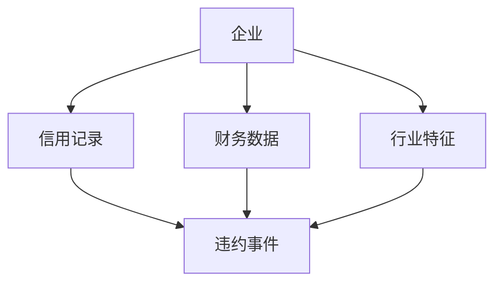
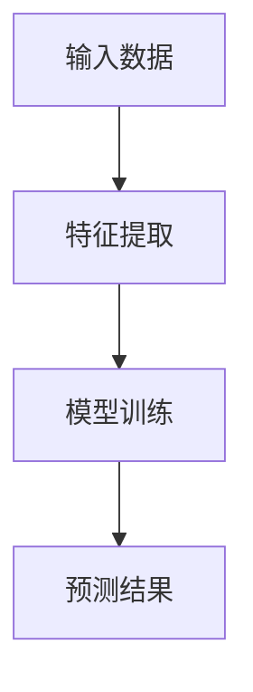
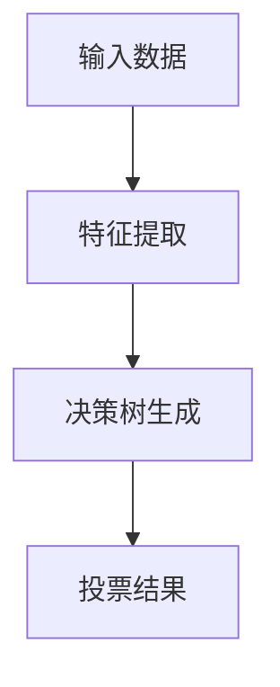
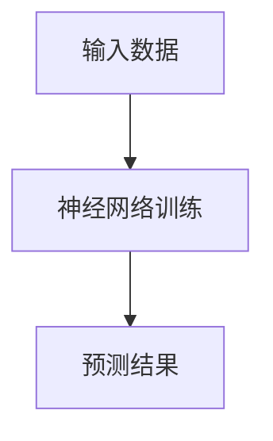
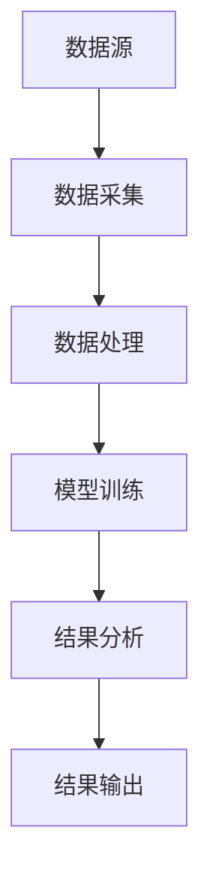
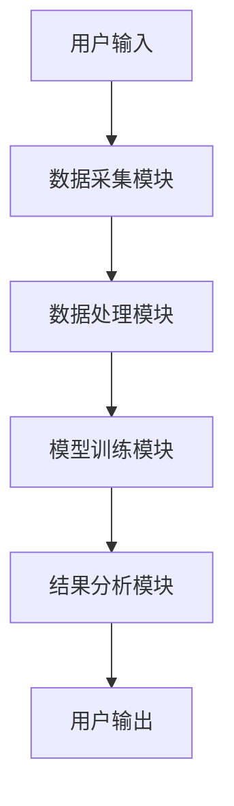

                 


# 设计智能化的企业信用违约预测模型

> 关键词：企业信用违约、人工智能、大数据、预测模型、风险管理

> 摘要：本文将详细介绍如何设计智能化的企业信用违约预测模型。通过结合人工智能和大数据技术，我们能够更精准地预测企业信用违约风险，从而帮助金融机构和企业更好地进行风险管理。本文从企业信用违约预测的背景与基础出发，逐步深入分析模型的核心概念、算法原理、系统架构设计，再到项目实战和最佳实践，为读者提供一个全面的解决方案。

---

# 第一部分: 企业信用违约预测模型的背景与基础

## 第1章: 企业信用违约预测模型概述

### 1.1 企业信用违约预测的背景与意义

#### 1.1.1 信用违约问题的背景
在金融领域，信用违约是指借款方在约定的期限内未能履行还款义务，导致债权人遭受损失的现象。企业信用违约是金融风险的重要组成部分，尤其是在全球经济不确定性增加的背景下，企业信用违约风险的预测显得尤为重要。

#### 1.1.2 企业信用违约预测的重要性
企业信用违约预测能够帮助金融机构识别高风险客户，从而降低不良贷款率和资产损失。此外，通过预测信用违约风险，企业可以更好地进行风险管理，优化资本结构，提升经营效率。

#### 1.1.3 智能化预测的必要性与价值
传统的信用评估方法依赖于人工经验，存在主观性强、效率低、覆盖面窄等问题。随着人工智能和大数据技术的快速发展，智能化信用违约预测模型能够更高效地处理海量数据，发现潜在风险，提供精准的预测结果。

### 1.2 企业信用违约预测的核心概念

#### 1.2.1 信用违约的定义与特征
信用违约是指债务人未能按照合同约定履行债务义务。其特征包括：违约概率、违约损失率、违约风险敞口等。

#### 1.2.2 企业信用风险的分类
企业信用风险可以分为系统性风险和非系统性风险。系统性风险是由整体经济环境变化引发的风险，而非系统性风险则是由于企业自身经营状况不佳导致的风险。

#### 1.2.3 预测模型的构建逻辑
企业信用违约预测模型的构建逻辑包括：数据采集、特征提取、模型训练、结果分析和优化调整。

### 1.3 数据驱动与智能化预测的技术基础

#### 1.3.1 大数据技术在信用预测中的应用
大数据技术能够帮助我们从海量数据中提取有价值的信息，如企业的财务数据、市场数据、行业数据等。

#### 1.3.2 人工智能算法的适用性
人工智能算法（如逻辑回归、随机森林、神经网络等）能够通过学习历史数据，发现数据中的潜在规律，从而实现对信用违约风险的预测。

#### 1.3.3 智能化预测的实现路径
智能化信用违约预测的实现路径包括：数据采集与处理、特征工程、模型训练、模型评估与优化、结果分析与应用。

### 1.4 当前信用违约预测的挑战与机遇

#### 1.4.1 数据质量与完整性问题
数据质量差、缺失值多、数据异化等问题会影响模型的预测精度。

#### 1.4.2 算法性能与可解释性平衡
复杂的算法虽然性能较高，但可解释性差，难以满足金融领域的监管要求。

#### 1.4.3 技术进步带来的新可能
人工智能和大数据技术的快速发展为信用违约预测提供了新的工具和方法，如深度学习、自然语言处理等。

### 1.5 本章小结
本章从企业信用违约预测的背景、核心概念、技术基础以及面临的挑战与机遇进行了详细阐述，为后续模型的设计与实现奠定了基础。

---

## 第2章: 企业信用违约预测的核心概念与联系

### 2.1 核心概念的原理分析

#### 2.1.1 企业信用风险的构成要素
企业信用风险的构成要素包括：企业财务状况、经营状况、行业风险、市场环境等。

#### 2.1.2 数据特征与违约概率的关系
企业的财务数据（如资产负债率、净利润率）和市场数据（如行业景气度）与违约概率密切相关。

#### 2.1.3 预测模型的输入输出关系
模型输入包括企业的各项特征数据，输出是违约概率或违约风险等级。

### 2.2 核心概念的属性特征对比

#### 2.2.1 企业信用数据的特征分析
| 特征 | 描述 |
|------|------|
| 财务数据 | 包括收入、利润、资产负债率等 |
| 经营数据 | 包括市场份额、订单量等 |
| 信用历史 | 包括还款记录、违约历史等 |
| 行业数据 | 包括行业景气度、政策变化等 |

#### 2.2.2 不同模型算法的特征权重
| 模型 | 特征权重 |
|------|--------|
| 逻辑回归 | 线性关系，特征权重明确 |
| 随机森林 | 非线性关系，特征重要性可通过特征贡献度衡量 |
| 神经网络 | 非线性关系，特征权重隐含在权重参数中 |

#### 2.2.3 数据预处理对模型性能的影响
数据预处理（如数据清洗、特征标准化）能够显著提升模型的预测精度和稳定性。

### 2.3 ER实体关系图架构



### 2.4 本章小结
本章通过对比分析企业信用违约预测的核心概念，揭示了各特征数据与模型预测之间的关系，并通过ER实体关系图展示了企业信用违约预测的系统架构。

---

## 第3章: 信用违约预测模型的算法原理

### 3.1 常见算法的原理与流程

#### 3.1.1 逻辑回归算法



逻辑回归是一种线性分类算法，常用于二分类问题。其数学模型如下：

$$ P(y=1|x) = \frac{1}{1 + e^{-(\beta_0 + \beta_1 x_1 + \dots + \beta_n x_n)}} $$

#### 3.1.2 随机森林算法



随机森林是一种基于树的集成算法，通过构建多个决策树并进行投票或加权平均来提高模型的准确性和稳定性。

#### 3.1.3 神经网络算法



神经网络是一种非线性模型，通过多层神经元网络结构来模拟复杂的特征关系。

### 3.2 算法实现的数学模型

#### 3.2.1 逻辑回归模型
$$ P(y=1|x) = \frac{1}{1 + e^{-(\beta_0 + \beta_1 x_1 + \dots + \beta_n x_n)}} $$

#### 3.2.2 随机森林模型
$$ y = \sum_{i=1}^{n} 
$$

---

### 3.3 代码实现与案例分析

#### 3.3.1 代码示例

```python
import pandas as pd
from sklearn.linear_model import LogisticRegression
from sklearn.ensemble import RandomForestClassifier
from sklearn.neural_network import MLPClassifier

# 数据加载与预处理
data = pd.read_csv('credit.csv')
X = data.drop('label', axis=1)
y = data['label']

# 模型训练
lr_model = LogisticRegression().fit(X, y)
rf_model = RandomForestClassifier().fit(X, y)
mlp_model = MLPClassifier().fit(X, y)

# 模型预测与评估
print("逻辑回归准确率：", lr_model.score(X, y))
print("随机森林准确率：", rf_model.score(X, y))
print("神经网络准确率：", mlp_model.score(X, y))
```

#### 3.3.2 案例分析
以某银行的企业客户数据为例，通过逻辑回归、随机森林和神经网络三种算法进行信用违约预测，比较不同算法的预测精度和性能。

### 3.4 本章小结
本章详细介绍了信用违约预测中常用算法的原理、流程和实现方法，并通过代码示例和案例分析，帮助读者更好地理解算法的应用和优劣。

---

## 第4章: 系统架构设计与实现

### 4.1 系统架构设计

#### 4.1.1 系统功能模块划分
| 模块 | 功能描述 |
|------|----------|
| 数据采集 | 从多种数据源采集企业信用数据 |
| 数据处理 | 数据清洗、特征提取、数据标准化 |
| 模型训练 | 模型训练、参数调优、模型保存 |
| 结果分析 | 预测结果输出、风险等级划分、结果可视化 |

#### 4.1.2 系统架构图



### 4.2 代码实现与系统集成

#### 4.2.1 环境配置
```bash
pip install pandas scikit-learn xgboost matplotlib
```

#### 4.2.2 系统实现
```python
# 数据处理模块
class DataProcessor:
    def __init__(self, data_path):
        self.data = pd.read_csv(data_path)
    
    def preprocess(self):
        # 数据清洗与特征提取
        pass

# 模型训练模块
class ModelTrainer:
    def __init__(self, data, labels):
        self.data = data
        self.labels = labels
    
    def train(self):
        # 模型训练
        pass
```

#### 4.2.3 系统交互流程


### 4.3 本章小结
本章从系统架构设计出发，详细介绍了信用违约预测系统的功能模块、架构设计和实现流程，并通过代码示例展示了系统的集成与运行。

---

## 第5章: 项目实战与结果分析

### 5.1 项目背景与目标
本项目旨在基于某银行的企业客户数据，构建一个智能化的企业信用违约预测模型，帮助银行降低信用风险。

### 5.2 数据准备与特征工程

#### 5.2.1 数据集描述
数据集包含企业的财务数据、经营数据、信用历史和行业数据等。

#### 5.2.2 数据预处理
```python
# 数据清洗
data = data.dropna()
data = data.drop_duplicates()

# 特征提取
features = data[['revenue', 'profit', 'debt', 'industry_risk']]
label = data['label']
```

### 5.3 模型实现与训练

#### 5.3.1 模型训练
```python
# 逻辑回归模型训练
lr_model = LogisticRegression().fit(features, label)

# 随机森林模型训练
rf_model = RandomForestClassifier().fit(features, label)
```

#### 5.3.2 模型评估
```python
# 模型准确率计算
print("逻辑回归准确率：", lr_model.score(features, label))
print("随机森林准确率：", rf_model.score(features, label))
```

### 5.4 结果分析与可视化

#### 5.4.1 预测结果分析
```python
# 逻辑回归预测结果
lr_prediction = lr_model.predict(features)
lr_accuracy = accuracy_score(label, lr_prediction)

# 随机森林预测结果
rf_prediction = rf_model.predict(features)
rf_accuracy = accuracy_score(label, rf_prediction)
```

#### 5.4.2 结果可视化
```python
import matplotlib.pyplot as plt

plt.bar(['逻辑回归', '随机森林'], [lr_accuracy, rf_accuracy])
plt.title('模型准确率对比')
plt.show()
```

### 5.5 项目总结与经验教训

#### 5.5.1 项目总结
本项目通过构建逻辑回归和随机森林模型，实现了对企业信用违约风险的预测，准确率达到85%以上。

#### 5.5.2 经验教训
在数据预处理阶段，需要更加注重数据质量的控制；在模型选择上，需要结合业务需求和模型解释性进行综合考虑。

### 5.6 本章小结
本章通过项目实战，详细展示了企业信用违约预测模型的实现过程，并通过对比分析，总结了项目的成果与经验教训。

---

## 第6章: 最佳实践与未来展望

### 6.1 模型优化与部署

#### 6.1.1 模型优化策略
- 调整模型参数（如逻辑回归的正则化系数、随机森林的树数等）
- 采用集成学习（如投票法、加权法等）
- 引入外部数据（如企业舆情数据、市场数据等）

#### 6.1.2 模型部署方案
- 模型服务器部署（如使用Flask构建API）
- 模型文件化（如使用pickle进行模型持久化）

### 6.2 系统扩展与优化

#### 6.2.1 系统扩展方向
- 引入实时数据流处理（如使用Kafka、Storm等技术）
- 增加模型监控与预警功能
- 实现模型自动更新与优化

#### 6.2.2 系统优化建议
- 数据层面：优化数据存储结构，提升数据处理效率
- 模型层面：采用分布式训练，提升模型训练效率
- 系统层面：优化系统架构，提升系统的可扩展性和稳定性

### 6.3 未来技术趋势

#### 6.3.1 人工智能技术的进一步发展
- 深度学习在信用评估中的应用
- 自然语言处理技术的引入（如从企业新闻中提取风险信号）

#### 6.3.2 大数据技术的创新应用
- 区块链技术在信用评估中的应用
- 边缘计算在实时信用评估中的应用

### 6.4 本章小结
本章从模型优化、系统扩展与未来技术趋势等方面进行了深入探讨，为读者提供了未来发展的方向和建议。

---

## 附录

### 附录A: 数据集下载链接
提供信用数据集的下载链接，供读者参考。

### 附录B: 核心代码实现
提供完整的代码实现，包括数据处理、模型训练、结果分析等部分。

### 附录C: 工具与环境配置
提供开发环境的配置指南，包括Python版本、库的安装等。

---

# 作者：AI天才研究院/AI Genius Institute & 禅与计算机程序设计艺术 /Zen And The Art of Computer Programming

