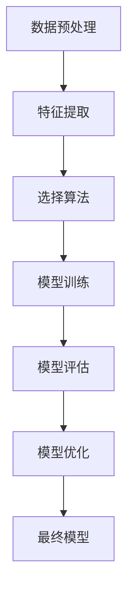

                 


# 设计智能化的企业信用风险定价模型

> 关键词：企业信用风险，智能化，定价模型，机器学习，深度学习，风险管理

> 摘要：随着企业融资需求的不断增加，信用风险定价模型在企业风险管理中的重要性日益凸显。传统的信用风险定价模型在面对复杂多变的市场环境时，往往表现出一定的局限性。而智能化信用风险定价模型通过引入机器学习、深度学习等先进技术，能够更准确地评估企业的信用风险，优化企业的融资效率。本文将详细探讨智能化信用风险定价模型的设计过程，包括核心概念、算法原理、系统架构等，最后通过实际案例展示模型的应用效果。

---

## 第一部分：企业信用风险定价模型概述

### 第1章：企业信用风险定价模型的背景与意义

#### 1.1 信用风险定价的定义与问题背景

- 1.1.1 信用风险的基本概念
  - 信用风险是企业在融资活动中由于债务人违约而导致的损失风险。
  - 信用风险定价是评估企业信用风险并确定其融资成本的过程。

- 1.1.2 信用风险定价的核心问题
  - 如何准确评估企业的信用状况？
  - 如何基于信用评估结果制定合理的融资价格？

- 1.1.3 传统信用风险定价的局限性
  - 依赖于少量的财务指标，难以全面反映企业的信用状况。
  - 无法及时捕捉市场环境的变化，导致定价不够准确。

#### 1.2 企业信用风险定价模型的定义与特点

- 1.2.1 模型的定义
  - 企业信用风险定价模型是基于企业的财务数据、市场数据等信息，通过一定的算法和模型，对企业信用风险进行评估和定价的工具。

- 1.2.2 模型的核心要素
  - 企业财务数据：收入、利润、资产负债情况等。
  - 市场数据：行业景气度、宏观经济指标等。
  - 信用评分：基于数据的信用评分模型。

- 1.2.3 模型的分类与应用场景
  - 基于传统财务指标的信用评分模型。
  - 基于机器学习的信用评分模型。
  - 基于行业特性的定制化信用评分模型。

#### 1.3 智能化信用风险定价模型的发展现状

- 1.3.1 传统模型的局限性
  - 传统模型依赖于线性假设，难以捕捉复杂的数据关系。
  - 传统模型更新周期长，难以应对市场变化。

- 1.3.2 智能化模型的兴起
  - 大数据技术的发展使得更多企业数据的收集和分析成为可能。
  - 人工智能技术的进步提供了更强大的数据分析能力。

- 1.3.3 当前技术与应用趋势
  - 深度学习在信用评分中的应用越来越广泛。
  - 自然语言处理技术开始应用于非结构化数据的分析。

#### 1.4 智能化信用风险定价模型的意义

- 1.4.1 提高风险评估的准确性
  - 通过引入更多的数据源和复杂的算法，模型能够更全面地评估企业的信用风险。

- 1.4.2 降低企业的财务风险
  - 通过准确的信用评分，企业可以更合理地分配融资资源，降低因信用风险带来的损失。

- 1.4.3 优化企业融资效率
  - 智能化模型能够快速处理大量数据，提高信用评估的效率，从而加快企业的融资过程。

#### 1.5 本章小结

- 本章主要介绍了企业信用风险定价模型的背景、定义、核心要素以及智能化模型的发展现状和意义，为后续章节的深入探讨奠定了基础。

---

## 第二部分：智能化信用风险定价模型的核心概念

### 第2章：智能化信用风险定价模型的核心概念

#### 2.1 信用风险定价模型的核心要素

- 2.1.1 企业信用评分
  - 信用评分是衡量企业信用风险的重要指标，通常以分数形式表示。
  - 信用评分越高，企业违约的可能性越小。

- 2.1.2 风险因子分析
  - 风险因子是影响企业信用风险的关键因素，包括财务指标、市场指标等。
  - 通过分析风险因子，可以更好地理解企业的信用风险来源。

- 2.1.3 数据特征提取
  - 数据特征提取是将原始数据转化为模型可以使用的特征的过程。
  - 有效的特征提取能够提高模型的准确性和鲁棒性。

#### 2.2 智能化模型的关键技术

- 2.2.1 机器学习算法
  - 机器学习算法通过学习数据中的模式和关系，自动优化模型参数。
  - 常用的机器学习算法包括逻辑回归、随机森林、支持向量机等。

- 2.2.2 深度学习模型
  - 深度学习模型通过多层神经网络结构，能够自动提取数据的高层次特征。
  - 常用的深度学习模型包括卷积神经网络（CNN）、循环神经网络（RNN）等。

- 2.2.3 自然语言处理技术
  - 自然语言处理技术能够从企业报告、新闻等非结构化数据中提取有用的信息。
  - 这些信息可以作为信用评分的补充数据。

#### 2.3 核心概念的ER实体关系图

```mermaid
er
    entity 企业 (id, name, industry, revenue, profit)
    entity 信用评分 (score, rating, timestamp)
    entity 风险因子 (factor_name, factor_value, factor_type)
    entity 数据特征 (feature_name, feature_value, feature_type)
    relationship 企业 -> 信用评分: 生成
    relationship 企业 -> 风险因子: 包含
    relationship 企业 -> 数据特征: 提供
```

- 企业通过提供财务数据和市场数据生成信用评分。
- 企业包含多个风险因子，每个因子都有具体的数值和类型。
- 企业提供的数据特征包括各种特征名称和特征值。

#### 2.4 核心概念的对比分析

- 2.4.1 传统模型与智能化模型的对比
  - 传统模型：依赖简单的线性关系，模型复杂度低。
  - 智能化模型：能够处理复杂的非线性关系，模型复杂度高。

- 2.4.2 不同算法的性能对比
  - 逻辑回归：适合线性可分的问题，计算速度快。
  - 随机森林：适合高维数据，具有较强的鲁棒性。
  - 深度学习：适合处理复杂数据，模型表达能力强。

- 2.4.3 数据特征的维度对比
  - 传统模型：特征数量少，主要依赖财务指标。
  - 智能化模型：特征数量多，包括财务指标、市场指标、非结构化数据等。

#### 2.5 本章小结

- 本章详细探讨了智能化信用风险定价模型的核心概念，包括信用评分、风险因子和数据特征，并通过ER图和对比分析展示了智能化模型相对于传统模型的优势。

---

## 第三部分：智能化信用风险定价模型的算法原理

### 第3章：智能化信用风险定价模型的算法原理

#### 3.1 机器学习算法在信用评分中的应用

- 3.1.1 逻辑回归
  - 逻辑回归是一种常用的分类算法，适用于二分类问题。
  - 在信用评分中，逻辑回归可以用来预测企业违约的概率。

- 3.1.2 随机森林
  - 随机森林是一种基于决策树的集成算法，具有较强的鲁棒性和抗过拟合能力。
  - 在信用评分中，随机森林可以用来分析多个特征对信用风险的影响。

- 3.1.3 支持向量机
  - 支持向量机是一种基于几何的分类算法，适用于高维数据。
  - 在信用评分中，支持向量机可以用来区分不同信用等级的企业。

#### 3.2 深度学习模型在信用评分中的应用

- 3.2.1 卷积神经网络（CNN）
  - CNN适用于处理图像和序列数据，但在信用评分中的应用较少。
  - 可以将企业的财务数据转化为序列数据，使用CNN进行分析。

- 3.2.2 循环神经网络（RNN）
  - RNN适用于处理序列数据，能够捕捉时间序列中的模式。
  - 在信用评分中，可以用来分析企业的财务数据随时间的变化趋势。

- 3.2.3 �长短时记忆网络（LSTM）
  - LSTM是一种改进的RNN，能够捕捉长期依赖关系。
  - 在信用评分中，LSTM可以用来分析企业财务数据的长期变化趋势。

#### 3.3 算法原理的数学模型

- 3.3.1 逻辑回归的数学模型
  - 逻辑回归的输出公式为：
    $$ P(y=1) = \frac{e^{\beta_0 + \beta_1 x_1 + \cdots + \beta_k x_k}}{1 + e^{\beta_0 + \beta_1 x_1 + \cdots + \beta_k x_k}} $$
  - 其中，$x_i$ 是输入特征，$\beta_i$ 是对应的系数。

- 3.3.2 随机森林的数学模型
  - 随机森林通过构建多个决策树，并对结果进行投票或取平均值来提高模型的准确性和鲁棒性。

- 3.3.3 LSTM的数学模型
  - LSTM的单元包括输入门、遗忘门和输出门，公式如下：
    $$ i = \sigma(W_i x + U_i h) $$
    $$ f = \sigma(W_f x + U_f h) $$
    $$ o = \sigma(W_o x + U_o h) $$
    $$ g = \tanh(W_g x + U_g h) $$
    $$ h' = o \cdot \tanh(g) $$

#### 3.4 算法流程图



- 数据预处理：包括数据清洗、标准化等。
- 特征提取：从原始数据中提取有用的特征。
- 选择算法：根据数据特点选择合适的算法。
- 模型训练：使用训练数据训练模型参数。
- 模型评估：使用测试数据评估模型性能。
- 模型优化：调整模型参数或结构，提高模型性能。
- 最终模型：部署到实际应用中进行信用评分。

#### 3.5 本章小结

- 本章详细介绍了机器学习和深度学习算法在信用评分中的应用，包括逻辑回归、随机森林和LSTM等算法的数学模型和流程图，展示了如何利用这些算法构建智能化的信用评分模型。

---

## 第四部分：智能化信用风险定价模型的系统架构

### 第4章：智能化信用风险定价模型的系统架构

#### 4.1 系统需求分析

- 4.1.1 问题场景介绍
  - 系统需要处理大量的企业数据，包括财务数据、市场数据等。
  - 系统需要提供准确的信用评分，帮助企业进行融资决策。

- 4.1.2 项目介绍
  - 本项目旨在设计一个智能化的企业信用风险定价系统，利用机器学习和深度学习技术，提高信用评分的准确性和效率。

#### 4.2 系统功能设计

- 4.2.1 领域模型类图
  ```mermaid
  classDiagram
      class 企业 {
          id: int
          name: string
          industry: string
          revenue: float
          profit: float
      }
      class 风险因子 {
          factor_name: string
          factor_value: float
          factor_type: string
      }
      class 数据特征 {
          feature_name: string
          feature_value: float
          feature_type: string
      }
      class 信用评分 {
          score: float
          rating: string
          timestamp: datetime
      }
      企业 --> 风险因子: 包含
      企业 --> 数据特征: 提供
      企业 --> 信用评分: 生成
  ```

- 4.2.2 系统架构设计
  ```mermaid
  architecture
      前端 --> 后端: 请求
      后端 --> 数据库: 查询
      后端 --> 模型服务: 调用
      模型服务 --> 数据预处理: 数据处理
      模型服务 --> 训练模块: 模型训练
      模型服务 --> 评估模块: 模型评估
      模型服务 --> 接口服务: 返回结果
  ```

- 4.2.3 系统接口设计
  - 输入接口：企业数据接口、模型参数接口。
  - 输出接口：信用评分接口、风险报告接口。

- 4.2.4 系统交互序列图
  ```mermaid
  sequenceDiagram
      用户 -> 前端: 提交企业数据
      前端 -> 后端: 请求信用评分
      后端 -> 数据库: 查询企业信息
      后端 -> 模型服务: 调用评分模型
      模型服务 -> 数据预处理: 处理数据
      模型服务 -> 训练模块: 训练模型
      模型服务 -> 评估模块: 评估模型
      模型服务 -> 接口服务: 返回评分结果
      后端 -> 用户: 返回信用评分
  ```

#### 4.3 本章小结

- 本章详细介绍了智能化信用风险定价系统的架构设计，包括系统功能模块、系统架构图和系统交互图，展示了系统各部分的协作关系。

---

## 第五部分：智能化信用风险定价模型的项目实战

### 第5章：智能化信用风险定价模型的项目实战

#### 5.1 环境安装与配置

- 5.1.1 环境需求
  - 操作系统：Linux/Windows/MacOS
  - Python版本：3.6及以上
  - 需要安装的库：numpy, pandas, scikit-learn, keras, tensorflow

- 5.1.2 环境配置步骤
  1. 安装Python和必要的库。
  2. 配置开发环境，如Jupyter Notebook或VS Code。
  3. 下载并安装数据库系统，如MySQL或MongoDB。

#### 5.2 系统核心代码实现

- 5.2.1 数据预处理代码
  ```python
  import pandas as pd
  import numpy as np

  # 读取数据
  data = pd.read_csv('enterprise_data.csv')
  # 删除缺失值
  data = data.dropna()
  # 标准化处理
  from sklearn.preprocessing import StandardScaler
  scaler = StandardScaler()
  data_scaled = scaler.fit_transform(data)
  ```

- 5.2.2 模型训练代码
  ```python
  from sklearn.ensemble import RandomForestClassifier
  model = RandomForestClassifier(n_estimators=100, max_depth=10, random_state=42)
  model.fit(X_train, y_train)
  ```

- 5.2.3 模型评估代码
  ```python
  from sklearn.metrics import accuracy_score, precision_score, recall_score
  y_pred = model.predict(X_test)
  print("准确率:", accuracy_score(y_test, y_pred))
  print("精确率:", precision_score(y_test, y_pred))
  print("召回率:", recall_score(y_test, y_pred))
  ```

#### 5.3 代码应用解读与分析

- 5.3.1 数据预处理
  - 数据预处理是确保模型能够正确训练的重要步骤，包括数据清洗和标准化。

- 5.3.2 模型训练
  - 使用随机森林算法训练模型，通过调整参数优化模型性能。

- 5.3.3 模型评估
  - 使用准确率、精确率和召回率等指标评估模型性能。

#### 5.4 实际案例分析

- 5.4.1 案例背景
  - 某企业申请贷款，需要进行信用评分。
  - 企业提供的数据包括财务数据、市场数据等。

- 5.4.2 模型应用
  - 使用训练好的模型对企业数据进行评分，预测企业的信用等级。

- 5.4.3 结果分析
  - 根据模型输出的信用评分，企业获得相应的贷款利率和额度。

#### 5.5 项目总结

- 5.5.1 项目成果
  - 成功构建了一个智能化的信用风险定价模型。
  - 模型能够准确评估企业的信用风险，优化企业的融资效率。

- 5.5.2 经验与教训
  - 数据质量对模型性能影响很大，需要确保数据的准确性和完整性。
  - 模型的选择需要根据具体场景和数据特点进行调整。

- 5.5.3 项目小结
  - 通过实际案例展示了智能化信用风险定价模型的应用效果。
  - 为后续研究提供了参考和借鉴。

#### 5.6 本章小结

- 本章通过实际案例展示了智能化信用风险定价模型的实现过程，包括环境配置、代码实现、模型评估和案例分析，验证了模型的有效性和实用性。

---

## 第六部分：总结与展望

### 第6章：总结与展望

#### 6.1 本项目的核心成果

- 成功设计并实现了智能化的企业信用风险定价模型。
- 模型能够准确评估企业的信用风险，优化企业的融资效率。

#### 6.2 最佳实践 tips

- 数据预处理是模型训练的关键步骤，需要仔细处理缺失值和异常值。
- 模型选择需要根据具体场景和数据特点进行调整，避免盲目使用复杂算法。
- 模型部署需要考虑系统的可扩展性和可维护性，确保模型能够长期稳定运行。

#### 6.3 小结

- 本文详细探讨了智能化企业信用风险定价模型的设计过程，包括核心概念、算法原理、系统架构和项目实战等内容。
- 通过实际案例展示了模型的应用效果，为后续研究提供了参考和借鉴。

#### 6.4 展望

- 随着人工智能技术的不断发展，智能化信用风险定价模型将更加精准和高效。
- 未来可以进一步研究如何利用自然语言处理技术分析企业报告和新闻，提取更多的信用相关信息。
- 同时，可以探索将模型部署到云端，利用大数据技术进一步优化模型性能。

#### 6.5 本章小结

- 本章总结了全文的主要内容，提出了未来的改进方向和研究展望，为读者提供了进一步思考的空间。

---

## 作者：AI天才研究院/AI Genius Institute & 禅与计算机程序设计艺术/Zen And The Art of Computer Programming

---

以上是《设计智能化的企业信用风险定价模型》的目录大纲和内容概要。每一章都详细探讨了相关的核心概念、算法原理和系统架构，并通过实际案例展示了模型的应用效果。希望这篇文章能够为读者提供有价值的技术见解和实践指导。

