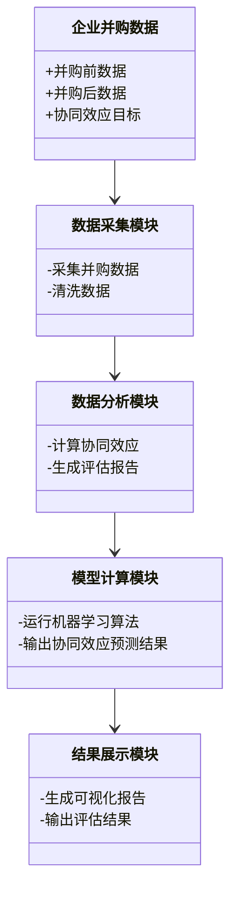
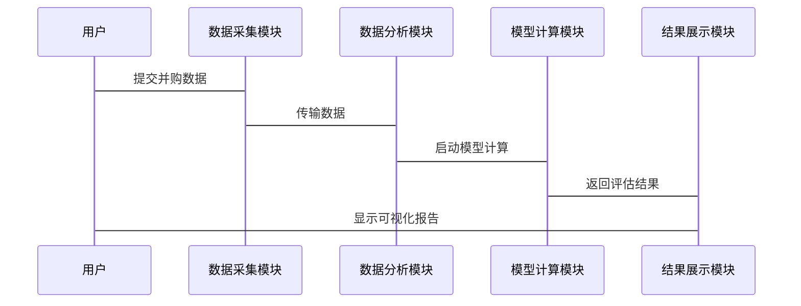

                 


# 设计智能化的企业并购后协同效应量化评估模型

> 关键词：企业并购、协同效应、智能化评估、量化模型、系统架构

> 摘要：企业并购后的协同效应量化评估是企业在并购决策中优化资源配置、降低风险、提升价值的重要手段。本文旨在通过设计智能化的企业并购后协同效应量化评估模型，提出一种基于数据分析和人工智能的解决方案，以克服传统评估方法的局限性。文章详细分析了模型的设计要素、算法原理、系统架构以及项目实现，为企业并购后的协同效应评估提供了理论和实践指导。

---

# 第一部分：企业并购与协同效应概述

## 第1章：企业并购的基本概念

### 1.1 企业并购的定义与类型

#### 1.1.1 企业并购的定义
企业并购是指一家企业通过购买另一家企业的股权或资产，以实现战略目标或提升市场竞争力的行为。企业并购通常分为两种类型：**横向并购**（同一行业内的并购）和**纵向并购**（上下游产业的并购），以及**混合并购**（不同行业或业务的并购）。

#### 1.1.2 并购的类型
- **横向并购**：在同一行业内部进行的并购，旨在扩大市场份额或消除竞争对手。
- **纵向并购**：在产业链上下游之间进行的并购，旨在整合供应链或分销渠道。
- **混合并购**：在不同行业之间进行的并购，旨在多元化经营或开拓新市场。

#### 1.1.3 并购的动机与目标
- **动机**：企业并购的主要动机包括市场扩张、成本节约、获取技术或品牌、提升竞争力等。
- **目标**：企业并购的目标通常包括扩大规模、优化资源分配、提升市场地位等。

### 1.2 协同效应的定义与分类

#### 1.2.1 协同效应的定义
协同效应是指企业在并购后通过资源整合、资源共享和业务协同所产生的一种额外的效益，即**1+1>2**的效果。

#### 1.2.2 协同效应的分类
- **运营协同**：通过整合生产、供应链、销售等环节，降低运营成本，提高效率。
- **财务协同**：通过整合财务资源，优化资本结构，降低融资成本。
- **战略协同**：通过整合战略资源，提升市场地位，增强竞争力。

#### 1.2.3 协同效应的重要性
- 协同效应是企业并购成功的关键因素之一。
- 协同效应能够显著提升企业的整体价值。
- 协同效应是企业在并购后实现可持续发展的核心驱动力。

### 1.3 企业并购中的协同效应量化评估

#### 1.3.1 协同效应的量化目标
- 量化协同效应的具体表现，例如成本节约、收入增加、市场份额提升等。
- 评估协同效应的实现程度和可持续性。

#### 1.3.2 协同效应的评估方法
- **定性评估**：通过专家判断和战略分析，评估协同效应的可能性和潜力。
- **定量评估**：通过财务指标和数据分析，量化协同效应的具体数值。

#### 1.3.3 协同效应的边界与外延
- 协同效应的边界：企业并购后协同效应的实现范围和限制条件。
- 协同效应的外延：协同效应的影响范围和扩展可能性。

---

## 第2章：传统企业并购评估方法的局限性

### 2.1 传统并购评估方法概述

#### 2.1.1 财务指标法
- **净现值（NPV）**：通过折现技术评估并购项目的净现值。
- **内部收益率（IRR）**：评估并购项目的内部收益率。
- **投资回报率（ROI）**：评估并购项目的投资回报率。

#### 2.1.2 交易价格法
- **溢价率**：并购交易中支付的价格相对于目标企业市值的溢价比例。
- **市盈率（P/E）**：目标企业市盈率的评估。
- **市净率（P/B）**：目标企业市净率的评估。

#### 2.1.3 经济增加值法（EVA）
- 经济增加值法通过计算企业经济利润，评估并购项目的价值。

### 2.2 传统方法的局限性

#### 2.2.1 无法全面衡量协同效应
- 传统方法主要关注财务指标，忽视了协同效应的实现过程和具体表现。

#### 2.2.2 忽略了动态变化和不确定性
- 传统方法通常基于静态假设，无法适应并购后的动态变化和不确定性。

#### 2.2.3 缺乏智能化和数据驱动的分析
- 传统方法依赖经验判断，缺乏数据驱动的智能化分析。

### 2.3 智能化评估方法的必要性

#### 2.3.1 数据驱动的决策优势
- 通过大数据分析和人工智能技术，实现更精准的协同效应评估。

#### 2.3.2 智能化模型的准确性
- 智能化模型能够通过机器学习算法，预测协同效应的实现程度。

#### 2.3.3 适应快速变化的商业环境
- 智能化评估方法能够实时适应市场变化和企业战略调整。

---

# 第二部分：协同效应量化评估模型的核心概念

## 第3章：协同效应模型的核心要素

### 3.1 协同效应的构成要素

#### 3.1.1 营销协同
- **客户共享**：通过整合客户资源，提升销售效率。
- **品牌协同**：通过品牌整合，提升品牌价值和市场影响力。

#### 3.1.2 生产协同
- **资源共享**：通过整合生产资源，降低生产成本。
- **效率提升**：通过优化生产流程，提高生产效率。

#### 3.1.3 管理协同
- **组织协同**：通过整合组织架构，优化管理流程。
- **文化协同**：通过文化整合，提升员工凝聚力。

### 3.2 协同效应模型的系统架构

#### 3.2.1 数据采集模块
- 采集企业并购前后的各项数据，包括财务数据、业务数据、市场数据等。

#### 3.2.2 数据分析模块
- 对采集的数据进行清洗、整理和分析，提取关键指标。

#### 3.2.3 模型计算模块
- 通过机器学习算法，计算协同效应的具体数值和实现程度。

#### 3.2.4 结果展示模块
- 以可视化的方式展示协同效应的评估结果，便于企业决策者理解和应用。

---

## 第4章：协同效应模型的算法原理

### 4.1 协同效应计算的数学模型

#### 4.1.1 协同效应的加权平均数计算
- 公式：$$协同效应 = \sum_{i=1}^{n} w_i \cdot x_i$$
  其中，$$w_i$$ 是第i项的权重，$$x_i$$ 是第i项的协同效应值。

#### 4.1.2 协同效应的回归分析
- 通过回归分析，建立协同效应与各项影响因素之间的关系模型。

### 4.2 协同效应评估的机器学习算法

#### 4.2.1 基于随机森林的协同效应预测
- 使用随机森林算法，预测协同效应的实现程度。

#### 4.2.2 基于神经网络的协同效应建模
- 使用深度学习算法，构建协同效应的神经网络模型。

---

# 第三部分：系统分析与架构设计

## 第5章：系统分析与架构设计方案

### 5.1 问题场景介绍
- 描述企业并购后协同效应评估的具体场景，分析存在的问题和挑战。

### 5.2 系统功能设计

#### 5.2.1 领域模型设计
- 使用Mermaid类图，展示协同效应评估系统的功能模块和类之间的关系。



### 5.3 系统架构设计

#### 5.3.1 系统架构图
- 使用Mermaid架构图，展示协同效应评估系统的整体架构。


---

## 第6章：项目实战

### 6.1 环境安装与配置

#### 6.1.1 安装Python环境
- 使用Anaconda或Miniconda安装Python环境，配置必要的库和工具。

#### 6.1.2 安装机器学习库
- 使用pip安装scikit-learn、xgboost、keras等机器学习库。

### 6.2 系统核心实现

#### 6.2.1 数据采集模块实现
```python
import pandas as pd
def collect_data():
    # 读取并购前数据
    pre_merge_data = pd.read_csv('pre_merge.csv')
    # 读取并购后数据
    post_merge_data = pd.read_csv('post_merge.csv')
    return pre_merge_data, post_merge_data
```

#### 6.2.2 数据分析模块实现
```python
from sklearn.ensemble import RandomForestRegressor
def analyze_data(pre_merge_data, post_merge_data):
    # 数据预处理
    data = pd.merge(pre_merge_data, post_merge_data, on='id')
    # 特征工程
    features = data.drop(columns=['协同效应'])
    target = data['协同效应']
    # 模型训练
    model = RandomForestRegressor(n_estimators=100, random_state=42)
    model.fit(features, target)
    return model
```

### 6.3 案例分析与解读

#### 6.3.1 案例分析
- 通过具体案例分析，展示模型的应用过程和结果。

#### 6.3.2 结果解读
- 解读模型计算出的协同效应结果，分析其对企业决策的影响。

---

## 第7章：最佳实践与总结

### 7.1 最佳实践 tips

#### 7.1.1 数据质量的重要性
- 数据的完整性和准确性是模型准确性的基础。

#### 7.1.2 模型调优的技巧
- 使用交叉验证和网格搜索优化模型参数。

#### 7.1.3 结果可视化的重要性
- 通过图表和报告直观展示协同效应的评估结果。

### 7.2 总结

#### 7.2.1 全书内容回顾
- 回顾全书内容，总结协同效应量化评估模型的核心思想和实现方法。

#### 7.2.2 未来展望
- 展望智能化协同效应评估模型的发展方向和应用前景。

---

# 第四部分：系统实现与项目实战

## 第8章：系统实现与项目实战

### 8.1 项目实战

#### 8.1.1 环境安装
- 安装必要的开发工具和库，例如Python、Jupyter Notebook、scikit-learn等。

#### 8.1.2 核心代码实现
```python
import numpy as np
import pandas as pd
from sklearn.ensemble import RandomForestRegressor
from sklearn.metrics import mean_squared_error

def load_data():
    # 加载并购前后的数据
    pre_merge = pd.read_csv('pre_merge.csv')
    post_merge = pd.read_csv('post_merge.csv')
    return pre_merge, post_merge

def preprocess_data(pre_merge, post_merge):
    # 数据合并与预处理
    data = pd.merge(pre_merge, post_merge, on='id')
    # 特征选择
    features = data.drop(columns=['协同效应', 'id'])
    target = data['协同效应']
    return features, target

def train_model(features, target):
    # 模型训练
    model = RandomForestRegressor(n_estimators=100, random_state=42)
    model.fit(features, target)
    return model

def evaluate_model(model, features, target):
    # 模型评估
    y_pred = model.predict(features)
    mse = mean_squared_error(target, y_pred)
    print(f"均方误差：{mse}")
    print(f"平均绝对误差：{np.mean(abs(y_pred - target))}")

pre_merge, post_merge = load_data()
features, target = preprocess_data(pre_merge, post_merge)
model = train_model(features, target)
evaluate_model(model, features, target)
```

#### 8.1.3 案例分析
- 以具体企业并购案例为例，展示模型的应用过程和结果。

### 8.2 系统实现

#### 8.2.1 系统功能模块实现
- 数据采集模块、数据分析模块、模型计算模块和结果展示模块的详细实现。

#### 8.2.2 系统交互设计
- 使用Mermaid序列图展示系统交互流程。



---

## 第9章：总结与展望

### 9.1 总结

#### 9.1.1 全书内容回顾
- 从理论到实践，系统地介绍了企业并购后协同效应量化评估模型的设计过程。

#### 9.1.2 核心观点总结
- 协同效应是企业并购成功的关键因素，智能化评估模型能够显著提升评估的准确性和效率。

### 9.2 未来展望

#### 9.2.1 模型优化方向
- 结合更多数据源和算法，进一步提升模型的准确性和预测能力。

#### 9.2.2 应用场景扩展
- 将模型应用于更多行业和场景，提升企业并购的决策效率和成功率。

---

# 作者：AI天才研究院/AI Genius Institute & 禅与计算机程序设计艺术 /Zen And The Art of Computer Programming

