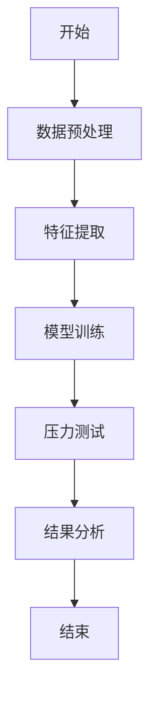
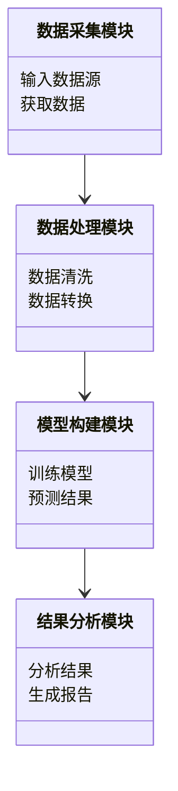
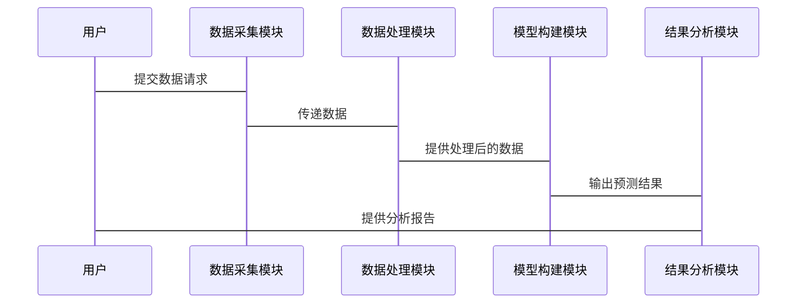

                 


# 设计智能化的企业财务压力测试系统

> 关键词：财务压力测试，人工智能，机器学习，大数据分析，风险管理

> 摘要：本文深入探讨了如何设计智能化的企业财务压力测试系统，结合传统财务分析方法与现代人工智能技术，提出了一种高效、准确的压力测试解决方案。文章从系统架构设计、算法原理、项目实战等多个维度展开，详细阐述了智能化压力测试系统的实现方法和应用价值。

---

# 第1章: 企业财务压力测试系统概述

## 1.1 财务压力测试的基本概念

### 1.1.1 财务压力测试的定义与目的

财务压力测试是一种用于评估企业在特定压力情景下财务状况的方法。通过模拟各种极端市场条件，分析企业的财务健康状况，帮助企业在潜在风险发生前做好准备。

### 1.1.2 财务压力测试的分类与应用场景

财务压力测试可以分为单变量分析、多变量分析和情景分析。常见应用场景包括信用风险、市场风险、流动性风险等。

### 1.1.3 压力测试在企业风险管理中的重要性

压力测试是企业风险管理的重要工具，能够帮助企业在复杂多变的市场环境中识别潜在风险，制定应对策略。

## 1.2 智能化财务压力测试系统的核心优势

### 1.2.1 传统压力测试的局限性

传统压力测试方法依赖人工分析，效率低、精度差，难以应对复杂多变的市场环境。

### 1.2.2 智能化压力测试系统的创新点

智能化压力测试系统利用人工智能和大数据分析技术，实现自动化、智能化的分析过程，提高测试效率和准确性。

### 1.2.3 智能化压力测试系统的潜在价值

智能化压力测试系统能够帮助企业更精准地识别和应对风险，提高企业风险管理能力，降低财务损失。

## 1.3 本章小结

本章介绍了财务压力测试的基本概念、分类及其在企业风险管理中的重要性，同时阐述了智能化压力测试系统的核心优势和潜在价值。

---

# 第2章: 智能化压力测试系统的核心概念

## 2.1 系统组成与功能模块

### 2.1.1 数据采集模块

数据采集模块负责从企业财务系统中获取必要的数据，包括财务报表、市场数据等。

### 2.1.2 数据处理模块

数据处理模块对采集到的数据进行清洗、转换和标准化处理，确保数据质量。

### 2.1.3 模型构建模块

模型构建模块利用机器学习算法，构建压力测试模型，预测企业在不同压力情景下的财务表现。

### 2.1.4 结果分析模块

结果分析模块对测试结果进行分析，生成报告，提出应对策略。

## 2.2 系统工作流程

### 2.2.1 数据输入与预处理

数据输入与预处理是压力测试的第一步，确保数据的准确性和完整性。

### 2.2.2 模型训练与优化

模型训练与优化阶段，系统利用历史数据训练模型，调整参数，提高模型精度。

### 2.2.3 压力测试结果输出

系统根据训练好的模型，模拟不同压力情景下的财务表现，输出测试结果。

## 2.3 核心概念对比分析

### 2.3.1 数据来源对比

对比传统压力测试与智能化压力测试系统的数据来源，分析其差异和优劣。

### 2.3.2 模型类型对比

对比不同模型在压力测试中的表现，选择最优模型。

### 2.3.3 结果分析方法对比

分析不同结果分析方法的优缺点，选择最适合企业需求的方法。

## 2.4 本章小结

本章详细阐述了智能化压力测试系统的核心概念，包括系统组成、工作流程以及核心概念的对比分析。

---

# 第3章: 智能化压力测试系统的算法原理

## 3.1 机器学习算法在压力测试中的应用

### 3.1.1 监督学习与无监督学习的对比

分析监督学习和无监督学习在压力测试中的应用，选择最适合的算法。

### 3.1.2 常见压力测试算法选择

介绍常见的压力测试算法，如线性回归、随机森林、神经网络等。

## 3.2 基于机器学习的压力测试模型

### 3.2.1 损失分布模型（LDA）

详细介绍损失分布模型（LDA）的原理和应用。

### 3.2.2 蒙特卡洛模拟

阐述蒙特卡洛模拟在压力测试中的应用，包括其优缺点。

### 3.2.3 时间序列分析

分析时间序列分析在压力测试中的应用，帮助预测未来财务状况。

## 3.3 算法流程图

### 3.3.1 算法流程图（使用 Mermaid）



## 3.4 数学模型与公式

### 3.4.1 损失分布模型公式

$$ P(L) = \sum_{i=1}^{n} w_i \cdot f_i(L) $$

### 3.4.2 蒙特卡洛模拟基本公式

$$ E[X] = \frac{1}{N} \sum_{i=1}^{N} X_i $$

## 3.5 本章小结

本章详细讲解了机器学习算法在压力测试中的应用，分析了不同算法的优缺点，并通过流程图和数学公式展示了算法的实现过程。

---

# 第4章: 智能化压力测试系统的系统架构与设计

## 4.1 系统功能模块划分

### 4.1.1 数据采集模块

详细描述数据采集模块的功能，包括数据来源和采集方式。

### 4.1.2 数据处理模块

介绍数据处理模块的职责，包括数据清洗、转换和标准化。

### 4.1.3 模型构建模块

阐述模型构建模块的功能，包括模型选择和训练过程。

### 4.1.4 结果分析模块

分析结果分析模块的作用，包括结果解读和报告生成。

## 4.2 系统功能设计

### 4.2.1 领域模型设计（使用 Mermaid 类图）



## 4.3 系统架构设计

### 4.3.1 系统架构图（使用 Mermaid 架构图）


### 4.3.2 系统接口设计

介绍系统与其他模块的接口设计，包括数据接口和结果接口。

## 4.4 系统交互设计

### 4.4.1 系统交互流程图（使用 Mermaid 序列图）



## 4.5 本章小结

本章详细阐述了智能化压力测试系统的系统架构与设计，包括功能模块划分、系统架构图、接口设计和交互流程图。

---

# 第5章: 项目实战

## 5.1 环境安装与配置

### 5.1.1 系统环境要求

介绍运行本系统的硬件和软件要求。

### 5.1.2 安装步骤

详细说明如何安装和配置系统环境。

## 5.2 核心代码实现

### 5.2.1 数据采集模块代码

展示数据采集模块的核心代码，包括数据获取和处理逻辑。

```python
import pandas as pd

def collect_data():
    # 从数据库获取数据
    data = pd.read_sql(...)
    return data
```

### 5.2.2 模型构建模块代码

展示模型构建模块的核心代码，包括模型训练和预测逻辑。

```python
from sklearn.linear_model import LinearRegression

def build_model(X, y):
    model = LinearRegression()
    model.fit(X, y)
    return model
```

### 5.2.3 结果分析模块代码

展示结果分析模块的核心代码，包括结果解读和报告生成。

```python
def generate_report(results):
    # 生成报告
    report = {}
    report['summary'] = ... # 总结
    return report
```

## 5.3 实际案例分析

### 5.3.1 案例背景介绍

介绍实际案例的背景，包括企业基本情况和测试情景。

### 5.3.2 数据分析与建模

详细分析案例数据，构建压力测试模型，预测财务状况。

### 5.3.3 测试结果解读

解读测试结果，分析企业在不同压力情景下的财务表现，提出应对策略。

## 5.4 本章小结

本章通过实际案例分析，展示了智能化压力测试系统的实现过程和应用价值。

---

# 第6章: 最佳实践与总结

## 6.1 最佳实践

### 6.1.1 数据质量控制

强调数据质量在压力测试中的重要性，提出数据清洗和预处理的建议。

### 6.1.2 模型选择与优化

分享模型选择和优化的经验，帮助读者选择最适合的模型。

### 6.1.3 系统维护与更新

提出系统维护和更新的建议，确保系统持续高效运行。

## 6.2 项目总结

### 6.2.1 项目成果

总结项目的主要成果，包括系统功能实现、测试效果等。

### 6.2.2 经验与教训

分享项目实施过程中的经验和教训，为后续项目提供参考。

### 6.2.3 未来展望

展望智能化压力测试系统的未来发展，提出改进建议和方向。

## 6.3 本章小结

本章总结了智能化压力测试系统的最佳实践，项目成果和经验教训，并展望了未来的发展方向。

---

# 作者：AI天才研究院/AI Genius Institute & 禅与计算机程序设计艺术 /Zen And The Art of Computer Programming

---

以上是一个详细且结构化的目录大纲，涵盖了从背景介绍到系统架构设计、项目实战和总结的各个方面。每一章都细化到了三级，确保内容的完整性和深度。

