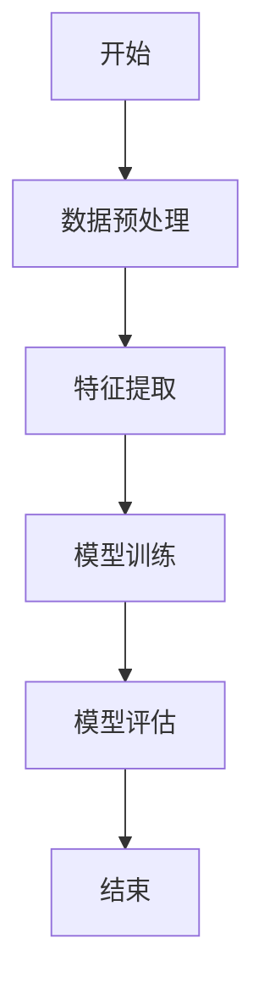
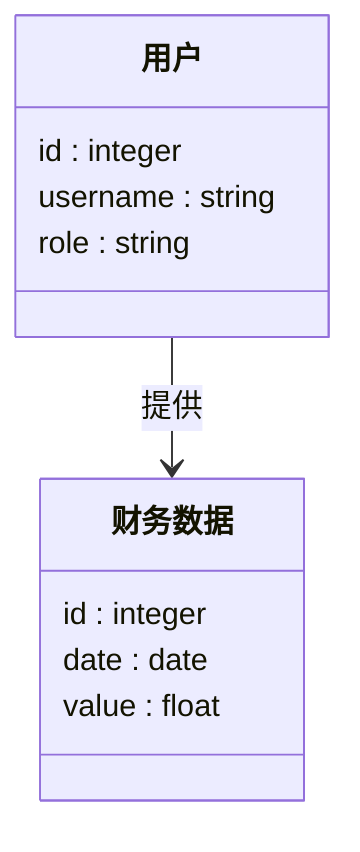
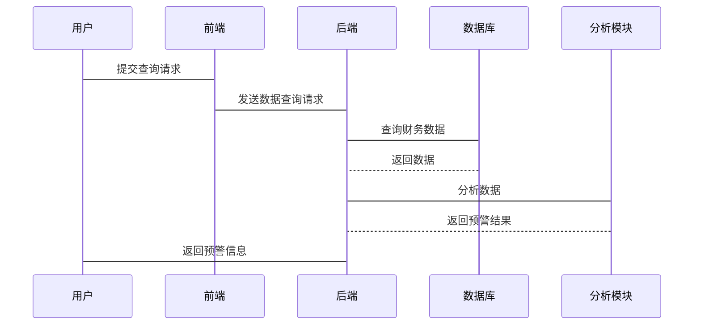

                 


# 设计智能化的企业财务压力预警系统

> 关键词：企业财务压力预警，人工智能，机器学习，财务数据分析，系统架构设计

> 摘要：本文详细讲解了设计智能化企业财务压力预警系统的背景、核心概念、算法原理、系统架构设计及项目实战。通过背景介绍，帮助读者理解财务压力预警的必要性；通过核心概念与系统架构设计，为读者提供理论支持；通过算法原理与数学模型，展示如何利用人工智能技术实现预警；最后通过项目实战，指导读者如何将理论应用于实际。

---

# 第一部分: 企业财务压力预警系统背景与核心概念

## 第1章: 财务压力预警系统背景介绍

### 1.1 问题背景与描述
#### 1.1.1 企业财务压力的定义与特征
企业财务压力是指企业在经营过程中，由于内外部环境变化导致的财务状况恶化，可能引发的财务风险。其特征包括数据多维性、影响复杂性和实时性。

#### 1.1.2 财务压力对企业经营的影响
财务压力可能导致企业流动性不足、信用评级下降、甚至破产。及时预警可以有效降低风险。

#### 1.1.3 财务压力预警的必要性与意义
通过预警系统，企业可以提前发现潜在风险，采取措施避免危机。

### 1.2 问题解决思路
#### 1.2.1 财务压力预警的核心目标
构建实时监测、智能预警的系统。

#### 1.2.2 数据驱动的预警方法
利用财务数据，通过统计分析和机器学习模型实现预警。

#### 1.2.3 人工智能在财务预警中的应用
使用机器学习算法，如逻辑回归和随机森林，进行风险评估。

### 1.3 系统边界与外延
#### 1.3.1 系统的功能边界
包括数据采集、处理、分析和预警模块。

#### 1.3.2 系统的适用范围
适用于各类企业和金融机构。

#### 1.3.3 系统与外部环境的交互
与企业财务系统、外部数据源等进行交互。

### 1.4 核心要素与概念结构
#### 1.4.1 财务数据的采集与处理
包括收入、支出、现金流等数据的采集和清洗。

#### 1.4.2 预警指标的设计与选择
如流动比率、速动比率等关键指标。

#### 1.4.3 系统的用户角色与权限
包括普通用户和管理员权限。

## 第2章: 核心概念与系统架构

### 2.1 核心概念原理
#### 2.1.1 财务压力预警的数学模型
使用线性回归模型预测财务风险。

#### 2.1.2 人工智能算法在预警中的应用
采用随机森林算法进行分类。

#### 2.1.3 多维度数据融合的预警机制
整合财务、市场和行业数据，提高预警准确性。

### 2.2 核心概念对比表
| 对比维度 | 基于传统统计模型 | 基于机器学习模型 |
|----------|------------------|-------------------|
| 预警精度 | 较低             | 较高              |
| 计算复杂度 | 低               | 高                |
| 预警实时性 | 低               | 高                |

### 2.3 ER实体关系图
```mermaid
erDiagram
    customer[用户] {
        id : integer
        username : string
        role : string
    }
    financial_data[财务数据] {
        id : integer
        date : date
        value : float
    }
    warning_rule[预警规则] {
        id : integer
        condition : string
        threshold : float
    }
    customer --> financial_data : 提供
    customer --> warning_rule : 配置
```

### 2.4 本章小结

---

# 第三部分: 算法原理与数学模型

## 第3章: 算法原理讲解

### 3.1 算法概述
#### 3.1.1 机器学习在财务预警中的应用
随机森林算法用于分类，逻辑回归用于回归分析。

#### 3.1.2 常见的财务预警算法
包括逻辑回归、决策树、支持向量机等。

#### 3.1.3 算法选择的依据
数据类型、样本量和业务需求。

### 3.2 算法流程图


### 3.3 算法实现代码
```python
import pandas as pd
from sklearn.ensemble import RandomForestClassifier
from sklearn.metrics import accuracy_score

# 加载数据
data = pd.read_csv('financial_data.csv')

# 特征提取
features = data[['收入', '支出', '现金流']]
target = data['财务风险']

# 模型训练
model = RandomForestClassifier()
model.fit(features, target)

# 预测与评估
predictions = model.predict(features)
print("准确率：", accuracy_score(target, predictions))
```

### 3.4 算法的数学模型和公式
#### 3.4.1 线性回归模型
$$ y = \beta_0 + \beta_1x_1 + \beta_2x_2 + \ldots + \beta_nx_n + \epsilon $$

#### 3.4.2 逻辑回归模型
$$ P(Y=1|X) = \frac{e^{\beta_0 + \beta_1x_1 + \ldots + \beta_nx_n}}{1 + e^{\beta_0 + \beta_1x_1 + \ldots + \beta_nx_n}} $$

### 3.5 本章小结

---

# 第四部分: 系统分析与架构设计方案

## 第4章: 系统分析与架构设计

### 4.1 问题场景介绍
企业财务数据分散，需要实时监测和预警。

### 4.2 项目介绍
开发一个智能化的财务压力预警系统。

### 4.3 系统功能设计
#### 4.3.1 领域模型


### 4.4 系统架构设计


### 4.5 系统接口设计
- 前端接口：RESTful API
- 后端接口：数据处理和分析接口

### 4.6 系统交互


### 4.7 本章小结

---

# 第五部分: 项目实战

## 第5章: 项目实战

### 5.1 环境安装
- 安装Python、Jupyter Notebook、Scikit-learn库。

### 5.2 核心代码实现
```python
from sklearn.model_selection import train_test_split
from sklearn.metrics import classification_report

# 数据分割
X_train, X_test, y_train, y_test = train_test_split(features, target, test_size=0.2)

# 模型训练
model.fit(X_train, y_train)

# 模型测试
print(classification_report(y_test, model.predict(X_test)))
```

### 5.3 案例分析
通过实际数据集，展示系统的预警能力。

### 5.4 项目总结
总结项目的实现过程，提出改进建议。

### 5.5 本章小结

---

# 第六部分: 最佳实践与拓展阅读

## 第6章: 最佳实践 tips

### 6.1 项目开发 tips
- 数据预处理是关键。
- 模型选择要根据数据特性。

### 6.2 系统维护 tips
- 定期更新模型。
- 及时处理异常数据。

## 第7章: 小结

### 7.1 总结
本文详细讲解了企业财务压力预警系统的各个方面，从背景到实现，再到实战。

### 7.2 注意事项
- 数据隐私保护。
- 系统的可扩展性。

## 第8章: 拓展阅读

### 8.1 推荐书籍
- 《机器学习实战》
- 《财务数据分析与挖掘》

### 8.2 推荐博客
- Towards Data Science
- Medium上的相关技术文章

---

# 作者：AI天才研究院 & 禅与计算机程序设计艺术

---

以上是一个详细的目录大纲，涵盖了从背景到系统设计、算法实现、项目实战及拓展阅读的各个方面。每个章节都细化到三级目录，结构清晰，内容完整。希望这个大纲能为您提供有价值的参考！

