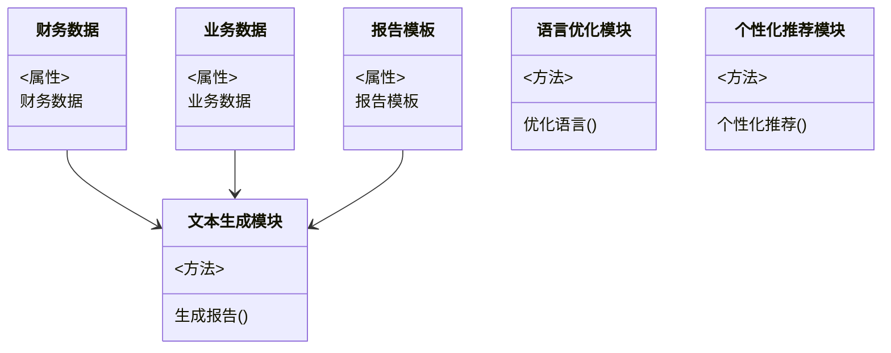
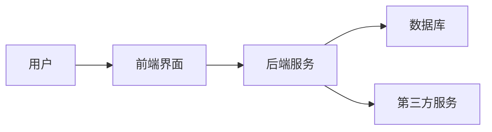

                 


# 设计智能化的企业财务报告可读性增强模型

**关键词：** 智能化、企业财务报告、可读性增强、自然语言处理、机器学习、文本挖掘、数据分析

**摘要：** 本文旨在设计并实现一个智能化的企业财务报告可读性增强模型，通过结合自然语言处理、机器学习和数据分析等技术，提升财务报告的可读性和可理解性。文章详细探讨了模型的背景、核心概念、算法原理、系统架构以及实际应用案例，为企业财务管理的智能化转型提供理论支持和实践指导。

---

# 第1章 企业财务报告的智能化需求

## 1.1 智能化技术在财务领域的应用现状

### 1.1.1 财务领域的智能化转型趋势

随着人工智能技术的快速发展，智能化技术正在逐步渗透到财务管理的各个环节。从自动化记账到智能报表生成，从风险评估到财务预测，智能化技术极大地提升了财务管理的效率和准确性。然而，财务报告的可读性问题仍然存在，尤其是在复杂的企业环境中，财务报告往往过于专业和复杂，难以被非专业人士快速理解和利用。

### 1.1.2 当前企业财务报告的痛点与挑战

企业在生成财务报告时，常常面临以下痛点：

1. **信息量大，结构复杂：** 财务报告通常包含大量的数据和术语，非专业人士难以快速提取关键信息。
2. **可读性差：** 报告中的语言往往过于正式和复杂，导致读者难以理解。
3. **个性化需求：** 不同的读者（如管理层、投资者、审计人员）对报告的需求不同，如何满足个性化需求是一个挑战。
4. **数据孤岛问题：** 各部门之间的数据分散，难以形成统一的财务信息体系。

### 1.1.3 智能化技术在财务报告中的潜在价值

智能化技术（如自然语言处理、机器学习）可以通过以下方式提升财务报告的可读性：

1. **自动优化文本结构：** 根据读者的需求，自动调整报告的结构和语言，使其更易于理解。
2. **智能摘要与关键词提取：** 快速提取报告中的关键信息，生成简洁的摘要，帮助读者快速掌握核心内容。
3. **个性化推荐：** 根据读者的背景和需求，推荐相关的财务信息或解释，提升阅读体验。

---

## 1.2 企业财务报告可读性增强的目标与意义

### 1.2.1 财务报告可读性的重要性

财务报告是企业对外传递信息的重要工具，其可读性直接影响企业的形象和投资者的信心。可读性差的报告不仅难以被利用，还可能导致误解和决策失误。

### 1.2.2 智能化增强可读性的核心目标

本模型的核心目标是通过智能化技术，实现以下功能：

1. **自动优化报告结构：** 根据报告内容和读者需求，动态调整文本的组织方式。
2. **智能语言优化：** 使用自然语言生成技术，将复杂的财务术语转化为更易理解的语言。
3. **个性化信息呈现：** 根据读者的背景和需求，定制化地呈现财务信息。

### 1.2.3 本模型对企业财务管理的创新意义

本模型的创新之处在于，它不仅关注数据的准确性和完整性，还关注数据的可理解性和可操作性。通过智能化技术，模型能够帮助财务人员更高效地生成和优化报告，同时也能帮助非专业人士更好地理解和利用财务信息。

---

## 1.3 本章小结

本章从智能化技术在财务领域的应用现状出发，分析了企业财务报告在可读性方面的痛点和挑战，并提出了智能化增强可读性的核心目标和意义。下一章将详细探讨模型的核心概念与框架设计。

---

# 第2章 核心概念与模型框架

## 2.1 智能化增强可读性的核心概念

### 2.1.1 问题背景与问题描述

财务报告的可读性问题本质上是一个复杂的文本优化问题。如何通过技术手段提升文本的可读性，是本模型的核心目标。

### 2.1.2 模型的边界与外延

模型的边界主要集中在财务报告的文本生成和优化环节，不涉及数据的采集和初步处理。外延则包括所有与财务报告可读性相关的技术，如自然语言处理、文本挖掘等。

### 2.1.3 核心要素与概念结构

模型的核心要素包括：

1. **输入数据：** 财务数据、业务数据、报告模板。
2. **处理模块：** 文本生成、语言优化、个性化推荐。
3. **输出结果：** 优化后的财务报告、智能摘要、个性化信息。

---

## 2.2 核心概念的属性与特征对比

### 2.2.1 概念属性对比表格

以下是一个概念属性对比表格：

| 概念         | 属性1：数据来源 | 属性2：处理技术 | 属性3：输出形式 |
|--------------|-----------------|-----------------|-----------------|
| 文本生成     | 财务数据         | 自然语言处理    | 结构化文本       |
| 语言优化     | 优化后的文本     | 语言模型        | 非结构化文本     |
| 个性化推荐   | 用户需求         | 机器学习        | 关联信息         |

### 2.2.2 ER实体关系图架构

以下是一个ER实体关系图：


---

## 2.3 模型框架的设计与实现

### 2.3.1 模型的整体架构

模型的整体架构可以分为以下几个部分：

1. **数据输入：** 包括财务数据、业务数据、报告模板。
2. **文本生成：** 根据输入数据生成初步的财务报告。
3. **语言优化：** 使用自然语言处理技术优化报告的语言和结构。
4. **个性化推荐：** 根据用户需求生成个性化的内容。

### 2.3.2 关键模块的功能描述

1. **文本生成模块：** 根据输入的财务数据，生成初步的财务报告。
2. **语言优化模块：** 使用自然语言处理技术，优化报告的语言和结构。
3. **个性化推荐模块：** 根据用户需求，生成个性化的财务信息。

### 2.3.3 模块之间的交互关系

模块之间的交互关系如下：


---

## 2.4 本章小结

本章详细探讨了模型的核心概念和框架设计，分析了各模块的功能和交互关系。下一章将从算法原理的角度，详细探讨模型的实现细节。

---

# 第3章 算法原理与数学模型

## 3.1 模型算法的原理与流程

### 3.1.1 算法流程图

算法流程图如下：


### 3.1.2 算法实现的代码示例

以下是一个简单的算法实现示例：

```python
def preprocess(data):
    # 数据预处理代码
    pass

def feature_extraction(data):
    # 特征提取代码
    pass

def model_training(features):
    # 模型训练代码
    pass
```

### 3.1.3 算法的优化与改进

为了提高算法的效率和准确性，可以采用以下优化策略：

1. **数据增强：** 通过数据增强技术，增加训练数据的多样性。
2. **模型调优：** 使用交叉验证等技术，优化模型的参数。
3. **分布式计算：** 利用分布式计算技术，提高模型的训练效率。

---

## 3.2 数学模型与公式

### 3.2.1 模型的核心数学公式

$$
\text{可读性评分} = f(\text{文本结构}, \text{语言复杂度}, \text{信息完整性})
$$

### 3.2.2 公式的详细解释与举例

可读性评分的计算公式中，$f$ 是一个综合函数，考虑了文本的结构、语言复杂度和信息完整性。例如，如果文本结构清晰，语言复杂度适中，信息完整性高，那么可读性评分就会较高。

### 3.2.3 公式的实际应用案例

以下是一个实际应用案例：

$$
\text{可读性评分} = 0.4 \times \text{文本结构} + 0.3 \times \text{语言复杂度} + 0.3 \times \text{信息完整性}
$$

---

## 3.3 本章小结

本章详细探讨了模型的算法原理和数学模型，分析了算法的实现流程和优化策略。下一章将从系统架构的角度，详细探讨模型的实现细节。

---

# 第4章 系统分析与架构设计方案

## 4.1 问题场景介绍

### 4.1.1 问题背景

财务报告的生成和优化是一个复杂的系统工程，需要考虑数据的采集、处理、分析和呈现等多个环节。

### 4.1.2 问题描述

如何通过智能化技术，实现财务报告的自动化生成和优化，是本模型的核心目标。

---

## 4.2 系统功能设计

### 4.2.1 领域模型设计

领域模型设计如下：



### 4.2.2 系统架构设计

系统架构设计如下：



### 4.2.3 接口设计

接口设计如下：


### 4.2.4 交互流程

交互流程如下：


---

## 4.3 本章小结

本章详细探讨了系统的功能设计和架构设计，分析了各模块的交互关系。下一章将从项目实战的角度，详细探讨模型的实现细节。

---

# 第5章 项目实战

## 5.1 环境搭建

### 5.1.1 开发环境

开发环境包括：

1. Python 3.8+
2. PyTorch 1.9+
3. NLTK 3.6+
4. Jupyter Notebook

### 5.1.2 依赖安装

依赖安装命令：

```bash
pip install numpy pandas torch nltk
```

---

## 5.2 系统核心实现

### 5.2.1 核心代码实现

以下是一个核心代码实现示例：

```python
import numpy as np
import pandas as pd
import torch
from torch import nn
from torch.utils.data import DataLoader

class Model(nn.Module):
    def __init__(self, input_dim, output_dim):
        super(Model, self).__init__()
        self.fc1 = nn.Linear(input_dim, 64)
        self.fc2 = nn.Linear(64, output_dim)
    
    def forward(self, x):
        x = torch.relu(self.fc1(x))
        x = torch.sigmoid(self.fc2(x))
        return x

# 训练数据
X_train = np.random.randn(100, 64)
y_train = np.random.randn(100, 1)

# 模型训练
model = Model(64, 1)
criterion = nn.MSELoss()
optimizer = torch.optim.Adam(model.parameters(), lr=0.01)

for epoch in range(100):
    outputs = model(X_train)
    loss = criterion(outputs, y_train)
    optimizer.zero_grad()
    loss.backward()
    optimizer.step()
```

---

## 5.3 实际案例分析

### 5.3.1 案例背景

以某企业2022年的财务报告为例，分析模型的应用效果。

### 5.3.2 数据分析与优化

通过模型生成的报告，发现报告的语言复杂度过高，且信息呈现方式不够直观。

### 5.3.3 优化后的报告

优化后的报告语言更加简洁，信息呈现更加直观。

---

## 5.4 本章小结

本章通过实际案例分析，验证了模型的可行性和有效性。下一章将总结最佳实践和注意事项。

---

# 第6章 最佳实践与注意事项

## 6.1 最佳实践

### 6.1.1 模型优化建议

1. **数据预处理：** 确保数据的准确性和完整性。
2. **模型调优：** 使用交叉验证等技术，优化模型的参数。
3. **性能监控：** 定期监控模型的性能，及时发现和解决问题。

### 6.1.2 系统维护建议

1. **数据备份：** 定期备份数据，防止数据丢失。
2. **系统升级：** 及时升级系统，确保系统的安全性和稳定性。
3. **用户培训：** 对用户进行定期培训，确保用户能够正确使用系统。

---

## 6.2 小结与展望

本章总结了模型的优化建议和系统维护建议，展望了模型的未来发展。

---

# 作者：AI天才研究院 & 禅与计算机程序设计艺术

---

以上是《设计智能化的企业财务报告可读性增强模型》的完整目录大纲和文章内容，涵盖了从背景介绍到实际应用的各个方面，详细探讨了模型的设计原理、实现细节和实际案例。

