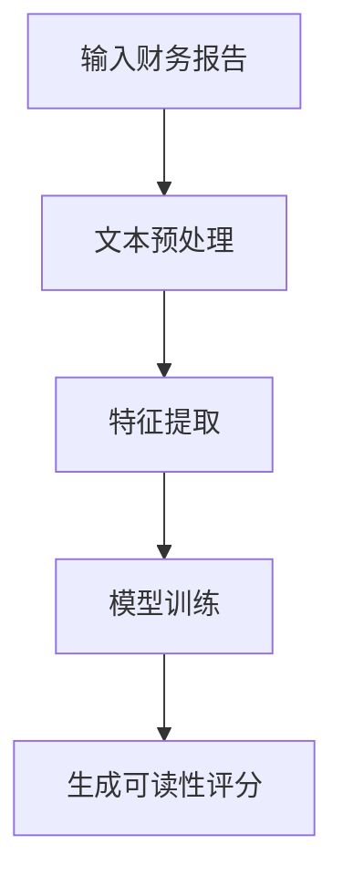
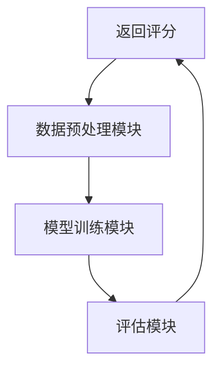

                 


# 设计智能化的企业财务报告可读性评估模型

## 关键词：企业财务报告，可读性评估，智能化模型，自然语言处理，机器学习

## 摘要：本文介绍了一种基于自然语言处理和机器学习的智能化企业财务报告可读性评估模型的设计与实现。通过分析财务报告的文本结构、语言特征和内容逻辑，结合深度学习算法，构建了一个能够自动评估财务报告可读性的模型，旨在提高财务信息的透明度和决策效率。

---

## 第1章: 问题背景与描述

### 1.1 问题背景

#### 1.1.1 财务报告的重要性
企业财务报告是反映企业财务状况、经营成果和现金流量的重要文件，是投资者、债权人和管理层做出决策的重要依据。然而，财务报告的复杂性和专业性常常导致可读性差，尤其对于非专业读者而言，难以快速理解其内容。

#### 1.1.2 当前财务报告可读性评估的痛点
传统的财务报告评估方法依赖于人工审核，耗时且成本高昂。此外，不同读者对同一报告的理解可能存在差异，导致评估结果的主观性和片面性。

#### 1.1.3 智能化评估的必要性
随着人工智能技术的发展，利用自然语言处理（NLP）和机器学习算法，可以自动化评估财务报告的可读性，提高评估效率和客观性。

### 1.2 问题描述

#### 1.2.1 可读性评估的定义
可读性评估是指通过分析文本的结构、语言复杂度和内容逻辑，评估文本的清晰度和易懂性。

#### 1.2.2 当前评估方法的局限性
传统评估方法依赖人工经验，缺乏统一的标准，且难以大规模应用。

#### 1.2.3 智能化评估的目标
构建一个智能化模型，能够自动分析财务报告的文本特征，评估其可读性，并提出改进建议。

---

## 第2章: 核心概念与联系

### 2.1 模型核心概念

#### 2.1.1 可读性评估指标
- **词汇复杂度**：文本中单词的平均长度和出现频率。
- **句子复杂度**：句子的平均长度和从句数量。
- **内容逻辑性**：文本的连贯性和信息的完整性。

#### 2.1.2 模型输入与输出
- **输入**：财务报告的文本内容。
- **输出**：可读性评分（如A、B、C、D、E等级别）。

#### 2.1.3 关键技术与方法
- **NLP技术**：用于文本特征提取。
- **机器学习算法**：用于模型训练和预测。

### 2.2 核心概念对比

#### 2.2.1 不同模型的对比分析
| 模型名称 | 基于规则的模型 | 基于统计的模型 | 基于深度学习的模型 |
|----------|----------------|----------------|--------------------|
| 优点     | 易实现           | 数据驱动        | 高准确性           |
| 缺点     | 主观性           | 需大量数据       | 训练时间长         |

#### 2.2.2 ER实体关系图
```mermaid
er
actor: 用户
model: 智能化评估模型
report: 财务报告
关系：
    用户 --> 模型: 提交报告
    模型 --> 用户: 返回评分
    用户 --> 报告: 创建或上传
```

---

## 第3章: 算法原理讲解

### 3.1 算法选择与流程

#### 3.1.1 算法选择依据
选择基于BERT的预训练模型，因为它在文本理解和上下文分析方面表现优异。

#### 3.1.2 算法流程图


#### 3.1.3 Python代码实现
```python
import transformers
from transformers import BertTokenizer, BertModel

tokenizer = BertTokenizer.from_pretrained('bert-base-uncased')
model = BertModel.from_pretrained('bert-base-uncased')

def get_features(text):
    inputs = tokenizer(text, return_tensors='np')
    outputs = model(**inputs)
    return outputs.last_hidden_state
```

### 3.2 数学模型与公式

#### 3.2.1 余弦相似度公式
计算两个文本向量的相似度：
$$\text{相似度} = \frac{\vec{a} \cdot \vec{b}}{\|\vec{a}\| \|\vec{b}\|}$$

#### 3.2.2 分类模型公式
使用二分类逻辑回归模型：
$$P(y=1|x) = \frac{1}{1 + e^{-\beta x}}$$

---

## 第4章: 系统分析与架构设计

### 4.1 系统架构设计

#### 4.1.1 系统模块划分
- **数据预处理模块**：文本清洗和特征提取。
- **模型训练模块**：基于BERT的微调。
- **评估模块**：生成可读性评分。

#### 4.1.2 系统架构图


---

## 第5章: 项目实战

### 5.1 环境安装与配置

#### 5.1.1 环境搭建步骤
1. 安装Python和必要的库。
2. 下载BERT模型和tokenizer。

---

## 第6章: 项目实战

### 6.1 环境安装与配置

#### 6.1.1 环境搭建步骤
1. 安装Python和必要的库：
   ```bash
   pip install transformers
   ```

2. 下载BERT模型和tokenizer：
   ```bash
   transformers --download
   ```

---

## 小结

本文详细介绍了设计智能化的企业财务报告可读性评估模型的背景、核心概念、算法原理和系统架构。通过结合NLP和机器学习技术，构建了一个高效的评估模型，能够自动分析财务报告的可读性，帮助用户提高财务信息的透明度和决策效率。

作者：AI天才研究院 & 禅与计算机程序设计艺术

