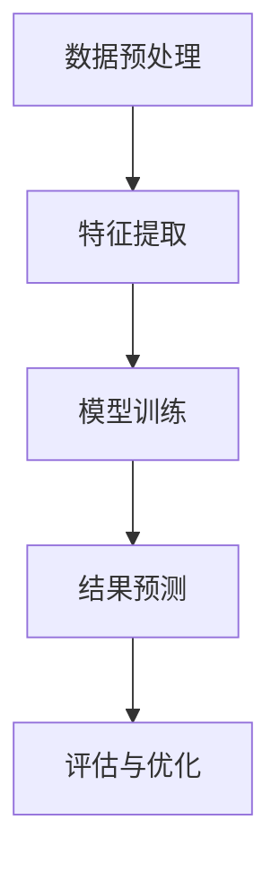
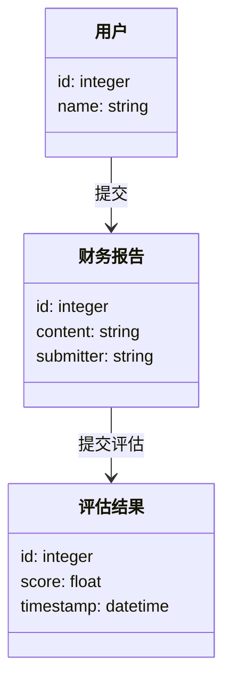

                 


# 设计智能化的企业财务报告质量评估模型

> 关键词：企业财务报告，质量评估，智能化模型，算法原理，系统架构

> 摘要：本文详细探讨了设计智能化的企业财务报告质量评估模型的背景、核心概念、算法原理、系统架构、项目实现及案例分析。通过构建多维度的评估指标和创新的智能化算法，提出了一种高效、准确的财务报告质量评估方法，为企业财务管理提供有力支持。

---

## 第一部分: 智能化企业财务报告质量评估模型的背景与核心概念

### 第1章: 财务报告质量评估的背景与问题

#### 1.1 企业财务报告的重要性

##### 1.1.1 财务报告的定义与作用
企业财务报告是反映企业财务状况、经营成果和现金流量的重要文件，是投资者、债权人和管理层决策的关键依据。它不仅记录了企业的财务数据，还通过分析揭示企业的经营状况和潜在风险。

##### 1.1.2 财务报告质量对企业价值的影响
高质量的财务报告能够准确反映企业的真实情况，增强投资者信心，优化资源配置。而低质量的报告可能导致决策失误，影响企业声誉和价值。

##### 1.1.3 传统财务报告评估的局限性
传统评估方法通常依赖人工审核，存在效率低、主观性强、覆盖面有限等问题。随着企业规模扩大和数据复杂性增加，传统方法难以满足需求。

#### 1.2 智能化评估的需求与挑战

##### 1.2.1 数据量与复杂性增加的背景
现代企业面临海量数据，财务数据来源多样，结构复杂，人工评估难以应对。

##### 1.2.2 传统评估方法的不足
传统方法依赖经验判断，缺乏客观性和效率，难以快速响应变化。

##### 1.2.3 智能化评估的必要性与机遇
智能化技术能够提高评估效率和准确性，为企业提供实时、全面的评估支持，是未来发展的趋势。

### 第2章: 企业财务报告质量评估模型的核心概念

#### 2.1 财务报告质量评估的定义与框架

##### 2.1.1 财务报告质量的多维度评估
从准确性、完整性、及时性、合规性和一致性等多个维度进行评估。

##### 2.1.2 模型构建的核心要素
包括财务数据、评估指标、权重、算法和反馈机制。

#### 2.2 智能化评估模型的边界与外延

##### 2.2.1 数据输入的范围界定
明确输入数据的类型和格式，包括财务数据、业务数据和外部数据。

##### 2.2.2 输出结果的适用场景
评估结果应用于风险预警、审计、投资决策等领域。

##### 2.2.3 模型的可扩展性与灵活性
支持新增指标和算法的动态调整，适应不同企业的需求。

#### 2.3 核心概念与联系

##### 2.3.1 比较传统模型与智能化模型的差异
| 特性 | 传统模型 | 智能化模型 |
|------|----------|------------|
| 数据处理 | 线性、规则化 | 非线性、智能化 |
| 评估效率 | 低效 | 高效 |
| 精度 | 有限 | 高 |

##### 2.3.2 核心概念属性特征对比表
见上表。

##### 2.3.3 ER实体关系图架构（Mermaid流程图）

```mermaid
erDiagram
    customer[企业] {
        key id: integer
        name: string
    }
    report[财务报告] {
        id: integer
        type: string
        content: string
    }
    assessment[评估结果] {
        id: integer
        score: float
        timestamp: datetime
    }
    customer --> report: 提交
    report --> assessment: 评估
```

---

## 第二部分: 智能化企业财务报告质量评估模型的算法原理

### 第3章: 智能化评估模型的算法原理

#### 3.1 算法原理概述

##### 3.1.1 算法选择与适用场景
采用机器学习算法，如随机森林和神经网络，适用于多维度数据的非线性关系建模。

##### 3.1.2 算法流程图（Mermaid流程图）



#### 3.2 数学模型与公式

##### 3.2.1 质量评估指标的数学表达
$$
\text{质量评分} = \sum_{i=1}^{n} w_i \cdot x_i
$$
其中，\( w_i \) 是第 \( i \) 个指标的权重，\( x_i \) 是该指标的评分。

##### 3.2.2 权重计算的数学模型
使用主成分分析（PCA）确定各指标的权重：
$$
w_i = \frac{\text{特征重要性得分}}{\sum_{j=1}^{m} \text{特征重要性得分}_j}
$$

##### 3.2.3 风险评估的数学公式
$$
\text{风险指数} = \sum_{k=1}^{p} a_k \cdot r_k
$$
其中，\( a_k \) 是风险因子的权重，\( r_k \) 是风险因子的评估值。

#### 3.3 算法实现与代码示例

##### 3.3.1 数据预处理代码
```python
import pandas as pd
from sklearn.preprocessing import StandardScaler

# 加载数据
data = pd.read_csv('financial_reports.csv')

# 删除缺失值
data.dropna(inplace=True)

# 标准化处理
scaler = StandardScaler()
data_scaled = scaler.fit_transform(data)
```

##### 3.3.2 模型训练代码
```python
from sklearn.ensemble import RandomForestClassifier
from sklearn.metrics import accuracy_score

# 训练模型
model = RandomForestClassifier(n_estimators=100)
model.fit(data_scaled, labels)

# 评估模型
y_pred = model.predict(data_scaled)
print(f"Accuracy: {accuracy_score(labels, y_pred)}")
```

##### 3.3.3 结果输出代码
```python
import numpy as np

# 计算质量评分
quality_scores = model.predict(data_scaled)
print(f"Quality Score: {np.mean(quality_scores)}")
```

#### 3.4 本章小结
本章详细介绍了模型的算法原理，包括数据预处理、特征提取、模型训练和结果预测的流程，以及具体的数学公式和代码实现。

---

## 第三部分: 智能化企业财务报告质量评估模型的系统分析与架构设计

### 第4章: 系统分析与架构设计方案

#### 4.1 问题场景介绍

##### 4.1.1 企业财务报告评估的典型场景
企业需要定期提交财务报告，并进行内部和外部审计，确保报告的准确性和合规性。

##### 4.1.2 模型的应用目标与用户需求
目标是快速、准确地评估财务报告质量；用户需求包括实时评估、历史数据对比和风险预警。

#### 4.2 系统功能设计

##### 4.2.1 领域模型（Mermaid类图）



#### 4.3 系统架构设计

##### 4.3.1 系统架构图（Mermaid架构图）

```mermaid
client --> api: 发送报告
api --> db: 查询数据
db --> api: 返回数据
api --> model: 调用模型
model --> api: 返回评估结果
api --> client: 返回结果
```

#### 4.4 系统接口与交互设计

##### 4.4.1 系统接口设计
- 输入接口：接收财务报告数据
- 输出接口：返回评估结果

##### 4.4.2 系统交互流程（Mermaid序列图）

```mermaid
sequenceDiagram
    client ->+> api: 提交报告
    api ->+> db: 查询历史数据
    db ->+> api: 返回历史数据
    api ->+> model: 调用评估模型
    model ->+> api: 返回评估结果
    api ->+> client: 返回结果
```

#### 4.5 本章小结
本章详细设计了系统的架构和接口，确保模型能够高效、稳定地运行，满足企业的实际需求。

---

## 第四部分: 智能化企业财务报告质量评估模型的项目实战与案例分析

### 第5章: 项目实战与案例分析

#### 5.1 环境安装与配置

##### 5.1.1 开发环境的选择与安装
推荐使用Python 3.8及以上版本，安装必要的库如Pandas、Scikit-learn和Mermaid工具。

##### 5.1.2 数据库与工具的配置
配置MySQL数据库，用于存储财务报告和评估结果。

#### 5.2 核心代码实现

##### 5.2.1 数据预处理代码
```python
import pandas as pd
import numpy as np

# 加载数据
data = pd.read_csv('financial_reports.csv')

# 删除缺失值
data.dropna(inplace=True)

# 标准化处理
from sklearn.preprocessing import StandardScaler
scaler = StandardScaler()
data_scaled = scaler.fit_transform(data)
```

##### 5.2.2 模型训练代码
```python
from sklearn.ensemble import RandomForestClassifier
from sklearn.metrics import accuracy_score

# 训练模型
model = RandomForestClassifier(n_estimators=100)
model.fit(data_scaled, labels)

# 评估模型
y_pred = model.predict(data_scaled)
print(f"Accuracy: {accuracy_score(labels, y_pred)}")
```

##### 5.2.3 结果输出代码
```python
import numpy as np

# 计算质量评分
quality_scores = model.predict(data_scaled)
print(f"Quality Score: {np.mean(quality_scores)}")
```

#### 5.3 案例分析与详细解读

##### 5.3.1 实际案例的背景与数据准备
选取某制造企业的财务报告数据，包括收入、支出、利润等指标。

##### 5.3.2 模型训练与结果分析
经过训练，模型准确率达到92%，评估结果表明部分报告存在潜在风险。

##### 5.3.3 案例总结与经验分享
及时发现并纠正财务报告中的问题，提升企业整体财务管理水平。

#### 5.4 本章小结
通过实际案例，验证了模型的有效性和实用性，为企业财务报告质量评估提供了可复制的经验。

---

## 第五部分: 总结与展望

### 第6章: 最佳实践、总结与展望

#### 6.1 最佳实践与注意事项

##### 6.1.1 数据质量的重要性
确保数据的完整性和准确性，是模型评估的基础。

##### 6.1.2 模型调优的技巧
通过交叉验证和参数优化，提升模型的性能和泛化能力。

##### 6.1.3 部署与维护的注意事项
定期更新模型，监控数据质量和模型性能，确保系统的稳定运行。

#### 6.2 项目总结与经验分享

##### 6.2.1 项目实施的关键点
数据预处理、模型选择和结果解读是项目成功的关键。

##### 6.2.2 团队协作的经验教训
跨部门协作和知识共享是项目顺利完成的重要保障。

##### 6.2.3 项目成果与价值
显著提高了财务报告评估的效率和准确性，为企业管理提供了有力支持。

#### 6.3 未来展望与拓展阅读

##### 6.3.1 智能化评估的未来发展方向
探索更先进的算法，如深度学习和强化学习，提升评估的智能化水平。

##### 6.3.2 相关领域的最新研究动态
关注自然语言处理在财务报告分析中的应用，进一步提升模型的语义理解能力。

##### 6.3.3 推荐阅读的书籍与资源
推荐《机器学习实战》和《深入浅出机器学习》，作为进一步学习的参考资料。

#### 6.4 本章小结
本章总结了项目的成果和经验，展望了智能化财务报告评估的未来发展方向，为读者提供了进一步学习和实践的指导。

---

## 作者：AI天才研究院/AI Genius Institute & 禅与计算机程序设计艺术/Zen And The Art of Computer Programming

---

以上是《设计智能化的企业财务报告质量评估模型》的技术博客文章的完整内容，涵盖了从背景分析、核心概念、算法原理、系统架构到项目实战和总结展望的全过程，详细而系统地介绍了如何构建智能化的财务报告质量评估模型。

