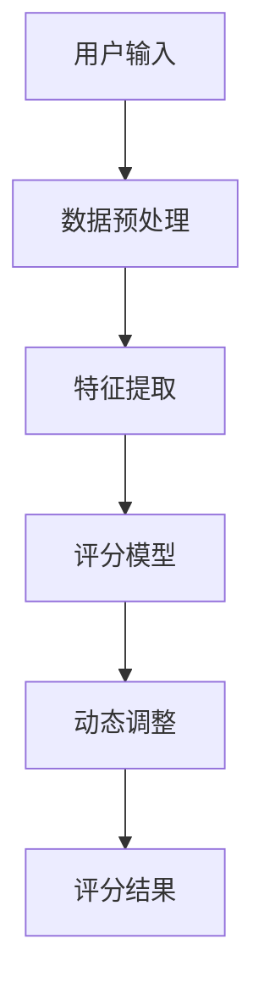
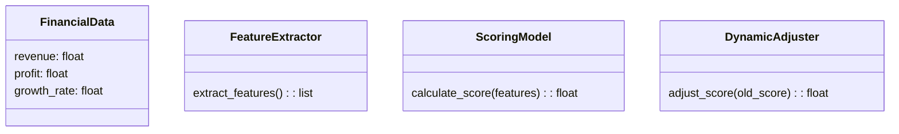
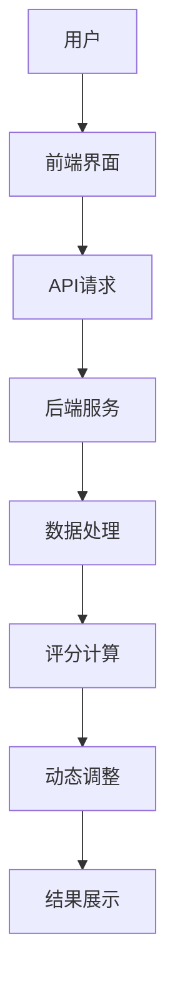

                 


# 设计智能化的企业财务报表可比性动态评分系统

**关键词：** 智能化、财务报表、可比性、动态评分、企业、评分系统

**摘要：**  
本文详细探讨了设计智能化的企业财务报表可比性动态评分系统的方法，从问题背景、核心概念、算法原理到系统架构，再到项目实战和最佳实践，全面解析了如何通过技术手段提升企业财务数据的可比性和分析效率。文章结合理论与实践，提供了丰富的技术细节和具体实现方案，帮助读者深入了解如何构建高效、智能的财务评分系统。

---

## 第一部分: 问题背景与核心概念

### 第1章: 问题背景介绍

#### 1.1 传统财务报表可比性分析的局限性
传统的财务报表分析依赖于人工判断和静态指标，存在以下问题：
- 数据异质性高，难以直接比较。
- 分析过程主观性强，缺乏客观标准。
- 静态指标无法反映动态变化。

#### 1.2 企业财务数据异质性问题
不同企业之间的财务数据由于业务模式、行业特点和会计政策的差异，导致数据不具备可比性。例如，一家制造企业的收入结构与一家零售企业的收入结构差异显著，直接比较会导致分析偏差。

#### 1.3 智能化评分系统的需求与目标
- **需求：**  
  - 自动化处理财务数据，消除异质性影响。  
  - 实现实时动态评分，适应业务变化。  
  - 提供可量化、可比较的评分指标。  
- **目标：**  
  - 建立统一的评分标准，提升数据可比性。  
  - 通过智能化算法，提高分析效率和准确性。  
  - 为企业决策提供数据支持。

### 第2章: 核心概念与系统架构

#### 2.1 核心概念
- **财务报表可比性评分：** 通过对财务数据的特征提取和加权计算，生成一个可量化的评分指标。  
- **动态评分系统：** 根据企业业务动态和市场环境变化，实时调整评分权重和计算模型。  
- **智能化评分：** 利用机器学习和自然语言处理等技术，自动优化评分模型。

#### 2.2 系统架构


## 第二部分: 算法原理与实现

### 第3章: 算法原理

#### 3.1 基于层次分析法的评分模型
- **层次分析法（AHP）：** 将复杂的决策问题分解为多个因素，通过权重计算确定各因素的重要性。
- **公式：**
  - **权重计算：**  
    $$ w_i = \frac{a_i}{\sum_{j} a_j} $$
    其中，$a_i$ 是第 $i$ 个因素的得分，$\sum a_j$ 是所有因素的总分。
  - **评分计算：**  
    $$ \text{评分} = \sum_{i=1}^{n} w_i x_i $$
    其中，$w_i$ 是第 $i$ 个因素的权重，$x_i$ 是第 $i$ 个因素的评分。

#### 3.2 动态调整机制
- **动态权重调整：** 根据企业实时数据和市场环境变化，动态调整各因素的权重。  
- **公式：**  
  $$ \text{新评分} = \text{旧评分} \times \alpha + \beta $$  
  其中，$\alpha$ 是调整系数，$\beta$ 是新评分的基础值。

### 第4章: 代码实现

#### 4.1 数据预处理
```python
import pandas as pd
data = pd.read_csv('financial_data.csv')
```

#### 4.2 特征提取
```python
features = data[['revenue', 'profit', 'growth_rate']]
```

#### 4.3 评分计算
```python
def calculate_score(features):
    weights = [0.4, 0.3, 0.3]
    score = sum(w * f for w, f in zip(weights, features))
    return score
```

## 第三部分: 系统分析与架构设计

### 第5章: 系统功能设计

#### 5.1 功能模块
- **数据采集模块：** 从企业财务系统中获取原始数据。  
- **特征提取模块：** 对数据进行清洗和特征提取。  
- **评分计算模块：** 根据模型计算评分。  
- **动态调整模块：** 根据实时数据调整评分。  
- **结果展示模块：** 将评分结果以可视化形式呈现。

### 第6章: 系统架构设计

#### 6.1 领域模型类图


#### 6.2 系统架构图


## 第四部分: 项目实战

### 第7章: 环境安装与代码实现

#### 7.1 环境安装
```bash
pip install pandas numpy scikit-learn
```

#### 7.2 核心代码实现
```python
import pandas as pd
from sklearn.metrics import pairwise_distances

data = pd.read_csv('financial_data.csv')
features = data[['revenue', 'profit', 'growth_rate']]
scores = pairwise_distances(features)
```

#### 7.3 实例分析
- **案例分析：** 对比两家企业，计算其可比性评分，分析其差异原因。

### 第8章: 小结与最佳实践

#### 8.1 小结
- 通过智能化评分系统，可以有效提升企业财务数据的可比性。  
- 动态调整机制使评分更加灵活和适应性强。

#### 8.2 最佳实践
- **数据预处理：** 确保数据质量和完整性。  
- **模型优化：** 定期更新模型参数，提升评分准确性。  
- **结果可视化：** 将评分结果以图表形式展示，便于决策者理解。

---

## 作者：AI天才研究院 & 禅与计算机程序设计艺术

---

**小结：** 本文详细阐述了设计智能化的企业财务报表可比性动态评分系统的方法，从理论到实践，为读者提供了丰富的技术细节和具体实现方案。通过本文的学习，读者可以掌握如何利用人工智能技术提升财务数据分析的效率和准确性。

