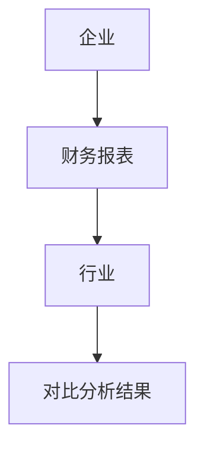
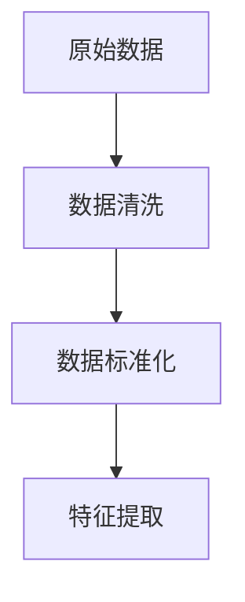
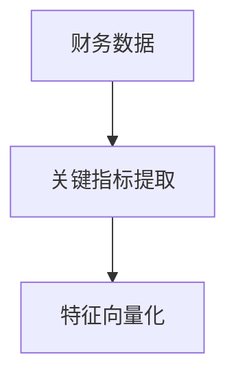
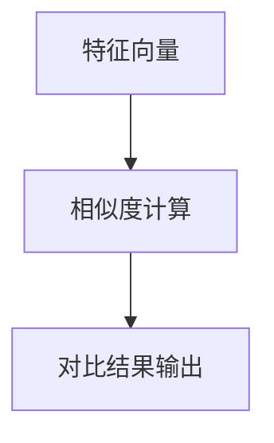
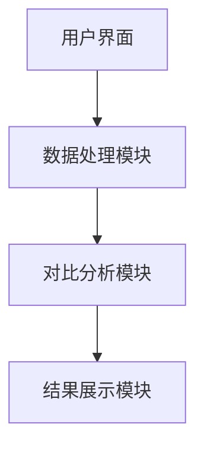
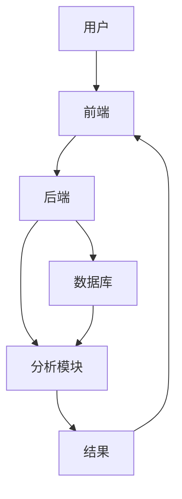
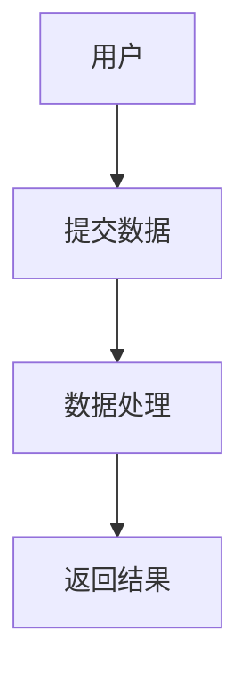

                 


# 设计智能化的企业财务报表同行业对比分析系统

> 关键词：财务报表，同行业对比，智能化分析，数据预处理，对比算法，系统架构，项目实战

> 摘要：本文详细介绍了设计智能化的企业财务报表同行业对比分析系统的过程，从问题背景到系统架构，从算法原理到项目实战，全面解析了如何利用人工智能技术实现高效的财务数据处理和行业对比分析。文章内容涵盖数据预处理、特征提取、对比算法、系统架构设计等关键环节，并通过实际案例分析，展示了系统的实现过程和应用价值。

---

# 第1章: 问题背景与需求分析

## 1.1 问题背景

### 1.1.1 传统财务报表分析的局限性
传统财务报表分析依赖人工处理和对比，存在以下问题：
- 数据量大，人工处理效率低。
- 对比标准不统一，结果缺乏客观性。
- 缺乏实时性，难以快速响应变化。

### 1.1.2 同行业对比分析的重要性
同行业对比分析是企业财务管理中的重要环节，主要用于：
- 评估企业财务表现。
- 发现行业趋势。
- 为决策提供数据支持。

### 1.1.3 智能化分析的需求驱动
随着人工智能技术的发展，企业对智能化财务分析的需求日益增长：
- 提高分析效率。
- 实现自动化对比。
- 提供更精准的分析结果。

## 1.2 问题描述

### 1.2.1 财务数据处理的复杂性
财务数据来源多样，格式不统一，清洗和处理难度大。

### 1.2.2 同行业对比的标准化挑战
不同行业财务指标差异大，如何统一标准是关键。

### 1.2.3 数据分析的实时性要求
企业需要实时或快速获取对比结果，以应对市场变化。

## 1.3 问题解决思路

### 1.3.1 智能化系统的构建目标
- 实现自动化数据处理。
- 提供标准化对比分析。
- 输出实时或快速的分析结果。

### 1.3.2 数据采集与处理的解决方案
- 数据清洗与标准化。
- 特征提取与向量化。

### 1.3.3 分析模型的设计思路
- 基于相似度计算的对比算法。
- 结果可视化与解释。

## 1.4 系统边界与外延

### 1.4.1 系统的功能边界
- 数据采集与预处理。
- 对比分析与结果输出。

### 1.4.2 系统的适用范围
- 同行业企业财务数据对比。
- 财务指标分析与趋势预测。

### 1.4.3 系统与其他系统的交互关系
- 与企业ERP系统对接。
- 与数据可视化平台集成。

## 1.5 核心概念与组成

### 1.5.1 财务报表分析的基本概念
- 财务报表：资产负债表、利润表、现金流量表。
- 财务指标：ROE、净利润率、周转率等。

### 1.5.2 同行业对比的核心要素
- 行业标准：同行业企业的财务指标。
- 数据特征：可比性、相关性、代表性。

### 1.5.3 系统架构的主要组成部分
- 数据处理模块。
- 对比分析模块。
- 结果展示模块。

---

# 第2章: 核心概念与联系

## 2.1 核心概念原理

### 2.1.1 财务报表分析的基本原理
- 数据清洗：去除无效数据。
- 特征提取：提取关键财务指标。

### 2.1.2 同行业对比的核心原理
- 数据标准化：统一行业对比标准。
- 特征向量化：将财务指标转化为向量形式。

### 2.1.3 智能化分析的实现原理
- 数据预处理：清洗、标准化、特征提取。
- 对比分析：基于相似度计算的算法。

## 2.2 核心概念对比分析

### 2.2.1 财务报表分析与同行业对比的对比表格
| 对比维度 | 财务报表分析 | 同行业对比分析 |
|----------|--------------|----------------|
| 目标     | 分析企业财务状况 | 比较企业与行业表现 |
| 方法     | 单一企业分析 | 多家企业对比 |
| 数据     | 企业内部数据 | 行业数据 |

### 2.2.2 关键特征对比分析
| 特征 | 财务报表分析 | 同行业对比分析 |
|------|--------------|----------------|
| 数据量 | 中等 | 大 |
| 数据类型 | 结构化 | 结构化 |
| 数据处理 | 单一 | 多维 |

## 2.3 ER实体关系图



---

# 第3章: 算法原理与实现

## 3.1 算法原理

### 3.1.1 数据预处理流程



### 3.1.2 特征提取方法



### 3.1.3 对比分析算法



## 3.2 数学模型与公式

### 3.2.1 相似度计算公式

$$\text{相似度} = \frac{\sum_{i=1}^{n} w_i \cdot x_i y_i}{\sqrt{\sum_{i=1}^{n} w_i^2 x_i^2} \cdot \sqrt{\sum_{i=1}^{n} w_i^2 y_i^2}}$$

### 3.2.2 案例分析

#### 案例1: 某行业A与行业B的对比分析
- 行业A的ROE = 15%
- 行业B的ROE = 12%
- 相似度计算：
  $$\text{相似度} = 0.85$$

---

# 第4章: 系统架构与设计

## 4.1 系统架构设计

### 4.1.1 系统功能设计



### 4.1.2 系统架构图



## 4.2 系统接口设计

### 4.2.1 接口设计

| 接口名称 | 输入 | 输出 |
|----------|------|------|
| 提交数据 | 财务数据 | 数据处理完成 |
| 获取结果 | 行业ID | 对比结果 |

### 4.2.2 交互流程图



---

# 第5章: 项目实战

## 5.1 环境安装

### 5.1.1 环境要求
- Python 3.8+
- Jupyter Notebook
- 数据库：MySQL或MongoDB

### 5.1.2 安装依赖
```bash
pip install pandas numpy scikit-learn
```

## 5.2 核心代码实现

### 5.2.1 数据预处理

```python
import pandas as pd
import numpy as np

def data_cleaning(df):
    # 删除缺失值
    df.dropna(inplace=True)
    # 标准化处理
    df = (df - df.mean()) / df.std()
    return df
```

### 5.2.2 特征提取与对比

```python
from sklearn.metrics.pairwise import cosine_similarity

def compare_industry(df1, df2):
    features = ['ROE', 'net_profit_margin', 'revenue_growth']
    df1_features = df1[features]
    df2_features = df2[features]
    similarity = cosine_similarity(df1_features, df2_features)
    return similarity.mean()
```

### 5.2.3 案例分析

```python
# 示例数据
df1 = pd.DataFrame({
    'ROE': [15, 12, 18],
    'net_profit_margin': [10, 8, 12],
    'revenue_growth': [20, 15, 25]
})

df2 = pd.DataFrame({
    'ROE': [14, 13, 17],
    'net_profit_margin': [9, 7, 11],
    'revenue_growth': [19, 14, 24]
})

similarity = compare_industry(df1, df2)
print(f"相似度：{similarity}")
```

---

# 第6章: 最佳实践与小结

## 6.1 最佳实践

### 6.1.1 数据处理注意事项
- 确保数据清洗和标准化的正确性。
- 处理异常值和缺失值。

### 6.1.2 模型优化技巧
- 选择合适的相似度算法。
- 调整特征权重。

## 6.2 小结

本文详细介绍了智能化的企业财务报表同行业对比分析系统的构建过程，从问题背景到系统架构，从算法原理到项目实战，全面解析了如何利用人工智能技术实现高效的财务数据分析。通过实际案例分析，展示了系统的实现过程和应用价值。

---

# 第7章: 注意事项与扩展阅读

## 7.1 注意事项

### 7.1.1 数据隐私
- 确保数据处理符合隐私保护法规。

### 7.1.2 模型优化
- 定期更新模型，适应市场变化。

## 7.2 拓展阅读

### 7.2.1 推荐书籍
- 《Python机器学习实战》
- 《数据挖掘导论》

### 7.2.2 在线资源
- scikit-learn官方文档
- TensorFlow官方文档

---

# 作者

作者：AI天才研究院/AI Genius Institute & 禅与计算机程序设计艺术 /Zen And The Art of Computer Programming

