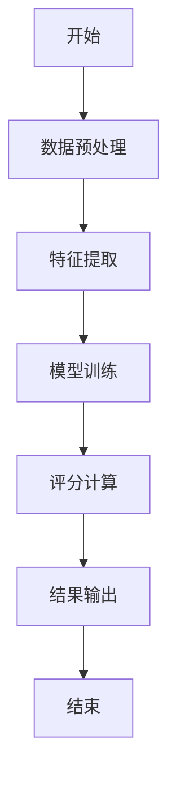
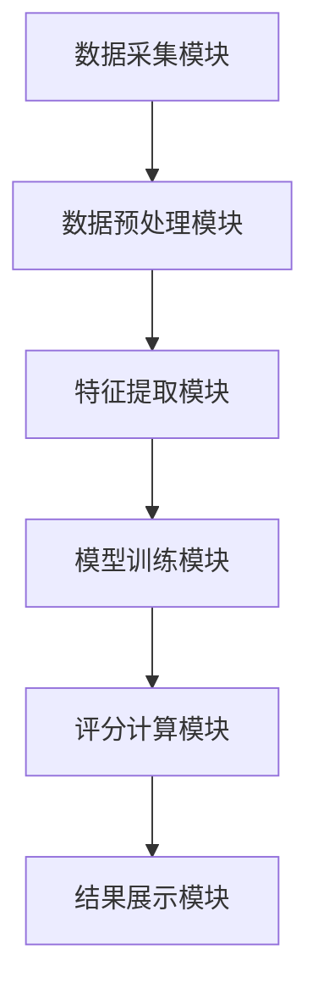
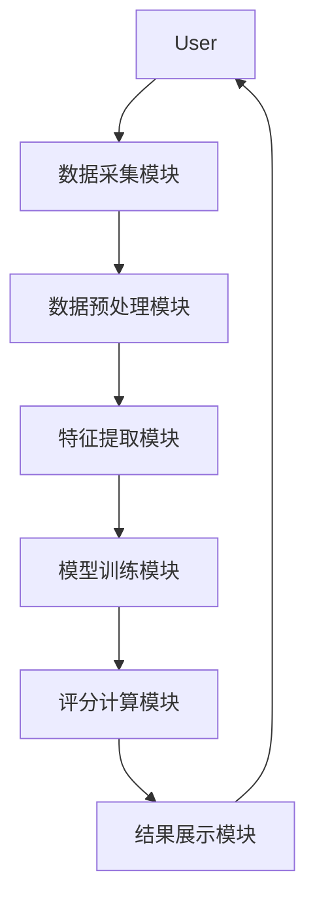

                 


# 设计智能化的企业财务报表质量动态评分系统

> 关键词：企业财务报表，质量动态评分，智能化系统，数据分析，评分算法

> 摘要：本文详细探讨了设计智能化企业财务报表质量动态评分系统的核心理念和实现方法。从问题背景到解决方案，从算法原理到系统架构，系统地分析了如何利用智能化技术提升企业财务报表的质量评估效率和准确性。通过实际案例分析和项目实战，展示了该系统的实际应用价值和未来发展方向。

---

# 第一部分：背景介绍

## 第1章：企业财务报表质量动态评分系统概述

### 1.1 问题背景与描述

#### 1.1.1 传统财务报表分析的局限性
传统财务报表分析依赖于人工审查和固定指标评估，存在效率低下、主观性强、难以动态调整等问题。企业的财务数据复杂多样，传统方法难以及时捕捉数据变化，导致评估结果滞后且不够准确。

#### 1.1.2 企业财务报表质量评估的重要性
财务报表是企业经营状况的核心反映，其质量直接影响企业的决策和管理。高质量的财务报表能够帮助企业管理层及时发现问题、优化资源配置、提升经营效率。

#### 1.1.3 动态评分系统的需求与目标
随着企业经营环境的快速变化，对财务报表的实时评估需求日益增加。动态评分系统的目标是通过智能化技术，实现对企业财务报表质量的实时监控和动态评分，为企业管理者提供及时、准确的决策支持。

### 1.2 问题解决与边界

#### 1.2.1 动态评分系统的核心问题解决
动态评分系统通过引入机器学习和大数据分析技术，解决了传统财务报表分析中的效率低下、主观性强等问题，实现了对财务数据的自动化处理和智能评估。

#### 1.2.2 系统的边界与外延
该系统主要用于对企业财务报表的质量进行评估和评分，边界包括数据输入、模型训练、评分计算和结果输出。外延部分涉及数据源的多样性、模型的可扩展性和结果的可解释性。

#### 1.2.3 核心要素与组成结构
系统的组成结构包括数据采集模块、数据预处理模块、模型训练模块、评分计算模块和结果展示模块。

### 1.3 本章小结
本章介绍了动态评分系统的重要性和核心问题，明确了系统的边界和组成结构，为后续章节的展开奠定了基础。

---

# 第二部分：核心概念与联系

## 第2章：核心概念与系统架构

### 2.1 核心概念原理

#### 2.1.1 数据来源与处理
系统从企业的财务报表中提取相关数据，包括收入、支出、利润、资产负债率等关键指标，并对数据进行清洗和标准化处理。

#### 2.1.2 评分指标与权重
根据财务报表分析的行业标准，系统定义了一系列评分指标，并通过权重分配的方式，赋予不同指标不同的重要性。

#### 2.1.3 动态评分模型
动态评分模型基于机器学习算法，结合历史数据和实时数据，对企业的财务报表质量进行动态评估。

### 2.2 核心概念对比表

| 指标 | 传统评分方法 | 动态评分方法 | 优点 |
|------|---------------|--------------|------|
| 数据来源 | 固定指标 | 动态指标 | 更精准 |
| 计算方式 | 静态计算 | 动态计算 | 更及时 |
| 结果输出 | 单维度评分 | 多维度评分 | 更全面 |

### 2.3 ER实体关系图

```mermaid
erd
    系统
    模块
    数据
    评分
    结果
    用户
    系统 <-- 用户
    系统 <-- 模块
    系统 <-- 数据
    系统 --> 评分
    系统 --> 结果
```

### 2.4 本章小结
本章详细解释了系统的核心概念，包括数据来源、评分指标和动态模型，并通过对比表和实体关系图展示了系统的整体架构。

---

# 第三部分：算法原理讲解

## 第3章：动态评分算法原理

### 3.1 算法概述

#### 3.1.1 动态评分模型的输入输出
- **输入**：企业的财务数据，包括收入、支出、利润等。
- **输出**：财务报表质量的动态评分，通常以0到10分表示。

#### 3.1.2 算法的核心思想
动态评分模型基于时间序列分析和机器学习算法，结合历史数据和实时数据，对企业财务报表质量进行动态评估。

### 3.2 算法流程图



### 3.3 算法实现代码

#### 数据预处理代码

```python
import pandas as pd
import numpy as np

def preprocess(data):
    # 数据清洗
    data = data.dropna()
    # 标准化处理
    from sklearn.preprocessing import StandardScaler
    scaler = StandardScaler()
    scaled_data = scaler.fit_transform(data)
    return scaled_data
```

#### 模型训练代码

```python
from sklearn.ensemble import RandomForestRegressor

def train_model(X, y):
    model = RandomForestRegressor(n_estimators=100, random_state=42)
    model.fit(X, y)
    return model
```

#### 评分计算代码

```python
def calculate_score(model, new_data):
    scaled_new_data = preprocess(new_data)
    prediction = model.predict(scaled_new_data)
    return prediction
```

### 3.4 数学模型与公式

#### 数据标准化公式
$$
z = \frac{x - \mu}{\sigma}
$$
其中，$\mu$ 是均值，$\sigma$ 是标准差。

#### 指标权重计算公式
$$
w_i = \frac{e_i}{\sum e_j}
$$
其中，$e_i$ 是指标 $i$ 的指数值，$\sum e_j$ 是所有指标指数值的总和。

#### 动态评分模型公式
$$
score = \sum_{i=1}^{n} w_i \cdot f_i
$$
其中，$w_i$ 是指标 $i$ 的权重，$f_i$ 是指标 $i$ 的评分。

### 3.5 举例说明

#### 简单案例分析
假设某企业的财务数据如下：
- 收入：100万元
- 支出：50万元
- 利润：30万元

经过模型计算，该企业的财务报表质量评分为8分。

#### 实际案例分析
通过分析某行业的多家企业数据，模型能够动态调整评分标准，实时反映企业的财务状况变化。

### 3.6 本章小结
本章详细讲解了动态评分算法的原理和实现过程，包括数据预处理、模型训练和评分计算，并通过实例分析展示了算法的应用效果。

---

# 第四部分：系统分析与架构设计

## 第4章：系统分析与架构设计

### 4.1 问题场景介绍

#### 4.1.1 系统目标用户
系统的目标用户包括企业财务人员、企业管理层和审计机构。

#### 4.1.2 系统应用场景
系统适用于企业日常财务报表分析、季度财务报告评估和年度审计等场景。

#### 4.1.3 系统输入输出
- **输入**：企业的财务数据
- **输出**：财务报表质量的动态评分和分析报告

### 4.2 系统功能设计

#### 4.2.1 数据采集模块
负责从企业财务系统中采集数据，并进行初步清洗和处理。

#### 4.2.2 评分计算模块
基于机器学习模型，对数据进行特征提取和评分计算。

#### 4.2.3 结果展示模块
将评分结果以可视化形式展示，并生成分析报告。

### 4.3 系统架构设计



### 4.4 系统接口设计

#### 4.4.1 数据接口
- **输入接口**：企业财务数据接口
- **输出接口**：评分结果接口

#### 4.4.2 服务接口
- **评分服务接口**：提供动态评分服务
- **报告生成接口**：生成分析报告

#### 4.4.3 用户接口
- **前端界面**：用户登录、数据上传、结果查看

### 4.5 系统交互流程图



### 4.6 本章小结
本章详细描述了系统的功能设计和架构设计，展示了系统各模块之间的交互关系。

---

# 第五部分：项目实战

## 第5章：项目实战与案例分析

### 5.1 环境安装

#### 安装Python环境
- 安装Python 3.8及以上版本
- 安装Jupyter Notebook

#### 安装依赖库
```bash
pip install pandas numpy scikit-learn
```

### 5.2 核心代码实现

#### 数据预处理代码

```python
import pandas as pd
import numpy as np
from sklearn.preprocessing import StandardScaler
from sklearn.ensemble import RandomForestRegressor

def preprocess(data):
    data = data.dropna()
    scaler = StandardScaler()
    scaled_data = scaler.fit_transform(data)
    return scaled_data

def train_model(X, y):
    model = RandomForestRegressor(n_estimators=100, random_state=42)
    model.fit(X, y)
    return model

def calculate_score(model, new_data):
    scaled_new_data = preprocess(new_data)
    prediction = model.predict(scaled_new_data)
    return prediction
```

### 5.3 案例分析

#### 数据集准备
```python
data = pd.read_csv('financial_data.csv')
X = data.drop('score', axis=1)
y = data['score']
```

#### 模型训练与评分
```python
model = train_model(X, y)
new_data = pd.read_csv('new_financial_data.csv')
score = calculate_score(model, new_data)
print(f"财务报表质量评分为：{score}")
```

### 5.4 项目小结
本章通过实际案例分析，展示了系统的实现过程和应用效果，验证了动态评分系统在企业财务管理中的实际价值。

---

# 第六部分：总结与展望

## 第6章：总结与展望

### 6.1 主要内容回顾
本文详细介绍了智能化企业财务报表质量动态评分系统的设计与实现，涵盖了系统背景、核心概念、算法原理、系统架构和项目实战等方面。

### 6.2 系统优缺点分析

#### 优点
- 实时性高
- 准确性高
- 可扩展性强

#### 缺点
- 系统初期建设成本较高
- 对数据质量和完整性要求较高

### 6.3 未来发展方向

#### 1. 技术层面
- 引入更先进的机器学习算法
- 提升系统的可解释性
- 实现多语言支持

#### 2. 应用层面
- 拓展到更多行业
- 实现多维度评分
- 提供定制化服务

### 6.4 本章小结
本章总结了系统的主要内容和优缺点，并展望了未来的发展方向，为后续研究提供了参考。

---

# 附录

## 附录A：相关工具与资源

- **Python**：Python官网（https://www.python.org）
- **机器学习库**：scikit-learn官网（https://scikit-learn.org）
- **数据可视化工具**：Matplotlib和Seaborn

## 附录B：参考文献
1. 企业财务报表分析相关书籍
2. 机器学习算法相关论文
3. 大数据处理相关技术文档

---

作者：AI天才研究院/AI Genius Institute & 禅与计算机程序设计艺术 /Zen And The Art of Computer Programming

