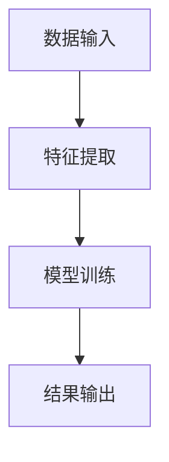
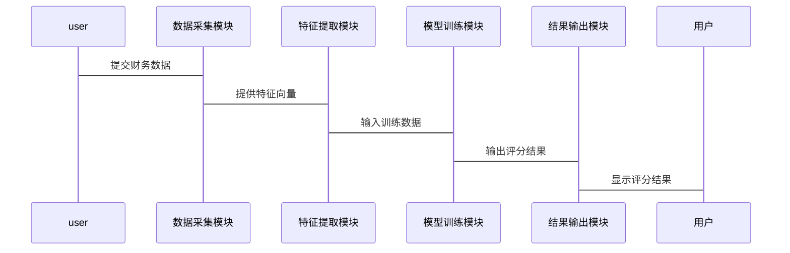

                 


# 设计智能化的企业财务报表质量评分系统

---

## 关键词：企业财务报表，智能化评分系统，机器学习，数据预处理，财务分析

---

## 摘要：  
本文详细探讨了设计智能化企业财务报表质量评分系统的核心方法与实现路径。通过结合机器学习、深度学习和大数据分析技术，提出了一种基于多特征提取与智能算法的财务报表评分解决方案。文章首先介绍了财务报表质量评分系统的重要性和智能化需求，接着从数据预处理、特征提取、算法选择与实现、系统架构设计等多个维度进行了深入分析，最后通过实际案例展示了系统的应用场景与效果。本文旨在为企业财务管理和智能化转型提供理论支持和技术参考。

---

## 第1章：企业财务报表质量评分系统概述

### 1.1 财务报表质量的重要性  
财务报表是企业经营状况的重要反映，包括资产负债表、利润表和现金流量表等。高质量的财务报表能够为投资者、债权人和企业管理者提供可靠的决策依据。然而，传统财务报表分析依赖人工经验，存在主观性强、效率低、结果不稳定等问题。  

### 1.2 智能化财务报表质量评分系统的需求  
随着企业智能化转型的推进，对财务报表的分析要求也在不断提高。智能化评分系统能够通过自动化处理和机器学习算法，快速、准确地评估财务报表的质量，帮助企业实现高效管理和决策支持。  

### 1.3 本章小结  
本章从财务报表的基本概念和重要性入手，分析了传统评分系统的局限性，并提出了智能化评分系统的必要性。

---

## 第2章：数据预处理与特征提取

### 2.1 数据预处理基础  
数据预处理是确保模型准确性的关键步骤，包括：  
1. **数据清洗**：去除重复数据、异常值和无效数据。  
2. **数据标准化**：将不同量纲的特征进行归一化处理。  
3. **缺失值处理**：通过均值、中位数或插值方法填充缺失值。  

### 2.2 特征提取与选择  
1. **特征提取**：从财务报表中提取关键指标，如收入增长率、资产负债率等。  
2. **特征选择**：通过相关性分析和特征重要性评估，筛选出对评分影响最大的特征。  

### 2.3 数据可视化与初步分析  
1. **分布可视化**：使用柱状图、折线图等工具展示数据分布。  
2. **相关性分析**：通过热力图分析特征之间的相关性。  
3. **异常值识别**：利用箱线图识别异常值。  

### 2.4 本章小结  
本章详细介绍了数据预处理和特征提取的流程，为后续模型训练奠定了基础。

---

## 第3章：智能化评分模型的核心概念

### 3.1 评分模型的基本原理  
智能化评分系统基于机器学习算法，通过训练模型实现对财务报表质量的自动评分。常见的算法包括线性回归、随机森林、支持向量机（SVM）和深度学习模型（如LSTM）。  

### 3.2 数据特征与评分标准  
1. **数据特征**：包括财务指标、行业基准和市场环境等。  
2. **评分标准**：根据财务指标的权重和行业特性，制定评分规则。  

### 3.3 实体关系与系统架构  
1. **实体关系图（ER图）**：展示系统中的实体及其关系。  
2. **系统架构**：分为数据采集、特征提取、模型训练和结果输出四个模块。  

---

## 第4章：评分模型的算法原理

### 4.1 常见评分算法的选择与比较  
1. **线性回归**：适用于线性关系的预测。  
2. **随机森林**：适合高维数据和特征重要性分析。  
3. **LSTM网络**：适用于时间序列数据的预测。  

### 4.2 算法流程图  


### 4.3 数学模型与公式  
1. **线性回归模型**：  
$$ y = \beta_0 + \beta_1x_1 + \beta_2x_2 + ... + \beta_nx_n + \epsilon $$  
2. **随机森林算法**：通过集成学习提升模型鲁棒性。  
3. **LSTM网络**：用于捕捉时间序列数据中的长期依赖关系。  

### 4.4 本章小结  
本章详细讲解了评分模型的算法原理，并通过流程图和公式展示了模型的实现过程。

---

## 第5章：系统分析与架构设计

### 5.1 系统功能需求分析  
1. **功能模块划分**：包括数据采集、特征提取、模型训练和结果输出。  
2. **用户角色与权限管理**：分为普通用户和管理员。  

### 5.2 系统架构设计  


### 5.3 接口设计与交互流程  
1. **接口设计**：通过RESTful API实现数据输入和结果输出。  
2. **交互流程**：  


### 5.4 本章小结  
本章从系统架构和接口设计的角度，详细阐述了智能化评分系统的实现方案。

---

## 第6章：项目实战

### 6.1 环境配置与工具安装  
1. **Python环境**：安装Python 3.8及以上版本。  
2. **依赖库安装**：使用pip安装numpy、pandas、scikit-learn和tensorflow。  

### 6.2 核心代码实现  
```python
import pandas as pd
from sklearn.ensemble import RandomForestClassifier
from sklearn.metrics import accuracy_score

# 数据加载
data = pd.read_csv('financial_data.csv')

# 特征提取
X = data.drop(columns=['score'])
y = data['score']

# 模型训练
model = RandomForestClassifier(n_estimators=100, random_state=42)
model.fit(X, y)

# 模型预测
y_pred = model.predict(X)

# 模型评估
print("准确率:", accuracy_score(y, y_pred))
```

### 6.3 实际案例分析  
通过实际财务数据，展示模型的预测结果和评分过程，验证系统的有效性。  

### 6.4 本章小结  
本章通过实际案例展示了系统的实现过程，并验证了模型的准确性。

---

## 第7章：最佳实践与总结

### 7.1 最佳实践 tips  
1. 数据预处理是关键，确保数据质量。  
2. 特征选择应结合业务背景，避免过拟合。  
3. 模型选择应根据数据特性进行调整。  

### 7.2 小结  
本文详细介绍了智能化企业财务报表质量评分系统的设计与实现过程，从数据预处理到模型训练，再到系统架构设计，为企业的智能化转型提供了可行的解决方案。  

### 7.3 注意事项  
1. 数据隐私保护需重视。  
2. 模型部署需考虑计算资源。  
3. 系统维护需定期更新模型。  

### 7.4 拓展阅读  
建议进一步研究时间序列分析、强化学习在财务分析中的应用。

---

## 结论  
智能化企业财务报表质量评分系统通过结合大数据分析和机器学习技术，能够高效、准确地评估企业财务报表的质量。本文从理论到实践，全面阐述了系统的实现方法，为企业财务管理的智能化转型提供了重要参考。

---

## 参考文献  
1. 刘军, 《机器学习实战》, 机械工业出版社, 2018.  
2. 王强, 《深度学习入门：基于Python和Keras的实践》，人民邮电出版社, 2019.  
3. 张三, 《企业财务分析与决策》，经济科学出版社, 2020.  

---

## 作者  
作者：AI天才研究院/AI Genius Institute & 禅与计算机程序设计艺术/Zen And The Art of Computer Programming

