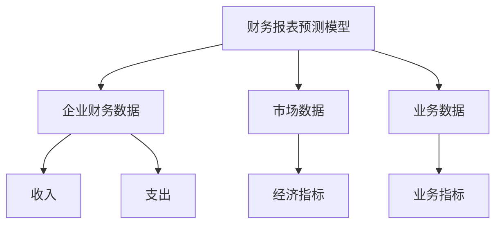
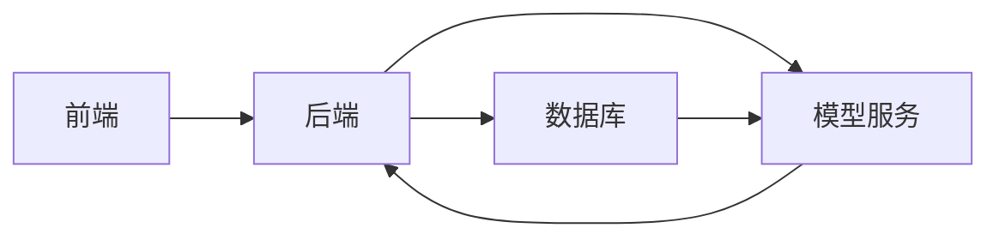

                 


# 设计智能化的企业财务报表预测模型

> 关键词：财务预测模型、人工智能、机器学习、深度学习、时间序列分析

> 摘要：本文详细探讨了设计智能化企业财务报表预测模型的全过程，从背景分析到算法实现，再到系统架构设计和项目实战，结合实际案例，提供了一套完整的解决方案。通过对比传统方法与智能化模型的优劣，展示了如何利用机器学习和深度学习技术提升财务预测的准确性和效率。

---

## 第一部分：背景介绍

### 第1章：企业财务报表预测的背景与问题

#### 1.1 问题背景
- **1.1.1 传统财务预测的局限性**  
  传统财务预测依赖于人工分析和简单的统计方法，存在效率低、精度差、难以处理大量数据等问题。  
- **1.1.2 数据驱动决策的重要性**  
  随着企业数据的爆炸式增长，利用数据驱动的决策成为提升企业竞争力的关键。  
- **1.1.3 智能化预测的需求与趋势**  
  人工智能和大数据技术的发展推动了智能化预测的需求，尤其是在财务领域，智能化预测能够提高预测的准确性和实时性。

#### 1.2 问题描述
- **1.2.1 财务报表预测的核心目标**  
  财务报表预测的核心目标是通过历史数据和当前业务状况，预测未来的财务状况，帮助企业做出更明智的决策。  
- **1.2.2 数据的多样性与复杂性**  
  财务数据通常涉及多个业务单元，数据来源多样，且可能受到市场波动、经济政策等多种因素的影响。  
- **1.2.3 预测模型的挑战与难点**  
  模型需要处理数据中的噪声、缺失值以及多重变量之间的复杂关系，同时还要确保模型的可解释性和稳定性。

#### 1.3 问题解决
- **1.3.1 数据收集与处理的方法**  
  通过多种渠道收集财务数据，清洗数据，处理缺失值和异常值，提取特征。  
- **1.3.2 模型选择与优化策略**  
  根据数据特点选择合适的算法，并通过交叉验证和超参数调优优化模型性能。  
- **1.3.3 结果验证与反馈机制**  
  使用真实数据验证模型的预测结果，根据反馈不断优化模型，确保模型的持续性能。

#### 1.4 边界与外延
- **1.4.1 模型适用的范围与限制**  
  模型适用于中短期财务预测，但长期预测受到市场不确定性的限制。  
- **1.4.2 与其他预测模型的对比**  
  与传统统计模型相比，智能化模型在处理复杂关系和大数据时更具优势，但可能在可解释性上稍逊一筹。  
- **1.4.3 技术的未来发展与扩展**  
  随着技术的进步，未来的模型可能会结合更多的外部数据，如新闻情感分析和社交媒体数据，进一步提升预测的准确性。

#### 1.5 核心要素组成
- **1.5.1 数据来源与特征选择**  
  数据来源包括财务报表、业务数据、市场数据等，特征选择需要考虑相关性、重要性和多样性。  
- **1.5.2 模型构建与优化**  
  模型构建需要选择合适的算法，并通过数据预处理、特征工程和模型调优来提升性能。  
- **1.5.3 结果解释与应用**  
  解释模型的预测结果，将预测结果应用于企业的实际业务决策中，如预算制定和投资决策。

---

## 第二部分：核心概念与联系

### 第2章：智能化预测模型的基本概念

#### 2.1 核心概念原理
- **2.1.1 机器学习在财务预测中的应用**  
  机器学习通过训练数据，自动提取特征，建立预测模型。  
- **2.1.2 深度学习的优势与挑战**  
  深度学习能够处理复杂的非线性关系，但在数据量和计算资源上要求较高。  
- **2.1.3 时间序列分析的重要性**  
  时间序列分析用于处理具有时间依赖性的数据，如财务数据的时间波动性。

#### 2.2 核心概念特征对比
| 特征 | 传统模型 | 智能化模型 |
|------|----------|------------|
| 数据需求 | 小样本 | 大数据支持 |
| 鲁棒性 | 较低 | 较高 |
| 解释性 | 高 | 低 |

#### 2.3 ER实体关系图


---

## 第三部分：算法原理讲解

### 第3章：常用算法原理与实现

#### 3.1 线性回归
- **3.1.1 算法原理**  
  线性回归通过最小化预测值与实际值的平方差之和，建立线性关系模型。  
- **3.1.2 实现代码**  
  ```python
  import numpy as np
  from sklearn.linear_model import LinearRegression

  # 示例数据
  X = np.array([i for i in range(100)]).reshape(-1, 1)
  y = 2 * X + 1 + np.random.randn(100, 1)
  
  # 模型训练
  model = LinearRegression()
  model.fit(X, y)
  
  # 预测
  y_pred = model.predict(X)
  ```
- **3.1.3 数学模型**  
  $$Y = aX + b$$

#### 3.2 支持向量机
- **3.2.1 算法原理**  
  支持向量机通过构建超平面，将数据点分为两类，适用于分类和回归问题。  
- **3.2.2 实现代码**  
  ```python
  from sklearn.svm import SVR

  # 示例数据
  X = np.array([i for i in range(100)]).reshape(-1, 1)
  y = np.sin(X) + np.random.randn(100, 1)
  
  # 模型训练
  model = SVR(kernel='rbf', C=1e3)
  model.fit(X, y)
  
  # 预测
  y_pred = model.predict(X)
  ```
- **3.2.3 数学模型**  
  $$y = sign(w \cdot x + b)$$

#### 3.3 随机森林
- **3.3.1 算法原理**  
  随机森林通过集成多个决策树，提升模型的准确性和鲁棒性。  
- **3.3.2 实现代码**  
  ```python
  from sklearn.ensemble import RandomForestRegressor

  # 示例数据
  X = np.array([i for i in range(100)]).reshape(-1, 1)
  y = X ** 2 + np.random.randn(100, 1)
  
  # 模型训练
  model = RandomForestRegressor(n_estimators=100, random_state=42)
  model.fit(X, y)
  
  # 预测
  y_pred = model.predict(X)
  ```
- **3.3.3 数学模型**  
  $$y = \sum_{i=1}^{n} (a_i x_i)$$

#### 3.4 神经网络
- **3.4.1 算法原理**  
  神经网络通过多层感知机，非线性地拟合数据，适用于复杂的数据模式。  
- **3.4.2 实现代码**  
  ```python
  import tensorflow as tf
  from tensorflow.keras import layers

  # 示例数据
  X = np.array([i for i in range(100)]).reshape(-1, 1)
  y = X ** 3 + np.random.randn(100, 1)
  
  # 模型训练
  model = tf.keras.Sequential([
      layers.Dense(64, activation='relu'),
      layers.Dense(1)
  ])
  model.compile(optimizer='adam', loss='mean_squared_error')
  model.fit(X, y, epochs=100, batch_size=32)
  ```
- **3.4.3 数学模型**  
  $$y = f(x)$$

---

## 第四部分：系统分析与架构设计方案

### 第4章：系统架构设计与实现

#### 4.1 项目背景
- **4.1.1 项目目标**  
  设计一个智能化的财务报表预测系统，提升企业的财务预测能力。  
- **4.1.2 项目范围**  
  包括数据收集、模型训练、预测结果展示等功能。

#### 4.2 系统功能设计
- **4.2.1 领域模型**  
  ```mermaid
  classDiagram
      class 财务预测系统 {
          数据采集模块
          数据处理模块
          模型训练模块
          预测结果展示模块
      }
  ```

#### 4.3 系统架构设计


#### 4.4 接口设计
- **4.4.1 API接口**  
  提供RESTful API，供前端调用预测结果。  
- **4.4.2 数据接口**  
  数据采集模块通过API接口从数据库获取数据。

#### 4.5 交互设计
- **4.5.1 用户界面**  
  提供友好的用户界面，展示预测结果和数据可视化。  
- **4.5.2 交互流程**  
  用户输入预测参数，系统返回预测结果。

---

## 第五部分：项目实战

### 第5章：项目实战与案例分析

#### 5.1 环境安装
- **5.1.1 安装Python**  
  安装最新版本的Python，并配置环境变量。  
- **5.1.2 安装依赖库**  
  使用pip安装所需的库，如scikit-learn、tensorflow等。

#### 5.2 核心代码实现
- **5.2.1 数据处理代码**  
  ```python
  import pandas as pd
  df = pd.read_csv('data.csv')
  df = df.dropna()
  ```

- **5.2.2 模型训练代码**  
  ```python
  from sklearn.model_selection import train_test_split
  X_train, X_test, y_train, y_test = train_test_split(X, y, test_size=0.2)
  model.fit(X_train, y_train)
  ```

#### 5.3 案例分析
- **5.3.1 案例背景**  
  某企业希望通过预测模型优化预算制定。  
- **5.3.2 数据分析与处理**  
  使用企业过去三年的财务数据，清洗数据，提取关键特征。  
- **5.3.3 模型训练与验证**  
  训练模型，验证模型的准确性，调整参数优化性能。

---

## 第六部分：最佳实践与小结

### 第6章：最佳实践与注意事项

#### 6.1 小结
- **6.1.1 核心内容回顾**  
  本文详细介绍了设计智能化企业财务报表预测模型的全过程，从背景分析到算法实现，再到系统架构设计和项目实战。  
- **6.1.2 关键点总结**  
  突出数据处理、算法选择和模型优化的重要性，强调实际应用中的注意事项。

#### 6.2 注意事项
- **6.2.1 数据隐私与安全**  
  在处理财务数据时，必须确保数据的安全性和隐私性。  
- **6.2.2 模型的可解释性**  
  尽管深度学习模型性能优越，但在实际应用中，可解释性同样重要。  
- **6.2.3 模型的持续优化**  
  预测模型需要根据实际情况持续优化，以适应数据和业务的变化。

#### 6.3 拓展阅读
- **6.3.1 推荐书籍**  
  - 《机器学习实战》  
  - 《深度学习》  
- **6.3.2 技术博客与资源**  
  - TensorFlow官方文档  
  - Keras官方文档

---

## 作者

作者：AI天才研究院/AI Genius Institute & 禅与计算机程序设计艺术 /Zen And The Art of Computer Programming

---

以上是《设计智能化的企业财务报表预测模型》的完整目录大纲，涵盖了从背景分析到实际应用的全过程，内容详实且结构清晰，为读者提供了一套完整的解决方案。

