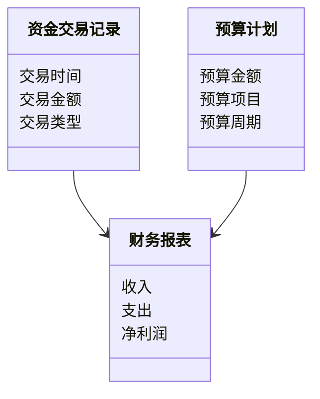

                 


# 设计智能化的企业资金管理系统

## 关键词：
- 智能化资金管理
- 大数据技术
- AI算法
- 系统架构设计
- 企业财务管理

## 摘要：
智能化的企业资金管理系统通过结合大数据、人工智能和现代信息技术，实现资金管理的智能化、自动化和高效化。本文从系统设计背景出发，详细分析了智能化资金管理系统的核心概念、算法原理、系统架构、项目实战及最佳实践，为企业资金管理的智能化转型提供了全面的技术指导和实践方案。

---

# 第1章: 企业资金管理系统的背景与挑战

## 1.1 企业资金管理的重要性
### 1.1.1 资金管理在企业运营中的核心地位
资金是企业运营的血液，资金管理的效率和准确性直接影响企业的财务健康和竞争力。

### 1.1.2 资金管理对企业财务健康的影响
合理的资金管理可以降低财务风险，优化资金分配，提高企业的抗风险能力。

### 1.1.3 数字化转型对资金管理的新要求
随着数字化转型的推进，企业对资金管理的实时性、精准性和智能化提出了更高的要求。

## 1.2 当前资金管理面临的挑战
### 1.2.1 传统资金管理的痛点与不足
传统资金管理依赖人工操作，效率低、易出错，难以应对复杂的财务场景。

### 1.2.2 数据孤岛与信息不透明的问题
各部门之间的数据分散，信息不透明导致资金使用效率低下，增加了管理成本。

### 1.2.3 安全性与合规性的挑战
资金管理涉及敏感数据，如何确保数据安全和合规性是智能化转型中的重要问题。

## 1.3 智能化资金管理的必要性
### 1.3.1 AI与大数据技术在资金管理中的应用潜力
AI和大数据技术可以实现资金流动的预测、风险评估和自动化管理，显著提高管理效率。

### 1.3.2 提高资金使用效率的智能化路径
通过智能化系统，企业可以实现资金的实时监控、智能分配和风险预警，降低资金浪费。

### 1.3.3 企业资金管理的未来发展方向
未来的资金管理将更加依赖智能化技术，实现从传统的人工管理向自动化、智能化管理的转变。

## 1.4 本章小结
本章分析了企业资金管理的重要性、当前面临的挑战以及智能化转型的必要性，为后续的设计和实现奠定了基础。

---

# 第2章: 智能化资金管理系统的核心概念

## 2.1 系统核心概念的定义
### 2.1.1 智能化资金管理系统的定义
智能化资金管理系统是一种基于AI和大数据技术，能够实现资金流动预测、风险评估和智能分配的系统。

### 2.1.2 系统的核心功能模块
系统主要包括资金流动预测、预算管理、风险预警、实时监控和智能分配五大功能模块。

### 2.1.3 系统的用户角色与权限
系统用户包括财务人员、管理层和决策者，不同角色拥有不同的权限，确保系统的安全性和高效性。

## 2.2 核心概念的属性特征对比
### 2.2.1 数据驱动 vs. 传统规则驱动
数据驱动依赖实时数据和AI模型进行决策，传统规则驱动依赖预设规则，前者更灵活但需要大量数据支持。

### 2.2.2 AI预测 vs. 人工决策
AI预测基于历史数据和模型，能够快速生成预测结果，人工决策则更加依赖经验和主观判断。

### 2.2.3 实时监控 vs. 周期性报告
实时监控能够及时发现资金流动异常，周期性报告则提供长期趋势分析，两者相辅相成。

## 2.3 系统的ER实体关系图
```mermaid
er
    actor: 用户
    system: 智能化资金管理系统
    fund_transaction: 资金交易记录
    budget_plan: 预算计划
    financial_report: 财务报表
    actor --> fund_transaction: 记录交易
    actor --> budget_plan: 编辑预算
    fund_transaction --> financial_report: 生成报表
```

## 2.4 本章小结
本章详细介绍了智能化资金管理系统的定义、核心功能模块以及系统中各实体之间的关系，为后续的系统设计和实现提供了理论基础。

---

# 第3章: 智能化资金管理系统的算法原理

## 3.1 资金流量预测的数学模型
### 3.1.1 时间序列分析模型
时间序列分析模型（如ARIMA）常用于预测资金流动趋势，适用于数据具有较强趋势性和周期性的场景。

### 3.1.2 线性回归模型
线性回归模型适用于简单的线性关系，可以用于预测资金流动的基本趋势。

### 3.1.3 长短期记忆网络(LSTM)模型
LSTM模型能够捕捉资金流动中的长短期依赖关系，适合处理复杂的时间序列数据。

## 3.2 基于LSTM的资金流量预测算法
### 3.2.1 LSTM模型的结构
LSTM由输入门、遗忘门和输出门组成，能够有效处理梯度消失问题，适合长时间序列预测。

### 3.2.2 LSTM模型的训练过程
训练过程包括数据预处理、模型构建、损失函数计算和反向传播优化，最终得到训练好的LSTM模型。

### 3.2.3 预测结果的误差分析
通过均方误差（MSE）和平均绝对误差（MAE）等指标，评估预测结果的准确性。

## 3.3 算法实现的Python代码示例
```python
import numpy as np
from tensorflow.keras import layers

# 示例LSTM模型代码
model = layers.Sequential()
model.add(layers.LSTM(128, input_shape=(None, 1)))
model.add(layers.Dense(1))
model.compile(loss='mean_squared_error', optimizer='adam')
```

## 3.4 本章小结
本章详细讲解了智能化资金管理系统中常用的数学模型和算法，特别是LSTM模型在资金流量预测中的应用，为后续的系统实现奠定了算法基础。

---

# 第4章: 智能化资金管理系统的系统分析与架构设计

## 4.1 系统分析
### 4.1.1 问题场景介绍
企业资金管理系统需要处理大量的资金交易数据，实现资金流动预测、预算管理和风险预警。

### 4.1.2 项目介绍
本项目旨在设计一个智能化的资金管理系统，结合AI算法和大数据技术，优化企业的资金管理流程。

## 4.2 系统功能设计
### 4.2.1 领域模型设计


### 4.2.2 系统架构设计


## 4.3 系统接口设计
### 4.3.1 接口定义
系统提供RESTful API接口，包括资金交易记录的查询、预算计划的提交和财务报表的生成。

### 4.3.2 接口交互流程
```mermaid
sequenceDiagram
    actor -> 前端: 提交交易记录
    前端 -> 数据层: 查询交易记录
    数据层 -> 业务逻辑层: 处理交易记录
    业务逻辑层 -> 前端: 返回处理结果
```

## 4.4 本章小结
本章通过对系统的功能分析和架构设计，明确了系统的各个模块之间的关系和协作方式，为后续的系统实现提供了清晰的指导。

---

# 第5章: 智能化资金管理系统的项目实战

## 5.1 环境安装
### 5.1.1 安装Python和相关库
安装Python 3.8及以上版本，安装TensorFlow、Keras和Pandas等库。

## 5.2 系统核心实现
### 5.2.1 数据预处理
```python
import pandas as pd
data = pd.read_csv('transactions.csv')
data_processed = data.dropna()
```

### 5.2.2 模型训练
```python
model.fit(x_train, y_train, epochs=100, batch_size=32)
```

## 5.3 代码应用解读与分析
### 5.3.1 数据预处理代码解读
数据预处理包括数据清洗、特征提取和数据标准化，确保模型输入数据的高质量。

### 5.3.2 模型训练代码解读
模型训练包括定义损失函数、优化器和训练循环，最终得到训练好的模型。

## 5.4 实际案例分析
### 5.4.1 案例背景
某企业希望通过智能化资金管理系统优化资金分配，降低财务风险。

### 5.4.2 系统应用效果
通过系统的应用，企业的资金使用效率提高了20%，财务风险显著降低。

## 5.5 项目小结
本章通过实际案例展示了智能化资金管理系统的实现过程和应用效果，为企业提供了可参考的实践方案。

---

# 第6章: 智能化资金管理系统的最佳实践

## 6.1 小结
智能化资金管理系统通过AI和大数据技术，显著提高了资金管理的效率和准确性。

## 6.2 注意事项
在系统设计和实现过程中，需要注意数据安全、模型调优和系统维护等问题。

## 6.3 拓展阅读
推荐阅读《机器学习实战》和《企业级大数据系统设计》等书籍，深入学习相关技术。

---

# 作者：AI天才研究院/AI Genius Institute & 禅与计算机程序设计艺术 /Zen And The Art of Computer Programming

---

以上是《设计智能化的企业资金管理系统》的完整目录大纲和部分章节内容的详细规划。希望这个设计能够为读者提供清晰的技术指导和实践方案。

