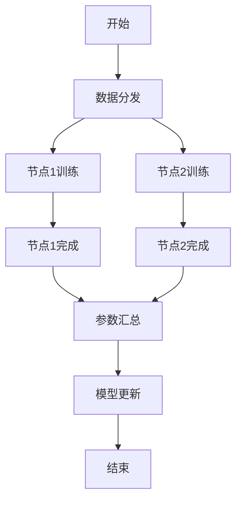

                 


# 设计高可用性金融AI系统架构

> 关键词：高可用性系统，金融AI，系统架构，容错机制，分布式训练，数学模型

> 摘要：本文系统地探讨了设计高可用性金融AI系统架构的关键步骤，从背景介绍到项目实战，详细讲解了系统架构设计的核心概念、算法原理、系统分析与架构设计方案、项目实战等内容，帮助读者全面理解并掌握高可用性金融AI系统的构建方法。

---

## 第1章：背景介绍

### 1.1 高可用性系统的基本概念
- **可用性**：系统在规定的时间内能够正常运行的概率。
- **高可用性**：系统能够在故障发生时，快速恢复并保持高性能运行，通常要求系统的年停机时间小于几分钟。

### 1.2 金融行业的特殊需求
- **稳定性**：金融系统涉及大量资金和用户，必须保证数据的准确性和交易的及时性。
- **容错机制**：系统需要在出现故障时，能够快速切换到备用系统，保证服务不中断。
- **合规性**：金融行业有严格的监管要求，系统设计必须符合相关法规。

### 1.3 AI在金融系统中的应用前景
- **金融预测**：利用AI进行市场趋势预测，帮助投资者做出决策。
- **风险控制**：通过AI分析交易数据，识别潜在风险，防止金融危机。
- **智能交易**：AI可以实时分析市场数据，自动执行交易指令，提高交易效率。

---

## 第2章：高可用性金融AI系统的组成

### 2.1 系统架构的核心要素
- **数据处理层**：负责数据的采集、清洗和预处理，确保数据的准确性和一致性。
- **AI模型层**：构建和训练AI模型，进行预测和分析。
- **系统控制层**：管理系统的运行，协调各部分的工作，处理异常情况。

### 2.2 系统各部分的属性对比

| 组件       | 数据处理层   | AI模型层     | 系统控制层   |
|------------|--------------|--------------|--------------|
| 功能       | 数据处理     | 模型训练     | 系统管理     |
| 性能       | 高效性       | 可扩展性     | 高可用性     |
| 容错机制   | 数据冗余     | 模型备份     | 系统冗余     |

### 2.3 实体关系图（ER图）

```mermaid
erDiagram
    actor 用户
    actor 系统管理员
    actor 交易处理系统
    actor 第三方数据源
    actor AI模型
    用户 -> 数据处理层 : 提供输入数据
    系统管理员 -> 数据处理层 : 配置参数
    交易处理系统 -> 数据处理层 : 接收处理结果
    第三方数据源 -> 数据处理层 : 提供实时数据
    数据处理层 -> AI模型 : 传递处理后的数据
    AI模型 -> 系统控制层 : 输出决策结果
    系统控制层 -> 交易处理系统 : 发出指令
```

---

## 第3章：分布式AI模型训练算法

### 3.1 分布式训练的基本原理
- **分布式训练**：将训练数据分布在多个计算节点上，每个节点独立训练模型，最后将结果汇总。
- **流程**：数据分发 → 并行训练 → 参数汇总 → 模型更新。

### 3.2 分布式训练的流程图



### 3.3 分布式训练的Python实现示例
```python
import numpy as np
from tensorflow.keras import layers, Model
import os

# 模型定义
def create_model():
    inputs = layers.Input(shape=(64,))
    x = layers.Dense(128, activation='relu')(inputs)
    x = layers.Dense(64, activation='relu')(x)
    predictions = layers.Dense(1, activation='sigmoid')(x)
    model = Model(inputs=inputs, outputs=predictions)
    model.compile(optimizer='adam', loss='binary_crossentropy')
    return model

# 分布式训练
strategy = tf.distribute.MirroredStrategy()
with strategy.scope():
    model = create_model()
    model.fit(data, labels, epochs=10, batch_size=32)
```

---

## 第4章：系统分析与架构设计方案

### 4.1 问题场景介绍
- **场景描述**：设计一个高可用性金融AI系统，用于实时股票交易预测。
- **需求分析**：系统需要处理大量数据，支持快速预测，并能在故障时自动切换备用系统。

### 4.2 系统功能设计
- **功能模块**：数据采集模块、AI预测模块、交易执行模块、容错机制模块。

### 4.3 系统架构设计图


### 4.4 系统接口设计
- **接口1**：数据采集接口，接收实时数据。
- **接口2**：预测结果接口，输出AI预测结果。
- **接口3**：交易执行接口，接收交易指令。

---

## 第5章：项目实战

### 5.1 环境安装
- **工具安装**：安装Python、TensorFlow、Kubernetes、Jupyter Notebook。
- **依赖管理**：使用虚拟环境管理依赖包。

### 5.2 系统核心代码实现

```python
import kubernetes as k8s
from kubernetes.client import BatchApi

# 初始化Kubernetes客户端
config = k8s.config.load_incluster_config()
client = k8s.client.BatchApi(api_client=config)

# 提交分布式训练任务
def submit_job():
    job = k8s.client.V1Job(
        spec=k8s.client.V1JobSpec(
            template=k8s.client.V1PodTemplateSpec(
                spec=k8s.client.V1PodSpec(
                    containers=[
                        k8s.client.V1Container(
                            name="train",
                            image="tensorflow:latest",
                            command=["python", "train.py"]
                        )
                    ],
                    restart_policy="Never"
                )
            ),
            backoff_limit=0
        )
    )
    client.create_namespaced_job("default", job)
```

### 5.3 代码应用解读与分析
- **代码功能**：通过Kubernetes提交分布式训练任务，确保任务在节点故障时能够自动重新提交。
- **关键点**：使用Kubernetes的高可用性特性，实现任务的自动恢复和负载均衡。

### 5.4 案例分析和详细讲解
- **案例描述**：设计一个基于Kubernetes的高可用性金融AI系统，用于实时股票交易预测。
- **实现步骤**：数据采集 → 数据处理 → 模型训练 → 模型部署 → 交易执行 → 容错机制。

---

## 第6章：总结与展望

### 6.1 最佳实践
- **备份与恢复**：定期备份系统数据和模型，确保在故障发生时能够快速恢复。
- **监控与日志**：实时监控系统运行状态，记录日志以便故障排查。

### 6.2 小结
本文详细讲解了设计高可用性金融AI系统架构的关键步骤，从背景介绍到项目实战，帮助读者全面理解并掌握系统的构建方法。

### 6.3 注意事项
- **数据安全**：确保金融数据的安全性，防止数据泄露。
- **性能优化**：在保证高可用性的前提下，尽可能优化系统性能。

### 6.4 拓展阅读
- **相关书籍**：《分布式系统：概念与设计》、《深度学习实战》。
- **在线资源**：Kubernetes官方文档、TensorFlow官方文档。

---

## 作者：AI天才研究院/Zen And The Art of Computer Programming

通过以上目录和内容的规划，您可以开始撰写具体的章节内容，每章按照上述结构详细展开。

