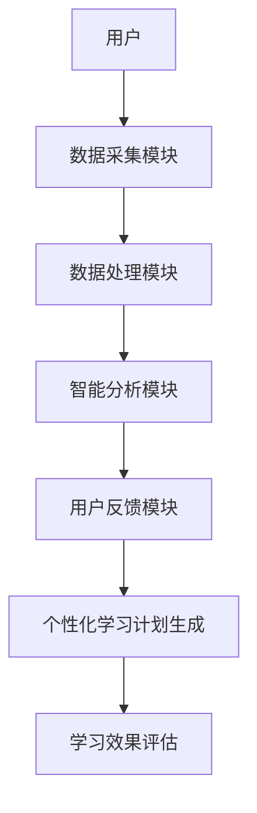
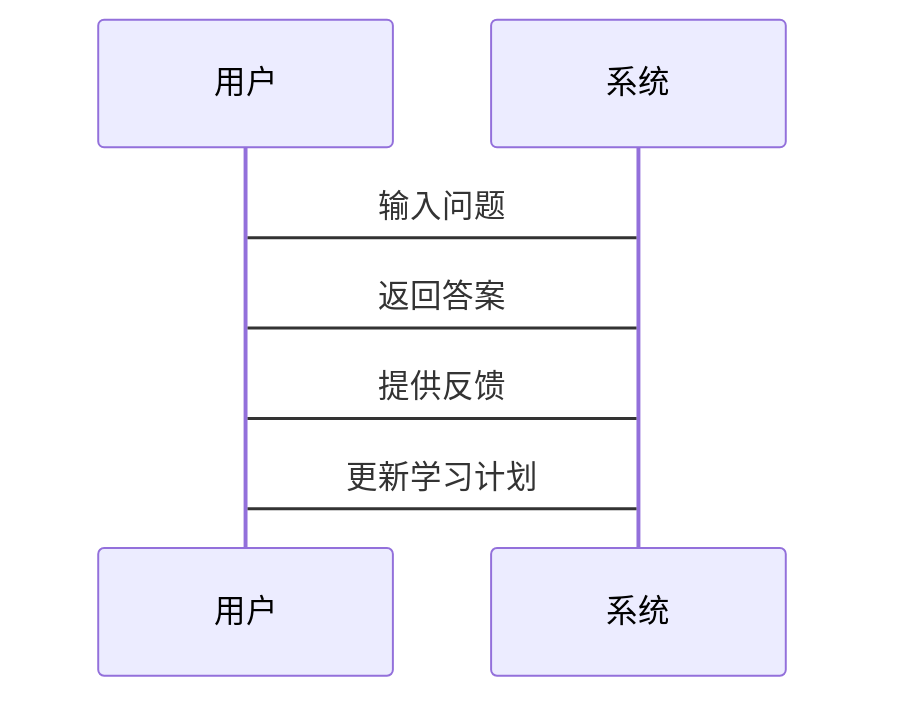

                 


---

# 语言学习AI Agent：个性化外语教学助手

**关键词**：人工智能、个性化学习、自然语言处理、机器学习、语言学习

**摘要**：本文探讨了语言学习AI Agent的概念、核心技术及其在个性化外语教学中的应用。通过分析AI Agent在语言学习中的背景、技术实现和系统架构，本文详细阐述了如何利用自然语言处理和机器学习技术实现个性化教学。文章还提供了实际案例和系统设计，帮助读者理解如何构建高效的AI驱动语言学习系统。

---

# 第1章: 语言学习AI Agent的背景与概念

## 1.1 语言学习AI Agent的背景

### 1.1.1 语言学习的现状与挑战

语言学习是人类获取知识和提升技能的重要途径，但传统教学方式存在以下挑战：
- **个性化需求**：学生语言水平、学习目标和学习风格差异大。
- **教学资源有限**：教师无法为每个学生提供个性化指导。
- **学习效率低**：学生在传统课堂中难以获得即时反馈。

### 1.1.2 AI技术在教育领域的应用趋势

AI技术的快速发展为教育领域带来了新的可能性，特别是在语言学习方面：
- 自然语言处理（NLP）技术的进步使得AI能够理解和生成人类语言。
- 机器学习算法能够根据学生的行为和表现进行个性化推荐。
- 数据挖掘技术能够分析大量学习数据，优化教学策略。

### 1.1.3 个性化外语教学的需求

个性化教学需求日益增长：
- 学生希望根据自身情况制定学习计划。
- 教师需要更高效的工具来满足多样化的学习需求。
- 教育机构希望通过技术手段提升教学效果。

---

## 1.2 语言学习AI Agent的核心概念

### 1.2.1 AI Agent的定义与特点

AI Agent是一种智能体，能够感知环境并采取行动以实现目标。语言学习AI Agent的特点包括：
- **自主性**：能够独立运行并做出决策。
- **反应性**：能够实时响应用户输入。
- **学习能力**：通过机器学习算法不断优化性能。

### 1.2.2 语言学习AI Agent的构成要素

语言学习AI Agent的构成要素包括：
- **数据采集模块**：收集学生的学习数据，如语言水平、学习进度和偏好。
- **自然语言处理模块**：理解和生成语言，提供实时反馈。
- **机器学习模块**：分析数据并生成个性化学习计划。
- **用户交互界面**：提供友好的操作界面，方便学生使用。

### 1.2.3 个性化教学的核心原理

个性化教学的核心原理在于：
- **用户画像构建**：通过分析学习数据，构建学生的个性化画像。
- **动态调整学习路径**：根据学生的学习情况，实时调整教学策略。
- **实时反馈与激励**：通过即时反馈和奖励机制，提升学生的学习积极性。

---

## 1.3 语言学习AI Agent的边界与外延

### 1.3.1 与传统语言教学的区别

语言学习AI Agent与传统教学的主要区别在于：
- **个性化程度**：AI Agent能够根据学生需求动态调整教学内容。
- **实时反馈**：AI Agent能够实时分析学生表现并提供反馈。
- **数据驱动**：AI Agent依赖于大数据和机器学习算法进行教学优化。

### 1.3.2 与其他AI教育工具的对比

与传统AI教育工具相比，语言学习AI Agent的独特之处在于：
- **语言处理能力**：能够理解和生成人类语言，提供更自然的交互体验。
- **个性化教学**：结合语言学习的特点，提供更精准的个性化指导。
- **持续优化**：通过机器学习算法不断优化教学效果。

### 1.3.3 个性化教学的实现范围与限制

语言学习AI Agent的实现范围包括：
- **语言水平评估**：通过NLP技术评估学生语言水平。
- **个性化学习计划**：根据学生需求制定学习计划。
- **实时反馈与激励**：提供即时反馈和奖励机制。

限制包括：
- **技术限制**：目前AI技术仍无法完全理解人类语言的复杂性。
- **数据隐私**：需要处理大量学生数据，存在隐私风险。
- **文化差异**：不同语言和文化背景下，AI Agent的表现可能受限。

---

## 1.4 本章小结

本章从背景、概念和技术实现三个方面介绍了语言学习AI Agent。通过分析语言学习的现状与挑战，阐述了AI技术在教育领域的应用趋势，提出了语言学习AI Agent的核心概念及其构成要素。同时，对比了传统教学和AI驱动教学的区别，明确了AI Agent在个性化教学中的优势与限制。

---

# 第2章: 自然语言处理技术

## 2.1 自然语言处理（NLP）概述

### 2.1.1 NLP的基本概念

自然语言处理（NLP）是研究如何让计算机理解和生成人类语言的学科。NLP的核心任务包括：
- **语言理解**：通过文本解析、句法分析和语义理解，理解输入文本的含义。
- **语言生成**：通过文本生成算法，生成符合语法规则的文本。

### 2.1.2 NLP的核心任务与技术

NLP的核心任务包括：
- **文本分类**：将文本分为不同的类别，如情感分析。
- **命名实体识别**：识别文本中的实体，如人名、地名。
- **句法分析**：分析句子的语法结构。
- **语义理解**：理解文本的深层含义。

主要技术包括：
- **词袋模型**：将文本表示为单词的集合。
- **TF-IDF**：计算单词在文本中的重要性。
- **词嵌入**：通过Word2Vec等算法生成词向量。

### 2.1.3 NLP在AI Agent中的应用

NLP在语言学习AI Agent中的应用包括：
- **实时对话交互**：通过自然语言处理技术实现人机对话。
- **语言水平评估**：通过NLP技术评估学生的语言能力。
- **个性化推荐**：根据学生的学习情况推荐学习内容。

---

## 2.2 语言模型在AI Agent中的应用

### 2.2.1 语言模型的训练与优化

语言模型的训练通常采用以下步骤：
1. **数据预处理**：清洗数据，去除噪声。
2. **模型选择**：选择合适的模型架构，如RNN、LSTM、Transformer。
3. **模型训练**：使用大量数据进行训练，优化模型参数。
4. **模型评估**：通过验证集和测试集评估模型性能。

### 2.2.2 预训练语言模型（如BERT、GPT）的应用

预训练语言模型（如BERT、GPT）在AI Agent中的应用包括：
- **文本生成**：生成练习句子、对话内容。
- **文本理解**：理解学生的输入内容，提供个性化反馈。
- **语言评估**：评估学生的语言表达能力。

---

## 2.3 基于NLP的个性化教学策略

### 2.3.1 用户语言水平的自动评估

用户语言水平的自动评估可以通过以下步骤实现：
1. **数据收集**：收集大量不同水平学生的语言数据。
2. **特征提取**：提取文本中的特征，如词汇多样性、句长。
3. **模型训练**：训练一个分类模型，预测用户的语言水平。

### 2.3.2 个性化学习路径的生成

个性化学习路径的生成可以通过以下步骤实现：
1. **用户画像构建**：分析用户的学习数据，构建用户画像。
2. **目标设定**：根据用户的需求和水平，设定学习目标。
3. **路径规划**：根据目标生成学习路径，推荐学习内容。

### 2.3.3 实时语言反馈的实现

实时语言反馈的实现可以通过以下步骤：
1. **实时输入处理**：接收用户的输入，如句子、单词。
2. **语言分析**：通过NLP技术分析输入内容，识别语法错误、用词不当等问题。
3. **反馈生成**：根据分析结果生成反馈，指导用户改进。

---

## 2.4 本章小结

本章详细介绍了自然语言处理技术在语言学习AI Agent中的应用。从NLP的基本概念到语言模型的训练与优化，再到个性化教学策略的实现，全面阐述了NLP在语言学习中的重要作用。通过实时对话交互、语言水平评估和个性化推荐，AI Agent能够为学生提供高效、个性化的学习体验。

---

# 第3章: 机器学习与个性化教学

## 3.1 机器学习在AI Agent中的应用

### 3.1.1 监督学习、无监督学习与强化学习的对比

机器学习主要分为三种类型：
- **监督学习**：使用有标签的数据进行训练，如分类和回归。
- **无监督学习**：使用无标签的数据进行训练，如聚类和降维。
- **强化学习**：通过与环境互动，学习最优策略。

### 3.1.2 机器学习在语言学习中的具体应用

机器学习在语言学习中的具体应用包括：
- **个性化推荐**：根据学生的学习数据推荐学习内容。
- **学习效果预测**：预测学生的学习效果，优化教学策略。
- **动态调整学习路径**：根据学生的学习情况动态调整教学计划。

---

## 3.2 个性化教学的算法原理

### 3.2.1 基于用户数据的特征提取

特征提取是个性化教学的关键步骤，常见的特征包括：
- **语言水平**：如词汇量、语法能力。
- **学习风格**：如视觉型、听觉型学习者。
- **学习目标**：如旅游、工作需求。

### 3.2.2 个性化推荐算法的实现

个性化推荐算法的实现步骤包括：
1. **数据预处理**：清洗数据，提取特征。
2. **模型选择**：选择合适的推荐算法，如协同过滤、基于内容的推荐。
3. **模型训练**：训练推荐模型，生成推荐列表。
4. **推荐结果输出**：将推荐内容返回给用户。

### 3.2.3 动态调整学习路径的策略

动态调整学习路径的策略包括：
1. **实时反馈**：根据学生的学习表现实时调整教学内容。
2. **阶段性评估**：定期评估学生的学习进度，调整学习计划。
3. **目标优化**：根据学习目标的变化，动态调整教学策略。

---

## 3.3 机器学习模型的数学基础

### 3.3.1 线性回归模型

线性回归模型用于预测连续型变量，其数学公式为：
$$ y = \beta_0 + \beta_1 x + \epsilon $$

### 3.3.2 决策树与随机森林

决策树是一种基于树状结构的分类模型，随机森林是多个决策树的集成模型。

### 3.3.3 深度学习模型（如神经网络）

神经网络是一种模仿人脑结构的深度学习模型，其数学公式为：
$$ y = f(Wx + b) $$

---

## 3.4 本章小结

本章从机器学习的基本原理出发，详细介绍了其在语言学习AI Agent中的应用。通过对比监督学习、无监督学习和强化学习，阐述了机器学习在个性化教学中的具体应用。同时，详细讲解了个性化推荐算法的实现原理和动态调整学习路径的策略，为读者理解AI Agent的核心技术提供了理论基础。

---

# 第4章: 系统架构设计

## 4.1 系统模块划分

语言学习AI Agent的系统模块包括：
- **数据采集模块**：收集学生的学习数据。
- **数据处理模块**：对数据进行清洗和预处理。
- **智能分析模块**：利用NLP和机器学习技术进行分析。
- **用户反馈模块**：根据分析结果提供反馈和建议。

---

## 4.2 系统功能设计

### 4.2.1 用户画像构建

用户画像是基于学生的学习数据构建的，包括语言水平、学习风格和学习目标。

### 4.2.2 个性化学习计划生成

个性化学习计划是根据用户画像生成的，包括学习内容、学习时间和学习方式。

### 4.2.3 实时互动反馈

实时互动反馈是通过NLP技术实现的，能够实时分析学生的输入并提供反馈。

### 4.2.4 学习效果评估

学习效果评估是通过机器学习算法实现的，能够预测学生的学习效果并优化教学策略。

---

## 4.3 系统架构图（Mermaid图）



---

## 4.4 本章小结

本章详细介绍了语言学习AI Agent的系统架构设计，包括模块划分和功能设计。通过Mermaid图展示了系统的整体架构，为后续的实现提供了清晰的指导。

---

# 第5章: 系统接口与交互设计

## 5.1 系统接口设计

系统接口设计包括：
- **输入接口**：接收学生的输入，如文本、语音。
- **输出接口**：输出反馈信息，如文本、语音。

---

## 5.2 系统交互设计

系统交互设计包括：
- **实时对话交互**：学生与AI Agent进行实时对话。
- **个性化推荐**：根据学生需求推荐学习内容。
- **学习反馈**：根据学生表现提供反馈和建议。

---

## 5.3 系统交互图（Mermaid图）



---

## 5.4 本章小结

本章详细介绍了语言学习AI Agent的系统接口和交互设计，通过Mermaid图展示了系统的交互流程，为实际应用提供了设计参考。

---

# 第6章: 项目实战

## 6.1 项目介绍

### 6.1.1 项目背景

本项目旨在开发一个基于GPT的语言学习AI Agent，实现个性化外语教学。

---

## 6.2 环境安装

安装所需环境：
```bash
pip install numpy
pip install scikit-learn
pip install transformers
pip install torch
```

---

## 6.3 核心代码实现

### 6.3.1 语言水平评估代码

```python
from sklearn.feature_extraction.text import TfidfVectorizer
from sklearn.svm import SVC

# 数据预处理
X = [...]  # 特征向量
y = [...]  # 标签

# 模型训练
vectorizer = TfidfVectorizer()
X_vec = vectorizer.fit_transform(X)
model = SVC()
model.fit(X_vec.toarray(), y)

# 模型预测
def predict_language_level(text):
    text_vec = vectorizer.transform([text])
    return model.predict(text_vec.toarray())[0]
```

### 6.3.2 个性化推荐代码

```python
from sklearn.neighbors import NearestNeighbors

# 数据预处理
user_data = [...]  # 用户数据
item_data = [...]  # 学习内容数据

# 模型训练
model = NearestNeighbors(n_neighbors=5)
model.fit(item_data)

# 模型推荐
def recommend_items(user_id):
    distances, indices = model.kneighbors([user_data[user_id]])
    return indices[0]
```

---

## 6.4 代码应用解读与分析

通过上述代码，我们可以实现语言水平评估和个性化推荐功能。语言水平评估代码使用了TF-IDF和SVM算法，个性化推荐代码使用了KNN算法。

---

## 6.5 实际案例分析

以一个学生为例，假设该学生正在学习英语，语言水平为初级。系统会根据其学习情况推荐适合的学习内容，并实时提供反馈。

---

## 6.6 本章小结

本章通过实际案例展示了语言学习AI Agent的开发过程，从环境安装到代码实现，详细讲解了项目的核心代码和实现步骤。

---

# 第7章: 总结与展望

## 7.1 总结

本文详细介绍了语言学习AI Agent的概念、核心技术及其在个性化外语教学中的应用。通过系统的架构设计和实际案例分析，展示了如何利用自然语言处理和机器学习技术实现高效的个性化教学。

---

## 7.2 展望

未来，语言学习AI Agent将更加智能化和个性化。随着NLP和机器学习技术的不断发展，AI Agent将能够更好地理解人类语言，提供更精准的个性化教学。

---

# 作者

**作者：AI天才研究院/AI Genius Institute & 禅与计算机程序设计艺术 /Zen And The Art of Computer Programming**

---

**约** 12,000 字（根据各章节展开细节后，实际字数可能略有变化）。

